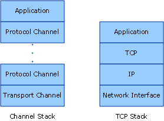
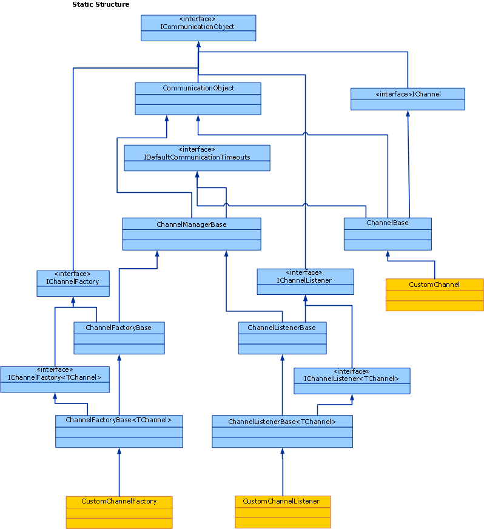

# Channel Model Overview
The [!INCLUDE[indigo1](../../../../includes/indigo1-md.md)] channel stack is a layered communication stack with one or more channels that process messages. At the bottom of the stack is a transport channel that is responsible for adapting the channel stack to the underlying transport (for example, TCP, HTTP, SMTP and other types of transport.). Channels provide a low-level programming model for sending and receiving messages. This programming model relies on several interfaces and other types collectively known as the [!INCLUDE[indigo2](../../../../includes/indigo2-md.md)] channel model. This topic discusses channel shapes, the construction of a basic channel listener (on the service) and channel factory (on the client).  
  
## Channel Stack  
 [!INCLUDE[indigo2](../../../../includes/indigo2-md.md)] endpoints communicate with the world using a communication stack called the channel stack. The following diagram compares the channel stack with other communication stacks, for example TCP/IP.  
  
   
  
 First, the similarities: In both cases, each layer of the stack provides some abstraction of the world below that layer and exposed that abstraction only to the layer directly above it. Each layer uses the abstraction of only the layer directly below it. Also in both cases, when two stacks communicate, each layer communicates with the corresponding layer in the other stack, for example, the IP layer communicates with the IP layer and the TCP layer with the TCP layer, and so on.  
  
 Now, the differences: While the TCP stack was designed to provide an abstraction of the physical network, the channel stack is designed to provide an abstraction of not only how the message is delivered, that is, the transport, but also other features such as what is in the message or what protocol is used for communication, including the transport but much more than that. For example, reliable session binding element is part of the channel stack but is not below the transport or the transport itself. This abstraction is achieved by requiring the bottom channel in the stack to adapt the underlying transport protocol to the channel stack architecture and then relying on channels further up in the stack to provide communication features such as reliability guarantees and security.  
  
 Messages flow through the communication stack as <xref:System.ServiceModel.Channels.Message> objects. As shown in figure above, the bottom channel is called a transport channel. It is the channel that is responsible for sending and receiving messages to and from other parties. This includes the responsibility of transforming the <xref:System.ServiceModel.Channels.Message> object to and from the format used to communicate with other parties. Above the transport channel there can be any number of protocol channels each responsible for providing a communication function such as reliable delivery guarantees. Protocol channels operate on messages flowing through them in the form of the <xref:System.ServiceModel.Channels.Message> object. They typically either transform the message, for example, by adding headers or encrypting the body, or send and receive their own protocol control messages, for example, receipt acknowledgments.  
  
## Channel Shapes  
 Each channel implements one or more interfaces known as channel shape interfaces or channel shapes. Those channel shapes provide the communication-oriented methods such as send and receive or request and reply that the channel implements and the user of the channel calls. At the base of the channel shapes is the <xref:System.ServiceModel.Channels.IChannel> interface, which is an interface that provides a `GetProperty`\<T> method intended as a layered mechanism to access arbitrary features exposed by channels in the stack. The five channel shapes that extend <xref:System.ServiceModel.Channels.IChannel> are:  
  
-   <xref:System.ServiceModel.Channels.IInputChannel>  
  
-   <xref:System.ServiceModel.Channels.IOutputChannel>  
  
-   <xref:System.ServiceModel.Channels.IRequestChannel>  
  
-   <xref:System.ServiceModel.Channels.IReplyChannel>  
  
-   <xref:System.ServiceModel.Channels.IDuplexChannel>  
  
 Further, each of these shapes has an equivalent that extends <xref:System.ServiceModel.Channels.ISessionChannel%601?displayProperty=nameWithType> to support sessions. These are:  
  
-   <xref:System.ServiceModel.Channels.IInputSessionChannel>  
  
-   <xref:System.ServiceModel.Channels.IOutputSessionChannel>  
  
-   <xref:System.ServiceModel.Channels.IRequestSessionChannel>  
  
-   <xref:System.ServiceModel.Channels.IReplySessionChannel>  
  
-   <xref:System.ServiceModel.Channels.IDuplexSessionChannel>  
  
 The channel shapes are patterned after some of the fundamental message exchange patterns supported by existing transport protocols. For example, one-way messaging corresponds to an <xref:System.ServiceModel.Channels.IInputChannel>/<xref:System.ServiceModel.Channels.IOutputChannel> pair, request-reply corresponds to <xref:System.ServiceModel.Channels.IRequestChannel>/<xref:System.ServiceModel.Channels.IReplyChannel> pairs and two-way duplex communications corresponds to <xref:System.ServiceModel.Channels.IDuplexChannel> (which extends both <xref:System.ServiceModel.Channels.IInputChannel> and <xref:System.ServiceModel.Channels.IOutputChannel>).  
  
## Programming with the Channel Stack  
 Channel stacks are typically created using a factory pattern where a binding creates the channel stack. On the send side, a binding is used to build a <xref:System.ServiceModel.ChannelFactory>, which in turn builds a channel stack and returns a reference to the top channel in the stack. The application can then use this channel to send messages. For more information, see [Client Channel-Level Programming](../../../../docs/framework/wcf/extending/client-channel-level-programming.md).  
  
 On the receive side a binding is used to build a <xref:System.ServiceModel.Channels.IChannelListener>, which listens for incoming messages. The <xref:System.ServiceModel.Channels.IChannelListener> provides messages to the listening application by creating channel stacks and handing the application reference to the top channel. The application then uses this channel to receive incoming messages. For more information, see [Service Channel-Level Programming](../../../../docs/framework/wcf/extending/service-channel-level-programming.md).  
  
## The Channel Object Model  
 The channel object model is the core set of interfaces required to implement channels, channel listeners and channel factories. There are also some base classes provided to assist in custom implementations.  
  
 Channel listeners are responsible for listening for incoming messages, then delivering them to the layer above through channels created by the channel listener.  
  
 Channel factories are responsible for creating channels that are used for sending messages and for closing all channels they created when the channel factory is closed.  
  
 <xref:System.ServiceModel.ICommunicationObject> is the core interface that defines the basic state machine that all communication objects implement. <xref:System.ServiceModel.Channels.CommunicationObject> provides an implementation of this core interface that other channel classes can derive from rather than re-implementing the interface. However, this is not required: a custom channel can implement <xref:System.ServiceModel.ICommunicationObject> directly and not inherit from <xref:System.ServiceModel.Channels.CommunicationObject>. None of the classes in Figure 3 are considered part of the channel model; they are helpers available to custom channel implementers who want to build channels.  
  
   
  
 The following topics describe the channel object model as well as various development areas that help build custom channels.  
  
|Topic|Description|  
|-----------|-----------------|  
|[Service: Channel Listeners and Channels](../../../../docs/framework/wcf/extending/service-channel-listeners-and-channels.md)|Describes channel listeners, which listen for incoming channels in a service application.|  
|[Client: Channel Factories and Channels](../../../../docs/framework/wcf/extending/client-channel-factories-and-channels.md)|Describes channel factories, which create channels to connect to a service application.|  
|[Understanding State Changes](../../../../docs/framework/wcf/extending/understanding-state-changes.md)|Describes how the <xref:System.ServiceModel.ICommunicationObject?displayProperty=nameWithType> interface models state changes in channels.|  
|[Choosing a Message Exchange Pattern](../../../../docs/framework/wcf/extending/choosing-a-message-exchange-pattern.md)|Describes the six basic message exchange patterns that channels can support.|  
|[Handling Exceptions and Faults](../../../../docs/framework/wcf/extending/handling-exceptions-and-faults.md)|Describes how to handle faults and exceptions in custom channels.|  
|[Configuration and Metadata Support](../../../../docs/framework/wcf/extending/configuration-and-metadata-support.md)|Describes how to support the use of custom channels from the application model and how to export and import metadata using bindings and binding elements.|
