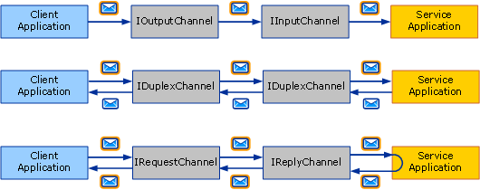
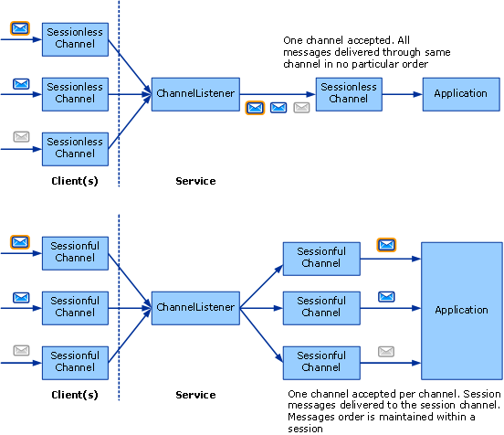

# Choosing a Message Exchange Pattern
The first step in writing a custom transport is to decide which *message exchange patterns* (or MEPs) are required for the channel you are developing. This topic describes the options available and discusses the various requirements. This is the first task in the channel development task list described in [Developing Channels](../../../../docs/framework/wcf/extending/developing-channels.md).  
  
## Six Message Exchange Patterns  
 There are three MEPs to choose from:  
  
-   Datagram (<xref:System.ServiceModel.Channels.IInputChannel> and <xref:System.ServiceModel.Channels.IOutputChannel>)  
  
     When using a datagram MEP, a client sends a message using a *fire and forget* exchange. A fire and forget exchange is one that requires out-of-band confirmation of successful delivery. The message might be lost in transit and never reach the service. If the send operation completes successfully at the client end, it does not guarantee that the remote endpoint has received the message. The datagram is a fundamental building block for messaging, as you can build your own protocols on top of it—including reliable protocols and secure protocols. Client datagram channels implement the <xref:System.ServiceModel.Channels.IOutputChannel> interface and service datagram channels implement the <xref:System.ServiceModel.Channels.IInputChannel> interface.  
  
-   Request-Response (<xref:System.ServiceModel.Channels.IRequestChannel> and <xref:System.ServiceModel.Channels.IReplyChannel>)  
  
     In this MEP, a message is sent, and a reply is received. The pattern consists of request-response pairs. Examples of request-response calls are remote procedure calls (RPC) and browser GET requests. This pattern is also known as half-duplex. In this MEP, client channels implement <xref:System.ServiceModel.Channels.IRequestChannel> and service channels implement <xref:System.ServiceModel.Channels.IReplyChannel>.  
  
-   Duplex (<xref:System.ServiceModel.Channels.IDuplexChannel>)  
  
     The duplex MEP allows an arbitrary number of messages to be sent by a client and received in any order. The duplex MEP is like a phone conversation, where each word being spoken is a message. Because both sides can send and receive in this MEP, the interface implemented by the client and service channels is <xref:System.ServiceModel.Channels.IDuplexChannel>.  
  
   
The three basic message exchange patterns. Top to bottom: datagram, request-response, and duplex.  
  
 Each of these MEPs can also support *sessions*. A session (and implementation of <xref:System.ServiceModel.Channels.ISessionChannel%601?displayProperty=nameWithType> of type <xref:System.ServiceModel.Channels.ISession?displayProperty=nameWithType>) correlates all messages sent and received on a channel. The request-response pattern is a stand-alone two-message session, as the request and reply are correlated. In contrast, the request-response pattern that supports sessions implies that all request/response pairs on that channel are correlated with each other. This gives you a total of six MEPs to choose from:  
  
-   Datagram  
  
-   Request-response  
  
-   Duplex  
  
-   Datagram with sessions  
  
-   Request-response with sessions  
  
-   Duplex with sessions  
  
> [!NOTE]
>  For the UDP transport, the only MEP that is supported is datagram, because UDP is inherently a fire and forget protocol.  
  
## Sessions and Sessionful Channels  
 In the networking world, there are connection-oriented protocols (for example, TCP) and connection-less protocols (for example, UDP). [!INCLUDE[indigo2](../../../../includes/indigo2-md.md)] uses the term session to mean a connection-like logical abstraction. Sessionful WCF protocols are similar to connection-oriented network protocols and sessionless WCF protocols are similar to connection-less network protocols.  
  
 In the channel object model, each logical session manifests as an instance of a sessionful channel. Therefore every new session created by the client, and accepted on the service, corresponds to a new sessionful channel on each side. The following diagram shows, on the top, the structure of sessionless channels, and on the bottom, the structure of sessionful channels.  
  
   
  
 A client creates a new sessionful channel and sends a message. On the service side, the channel listener receives this message and detects that it belongs to a new session so it creates a new sessionful channel and hands it to the application (in response to the application calling AcceptChannel on the channel listener). The application then receives this message and all subsequent messages sent in the same session through the same sessionful channel.  
  
 Another client (or the same client) creates a new sessionful and sends a message. The channel listener detects this message is in a new session and creates a new sessionful channel and the process repeats.  
  
 Without sessions, there is no correlation between channels and sessions. Therefore a channel listener creates only one channel through which all received messages are delivered to the application. There is also no message ordering because there is no session within which to maintain message order. The top portion of the preceding graphic illustrates a sessionless message exchange.  
  
## Starting and Terminating Sessions  
 Sessions are started on the client by simply creating a new sessionful channel. They are started on the service when the service receives a message that was sent in a new session. Likewise, sessions are terminated by closing or aborting a sessionful channel.  
  
 The exception to this is <xref:System.ServiceModel.Channels.IDuplexSessionChannel> which is used for both sending and receiving messages in a duplex, sessionful communication pattern. It is possible that one side will want to stop sending messages but continue to receive messages therefore when using <xref:System.ServiceModel.Channels.IDuplexSessionChannel> there is a mechanism that lets you close the output session indicating you will not send any more messages but keep the input session opened allowing you to continue to receive messages.  
  
 In general, sessions are closed on the outgoing side and not on the incoming side. That is, sessionful output channels can be closed, thereby cleanly terminating the session. Closing a sessionful output channel causes the corresponding sessionful input channel to return null to the application calling <xref:System.ServiceModel.Channels.IInputChannel.Receive%2A?displayProperty=nameWithType> on the <xref:System.ServiceModel.Channels.IDuplexSessionChannel>.  
  
 However sessionful input channels should not be closed unless <xref:System.ServiceModel.Channels.IInputChannel.Receive%2A?displayProperty=nameWithType> on the <xref:System.ServiceModel.Channels.IDuplexSessionChannel> returns null, indicating that the session is already closed. If <xref:System.ServiceModel.Channels.IInputChannel.Receive%2A?displayProperty=nameWithType> on the <xref:System.ServiceModel.Channels.IDuplexSessionChannel> has not returned null, closing a sessionful input channel may throw an exception because it may receive unexpected messages while closing. If a receiver wishes to terminate a session before the sender does, it should call <xref:System.ServiceModel.ICommunicationObject.Abort%2A> on the input channel, which abruptly terminates the session.  
  
## Writing Sessionful Channels  
 As a sessionful channel author, there are a few things your channel must do to provide sessions. On the send side, your channel needs to:  
  
-   For each new channel, create a new session and associate it with a new session id which is a unique string. Or obtain a new session from the sessionful channel below you in the stack.  
  
-   For each message sent using this channel, if your channel created the session (as opposed to obtaining it from the layer below you), you need to associate the message with the session. For protocol channels, this is typically done by adding a SOAP header. For transport channels, this is typically done by creating a new transport connection or adding session information to the framing protocol.  
  
-   For each message sent using this channel, you need to provide the delivery guarantees mentioned above. If you are relying on the channel below you to provide the session, that channel will also provide the delivery guarantees. If you’re providing the session yourself, you need to implement those guarantees as part of your protocol. In general, if you are writing a protocol channel that assumes WCF on both sides you may require the TCP transport or the Reliable Messaging channel and rely on either one to provide a session.  
  
-   When <xref:System.ServiceModel.ICommunicationObject.Close%2A?displayProperty=nameWithType> is called on your channel, perform the necessary work to close the session using either the specified timeout or the default one. This can be as simple as calling <xref:System.ServiceModel.ICommunicationObject.Close%2A> on the channel below you (if you just obtained the session from it) or sending a special SOAP message or closing a transport connection.  
  
-   When <xref:System.ServiceModel.ICommunicationObject.Abort%2A> is called on your channel, terminate the session abruptly without performing I/O. This may mean doing nothing or may involve aborting a network connection or some other resource.  
  
 On the receive side, your channel needs to:  
  
-   For each incoming message, the channel listener must detect the session it belongs to. If this is the first message in the session, the channel listener must create a new channel and return it from the call to <xref:System.ServiceModel.Channels.IChannelListener%601.AcceptChannel%2A?displayProperty=nameWithType>. Otherwise the channel listener must find the existing channel that corresponds to the session and deliver the message through that channel.  
  
-   If your channel is providing the session (along with the required delivery guarantees) the receive side may be required to perform some actions such as re-order messages or send acknowledgements.  
  
-   When <xref:System.ServiceModel.ICommunicationObject.Close%2A> is called on your channel, perform the necessary work to close the session either the specified timeout or the default one. This could result in exceptions if the channel receives a message while waiting for the close timeout to expire. That’s because the channel will be in the Closing state when it receives a message so it would throw.  
  
-   When <xref:System.ServiceModel.ICommunicationObject.Abort%2A> is called on your channel, terminate the session abruptly without performing I/O. Again, this may mean doing nothing or may involve aborting a network connection or some other resource.  
  
## See Also  
 [Channel Model Overview](../../../../docs/framework/wcf/extending/channel-model-overview.md)
