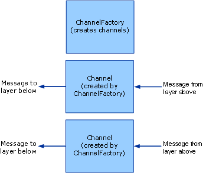

# Client: Channel Factories and Channels
This topic discusses the creation of channel factories and channels.  
  
## Channel Factories and Channels  
 Channel factories are responsible for creating channels. Channels created by channel factories are used for sending messages. These channels are responsible for getting the message from the layer above, performing whatever processing is necessary, then sending the message to the layer below. The following graphic illustrates this process.  
  
   
A channel factory creates channels.  
  
 When closed, channel factories are responsible for closing any channels they created that are not yet closed. Note that the model is asymmetric here because when a channel listener is closed, it only stops accepting new channels but leaves existing channels open so that they can continue receiving messages.  
  
 [!INCLUDE[indigo2](../../../../includes/indigo2-md.md)] provides base class helpers for this process. (For a diagram of the channel helper classes discussed in this topic, see [Channel Model Overview](../../../../docs/framework/wcf/extending/channel-model-overview.md).)  
  
-   The <xref:System.ServiceModel.Channels.CommunicationObject> class implements <xref:System.ServiceModel.ICommunicationObject> and enforces the state machine described in step 2 of [Developing Channels](../../../../docs/framework/wcf/extending/developing-channels.md).  
  
-   The``<xref:System.ServiceModel.Channels.ChannelManagerBase> class implements <xref:System.ServiceModel.Channels.CommunicationObject> and provides a unified base class for <xref:System.ServiceModel.Channels.ChannelFactoryBase?displayProperty=nameWithType> and <xref:System.ServiceModel.Channels.ChannelListenerBase?displayProperty=nameWithType>. The <xref:System.ServiceModel.Channels.ChannelManagerBase> class works in conjunction with <xref:System.ServiceModel.Channels.ChannelBase>, which is a base class that implements <xref:System.ServiceModel.Channels.IChannel>.  
  
-   The``<xref:System.ServiceModel.Channels.ChannelFactoryBase> class implements <xref:System.ServiceModel.Channels.ChannelManagerBase> and <xref:System.ServiceModel.Channels.IChannelFactory> and consolidates the `CreateChannel` overloads into one `OnCreateChannel` abstract method.  
  
-   The``<xref:System.ServiceModel.Channels.ChannelListenerBase> class implements <xref:System.ServiceModel.Channels.IChannelListener>. It takes care of basic state management.  
  
 The following discussion is based upon the [Transport: UDP](../../../../docs/framework/wcf/samples/transport-udp.md) sample.  
  
### Creating a Channel Factory  
 The `UdpChannelFactory` derives from <xref:System.ServiceModel.Channels.ChannelFactoryBase>. The sample overrides <xref:System.ServiceModel.Channels.ChannelFactoryBase.GetProperty%2A> to provide access to the message version of the message encoder. The sample also overrides <xref:System.ServiceModel.Channels.ChannelFactoryBase.OnClose%2A> to tear down our instance of <xref:System.ServiceModel.Channels.BufferManager> when the state machine transitions.  
  
#### The UDP Output Channel  
 The `UdpOutputChannel` implements <xref:System.ServiceModel.Channels.IOutputChannel>. The constructor validates the arguments and constructs a destination <xref:System.Net.EndPoint> object based on the <xref:System.ServiceModel.EndpointAddress> that is passed in.  
  
 The override of <xref:System.ServiceModel.Channels.CommunicationObject.OnOpen%2A> creates a socket that is used to send messages to this <xref:System.Net.EndPoint>.  
  
 `this.socket = new Socket(`  
  
 `this.remoteEndPoint.AddressFamily,`  
  
 `SocketType.Dgram,`  
  
 `ProtocolType.Udp`  
  
 `);`  
  
 The channel can be closed gracefully or ungracefully. If the channel is closed gracefully the socket is closed and a call is made to the base class `OnClose` method. If this throws an exception, the infrastructure calls `Abort` to ensure the channel is cleaned up.  
  
```  
this.socket.Close();  
base.OnClose(timeout);  
```  
  
 Implement `Send()` and `BeginSend()`/`EndSend()`. This breaks down into two main sections. First serialize the message into a byte array:  
  
```  
ArraySegment<byte> messageBuffer = EncodeMessage(message);  
```  
  
 Then send the resulting data on the wire:  
  
```  
this.socket.SendTo(  
  messageBuffer.Array,   
  messageBuffer.Offset,   
  messageBuffer.Count,   
  SocketFlags.None,   
  this.remoteEndPoint  
);  
```  
  
## See Also  
 [Developing Channels](../../../../docs/framework/wcf/extending/developing-channels.md)
