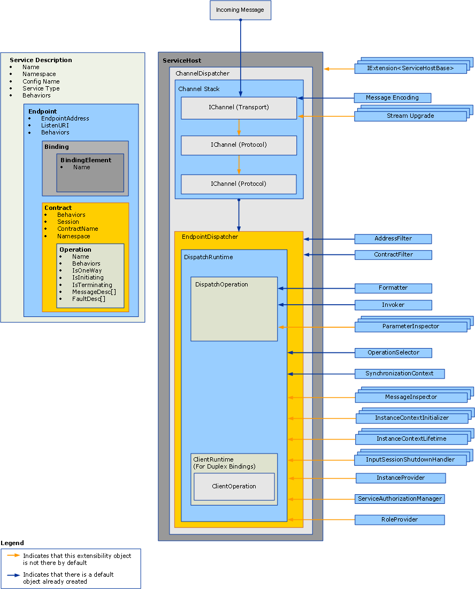

# Extending Dispatchers
Dispatchers are responsible for pulling incoming messages out of the underlying channels, translating them into method invocations in application code, and sending the results back to the caller. Dispatcher extensions allow you to modify this processing.  You can implement message or parameter inspectors that inspect or modify the contents of messages or parameters.  You can change the way messages are routed to operations or provide some other functionality.  
  
 This topic describes how to use the <xref:System.ServiceModel.Dispatcher.DispatchRuntime> and <xref:System.ServiceModel.Dispatcher.DispatchOperation> classes in a [!INCLUDE[indigo1](../../../../includes/indigo1-md.md)] service application to modify the default execution behavior of a dispatcher or to intercept or modify messages, parameters, or return values prior to or subsequent to sending or retrieving them from the channel layer. For more information about the equivalent client runtime message processing, see [Extending Clients](../../../../docs/framework/wcf/extending/extending-clients.md). To understand the role that <xref:System.ServiceModel.IExtensibleObject%601> types play in accessing shared state between various runtime customization objects, see [Extensible Objects](../../../../docs/framework/wcf/extending/extensible-objects.md).  
  
## Dispatchers  
 The service model layer performs the conversion between the developer’s programming model and the underlying message exchange, commonly called the channel layer. In [!INCLUDE[indigo2](../../../../includes/indigo2-md.md)] the channel and endpoint dispatchers (<xref:System.ServiceModel.Dispatcher.ChannelDispatcher> and <xref:System.ServiceModel.Dispatcher.EndpointDispatcher>, respectively) are the service components responsible for accepting new channels, receiving messages, operation dispatch and invocation, and response processing. Dispatcher objects are receiver objects, but callback contract implementations in duplex services also expose their dispatcher objects for inspection, modification, or extension.  
  
 The channel dispatcher (and companion <xref:System.ServiceModel.Channels.IChannelListener>) pulls messages out of the underling channel and passes the messages to their respective endpoint dispatchers. Each endpoint dispatcher has a <xref:System.ServiceModel.Dispatcher.DispatchRuntime> that routes messages to the appropriate <xref:System.ServiceModel.Dispatcher.DispatchOperation>, which is responsible for calling the method that implements the operation. Various optional and required extension classes are invoked along the way. This topic explains how these pieces fit together, and how you might modify properties and plug your own code in to extend the base functionality.  
  
 Dispatcher properties and modified customization objects are inserted by using service, endpoint, contract, or operation behavior objects. This topic does not describe how to use behaviors. For more information about the types used to insert dispatcher modifications, see [Configuring and Extending the Runtime with Behaviors](../../../../docs/framework/wcf/extending/configuring-and-extending-the-runtime-with-behaviors.md).  
  
 The following graphic provides a high-level view of the architectural items in a service.  
  
   
  
### Channel Dispatchers  
 A <xref:System.ServiceModel.Dispatcher.ChannelDispatcher> object is created to associate an <xref:System.ServiceModel.Channels.IChannelListener> at a particular URI (called a listen URI) with an instance of a service. Each <xref:System.ServiceModel.ServiceHost> object can have many <xref:System.ServiceModel.Dispatcher.ChannelDispatcher> objects, each associated with only one listener and listen URI. When a message arrives, the <xref:System.ServiceModel.Dispatcher.ChannelDispatcher> queries each of the associated <xref:System.ServiceModel.Dispatcher.EndpointDispatcher> objects whether the endpoint can accept the message, and passes the message to the one that can.  
  
 All properties that control the lifetime and behavior of a channel session are available for inspection or modification on the <xref:System.ServiceModel.Dispatcher.ChannelDispatcher> object. These include custom channel initializers, the channel listener, the host, the associated <xref:System.ServiceModel.InstanceContext>, and so on.  
  
### Endpoint Dispatchers  
 The <xref:System.ServiceModel.Dispatcher.EndpointDispatcher> object is responsible for processing messages from a <xref:System.ServiceModel.Dispatcher.ChannelDispatcher> when the destination address of a message matches the <xref:System.ServiceModel.Dispatcher.EndpointDispatcher.AddressFilter%2A> and the message action matches the <xref:System.ServiceModel.Dispatcher.EndpointDispatcher.ContractFilter%2A> property. If two <xref:System.ServiceModel.Dispatcher.EndpointDispatcher> objects can accept a message, the <xref:System.ServiceModel.Dispatcher.EndpointDispatcher.FilterPriority%2A> property value determines the higher priority endpoint.  
  
 Use the <xref:System.ServiceModel.Dispatcher.EndpointDispatcher> to acquire the two main service model extension points – the <xref:System.ServiceModel.Dispatcher.DispatchRuntime> and <xref:System.ServiceModel.Dispatcher.DispatchOperation> classes – that you can use to customize the processing of the dispatcher. The <xref:System.ServiceModel.Dispatcher.DispatchRuntime> class allows users to intercept and extend the dispatcher at the contract scope (that is, for all messages in a contract). The <xref:System.ServiceModel.Dispatcher.DispatchOperation> class allows users to intercept and extend the dispatcher at an operation scope (that is, for all messages in an operation).  
  
## Scenarios  
 There a number of reasons to extend the dispatcher:  
  
-   Custom Message Validation. Users can enforce that a message is valid for a certain schema. This can be done by implementing the message interceptor interfaces. For an example, see [Message Inspectors](../../../../docs/framework/wcf/samples/message-inspectors.md).  
  
-   Custom Message Logging. Users can inspect and log some set of application messages that flow through an endpoint. This can also be accomplished with the message interceptor interfaces.  
  
-   Custom Message Transformations. Users can apply certain transformations to the message in the runtime (for example, for versioning). This can be accomplished, again, with the message interceptor interfaces.  
  
-   Custom Data Model. Users can have a data serialization model other than those supported by default in [!INCLUDE[indigo2](../../../../includes/indigo2-md.md)] (namely, <xref:System.Runtime.Serialization.DataContractSerializer?displayProperty=nameWithType>, <xref:System.Xml.Serialization.XmlSerializer?displayProperty=nameWithType>, and raw messages). This can be done by implement the message formatter interfaces. For an example, see [Operation Formatter and Operation Selector](../../../../docs/framework/wcf/samples/operation-formatter-and-operation-selector.md).  
  
-   Custom Parameter Validation. Users can enforce that typed parameters are valid (as opposed to XML). This can be done using the parameter inspector interfaces.  
  
-   Custom Operation Dispatching. Users can implement dispatching on something other than action – for example, on the body element, or on a custom message property. This can be done using the <xref:System.ServiceModel.Dispatcher.IDispatchOperationSelector> interface. For an example, see [Operation Formatter and Operation Selector](../../../../docs/framework/wcf/samples/operation-formatter-and-operation-selector.md).  
  
-   Object Pooling. Users can pool instances rather than allocating a new one for every call. This can be implemented using the instance provider interfaces. For an example, see [Pooling](../../../../docs/framework/wcf/samples/pooling.md).  
  
-   Instance Leasing. Users can implement a leasing pattern for instance lifetime, similar to that of .NET Framework Remoting. This can be done using the instance context lifetime interfaces.  
  
-   Custom Error Handling. Users can control how both local errors are processed and how faults are communicated back to clients. This can be implemented using the <xref:System.ServiceModel.Dispatcher.IErrorHandler> interfaces.  
  
-   Custom Authorization Behaviors. Users can implement custom access control by extending the Contract or Operation run-time pieces and adding security checks based upon the tokens present in the message. This can be accomplished using either the message interceptor or parameter interceptor interfaces. For examples, see [Security Extensibility](../../../../docs/framework/wcf/samples/security-extensibility.md).  
  
    > [!CAUTION]
    >  Because altering security properties has the potential to compromise the security of [!INCLUDE[indigo2](../../../../includes/indigo2-md.md)] applications, it is strongly recommended that you undertake security-related modifications with care and test thoroughly prior to deployment.  
  
-   Custom WCF Runtime Validators. You can install custom validators that examine services, contracts, and bindings to enforce enterprise-level policies with respect to [!INCLUDE[indigo2](../../../../includes/indigo2-md.md)] applications. (For example, see [How to: Lock Down Endpoints in the Enterprise](../../../../docs/framework/wcf/extending/how-to-lock-down-endpoints-in-the-enterprise.md).)  
  
### Using the DispatchRuntime Class  
 Use the <xref:System.ServiceModel.Dispatcher.DispatchRuntime> class either to modify the default behavior of a service or individual endpoint, or to insert objects that implement custom modifications to one or both of the following service processes (or client processes in the case of a duplex client):  
  
-   The transformation of incoming messages into objects and releasing those objects as method invocations on a service object.  
  
-   The transformation of objects received from the response to a service operation invocation into outbound messages.  
  
 The <xref:System.ServiceModel.Dispatcher.DispatchRuntime> enables you to intercept and extend the channel or endpoint dispatcher for all messages across a particular contract, even when a message is not recognized. When a message arrives that does not match any declared in the contract it is dispatched to the operation returned by the <xref:System.ServiceModel.Dispatcher.DispatchRuntime.UnhandledDispatchOperation%2A> property. To intercept or extend across all messages for a particular operation, see the <xref:System.ServiceModel.Dispatcher.DispatchOperation> class.  
  
 There are four main areas of dispatcher extensibility exposed by the <xref:System.ServiceModel.Dispatcher.DispatchRuntime> class:  
  
1.  Channel components use the properties of the <xref:System.ServiceModel.Dispatcher.DispatchRuntime> and those of the associated channel dispatcher returned by the <xref:System.ServiceModel.Dispatcher.DispatchRuntime.ChannelDispatcher%2A> property to customize how the channel dispatcher accepts and closes channels. This category includes the <xref:System.ServiceModel.Dispatcher.ChannelDispatcher.ChannelInitializers%2A> and <xref:System.ServiceModel.Dispatcher.DispatchRuntime.InputSessionShutdownHandlers%2A> properties.  
  
2.  Message components are customized for each message processed. This category includes the <xref:System.ServiceModel.Dispatcher.DispatchRuntime.MessageInspectors%2A>, <xref:System.ServiceModel.Dispatcher.DispatchRuntime.OperationSelector%2A>, <xref:System.ServiceModel.Dispatcher.DispatchRuntime.Operations%2A>, and the <xref:System.ServiceModel.Dispatcher.ChannelDispatcher.ErrorHandlers%2A> properties.  
  
3.  Instance components customize the creation, lifetime, and disposal of instances of the service type. For more information about service object lifetimes, see the <xref:System.ServiceModel.ServiceBehaviorAttribute.InstanceContextMode%2A> property. This category includes the <xref:System.ServiceModel.Dispatcher.DispatchRuntime.InstanceContextInitializers%2A> and the <xref:System.ServiceModel.Dispatcher.DispatchRuntime.InstanceProvider%2A> properties.  
  
4.  Security-related components can use the following properties:  
  
    -   <xref:System.ServiceModel.Dispatcher.DispatchRuntime.SecurityAuditLogLocation%2A> indicates where audit events are written.  
  
    -   <xref:System.ServiceModel.Dispatcher.DispatchRuntime.ImpersonateCallerForAllOperations%2A> controls whether the service attempts to impersonate using the credentials provided by the incoming message.  
  
    -   <xref:System.ServiceModel.Dispatcher.DispatchRuntime.MessageAuthenticationAuditLevel%2A> controls whether successful message authentication events are written to the event log specified by <xref:System.ServiceModel.Dispatcher.DispatchRuntime.SecurityAuditLogLocation%2A>.  
  
    -   <xref:System.ServiceModel.Dispatcher.DispatchRuntime.PrincipalPermissionMode%2A> controls how the <xref:System.Threading.Thread.CurrentPrincipal%2A> property is set.  
  
    -   <xref:System.ServiceModel.Dispatcher.DispatchRuntime.ServiceAuthorizationAuditLevel%2A> specifies how the auditing of authorization events is performed.  
  
    -   <xref:System.ServiceModel.Dispatcher.DispatchRuntime.SuppressAuditFailure%2A> specifies whether to suppress non-critical exceptions that occur during the logging process.  
  
 Typically, custom extension objects are assigned to a <xref:System.ServiceModel.Dispatcher.DispatchRuntime> property or inserted into a collection by a service behavior (an object that implements <xref:System.ServiceModel.Description.IServiceBehavior>), a contract behavior (an object that implements <xref:System.ServiceModel.Description.IContractBehavior>), or an endpoint behavior (an object that implements <xref:System.ServiceModel.Description.IEndpointBehavior>). Then the installing behavior object is added to the appropriate collection of behaviors either programmatically or by implementing a custom <xref:System.ServiceModel.Configuration.BehaviorExtensionElement> object to enable the behavior to be inserted using an application configuration file.  
  
 Duplex clients (clients that implement a callback contract specified by a duplex service) also have a <xref:System.ServiceModel.Dispatcher.DispatchRuntime> object that can be accessed using the <xref:System.ServiceModel.Dispatcher.ClientRuntime.CallbackDispatchRuntime%2A> property.  
  
### Using the DispatchOperation Class  
 The <xref:System.ServiceModel.Dispatcher.DispatchOperation> class is the location for run-time modifications and the insertion point for custom extensions that are scoped to only one service operation. (To modify service run-time behavior for all messages in a contract, use the <xref:System.ServiceModel.Dispatcher.DispatchRuntime> class.)  
  
 Install <xref:System.ServiceModel.Dispatcher.DispatchOperation> modifications using a custom service behavior object.  
  
 Use the <xref:System.ServiceModel.Dispatcher.DispatchRuntime.Operations%2A> property to locate the <xref:System.ServiceModel.Dispatcher.DispatchOperation> object that represents a particular service operation.  
  
 The following properties control runtime execution at the operation level:  
  
-   The <xref:System.ServiceModel.Dispatcher.DispatchOperation.Action%2A>, <xref:System.ServiceModel.Dispatcher.DispatchOperation.ReplyAction%2A>, <xref:System.ServiceModel.Dispatcher.DispatchOperation.FaultContractInfos%2A>, <xref:System.ServiceModel.Dispatcher.DispatchOperation.IsOneWay%2A>, <xref:System.ServiceModel.Dispatcher.DispatchOperation.IsTerminating%2A>, and <xref:System.ServiceModel.Dispatcher.DispatchOperation.Name%2A> properties obtain the respective values for the operation.  
  
-   The <xref:System.ServiceModel.Dispatcher.DispatchOperation.TransactionAutoComplete%2A> and <xref:System.ServiceModel.Dispatcher.DispatchOperation.TransactionRequired%2A> specify transaction behavior.  
  
-   The <xref:System.ServiceModel.Dispatcher.DispatchOperation.ReleaseInstanceBeforeCall%2A> and <xref:System.ServiceModel.Dispatcher.DispatchOperation.ReleaseInstanceAfterCall%2A> properties control the lifetime of the user-defined service object relative to the <xref:System.ServiceModel.InstanceContext>.  
  
-   The <xref:System.ServiceModel.Dispatcher.DispatchOperation.DeserializeRequest%2A>, <xref:System.ServiceModel.Dispatcher.DispatchOperation.SerializeReply%2A>, and the <xref:System.ServiceModel.Dispatcher.DispatchOperation.Formatter%2A> properties enable explicit control over the conversion from messages to objects and objects to messages.  
  
-   The <xref:System.ServiceModel.Dispatcher.DispatchOperation.Impersonation%2A> property specifies the operation impersonation level.  
  
-   The <xref:System.ServiceModel.Dispatcher.DispatchOperation.CallContextInitializers%2A> property inserts custom call context extensions for the operation.  
  
-   The <xref:System.ServiceModel.Dispatcher.DispatchOperation.AutoDisposeParameters%2A> property controls when parameter objects are destroyed.  
  
-   The <xref:System.ServiceModel.Dispatcher.DispatchOperation.Invoker%2A> property to insert a custom invoker object.  
  
-   The <xref:System.ServiceModel.Dispatcher.DispatchOperation.ParameterInspectors%2A> property enables you to insert a custom parameter inspector that you can use to inspect or modify parameters and return values.  
  
## See Also  
 <xref:System.ServiceModel.Dispatcher.DispatchRuntime>  
 <xref:System.ServiceModel.Dispatcher.DispatchOperation>  
 [How to: Inspect and Modify Messages on the Service](../../../../docs/framework/wcf/extending/how-to-inspect-and-modify-messages-on-the-service.md)  
 [How to: Inspect or Modify Parameters](../../../../docs/framework/wcf/extending/how-to-inspect-or-modify-parameters.md)  
 [How to: Lock Down Endpoints in the Enterprise](../../../../docs/framework/wcf/extending/how-to-lock-down-endpoints-in-the-enterprise.md)
