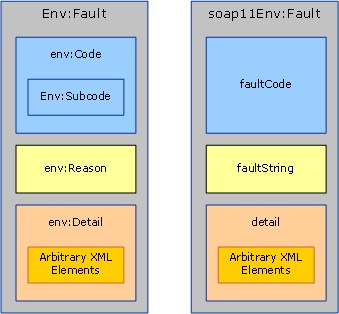
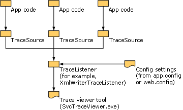

# Handling Exceptions and Faults
Exceptions are used to communicate errors locally within the service or the client implementation. Faults, on the other hand, are used to communicate errors across service boundaries, such as from the server to the client or vice versa. In addition to faults, transport channels often use transport-specific mechanisms to communicate transport-level errors. For example, HTTP transport uses status codes such as 404 to communicate a non-existing endpoint URL (there is no endpoint to send back a fault). This document consists of three sections that provide guidance to custom channel authors. The first section provides guidance on when and how to define and throw exceptions. The second section provides guidance around generating and consuming faults. The third section explains how to provide trace information to aid the user of your custom channel in troubleshooting running applications.  
  
## Exceptions  
 There are two things to keep in mind when throwing an exception: First it has to be of a type that allows users to write correct code that can react appropriately to the exception. Second, it has to provide enough information for the user to understand what went wrong, the failure impact, and how to fix it. The following sections give guidance around exception types and messages for [!INCLUDE[indigo1](../../../../includes/indigo1-md.md)] channels. There is also general guidance around exceptions in .NET in the Design Guidelines for Exceptions document.  
  
### Exception Types  
 All exceptions thrown by channels must be either a <xref:System.TimeoutException?displayProperty=nameWithType>, <xref:System.ServiceModel.CommunicationException?displayProperty=nameWithType>, or a type derived from <xref:System.ServiceModel.CommunicationException>. (Exceptions such as <xref:System.ObjectDisposedException> may also be thrown, but only to indicate that the calling code has misused the channel. If a channel is used correctly, it must only throw the given exceptions.) [!INCLUDE[indigo2](../../../../includes/indigo2-md.md)] provides seven exception types that derive from <xref:System.ServiceModel.CommunicationException> and are designed to be used by channels. There are other <xref:System.ServiceModel.CommunicationException>-derived exceptions that are designed to be used by other parts of the system. These exception types are:  
  
|Exception Type|Meaning|Inner Exception Content|Recovery Strategy|  
|--------------------|-------------|-----------------------------|-----------------------|  
|<xref:System.ServiceModel.AddressAlreadyInUseException>|The endpoint address specified for listening is already in use.|If present, provides more details about the transport error that caused this exception. For example. <xref:System.IO.PipeException>, <xref:System.Net.HttpListenerException>, or <xref:System.Net.Sockets.SocketException>.|Try a different address.|  
|<xref:System.ServiceModel.AddressAccessDeniedException>|The process is not allowed access to the endpoint address specified for listening.|If present, provides more details about the transport error that caused this exception. For example, <xref:System.IO.PipeException>, or <xref:System.Net.HttpListenerException>.|Try with different credentials.|  
|<xref:System.ServiceModel.CommunicationObjectFaultedException>|The <xref:System.ServiceModel.ICommunicationObject> being used is in the Faulted state (for more information, see [Understanding State Changes](../../../../docs/framework/wcf/extending/understanding-state-changes.md)). Note that when an object with multiple pending calls transitions to the Faulted state, only one call throws an exception that is related to the failure and the rest of the calls throw a <xref:System.ServiceModel.CommunicationObjectFaultedException>. This exception is typically thrown because an application overlooks some exception and tries to use an already faulted object, possibly on a thread other than the one that caught the original exception.|If present provides details about the inner exception.|Create a new object. Note that depending on what caused the <xref:System.ServiceModel.ICommunicationObject> to fault in the first place, there may be other work required to recover.|  
|<xref:System.ServiceModel.CommunicationObjectAbortedException>|The <xref:System.ServiceModel.ICommunicationObject> being used has been Aborted (for more information, see [Understanding State Changes](../../../../docs/framework/wcf/extending/understanding-state-changes.md)). Similar to <xref:System.ServiceModel.CommunicationObjectFaultedException>, his exception indicates the application has called <xref:System.ServiceModel.ICommunicationObject.Abort%2A> on the object, possibly from another thread, and the object is no longer usable for that reason.|If present provides details about the inner exception.|Create a new object. Note that depending on what caused the <xref:System.ServiceModel.ICommunicationObject> to abort in the first place, there may be other work required to recover.|  
|<xref:System.ServiceModel.EndpointNotFoundException>|The target remote endpoint is not listening. This can result from any part of the endpoint address being incorrect, irresolvable, or the endpoint being down. Examples include DNS error, Queue Manager not available, and service not running.|The inner exception provides details, typically from the underlying transport.|Try a different address. Alternatively, the sender may wait a while and try again in case the service was down|  
|<xref:System.ServiceModel.ProtocolException>|The communication protocols, as described by the endpoint’s policy, are mismatched between endpoints. For example, framing content type mismatch or max message size exceeded.|If present provides more information about the specific protocol error. For example, <xref:System.ServiceModel.QuotaExceededException> is the inner exception when the error cause is exceeding MaxReceivedMessageSize.|Recovery: Ensure sender and received protocol settings match. One way to do this is to re-import the service endpoint’s metadata (policy) and use the generated binding to recreate the channel.|  
|<xref:System.ServiceModel.ServerTooBusyException>|The remote endpoint is listening but is not prepared to process messages.|If present, the inner Exception provides the SOAP fault or transport-level error details.|Recovery: Wait and retry the operation later.|  
|<xref:System.TimeoutException>|The operation failed to complete within the timeout period.|May provide details about the timeout.|Wait and retry the operation later.|  
  
 Define a new exception type only if that type corresponds to a specific recovery strategy different from all of the existing exception types. If you do define a new exception type, it must derive from <xref:System.ServiceModel.CommunicationException> or one of its derived classes.  
  
### Exception Messages  
 Exception messages are targeted at the user not the program so they should provide sufficient information to help the user understand and solve the problem. The three essential parts of a good exception message are:  
  
 What happened. Provide a clear description of the problem using terms that relate to the user’s experience. For example, a bad exception message would be "Invalid configuration section". This leaves the user wondering which configuration section is incorrect and why it is incorrect. An improved message would be "Invalid configuration section \<customBinding>". An even better message would be "Cannot add the transport named myTransport to the binding named myBinding because the binding already has a transport named myTransport". This is a very specific message using terms and names that the user can easily identify in the application’s configuration file. However, there are still a few key components missing.  
  
 The significance of the error. Unless the message states clearly what the error means, the user is likely to wonder whether it is a fatal error or if it can be ignored. In general, messages should lead with the meaning or significance of the error. To improve the previous example, the message could be "ServiceHost failed to Open due to a configuration error: Cannot add the transport named myTransport to the binding named myBinding because the binding already has a transport named myTransport".  
  
 How the user should correct the problem. The most important part of the message is helping the user fix the problem. The message should include some guidance or hints about what to check or fix to remedy the problem. For example, "ServiceHost failed to Open due to a configuration error: Cannot add the transport named myTransport to the binding named myBinding because the binding already has a transport named myTransport. Please ensure there is only one transport in the binding".  
  
## Communicating Faults  
 SOAP 1.1 and SOAP 1.2 both define a specific structure for faults. There are some differences between the two specifications but in general, the Message and MessageFault types are used to create and consume faults.  
  
   
SOAP 1.2 Fault (left) and SOAP 1.1 Fault (right). Note that in SOAP 1.1 only the Fault element is namespace qualified.  
  
 SOAP defines a fault message as a message that contains only a fault element (an element whose name is `<env:Fault>`) as a child of `<env:Body>`. The contents of the fault element differ slightly between SOAP 1.1 and SOAP 1.2 as shown in figure 1. However, the <xref:System.ServiceModel.Channels.MessageFault?displayProperty=nameWithType> class normalizes these differences into one object model:  
  
```  
public abstract class MessageFault  
{  
    protected MessageFault();  
  
    public virtual string Actor { get; }  
    public virtual string Node { get; }  
    public static string DefaultAction { get; }  
    public abstract FaultCode Code { get; }  
    public abstract bool HasDetail { get; }  
    public abstract FaultReason Reason { get; }  
  
    public T GetDetail<T>();  
    public T GetDetail<T>( XmlObjectSerializer serializer);  
    public System.Xml.XmlDictionaryReader GetReaderAtDetailContents();  
  
    // other methods omitted  
}  
```  
  
 The `Code` property corresponds to the `env:Code` (or `faultCode` in SOAP 1.1) and identifies the type of the fault. SOAP 1.2 defines five allowable values for `faultCode` (for example, Sender and Receiver) and defines a `Subcode` element which can contain any subcode value. (See the [SOAP 1.2 specification](http://go.microsoft.com/fwlink/?LinkId=95176) for the list of allowable fault codes and their meaning.) SOAP 1.1 has a slightly different mechanism: It defines four `faultCode` values (for example, Client and Server) that can be extended either by defining entirely new ones or by using the dot notation to create more specific `faultCodes`, for example, Client.Authentication.  
  
 When you use MessageFault to program faults, the FaultCode.Name and FaultCode.Namespace maps to the name and namespace of the SOAP 1.2 `env:Code` or the SOAP 1.1 `faultCode`. The FaultCode.SubCode maps to `env:Subcode` for SOAP 1.2 and is null for SOAP 1.1.  
  
 You should create new fault subcodes (or new fault codes if using SOAP 1.1) if it is interesting to programmatically distinguish a fault. This is analogous to creating a new exception type. You should avoid using the dot notation with SOAP 1.1 fault codes. (The [WS-I Basic Profile](http://go.microsoft.com/fwlink/?LinkId=95177) also discourages the use of the fault code dot notation.)  
  
```  
public class FaultCode  
{  
    public FaultCode(string name);  
    public FaultCode(string name, FaultCode subCode);  
    public FaultCode(string name, string ns);  
    public FaultCode(string name, string ns, FaultCode subCode);  
  
    public bool IsPredefinedFault { get; }  
    public bool IsReceiverFault { get; }  
    public bool IsSenderFault { get; }  
    public string Name { get; }  
    public string Namespace { get; }  
    public FaultCode SubCode { get; }  
  
//  methods omitted  
  
}  
```  
  
 The `Reason` property corresponds to the `env:Reason` (or `faultString` in SOAP 1.1) a human-readable description of the error condition analogous to an exception’s message. The `FaultReason` class (and SOAP `env:Reason/faultString`) has built-in support for having multiple translations in the interest of globalization.  
  
```  
public class FaultReason  
{  
    public FaultReason(FaultReasonText translation);  
    public FaultReason(IEnumerable<FaultReasonText> translations);  
    public FaultReason(string text);  
  
    public SynchronizedReadOnlyCollection<FaultReasonText> Translations   
    {   
       get;   
    }  
  
 }  
```  
  
 The fault detail contents are exposed on MessageFault using various methods including the `GetDetail`\<T> and `GetReaderAtDetailContents`(). The fault detail is an opaque element for carrying additional detail about the fault. This is useful if there is some arbitrary structured detail that you want to carry with the fault.  
  
### Generating Faults  
 This section explains the process of generating a fault in response to an error condition detected in a channel or in a message property created by the channel. A typical example is sending back a fault in response to a request message that contains invalid data.  
  
 When generating a fault, the custom channel should not send the fault directly, rather, it should throw an exception and let the layer above decide whether to convert that exception to a fault and how to send it. To aid in this conversion, the channel should provide a `FaultConverter` implementation that can convert the exception thrown by the custom channel to the appropriate fault. `FaultConverter` is defined as:  
  
```  
public class FaultConverter  
{  
    public static FaultConverter GetDefaultFaultConverter(  
                                   MessageVersion version);  
    protected abstract bool OnTryCreateFaultMessage(  
                                   Exception exception,   
                                   out Message message);  
    public bool TryCreateFaultMessage(  
                                   Exception exception,   
                                   out Message message);  
}  
```  
  
 Each channel that generates custom faults must implement `FaultConverter` and return it from a call to `GetProperty<FaultConverter>`. The custom `OnTryCreateFaultMessage` implementation must either convert the exception to a fault or delegate to the inner channel’s `FaultConverter`. If the channel is a transport it must either convert the exception or delegate to the encoder’s `FaultConverter` or the default `FaultConverter` provided in [!INCLUDE[indigo2](../../../../includes/indigo2-md.md)] . The default `FaultConverter` converts errors corresponding to fault messages specified by WS-Addressing and SOAP. Here is an example `OnTryCreateFaultMessage` implementation.  
  
```  
public override bool OnTryCreateFaultMessage(Exception exception,   
                                             out Message message)  
{  
    if (exception is ...)  
    {  
        message = ...;  
        return true;  
    }  
  
#if IMPLEMENTING_TRANSPORT_CHANNEL  
    FaultConverter encoderConverter =   
                    this.encoder.GetProperty<FaultConverter>();  
    if ((encoderConverter != null) &&               
        (encoderConverter.TryCreateFaultMessage(  
         exception, out message)))  
    {  
        return true;  
    }  
  
    FaultConverter defaultConverter =   
                   FaultConverter.GetDefaultFaultConverter(  
                   this.channel.messageVersion);  
    return defaultConverter.TryCreateFaultMessage(  
                   exception,   
                   out message);  
#else  
    FaultConverter inner =   
                   this.innerChannel.GetProperty<FaultConverter>();  
    if (inner != null)  
    {  
        return inner.TryCreateFaultMessage(exception, out message);  
    }  
    else  
    {  
        message = null;  
        return false;  
    }  
#endif  
}  
```  
  
 An implication of this pattern is that exceptions thrown between layers for error conditions that require faults must contain enough information for the corresponding fault generator to create the correct fault. As a custom channel author, you may define exception types that correspond to different fault conditions if such exceptions do not already exist. Note that exceptions traversing channel layers should communicate the error condition rather than opaque fault data.  
  
### Fault Categories  
 There are generally three categories of faults:  
  
1.  Faults that are pervasive throughout the entire stack. These faults could be encountered at any layer in the channel stack, for example InvalidCardinalityAddressingException.  
  
2.  Faults that can be encountered anywhere above a certain layer in the stack for example some errors that pertain to a flowed transaction or to security roles.  
  
3.  Faults that are directed at a single layer in the stack, for example errors like WS-RM sequence number faults.  
  
 Category 1. Faults are generally WS-Addressing and SOAP faults. The base `FaultConverter` class provided by [!INCLUDE[indigo2](../../../../includes/indigo2-md.md)] converts errors corresponding to fault messages specified by WS-Addressing and SOAP so you do not have to handle conversion of these exceptions yourself.  
  
 Category 2. Faults occur when a layer adds a property to the message that does not completely consume message information that pertains to that layer. Errors may be detected later when a higher layer asks the message property to process message information further. Such channels should implement the `GetProperty` specified previously to enable the higher layer to send back the correct fault. An example of this is the TransactionMessageProperty. This property is added to the message without fully validating all the data in the header (doing so may involve contacting the distributed transaction coordinator (DTC).  
  
 Category 3. Faults are only generated and sent by a single layer in the processor. Therefore all the exceptions are contained within the layer. To improve consistency among channels and ease maintenance, your custom channel should use the pattern specified previously to generate fault messages even for internal faults.  
  
### Interpreting Received Faults  
 This section provides guidance for generating the appropriate exception when receiving a fault message. The decision tree for processing a message at every layer in the stack is as follows:  
  
1.  If the layer considers the message to be invalid, the layer should do its ‘invalid message’ processing. Such processing is specific to the layer but could include dropping the message, tracing, or throwing an exception that gets converted to a fault. Examples include security receiving a message that is not secured properly, or RM receiving a message with a bad sequence number.  
  
2.  Otherwise, if the message is a fault message that applies specifically to the layer, and the message is not meaningful outside the layer’s interaction, the layer should handle the error condition. An example of this is an RM Sequence Refused fault that is meaningless to layers above the RM channel and that implies faulting the RM channel and throwing from pending operations.  
  
3.  Otherwise, the message should be returned from Request() or Receive(). This includes cases where the layer recognizes the fault, but the fault just indicates that a request failed and does not imply faulting the channel and throwing from pending operations. To improve usability in such a case, the layer should implement `GetProperty<FaultConverter>` and return a `FaultConverter` derived class that can convert the fault to an exception by overriding `OnTryCreateException`.  
  
 The following object model supports converting messages to exceptions:  
  
```  
public class FaultConverter  
{  
    public static FaultConverter GetDefaultFaultConverter(  
                                  MessageVersion version);  
    protected abstract bool OnTryCreateException(  
                                 Message message,   
                                 MessageFault fault,   
                                 out Exception exception);  
    public bool TryCreateException(  
                                 Message message,   
                                 MessageFault fault,   
                                 out Exception exception);  
}  
```  
  
 A channel layer can implement `GetProperty<FaultConverter>` to support converting fault messages to exceptions. To do so, override `OnTryCreateException` and inspect the fault message. If recognized, do the conversion, otherwise ask the inner channel to convert it. Transport channels should delegate to `FaultConverter.GetDefaultFaultConverter` to get the default SOAP/WS-Addressing FaultConverter.  
  
 A typical implementation looks like this:  
  
```  
public override bool OnTryCreateException(  
                            Message message,   
                            MessageFault fault,   
                            out Exception exception)  
{  
    if (message.Action == "...")  
    {  
        exception = ...;  
        return true;  
    }  
    // OR  
    if ((fault.Code.Name == "...") && (fault.Code.Namespace == "..."))  
    {  
        exception = ...;  
        return true;  
    }  
  
    if (fault.IsMustUnderstand)  
    {  
        if (fault.WasHeaderNotUnderstood(  
                   message.Headers, "...", "..."))  
        {  
            exception = new ProtocolException(...);  
            return true;  
        }  
    }  
  
#if IMPLEMENTING_TRANSPORT_CHANNEL  
    FaultConverter encoderConverter =   
              this.encoder.GetProperty<FaultConverter>();  
    if ((encoderConverter != null) &&   
        (encoderConverter.TryCreateException(  
                              message, fault, out exception)))  
    {  
        return true;  
    }  
  
    FaultConverter defaultConverter =  
             FaultConverter.GetDefaultFaultConverter(  
                             this.channel.messageVersion);  
    return defaultConverter.TryCreateException(  
                             message, fault, out exception);  
#else  
    FaultConverter inner =   
                    this.innerChannel.GetProperty<FaultConverter>();  
    if (inner != null)  
    {  
        return inner.TryCreateException(message, fault, out exception);  
    }  
    else  
    {  
        exception = null;  
        return false;  
    }  
#endif  
}  
```  
  
 For specific fault conditions that have distinct recovery scenarios, consider defining a derived class of `ProtocolException`.  
  
### MustUnderstand Processing  
 SOAP defines a general fault for signaling that a required header was not understood by the receiver. This fault is known as the `mustUnderstand` fault. In [!INCLUDE[indigo2](../../../../includes/indigo2-md.md)], custom channels never generate `mustUnderstand` faults. Instead, the [!INCLUDE[indigo2](../../../../includes/indigo2-md.md)] Dispatcher, which is located at the top of the [!INCLUDE[indigo2](../../../../includes/indigo2-md.md)] communication stack, checks to see that all headers that were marked as MustUndestand=true were understood by the underlying stack. If any were not understood, a `mustUnderstand` fault is generated at that point. (The user can choose to turn off this `mustUnderstand` processing and have the application receive all message headers. In that case the application is responsible for performing `mustUnderstand` processing.) The generated fault includes a NotUnderstood header that contains the names of all headers with MustUnderstand=true that were not understood.  
  
 If your protocol channel sends a custom header with MustUnderstand=true and receives a `mustUnderstand` fault, it must figure out whether that fault is due to the header it sent. There are two members on the `MessageFault` class that are useful for this:  
  
```  
public class MessageFault  
{  
    ...  
    public bool IsMustUnderstandFault { get; }  
    public static bool WasHeaderNotUnderstood(MessageHeaders headers,   
        string name, string ns) { }  
    ...  
  
}  
```  
  
 `IsMustUnderstandFault` returns `true` if the fault is a `mustUnderstand` fault. `WasHeaderNotUnderstood` returns `true` if the header with the specified name and namespace is included in the fault as a NotUnderstood header.  Otherwise, it returns `false`.  
  
 If a channel emits a header that is marked MustUnderstand = true, then that layer should also implement the Exception Generation API pattern and should convert `mustUnderstand` faults caused by that header to a more useful exception as described previously.  
  
## Tracing  
 The .NET Framework provides a mechanism to trace program execution as a way to aid diagnosing production applications or intermittent problems where it is not possible to just attach a debugger and step through the code. The core components of this mechanism are in the <xref:System.Diagnostics?displayProperty=nameWithType> namespace and consist of:  
  
-   <xref:System.Diagnostics.TraceSource?displayProperty=nameWithType>, which is the source of trace information to be written, <xref:System.Diagnostics.TraceListener?displayProperty=nameWithType>, which is an abstract base class for concrete listeners that receive the information to be traced from the <xref:System.Diagnostics.TraceSource> and output it to a listener-specific destination. For example, <xref:System.Diagnostics.XmlWriterTraceListener> outputs trace information to an XML file. Finally, <xref:System.Diagnostics.TraceSwitch?displayProperty=nameWithType>, which lets the application user control the tracing verbosity and is typically specified in configuration.  
  
-   In addition to the core components, you can use the [Service Trace Viewer Tool (SvcTraceViewer.exe)](../../../../docs/framework/wcf/service-trace-viewer-tool-svctraceviewer-exe.md) to view and search [!INCLUDE[indigo2](../../../../includes/indigo2-md.md)] traces. The tool is designed specifically for trace files generated by [!INCLUDE[indigo2](../../../../includes/indigo2-md.md)] and written out using <xref:System.Diagnostics.XmlWriterTraceListener>. The following figure shows the various components involved in tracing.  
  
   
  
### Tracing from a Custom Channel  
 Custom channels should write out trace messages to assist in diagnosing problems when it is not possible to attach a debugger to the running application. This involves two high level tasks: Instantiating a <xref:System.Diagnostics.TraceSource> and calling its methods to write traces.  
  
 When instantiating a <xref:System.Diagnostics.TraceSource>, the string you specify becomes the name of that source. This name is used to configure (enable/disable/set tracing level) the trace source. It also appears in the trace output itself. Custom channels should use a unique source name to help readers of the trace output understand where the trace information comes from. Using the name of the assembly that is writing the information as the name of the trace source is the common practice. For example, [!INCLUDE[indigo2](../../../../includes/indigo2-md.md)] uses System.ServiceModel as the trace source for information written from the System.ServiceModel assembly.  
  
 Once you have a trace source, you call its <xref:System.Diagnostics.TraceSource.TraceData%2A>, <xref:System.Diagnostics.TraceSource.TraceEvent%2A>, or <xref:System.Diagnostics.TraceSource.TraceInformation%2A> methods to write trace entries to the trace listeners. For each trace entry you write, you need to classify the type of event as one of the event types defined in <xref:System.Diagnostics.TraceEventType>. This classification and the trace level setting in configuration determine whether the trace entry is output to the listener. For example, setting the trace level in configuration to `Warning` allows `Warning`, `Error` and `Critical` trace entries to be written but blocks Information and Verbose entries. Here is an example of instantiating a trace source and writing out an entry at Information level:  
  
```  
using System.Diagnostics;  
//...  
TraceSource udpSource=new TraceSource("Microsoft.Samples.Udp");  
//...  
udpsource.TraceInformation("UdpInputChannel received a message");  
```  
  
> [!IMPORTANT]
>  It is highly recommended that you specify a trace source name that is unique to your custom channel to help trace output readers understand where the output came from.  
  
#### Integrating with the Trace Viewer  
 Traces generated by your channel can be output in a format readable by the [Service Trace Viewer Tool (SvcTraceViewer.exe)](../../../../docs/framework/wcf/service-trace-viewer-tool-svctraceviewer-exe.md) by using <xref:System.Diagnostics.XmlWriterTraceListener?displayProperty=nameWithType> as the trace listener. This is not something you, as the channel developer, need to do. Rather, it is the application user (or the person troubleshooting the application) that needs to configure this trace listener in the application’s configuration file. For example, the following configuration outputs trace information from both <xref:System.ServiceModel?displayProperty=nameWithType> and `Microsoft.Samples.Udp` to the file named `TraceEventsFile.e2e`:  
  
```xml  
<configuration>  
  <system.diagnostics>  
    <sources>  
      <!-- configure System.ServiceModel trace source -->  
      <source name="System.ServiceModel" switchValue="Verbose"   
              propagateActivity="true">  
        <listeners>  
          <add name="e2e" />  
        </listeners>  
      </source>  
      <!-- configure Microsoft.Samples.Udp trace source -->  
      <source name="Microsoft.Samples.Udp" switchValue="Verbose" >  
        <listeners>  
          <add name="e2e" />  
        </listeners>  
      </source>  
    </sources>  
    <!--   
    Define a shared trace listener that outputs to TraceFile.e2e  
    The listener name is e2e   
    -->  
    <sharedListeners>  
      <add name="e2e" type="System.Diagnostics.XmlWriterTraceListener"  
        initializeData=".\TraceFile.e2e"/>  
    </sharedListeners>  
    <trace autoflush="true" />  
  </system.diagnostics>  
</configuration>  
```  
  
#### Tracing Structured Data  
 <xref:System.Diagnostics.TraceSource?displayProperty=nameWithType> has a <xref:System.Diagnostics.TraceSource.TraceData%2A> method that takes one or more objects that are to be included in the trace entry. In general, the <xref:System.Object.ToString%2A?displayProperty=nameWithType> method is called on each object and the resulting string is written as part of the trace entry. When using <xref:System.Diagnostics.XmlWriterTraceListener?displayProperty=nameWithType> to output traces, you can pass an <xref:System.Xml.XPath.IXPathNavigable?displayProperty=nameWithType> as the data object to <xref:System.Diagnostics.TraceSource.TraceData%2A>. The resulting trace entry includes the XML provided by the <xref:System.Xml.XPath.XPathNavigator?displayProperty=nameWithType>. Here is an example entry with XML application data:  
  
```xml  
<E2ETraceEvent xmlns="http://schemas.microsoft.com/2004/06/E2ETraceEvent">  
  <System xmlns="...">  
    <EventID>12</EventID>  
    <Type>3</Type>  
    <SubType Name="Information">0</SubType>  
    <Level>8</Level>  
    <TimeCreated SystemTime="2006-01-13T22:58:03.0654832Z" />  
    <Source Name="Microsoft.ServiceModel.Samples.Udp" />  
    <Correlation ActivityID="{00000000-0000-0000-0000-000000000000}" />  
    <Execution  ProcessName="UdpTestConsole"   
                ProcessID="3348" ThreadID="4" />  
    <Channel />  
    <Computer>COMPUTER-LT01</Computer>  
  </System>  
<!-- XML application data -->  
  <ApplicationData>  
  <TraceData>  
   <DataItem>  
   <TraceRecord   
     Severity="Information"  
     xmlns="…">  
        <TraceIdentifier>some trace id</TraceIdentifier>  
        <Description>EndReceive called</Description>  
        <AppDomain>UdpTestConsole.exe</AppDomain>  
        <Source>UdpInputChannel</Source>  
      </TraceRecord>  
    </DataItem>  
  </TraceData>  
  </ApplicationData>  
</E2ETraceEvent>  
```  
  
 The [!INCLUDE[indigo2](../../../../includes/indigo2-md.md)] trace viewer understands the schema of the `TraceRecord` element shown previously and extracts the data from its child elements and displays it in a tabular format. Your channel should use this schema when tracing structured application data to help Svctraceviewer.exe users read the data.
