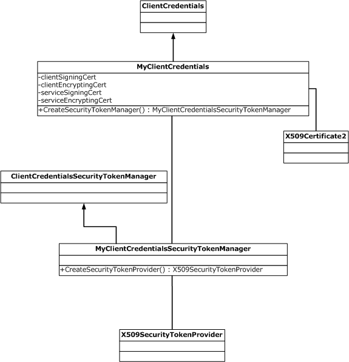
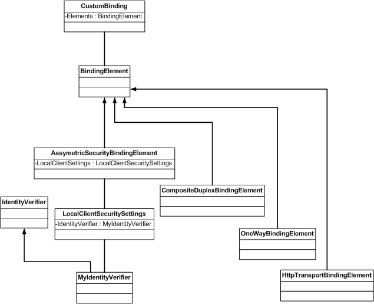

# How to: Use Separate X.509 Certificates for Signing and Encryption
This topic shows how to configure [!INCLUDE[indigo1](../../../../includes/indigo1-md.md)] to use different certificates for message signing and encryption on both the client and service.  
  
 To enable separate certificates to be used for signing and encryption, a custom client or service credentials (or both) must be created because [!INCLUDE[indigo2](../../../../includes/indigo2-md.md)] does not provide an API to set multiple client or service certificates. Additionally, a security token manager must be provided to leverage the multiple certificates' information and to create an appropriate security token provider for specified key usage and message direction.  
  
 The following diagram shows the main classes used, the classes they inherit from (shown by an upward-pointing arrow), and the return types of certain methods and properties.  
  
-   `MyClientCredentials` is a custom implementation of <xref:System.ServiceModel.Description.ClientCredentials>.  
  
    -   Its properties shown in the diagram all return instances of <xref:System.Security.Cryptography.X509Certificates.X509Certificate2>.  
  
    -   Its method <xref:System.ServiceModel.Description.ClientCredentials.CreateSecurityTokenManager%2A> returns an instance of `MyClientCredentialsSecurityTokenManager`.  
  
-   `MyClientCredentialsSecurityTokenManager` is a custom implementation of <xref:System.ServiceModel.ClientCredentialsSecurityTokenManager>.  
  
    -   Its method <xref:System.ServiceModel.ClientCredentialsSecurityTokenManager.CreateSecurityTokenProvider%2A> returns an instance of <xref:System.IdentityModel.Selectors.X509SecurityTokenProvider>.  
  
   
  
 [!INCLUDE[crabout](../../../../includes/crabout-md.md)] custom credentials, see [Walkthrough: Creating Custom Client and Service Credentials](../../../../docs/framework/wcf/extending/walkthrough-creating-custom-client-and-service-credentials.md).  
  
 In addition, you must create a custom identity verifier, and link it to a security binding element in a custom binding. You must also use the custom credentials instead of the default credentials.  
  
 The following diagram shows the classes involved in the custom binding, and how the custom identity verifier is linked. There are several binding elements involved, all of which inherit from <xref:System.ServiceModel.Channels.BindingElement>. The <xref:System.ServiceModel.Channels.AsymmetricSecurityBindingElement> has the <xref:System.ServiceModel.Channels.LocalClientSecuritySettings> property, which returns an instance of <xref:System.ServiceModel.Security.IdentityVerifier>, from which `MyIdentityVerifier` is customized.  
  
   
  
 [!INCLUDE[crabout](../../../../includes/crabout-md.md)] creating a custom identity verifier, see How to: [How to: Create a Custom Client Identity Verifier](../../../../docs/framework/wcf/extending/how-to-create-a-custom-client-identity-verifier.md).  
  
### To use separate certificates for signing and encryption  
  
1.  Define a new client credentials class that inherits from the <xref:System.ServiceModel.Description.ClientCredentials> class. Implement four new properties to allow multiple certificates specification: `ClientSigningCertificate`, `ClientEncryptingCertificate`, `ServiceSigningCertificate`, and `ServiceEncryptingCertificate`. Also override the <xref:System.ServiceModel.Description.ClientCredentials.CreateSecurityTokenManager%2A> method to return an instance of the customized <xref:System.ServiceModel.ClientCredentialsSecurityTokenManager> class that is defined in the next step.  
  
     [!code-csharp[c_FourCerts#1](../../../../samples/snippets/csharp/VS_Snippets_CFX/c_fourcerts/cs/source.cs#1)]
     [!code-vb[c_FourCerts#1](../../../../samples/snippets/visualbasic/VS_Snippets_CFX/c_fourcerts/vb/source.vb#1)]  
  
2.  Define a new client security token manager that inherits from the <xref:System.ServiceModel.ClientCredentialsSecurityTokenManager> class. Override the <xref:System.ServiceModel.ClientCredentialsSecurityTokenManager.CreateSecurityTokenProvider%2A> method to create an appropriate security token provider. The `requirement` parameter (a <xref:System.IdentityModel.Selectors.SecurityTokenRequirement>) provides the message direction and key usage.  
  
     [!code-csharp[c_FourCerts#2](../../../../samples/snippets/csharp/VS_Snippets_CFX/c_fourcerts/cs/source.cs#2)]
     [!code-vb[c_FourCerts#2](../../../../samples/snippets/visualbasic/VS_Snippets_CFX/c_fourcerts/vb/source.vb#2)]  
  
3.  Define a new service credentials class that inherits from the <xref:System.ServiceModel.Description.ServiceCredentials> class. Implement four new properties to allow multiple certificates specification: `ClientSigningCertificate`, `ClientEncryptingCertificate`, `ServiceSigningCertificate`, and `ServiceEncryptingCertificate`. Also override the <xref:System.ServiceModel.Description.ServiceCredentials.CreateSecurityTokenManager%2A> method to return an instance of the customized <xref:System.ServiceModel.Security.ServiceCredentialsSecurityTokenManager> class that is defined in the next step.  
  
     [!code-csharp[c_FourCerts#3](../../../../samples/snippets/csharp/VS_Snippets_CFX/c_fourcerts/cs/source.cs#3)]
     [!code-vb[c_FourCerts#3](../../../../samples/snippets/visualbasic/VS_Snippets_CFX/c_fourcerts/vb/source.vb#3)]  
  
4.  Define a new service security token manager that inherits from the <xref:System.ServiceModel.Security.ServiceCredentialsSecurityTokenManager> class. Override the <xref:System.ServiceModel.Security.ServiceCredentialsSecurityTokenManager.CreateSecurityTokenProvider%2A> method to create an appropriate security token provider given the passed-in message direction and key usage.  
  
     [!code-csharp[c_FourCerts#4](../../../../samples/snippets/csharp/VS_Snippets_CFX/c_fourcerts/cs/source.cs#4)]
     [!code-vb[c_FourCerts#4](../../../../samples/snippets/visualbasic/VS_Snippets_CFX/c_fourcerts/vb/source.vb#4)]  
  
### To use multiple certificates on the client  
  
1.  Create a custom binding. The security binding element must operate in duplex mode to allow different security token providers to be present for requests and responses. One way to do this is to use a duplex-capable transport or to use the <xref:System.ServiceModel.Channels.CompositeDuplexBindingElement> as shown in the following code. Link the customized <xref:System.ServiceModel.Security.IdentityVerifier> which is defined in the next step to the security binding element. Replace the default client credentials with the customized client credentials previously created.  
  
     [!code-csharp[c_FourCerts#5](../../../../samples/snippets/csharp/VS_Snippets_CFX/c_fourcerts/cs/source.cs#5)]
     [!code-vb[c_FourCerts#5](../../../../samples/snippets/visualbasic/VS_Snippets_CFX/c_fourcerts/vb/source.vb#5)]  
  
2.  Define a custom <xref:System.ServiceModel.Security.IdentityVerifier>. The service has multiple identities because different certificates are used to encrypt the request and to sign the response.  
  
    > [!NOTE]
    >  In the following sample, the provided custom identity verifier does not perform any endpoint identity checking for demonstration purposes. This is not recommended practice for production code.  
  
     [!code-csharp[c_FourCerts#6](../../../../samples/snippets/csharp/VS_Snippets_CFX/c_fourcerts/cs/source.cs#6)]
     [!code-vb[c_FourCerts#6](../../../../samples/snippets/visualbasic/VS_Snippets_CFX/c_fourcerts/vb/source.vb#6)]  
  
### To use multiple certificates on the service  
  
1.  Create a custom binding. The security binding element must operate in a duplex mode to allow different security token providers to be present for requests and responses. As with the client, use a duplex-capable transport or use <xref:System.ServiceModel.Channels.CompositeDuplexBindingElement> as shown in the following code. Replace the default service credentials with the customized service credentials previously created.  
  
     [!code-csharp[c_FourCerts#7](../../../../samples/snippets/csharp/VS_Snippets_CFX/c_fourcerts/cs/source.cs#7)]
     [!code-vb[c_FourCerts#7](../../../../samples/snippets/visualbasic/VS_Snippets_CFX/c_fourcerts/vb/source.vb#7)]  
  
## See Also  
 <xref:System.ServiceModel.Description.ClientCredentials>  
 <xref:System.ServiceModel.Description.ServiceCredentials>  
 <xref:System.ServiceModel.ClientCredentialsSecurityTokenManager>  
 <xref:System.ServiceModel.Security.ServiceCredentialsSecurityTokenManager>  
 <xref:System.ServiceModel.Security.IdentityVerifier>  
 [Walkthrough: Creating Custom Client and Service Credentials](../../../../docs/framework/wcf/extending/walkthrough-creating-custom-client-and-service-credentials.md)
