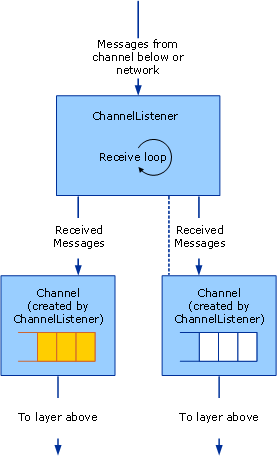

# Service: Channel Listeners and Channels
There are three categories of channel objects: channels, channel listeners and channel factories. Channels are the interface between the application and the channel stack. Channel listeners are responsible for creating channels on the receive (or listen) side, typically in response to a new incoming message or connection. Channel factories are responsible for creating channels on the send side to initiate communication with an endpoint.  
  
## Channel Listeners and Channels  
 Channel listeners are responsible for creating channels and receiving messages from the layer below or from the network. Received messages are delivered to the layer above using a channel that is created by the channel listener.  
  
 The following diagram illustrates the process of receiving messages and delivering them to the layer above.  
  
   
A channel listener receiving messages and delivering to the layer above through channels.  
  
 The process can be conceptually modeled as a queue inside each channel although the implementation may not actually use a queue. The channel listener is responsible for receiving messages from the layer below or the network and putting them in the queue. The channel is responsible for getting messages from the queue and handing them to the layer above when that layer asks for a message, for example by calling `Receive` on the channel.  
  
 [!INCLUDE[indigo2](../../../../includes/indigo2-md.md)] provides base class helpers for this process. (For a diagram of the channel helper classes discussed in this topic, see [Channel Model Overview](../../../../docs/framework/wcf/extending/channel-model-overview.md).)  
  
-   The <xref:System.ServiceModel.Channels.CommunicationObject> class implements <xref:System.ServiceModel.ICommunicationObject> and enforces the state machine described in step 2 of [Developing Channels](../../../../docs/framework/wcf/extending/developing-channels.md).  
  
-   The <xref:System.ServiceModel.Channels.ChannelManagerBase> class implements <xref:System.ServiceModel.Channels.CommunicationObject> and provides a unified base class for <xref:System.ServiceModel.Channels.ChannelFactoryBase> and <xref:System.ServiceModel.Channels.ChannelListenerBase>. The <xref:System.ServiceModel.Channels.ChannelManagerBase> class works in conjunction with <xref:System.ServiceModel.Channels.ChannelBase>, which is a base class that implements <xref:System.ServiceModel.Channels.IChannel>.  
  
-   The``<xref:System.ServiceModel.Channels.ChannelFactoryBase> class implements <xref:System.ServiceModel.Channels.ChannelManagerBase> and <xref:System.ServiceModel.Channels.IChannelFactory> and consolidates the `CreateChannel` overloads into one `OnCreateChannel` abstract method.  
  
-   The <xref:System.ServiceModel.Channels.ChannelListenerBase> class implements <xref:System.ServiceModel.Channels.IChannelListener>. It takes care of basic state management.  
  
 The following discussion is based upon the [Transport: UDP](../../../../docs/framework/wcf/samples/transport-udp.md) sample.  
  
## Creating a Channel Listener  
 The``UdpChannelListener that the sample implements derives from the <xref:System.ServiceModel.Channels.ChannelListenerBase> class. It uses a single UDP socket to receive datagrams. The `OnOpen` method receives data using the UDP socket in an asynchronous loop. The data are then converted into messages using the message encoding system:  
  
```  
message = UdpConstants.MessageEncoder.ReadMessage(  
  new ArraySegment<byte>(buffer, 0, count),   
  bufferManager  
);  
```  
  
 Because the same datagram channel represents messages that arrive from a number of sources, the `UdpChannelListener` is a singleton listener. There is at most one active <xref:System.ServiceModel.Channels.IChannel>``associated with this listener at a time. The sample generates another one only if a channel that is returned by the <xref:System.ServiceModel.Channels.ChannelListenerBase%601.AcceptChannel%2A> method is subsequently disposed. When a message is received, it is enqueued into this singleton channel.  
  
### UdpInputChannel  
 The `UdpInputChannel` class implements <xref:System.ServiceModel.Channels.IInputChannel>. It consists of a queue of incoming messages that is populated by the `UdpChannelListener`'s socket. These messages are dequeued by the <xref:System.ServiceModel.Channels.IInputChannel.Receive%2A> method.
