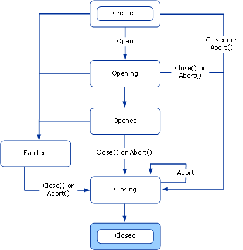

# Understanding State Changes
This topic discusses the states and transitions that channels have, the types used to structure channel states, and how to implement them.  
  
## State Machines and Channels  
 Objects that deal with communication, for example sockets, usually present a state machine whose state transitions relate to allocating network resources, making or accepting connections, closing connections and terminating communication. The channel state machine provides a uniform model of the states of a communication object that abstracts the underlying implementation of that object. The <xref:System.ServiceModel.ICommunicationObject> interface provides a set of states, state transition methods and state transition events. All channels, channel factories and channel listeners implement the channel state machine.  
  
 The events Closed, Closing, Faulted, Opened and Opening signal an external observer after a state transition occurs.  
  
 The methods Abort, Close, and Open (and their asynchronous equivalents) cause state transitions.  
  
 The state property returns the current state as defined by <xref:System.ServiceModel.CommunicationState>:  
  
## ICommunicationObject, CommunicationObject, and States and State Transition  
 An <xref:System.ServiceModel.ICommunicationObject> starts out in the Created state where its various properties can be configured. Once in the Opened state, the object is usable for sending and receiving messages but its properties are considered immutable. Once in the Closing state, the object can no longer process new send or receive requests, but existing requests have a chance to complete until the Close timeout is reached.  If an unrecoverable error occurs, the object transitions to the Faulted state where it can be inspected for information about the error and ultimately closed. When in the Closed state the object has essentially reached the end of the state machine. Once an object transitions from one state to the next, it does not go back to a previous state.  
  
 The following diagram shows the <xref:System.ServiceModel.ICommunicationObject> states and state transitions. State transitions can be caused by calling one of the three methods: Abort, Open, or Close. They could also be caused by calling other implementation-specific methods. Transitioning to the Faulted state could happen as a result of errors while opening or after having opened the communication object.  
  
 Every <xref:System.ServiceModel.ICommunicationObject> starts out in the Created state. In this state, an application can configure the object by setting its properties. Once an object is in a state other than Created, it is considered immutable.  
  
   
Figure 1. The ICommunicationObject State Machine.  
  
 [!INCLUDE[indigo1](../../../../includes/indigo1-md.md)] provides an abstract base class named <xref:System.ServiceModel.Channels.CommunicationObject> that implements <xref:System.ServiceModel.ICommunicationObject> and the channel state machine. The following graphic is a modified state diagram that is specific to <xref:System.ServiceModel.Channels.CommunicationObject>. In addition to the <xref:System.ServiceModel.ICommunicationObject> state machine, it shows the timing when additional <xref:System.ServiceModel.Channels.CommunicationObject> methods are invoked.  
  
   
Figure 2. The CommunicationObject implementation of the ICommunicationObject state machine including calls to events and protected methods.  
  
### ICommunicationObject Events  
 <xref:System.ServiceModel.Channels.CommunicationObject> exposes the five events defined by <xref:System.ServiceModel.ICommunicationObject>. These events are designed for code using the communication object to be notified of state transitions. As shown in Figure 2 above, each event is fired once after the object’s state transitions to the state named by the event. All five events are of the `EventHandler` type which is defined as:  
  
 `public delegate void EventHandler(object sender, EventArgs e);`  
  
 In the <xref:System.ServiceModel.Channels.CommunicationObject> implementation, the sender is either the <xref:System.ServiceModel.Channels.CommunicationObject> itself or whatever was passed in as the sender to the <xref:System.ServiceModel.Channels.CommunicationObject> constructor (if that constructor overload was used). The EventArgs parameter, `e`, is always `EventArgs.Empty`.  
  
### Derived Object Callbacks  
 In addition to the five events, <xref:System.ServiceModel.Channels.CommunicationObject> declares eight protected virtual methods designed to allow a derived object to be called back before and after state transitions occur.  
  
 The <xref:System.ServiceModel.Channels.CommunicationObject.Open%2A?displayProperty=nameWithType> and <xref:System.ServiceModel.Channels.CommunicationObject.Close%2A?displayProperty=nameWithType> methods have three such callbacks associated with each of them. For example, corresponding to <xref:System.ServiceModel.Channels.CommunicationObject.Open%2A?displayProperty=nameWithType> there is <xref:System.ServiceModel.Channels.CommunicationObject.OnOpening%2A?displayProperty=nameWithType>, <xref:System.ServiceModel.Channels.CommunicationObject.OnOpen%2A?displayProperty=nameWithType>, and <xref:System.ServiceModel.Channels.CommunicationObject.OnOpened%2A?displayProperty=nameWithType>. Associated with <xref:System.ServiceModel.Channels.CommunicationObject.Close%2A?displayProperty=nameWithType> are the <xref:System.ServiceModel.Channels.CommunicationObject.OnClose%2A?displayProperty=nameWithType>, <xref:System.ServiceModel.Channels.CommunicationObject.OnClosing%2A?displayProperty=nameWithType>, and <xref:System.ServiceModel.Channels.CommunicationObject.OnClosed%2A?displayProperty=nameWithType> methods.  
  
 Similarly, the <xref:System.ServiceModel.Channels.CommunicationObject.Abort%2A?displayProperty=nameWithType> method has a corresponding <xref:System.ServiceModel.Channels.CommunicationObject.OnAbort%2A?displayProperty=nameWithType>.  
  
 While <xref:System.ServiceModel.Channels.CommunicationObject.OnOpen%2A?displayProperty=nameWithType>, <xref:System.ServiceModel.Channels.CommunicationObject.OnClose%2A?displayProperty=nameWithType>, and <xref:System.ServiceModel.Channels.CommunicationObject.OnAbort%2A?displayProperty=nameWithType> have no default implementation, the other callbacks do have a default implementation which is necessary for state machine correctness. If you override those methods be sure to call the base implementation or correctly replace it.  
  
 <xref:System.ServiceModel.Channels.CommunicationObject.OnOpening%2A?displayProperty=nameWithType>, <xref:System.ServiceModel.Channels.CommunicationObject.OnClosing%2A?displayProperty=nameWithType> and <xref:System.ServiceModel.Channels.CommunicationObject.OnFaulted%2A?displayProperty=nameWithType> fire the corresponding <xref:System.ServiceModel.Channels.CommunicationObject.Opening?displayProperty=nameWithType>, <xref:System.ServiceModel.Channels.CommunicationObject.Closing?displayProperty=nameWithType> and <xref:System.ServiceModel.Channels.CommunicationObject.Faulted?displayProperty=nameWithType> events. <xref:System.ServiceModel.Channels.CommunicationObject.OnOpened%2A?displayProperty=nameWithType> and <xref:System.ServiceModel.Channels.CommunicationObject.OnClosed%2A?displayProperty=nameWithType> set the object state to Opened and Closed respectively then fire the corresponding <xref:System.ServiceModel.Channels.CommunicationObject.Opened?displayProperty=nameWithType> and <xref:System.ServiceModel.Channels.CommunicationObject.Closed?displayProperty=nameWithType> events.  
  
### State Transition Methods  
 <xref:System.ServiceModel.Channels.CommunicationObject> provides implementations of Abort, Close and Open. It also provides a Fault method which causes a state transition to the Faulted state. Figure 2 shows the <xref:System.ServiceModel.ICommunicationObject> state machine with each transition labeled by the method that causes it (unlabeled transitions happen inside the implementation of the method that caused the last labeled transition).  
  
> [!NOTE]
>  All <xref:System.ServiceModel.Channels.CommunicationObject> implementations of communication state gets/sets are thread-synchronized.  
  
 Constructor  
  
 <xref:System.ServiceModel.Channels.CommunicationObject> provides three constructors, all of which leave the object in the Created state. The constructors are defined as:  
  
 The first constructor is a default constructor that delegates to the constructor overload that takes an object:  
  
 `protected CommunicationObject() : this(new object()) { … }`  
  
 The constructor that takes an object uses that parameter as the object to be locked when synchronizing access to communication object state:  
  
 `protected CommunicationObject(object mutex) { … }`  
  
 Finally, a third constructor takes an additional parameter that is used as the sender argument when <xref:System.ServiceModel.ICommunicationObject> events are fired.  
  
 `protected CommunicationObject(object mutex, object eventSender) { … }`  
  
 The previous two constructors set the sender to this.  
  
 Open Method  
  
 Precondition: State is Created.  
  
 Post-condition: State is Opened or Faulted. May throw an exception.  
  
 The Open() method will try to open the communication object and set the state to Opened. If it encounters an error, it will set the state to Faulted.  
  
 The method first checks that the current state is Created. If the current state is Opening or Opened it throws an <xref:System.InvalidOperationException>. If the current state is Closing or Closed, it throws a <xref:System.ServiceModel.CommunicationObjectAbortedException> if the object has been terminated and <xref:System.ObjectDisposedException> otherwise. If the current state is Faulted, it throws a <xref:System.ServiceModel.CommunicationObjectFaultedException>.  
  
 It then sets the state to Opening and calls OnOpening() (which raises the Opening event), OnOpen() and OnOpened() in that order. OnOpened() sets the state to Opened and raises the Opened event. If any of these throws an exception, Open()calls Fault() and lets the exception bubble up. The following diagram shows the Open process in more detail.  
  
   
Override the OnOpen method to implement custom open logic such as opening an inner communication object.  
  
 Close Method  
  
 Precondition: None.  
  
 Post-condition: State is Closed. May throw an exception.  
  
 The Close() method can be called at any state. It tries to close the object normally. If an error is encountered, it terminates the object. The method does nothing if the current state is Closing or Closed. Otherwise it sets the state to Closing. If the original state was Created, Opening or Faulted, it calls Abort() (see the following diagram). If the original state was Opened, it calls OnClosing() (which raises the Closing event), OnClose() and OnClosed() in that order. If any of these throws an exception, Close()calls Abort() and lets the exception bubble up. OnClosed() sets the state to Closed and raises the Closed event. The following diagram shows the Close process in more detail.  
  
   
Override the OnClose method to implement custom close logic, such as closing an inner communication object. All graceful closing logic that may block for a long time (for example, waiting for the other side to respond) should be implemented in OnClose() because it takes a timeout parameter and because it is not called as part of Abort().  
  
 Abort  
  
 Precondition: None.  
Post-condition: State is Closed. May throw an exception.  
  
 The Abort() method does nothing if the current state is Closed or if the object has been terminated before (for example, possibly by having Abort() executing on another thread). Otherwise it sets the state to Closing and calls OnClosing() (which raises the Closing event), OnAbort(), and OnClosed() in that order (does not call OnClose because the object is being terminated, not closed). OnClosed() sets the state to Closed and raises the Closed event. If any of these throw an exception, it is re-thrown to the caller of Abort. Implementations of OnClosing(), OnClosed() and OnAbort() should not block (for example, on input/output). The following diagram shows the Abort process in more detail.  
  
   
Override the OnAbort method to implement custom terminate logic such as terminating an inner communication object.  
  
 Fault  
  
 The Fault method is specific to <xref:System.ServiceModel.Channels.CommunicationObject> and is not part of the <xref:System.ServiceModel.ICommunicationObject> interface. It is included here for completeness.  
  
 Precondition: None.  
  
 Post-condition: State is Faulted. May throw an exception.  
  
 The Fault() method does nothing if the current state is Faulted or Closed. Otherwise it sets the state to Faulted and call OnFaulted(), which raises the Faulted event. If OnFaulted throws an exception it is re-thrown.  
  
### ThrowIfXxx Methods  
 CommunicationObject has three protected methods that can be used to throw exceptions if the object is in a specific state.  
  
 <xref:System.ServiceModel.Channels.CommunicationObject.ThrowIfDisposed%2A> throws an exception if the state is Closing, Closed or Faulted.  
  
 <xref:System.ServiceModel.Channels.CommunicationObject.ThrowIfDisposedOrImmutable%2A> throws an exception if the state is not Created.  
  
 <xref:System.ServiceModel.Channels.CommunicationObject.ThrowIfDisposedOrNotOpen%2A> throws an exception if the state is not Opened.  
  
 The exceptions thrown depend on the state. The following table shows the different states and the corresponding exception type thrown by calling a ThrowIfXxx that throws on that state.  
  
|State|Has Abort been called?|Exception|  
|-----------|----------------------------|---------------|  
|Created|N/A|<xref:System.InvalidOperationException?displayProperty=nameWithType>|  
|Opening|N/A|<xref:System.InvalidOperationException?displayProperty=nameWithType>|  
|Opened|N/A|<xref:System.InvalidOperationException?displayProperty=nameWithType>|  
|Closing|Yes|<xref:System.ServiceModel.CommunicationObjectAbortedException?displayProperty=nameWithType>|  
|Closing|No|<xref:System.ObjectDisposedException?displayProperty=nameWithType>|  
|Closed|Yes|<xref:System.ServiceModel.CommunicationObjectAbortedException?displayProperty=nameWithType> in the case that an object was closed by a previous and explicit call of Abort. If you call Close on the object then an <xref:System.ObjectDisposedException?displayProperty=nameWithType> is thrown.|  
|Closed|No|<xref:System.ObjectDisposedException?displayProperty=nameWithType>|  
|Faulted|N/A|<xref:System.ServiceModel.CommunicationObjectFaultedException?displayProperty=nameWithType>|  
  
### Timeouts  
 Several of the methods we discussed take timeout parameters. These are Close, Open (certain overloads and asynchronous versions), OnClose and OnOpen. These methods are designed to allow for lengthy operations (for example, blocking on input/output while gracefully closing down a connection) so the timeout parameter indicates how long such operations can take before being interrupted. Implementations of any of these methods should use the supplied timeout value to ensure it returns to the caller within that timeout. Implementations of other methods that do not take a timeout are not designed for lengthy operations and should not block on input/output.  
  
 The exception are the Open() and Close() overloads that do not take a timeout. These use a default timeout value supplied by the derived class. <xref:System.ServiceModel.Channels.CommunicationObject> exposes two protected abstract properties named <xref:System.ServiceModel.Channels.CommunicationObject.DefaultCloseTimeout%2A> and <xref:System.ServiceModel.Channels.CommunicationObject.DefaultOpenTimeout%2A> defined as:  
  
 `protected abstract TimeSpan DefaultCloseTimeout { get; }`  
  
 `protected abstract TimeSpan DefaultOpenTimeout { get; }`  
  
 A derived class implements these properties to provide the default timeout for the Open() and Close() overloads that do not take a timeout value. Then the Open() and Close() implementations delegate to the overload that takes a timeout passing it the default timeout value, for example:  
  
 `public void Open()`  
  
 `{`  
  
 `this.Open(this.DefaultOpenTimeout);`  
  
 `}`  
  
#### IDefaultCommunicationTimeouts  
 This interface has four read-only properties for providing default timeout values for open, send, receive, and close. Each implementation is responsible for obtaining the default values in whatever manner appropriate. As a convenience, <xref:System.ServiceModel.Channels.ChannelFactoryBase> and <xref:System.ServiceModel.Channels.ChannelListenerBase> default these values to 1 minute each.
