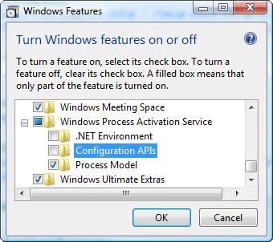
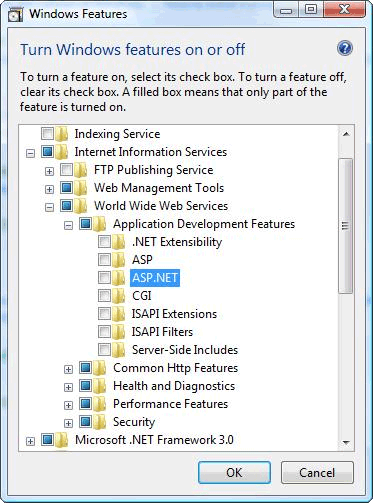
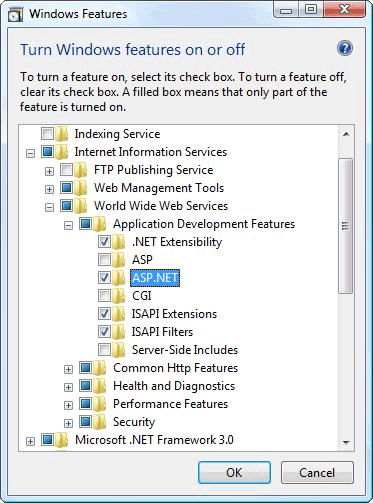
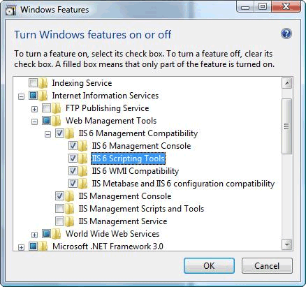

# Configuring Internet Information Services 7.0 for Windows Communication Foundation

Internet Information Services (IIS) 7.0 has a modular design that allows you to selectively install components that are required. This design is based on the new manifest-driven componentization technology introduced in Windows Vista. There are more than 40 standalone feature components of IIS 7.0 that can be installed independently. This allows IT professionals to easily customize the installation as required. This topic discusses how to configure IIS 7.0 for use with Windows Communication Foundation (WCF) and determine which components are required.

## Minimal Installation: Installing WAS
 The minimal installation of the whole IIS 7.0 package is to install the Windows Process Activation Service (WAS). WAS is a standalone feature and it is the only feature from the IIS 7.0 that is available for all Windows Vista operating systems (Home Basic, Home Premium, Business, and Ultimate and Enterprise).

 From the Control Panel, click **Programs** and then click **Turn Windows features on or off** which is listed under **Programs and Features**, the WAS component is shown in the list as in the following illustration.

 

 This feature has the following sub-components:

- .NET Environment

- Configuration APIs

- Process Model

 If you select the root node of WAS, only the **Process Model** sub-node is checked by default. Please note that with this installation you are only installing WAS, because there is no support for a Web server.

 To make WCF or any ASP.NET application work, check the **.NET Environment** checkbox. This means that all of WAS components are required to make WCF and ASP.NET to work well. These are automatically checked once you install any of those components.

## IIS 7.0: Default Installation
 By checking the **Internet Information Services** feature, some of the sub-nodes are automatically checked as shown in the following illustration.

 

 This is the default installation of IIS 7.0. With this installation, you can use IIS 7.0 to service static content (such as HTML pages and other content). However, you cannot run ASP.NET or CGI applications or host WCF services.

## IIS 7.0: Installation with ASP.NET Support
 You must install ASP.NET to make ASP.NET work on IIS 7.0. After checking **ASP.NET**, your screen should look like the following illustration.

 

 This is the minimal environment for both WCF and ASP.NET applications to work in IIS 7.0.

## IIS 7.0: Installation with IIS 6.0 Compatibility Components
 When installing IIS 7.0 on a system with Visual Studio 2005 or some other automation scripts or tools (such as Adsutil.vbs) that configure virtual applications that use IIS 6.0 Metabase API, ensure that you check the IIS 6.0 **Scripting Tools**. This automatically checks the other sub-nodes of IIS 6.0 **Management Compatibility**. The following illustration shows the screen after this is done:

 

 With this installation, you have everything required to use IIS 7.0, ASP.NET and WCF features and samples available on the Web.

## Request Limits
 On Windows Vista with IIS 7 the default value of the `maxUri` and `maxQueryStringSize` settings have been changed. By default, request filtering in IIS 7.0 allows a URL length of 4096 characters and a query string length of 2048 characters. To change these defaults add the following XML to your App.config file.

```xml
 <system.webServer>
    <security>
        <requestFiltering>
            <requestLimits maxUrl="8192" maxQueryString="8192" />
        </requestFiltering>
    </security>
 </system.webServer>
 ```

## See also

- [WAS Activation Architecture](../../../../docs/framework/wcf/feature-details/was-activation-architecture.md)
- [Configuring WAS for Use with WCF](../../../../docs/framework/wcf/feature-details/configuring-the-wpa--service-for-use-with-wcf.md)
- [How to: Install and Configure WCF Activation Components](../../../../docs/framework/wcf/feature-details/how-to-install-and-configure-wcf-activation-components.md)
- [Windows Server App Fabric Hosting Features](https://go.microsoft.com/fwlink/?LinkId=201276)
