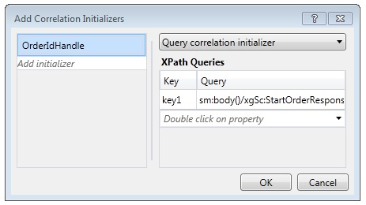

# Content Based Correlation
When workflow services communicate with clients and other services, often there is some data in the exchanged messages that uniquely relates a message to a particular instance. Content-based correlation uses this data in the message, such as a customer number or order ID, to route messages to the proper workflow instance. This topic explains how to use content-based correlation in workflows.  
  
## Using Content-Based Correlation  
 Content-based correlation is used when a workflow service has multiple methods that are accessed by a single client and a piece of data in the exchanged messages identifies the desired instance.  
  
> [!NOTE]
>  Content-based correlation is useful when context correlation cannot be used because the binding is not one of the supported context exchange bindings. [!INCLUDE[crabout](../../../../includes/crabout-md.md)] context correlation, see [Context Exchange](../../../../docs/framework/wcf/feature-details/context-exchange-correlation.md).  
  
 Each messaging activity used in these communications must specify the location of the data in the message that uniquely identifies the instance. This is done by providing a <xref:System.ServiceModel.MessageQuerySet>, using either a <xref:System.ServiceModel.Activities.QueryCorrelationInitializer> or <xref:System.ServiceModel.Activities.Receive.CorrelatesOn%2A>, that queries the message for the piece or pieces of data that uniquely identify the instance.  
  
> [!WARNING]
>  The data that is used to identify the instance is hashed into a correlation key. Care must be taken to ensure that the data used for correlation is unique or else collisions in the hashed key could occur and cause messages to be misrouted. For example, a correlation based solely on a customer name may cause a collision because there may be multiple customers with the same name. The colon (`:`) should not be used as part of the data used to correlate the message because it is already used to delimit the message query’s key and value to form the string that is subsequently hashed.  
  
 In the following example, the initial <xref:System.ServiceModel.Activities.Receive>/<xref:System.ServiceModel.Activities.SendReply> in a workflow service returns an `OrderId`, which is then passed back by the client on the call to the following <xref:System.ServiceModel.Activities.Receive> activity in the workflow service.  
  
 [!code-csharp[CFX_ContentCorrelation#1](../../../../samples/snippets/csharp/VS_Snippets_CFX/cfx_contentcorrelation/cs/program.cs#1)]  
  
 The previous example shows a content-based correlation that is initialized by the <xref:System.ServiceModel.Activities.SendReply>. The <xref:System.ServiceModel.MessageQuerySet> specifies that the data used to identify subsequent messages to this service is the `OrderId`.  
  
 [!code-csharp[CFX_ContentCorrelation#2](../../../../samples/snippets/csharp/VS_Snippets_CFX/cfx_contentcorrelation/cs/program.cs#2)]  
  
 The <xref:System.ServiceModel.Activities.Receive> activity that follows the <xref:System.ServiceModel.Activities.SendReply> in the workflow follows the correlation that was initialized by the <xref:System.ServiceModel.Activities.SendReply>. Both activities share the same <xref:System.ServiceModel.Activities.CorrelationHandle>, but each one has its own <xref:System.ServiceModel.MessageQuerySet> and <xref:System.ServiceModel.XPathMessageQuery> that specifies where the identifying data is in that particular message. On the activity that initializes the correlation, this <xref:System.ServiceModel.MessageQuerySet> is specified in the <xref:System.ServiceModel.Activities.Receive.CorrelationInitializers%2A> property, and for any following <xref:System.ServiceModel.Activities.Receive> activities, it is specified using the <xref:System.ServiceModel.Activities.Receive.CorrelatesOn%2A> property.  
  
 [!code-csharp[CFX_ContentCorrelation#3](../../../../samples/snippets/csharp/VS_Snippets_CFX/cfx_contentcorrelation/cs/program.cs#3)]  
  
 A content-based correlation can be initialized by any messaging activity (<xref:System.ServiceModel.Activities.Send>, <xref:System.ServiceModel.Activities.Receive>, <xref:System.ServiceModel.Activities.SendReply>, <xref:System.ServiceModel.Activities.ReceiveReply>) when the data flows as part of a message. If the particular piece of data does not flow as part of a message, then it can be initialized explicitly by using the <xref:System.ServiceModel.Activities.InitializeCorrelation> activity. If multiple pieces of data are required to uniquely identify the message, then multiple queries can be added to the <xref:System.ServiceModel.MessageQuerySet>. In these examples, a <xref:System.ServiceModel.Activities.CorrelationHandle> was explicitly provided to each of the activities using the `CorrelatesWith` or `CorrelationHandle` properties, but if there is only one correlation required for the entire workflow, such as in this example where everything correlates on `OrderId`, the implicit correlation handle management provided by <xref:System.ServiceModel.Activities.WorkflowServiceHost> is sufficient.  
  
## Using the InitializeCorrelation Activity  
 In the previous example, the `OrderId` flowed to the caller through the <xref:System.ServiceModel.Activities.SendReply> activity and this is where the correlation was initialized. The same behavior can be accomplished by using the <xref:System.ServiceModel.Activities.InitializeCorrelation> activity. The <xref:System.ServiceModel.Activities.InitializeCorrelation> activity takes the <xref:System.ServiceModel.Activities.CorrelationHandle> and a dictionary of items that represent the data used to map the message to the correct instance. To use the <xref:System.ServiceModel.Activities.InitializeCorrelation> activity in the preceding sample, remove the <xref:System.ServiceModel.Activities.SendReply.CorrelationInitializers%2A> from the <xref:System.ServiceModel.Activities.SendReply> activity and initialize the correlation using the <xref:System.ServiceModel.Activities.InitializeCorrelation> activity.  
  
 [!code-csharp[CFX_ContentCorrelation#4](../../../../samples/snippets/csharp/VS_Snippets_CFX/cfx_contentcorrelation/cs/program.cs#4)]  
  
 The <xref:System.ServiceModel.Activities.InitializeCorrelation> activity is then used in the workflow, after the variables that hold the data are populated but before the <xref:System.ServiceModel.Activities.Receive> activity that correlates with the initialized <xref:System.ServiceModel.Activities.CorrelationHandle>.  
  
 [!code-csharp[CFX_ContentCorrelation#5](../../../../samples/snippets/csharp/VS_Snippets_CFX/cfx_contentcorrelation/cs/program.cs#5)]  
  
## Configuring XPath Queries Using the Workflow Designer  
 In the previous examples, the activities and the XPath queries used in the message queries were specified in code. The workflow designer in [!INCLUDE[vs_current_long](../../../../includes/vs-current-long-md.md)] also provides the ability to generate XPaths from `DataContract` types for content-based correlation. The first XPath configured in the previous example was configured for the <xref:System.ServiceModel.Activities.SendReply>.  
  
 [!code-csharp[CFX_ContentCorrelation#2](../../../../samples/snippets/csharp/VS_Snippets_CFX/cfx_contentcorrelation/cs/program.cs#2)]  
  
 To configure the XPath for a messaging activity in the workflow designer, select the activity in the workflow designer. If the activity is initializing the correlation, as in the previous example, click the ellipsis button for the **CorrelationInitializers** property in the **Properties** window. This displays the **Add Correlation Initializers** dialog window. From this dialog you can specify the correlation type and select the content that is used for the correlation. The <xref:System.ServiceModel.Activities.CorrelationHandle> variable is specified in the **Add initializer** box, and the correlation type and data used for the correlation is selected from the **XPath Queries** section of the dialog box.  
  
   
  
 The second XPath query in the previous example was configured in the <xref:System.ServiceModel.Activities.Receive> activity.  
  
 [!code-csharp[CFX_ContentCorrelation#3](../../../../samples/snippets/csharp/VS_Snippets_CFX/cfx_contentcorrelation/cs/program.cs#3)]  
  
 To configure the XPath query for a messaging activity that does not initialize the correlation, select the activity in the workflow designer and then click the ellipsis button for the **CorrelatesOn** property in the **Properties** window. This displays the **CorrelatesOn Definition** dialog window.  
  
   
  
 From this dialog you specify the <xref:System.ServiceModel.Activities.CorrelationHandle> and choose items in the **XPath Queries** list to build the XPath query.
