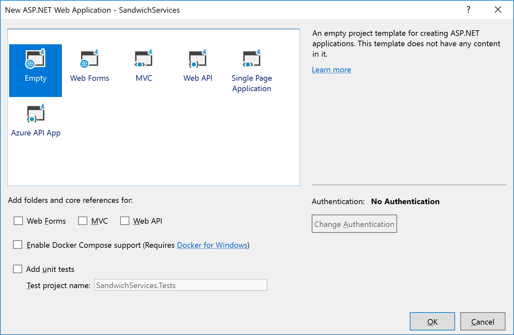
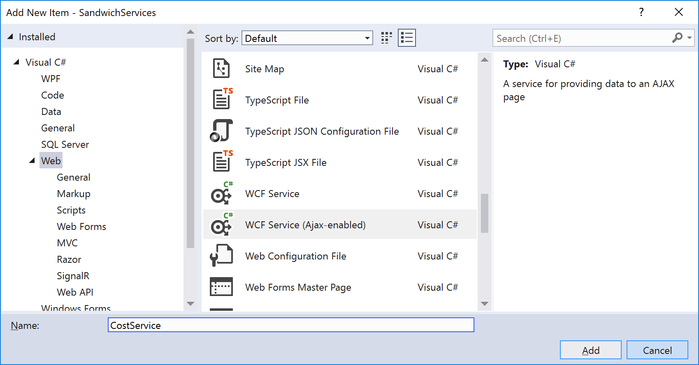

# How to: Create an AJAX-Enabled WCF Service and an ASP.NET Client that Accesses the Service

This topic shows how to use Visual Studio to create an AJAX-enabled Windows Communication Foundation (WCF) service and an ASP.NET client that accesses the service.

## Create an ASP.NET web app

1. Open Visual Studio.

1. From the **File** menu, select **New** > **Project**

1. In the **New Project** dialog, expand the **Installed** > **Visual C#** > **Web** category, and then select **ASP.NET Web Application (.NET Framework)**.

1. Name the Project **SandwichServices** and click **OK**.

1. In the **New ASP.NET Web Application** dialog, select **Empty** and then select **OK**.

   

## Add a web form

1. Right-click the SandwichServices project in **Solution Explorer** and select **Add** > **New Item**.

1. In the **Add New Item** dialog, expand the **Installed** > **Visual C#** > **Web** category, and then select the **Web Form** template.

1. Accept the default name (**WebForm1**), and then select **Add**.

   *WebForm1.aspx* opens in **Source** view.

1. Add the following markup inside the **\<body>** tags:

   ```html
   <input type="button" value="Price of 3 sandwiches" onclick="Calculate()"/>
   <br />
   <span id="additionResult"></span>
   ```

## Create an AJAX-enabled WCF service

1. Right-click the SandwichServices project in **Solution Explorer** and select **Add** > **New Item**.

1. In the **Add New Item** dialog, expand the **Installed** > **Visual C#** > **Web** category, and then select the **WCF Service (AJAX-enabled)** template.

   

1. Name the service **CostService** and then select **Add**.

   *CostService.svc.cs* opens in the editor.

1. Implement the operation in the service. Add the following method to the CostService class to calculate the cost of a quantity of sandwiches:

    ```csharp
    [OperationContract]
    public double CostOfSandwiches(int quantity)
    {
        return 1.25 * quantity;
    }
    ```

## Configure the client to access the service

1. Open the *WebForm1.aspx* file and select the **Design** view.

2. From the **View** menu, select **Toolbox**.

3. Expand the **AJAX Extensions** node and drag and drop a **ScriptManager** onto the form.

4. Back in the **Source** view, add the following code between the **\<ScriptManager>** tags to specify the path to the WCF service:

    ```xml
    <Services>
       <asp:ServiceReference Path="~/CostService.svc" />
    </Services>
    ```

5. Add the code for the JavaScript function `Calculate()`. Place the following code in the **head** section of the web form:

    ```html
    <script type="text/javascript">

        function Calculate() {
            CostService.CostOfSandwiches(3, onSuccess);
        }

        function onSuccess(result) {
            var myres = $get("additionResult");
            myres.innerHTML = result;
        }

    </script>
    ```

   This code calls the method of CostService to calculate the price for three sandwiches, and then displays the result in the span called **additionResult**.

## Run the program

Make sure that *WebForm1.aspx* has focus, and then press **Start** button to launch the web client. The button has a green triangle and says something like **IIS Express (Microsoft Edge)**. Or, you can press <kbd>F5</kbd>. Click the **Price of 3 sandwiches** button to generate the expected output of "3.75".

## Example

The following is the full code in the *CostService.svc.cs* file:

```csharp
using System.ServiceModel;
using System.ServiceModel.Activation;

namespace SandwichServices
{
    [ServiceContract(Namespace = "")]
    [AspNetCompatibilityRequirements(RequirementsMode = AspNetCompatibilityRequirementsMode.Allowed)]
    public class CostService
    {
        [OperationContract]
        public double CostOfSandwiches(int quantity)
        {
            return 1.25 * quantity;
        }
    }
}
```

The following is the full contents of the *WebForm1.aspx* page:

```aspx-csharp
<%@ Page Language="C#" AutoEventWireup="true" CodeBehind="WebForm1.aspx.cs" Inherits="SandwichServices.WebForm1" %>

<!DOCTYPE html>

<html xmlns="http://www.w3.org/1999/xhtml">
<head runat="server">
    <title></title>
    <script type="text/javascript">

        function Calculate() {
            CostService.CostOfSandwiches(3, onSuccess);
        }

        function onSuccess(result) {
            var myres = $get("additionResult");
            myres.innerHTML = result;
        }

    </script>
</head>
<body>
    <form id="form1" runat="server">
        <div>
        </div>
        <asp:ScriptManager ID="ScriptManager1" runat="server">
            <Services>
                <asp:ServiceReference Path="~/CostService.svc" />
            </Services>
        </asp:ScriptManager>

        <input type="button" value="Price of 3 sandwiches" onclick="Calculate()" />
        <br />
        <span id="additionResult"></span>
    </form>
</body>
</html>
```
