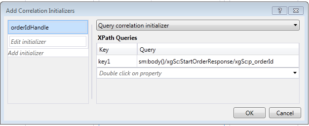
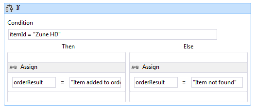

# Creating a Long-running Workflow Service
This topic describes how to create a long-running workflow service. Long running workflow services may run for long periods of time. At some point the workflow may go idle waiting for some additional information. When this occurs the workflow is persisted to a SQL database and is removed from memory. When the additional information becomes available the workflow instance is loaded back into memory and continues executing.  In this scenario you are implementing a very simplified ordering system.  The client sends an initial message to the workflow service to start the order. It returns an order ID to the client. At this point the workflow service is waiting for another message from the client and goes into the idle state and is persisted to a SQL Server database.  When the client sends the next message to order an item, the workflow service is loaded back into memory and finishes processing the order. In the code sample it returns a string stating the item has been added to the order. The code sample is not meant to be a real world application of the technology, but rather a simple sample that illustrates long running workflow services. This topic assumes you know how to create [!INCLUDE[vs_current_long](../../../../includes/vs-current-long-md.md)] projects and solutions.  
  
## Prerequisites  
 You must have the following software installed to use this walkthrough:  
  
1.  Microsoft SQL Server 2008  
  
2.  [!INCLUDE[vs_current_long](../../../../includes/vs-current-long-md.md)]  
  
3.  Microsoft  [!INCLUDE[netfx_current_long](../../../../includes/netfx-current-long-md.md)]  
  
4.  You are familiar with WCF and [!INCLUDE[vs_current_long](../../../../includes/vs-current-long-md.md)] and know how to create projects/solutions.  
  
### To Setup the SQL Database  
  
1.  In order for workflow service instances to be persisted you must have Microsoft SQL Server installed and you must configure a database to store the persisted workflow instances. Run Microsoft SQL Management Studio by clicking the **Start** button, selecting **All Programs**, **Microsoft SQL Server 2008**, and **Microsoft SQL Management Studio**.  
  
2.  Click the **Connect** button to log on to the SQL Server instance  
  
3.  Right click **Databases** in the tree view and select **New Database..** to create a new database called `SQLPersistenceStore`.  
  
4.  Run the SqlWorkflowInstanceStoreSchema.sql script file located in the C:\Windows\Microsoft.NET\Framework\v4.0\SQL\en directory on the SQLPersistenceStore database to set up the needed database schemas.  
  
5.  Run the SqlWorkflowInstanceStoreLogic.sql script file located in the C:\Windows\Microsoft.NET\Framework\v4.0\SQL\en directory on the SQLPersistenceStore database to set up the needed database logic.  
  
### To Create the Web Hosted Workflow Service  
  
1.  Create an empty [!INCLUDE[vs_current_long](../../../../includes/vs-current-long-md.md)] solution, name it `OrderProcessing`.  
  
2.  Add a new [!INCLUDE[indigo2](../../../../includes/indigo2-md.md)] Workflow Service Application project called `OrderService` to the solution.  
  
3.  In the project properties dialog, select the **Web** tab.  
  
    1.  Under **Start Action** select **Specific Page** and specify `Service1.xamlx`.  
  
           
  
    2.  Under **Servers** select **Use Local IIS Web server**.  
  
           
  
        > [!WARNING]
        >  You must run [!INCLUDE[vs_current_long](../../../../includes/vs-current-long-md.md)] in administrator mode to make this setting.  
  
         These two steps configure the workflow service project to be hosted by IIS.  
  
4.  Open `Service1.xamlx` if it is not open already and delete the existing **ReceiveRequest** and **SendResponse** activities.  
  
5.  Select the **Sequential Service** activity and click the **Variables** link and add the variables shown in the following illustration. Doing this adds some variables that will be used later on in the workflow service.  
  
    > [!NOTE]
    >  If CorrelationHandle is not in the Variable Type drop-down, select **Browse for types** from the drop-down. Type CorrelationHandle in the **Type name** box, select CorrelationHandle from the listbox and click **OK**.  
  
       
  
6.  Drag and drop a **ReceiveAndSendReply** activity template into the **Sequential Service** activity. This set of activities will receive a message from a client and send a reply back.  
  
    1.  Select the **Receive** activity and set the properties highlighted in the following illustration.  
  
           
  
         The DisplayName property sets the name displayed for the Receive activity in the designer. The ServiceContractName and OperationName properties specify the name of the service contract and operation that are implemented by the Receive activity. [!INCLUDE[crabout](../../../../includes/crabout-md.md)] how contracts are used in Workflow services see [Using Contracts in Workflow](../../../../docs/framework/wcf/feature-details/using-contracts-in-workflow.md).  
  
    2.  Click the **Define...** link in the **ReceiveStartOrder** activity and set the properties shown in the following illustration.  Notice that the **Parameters** radio button is selected, a parameter named `p_customerName` is bound to the `customerName` variable. This configures the **Receive** activity to receive some data and bind that data to local variables.  
  
           
  
    3.  Select The **SendReplyToReceive** activity and set the highlighted property shown in the following illustration.  
  
           
  
    4.  Click the **Define...** link in the **SendReplyToStartOrder** activity and set the properties shown in the following illustration. Notice that the **Parameters** radio button is selected; a parameter named `p_orderId` is bound to the `orderId` variable. This setting specifies that the SendReplyToStartOrder activity will return a value of type string to the caller.  
  
           
  
    5.  Drag and drop an Assign activity in between the **Receive** and **SendReply** activities and set the properties as shown in the following illustration:  
  
           
  
         This creates a new order ID and places the value in the orderId variable.  
  
    6.  Select the **ReplyToStartOrder** activity. In the properties window click the ellipsis button for **CorrelationInitializers**. Select the **Add initializer** link, enter `orderIdHandle` in the Initializer text box, select Query correlation initializer for the Correlation type, and select p_orderId under the XPATH Queries dropdown box. These settings are shown in the following illustration. Click **OK**.  This initializes a correlation between the client and this instance of the workflow service. When a message containing this order ID is received it is routed to this instance of the workflow service.  
  
           
  
7.  Drag and drop another **ReceiveAndSendReply** activity to the end of the workflow (outside the **Sequence** containing the first **Receive** and **SendReply** activities). This will receive the second message sent by the client and respond to it.  
  
    1.  Select the **Sequence** that contains the newly added **Receive** and **SendReply** activities and click the **Variables** button. Add the variable highlighted in the following illustration:  
  
           
  
    2.  Select the **Receive** activity and set the properties shown in the following illustration:  
  
           
  
    3.  Click the **Define...** link in the **ReceiveAddItem** activity and add the parameters shown in the following illustration:This configures the receive activity to accept two parameters, the order ID and the ID of the item being ordered.  
  
           
  
    4.  Click the **CorrelateOn** ellipsis button and enter `orderIdHandle`. Under **XPath Queries**, click the drop down arrow and select `p_orderId`. This configures the correlation on the second receive activity. [!INCLUDE[crabout](../../../../includes/crabout-md.md)] correlation see [Correlation](../../../../docs/framework/wcf/feature-details/correlation.md).  
  
           
  
    5.  Drag and drop an **If** activity immediately after the **ReceiveAddItem** activity. This activity acts just like an if statement.  
  
        1.  Set the **Condition** property to `itemId=="Zune HD" (itemId="Zune HD" for Visual Basic)`  
  
        2.  Drag and drop an **Assign** activity in to the **Then** section and another into the **Else** section set the properties of the **Assign** activities as shown in the following illustration.  
  
               
  
             If the condition is `true` the **Then** section will be executed. If the condition is `false` the **Else** section is executed.  
  
        3.  Select the **SendReplyToReceive** activity and set the **DisplayName** property shown in the following illustration.  
  
               
  
        4.  Click the **Define ...** link in the **SetReplyToAddItem** activity and configure it as shown in the following illustration. This configures the **SendReplyToAddItem** activity to return the value in the `orderResult` variable.  
  
               
  
8.  Open the web.config file and add the following elements in the \<behavior> section to enable workflow persistence.  
  
    ```xml  
    <sqlWorkflowInstanceStore connectionString="Data Source=your-machine\SQLExpress;Initial Catalog=SQLPersistenceStore;Integrated Security=True;Asynchronous Processing=True" instanceEncodingOption="None" instanceCompletionAction="DeleteAll" instanceLockedExceptionAction="BasicRetry" hostLockRenewalPeriod="00:00:30" runnableInstancesDetectionPeriod="00:00:02" />  
              <workflowIdle timeToUnload="0"/>  
    ```  
  
    > [!WARNING]
    >  Make sure to replace your host and SQL server instance name in the previous code snippet.  
  
9. Build the solution.  
  
### To Create a Client Application to Call the Workflow Service  
  
1.  Add a new Console application project called `OrderClient` to the solution.  
  
2.  Add references to the following assemblies to the `OrderClient` project  
  
    1.  System.ServiceModel.dll  
  
    2.  System.ServiceModel.Activities.dll  
  
3.  Add a service reference to the workflow service and specify `OrderService` as the namespace.  
  
4.  In the `Main()` method of the client project add the following code:  
  
    ```  
    static void Main(string[] args)  
    {  
       // Send initial message to start the workflow service  
       Console.WriteLine("Sending start message");  
       StartOrderClient startProxy = new StartOrderClient();  
       string orderId = startProxy.StartOrder("Kim Abercrombie");  
  
       // The workflow service is now waiting for the second message to be sent  
       Console.WriteLine("Workflow service is idle...");  
       Console.WriteLine("Press [ENTER] to send an add item message to reactivate the workflow service...");  
       Console.ReadLine();  
  
       // Send the second message  
       Console.WriteLine("Sending add item message");  
       AddItemClient addProxy = new AddItemClient();  
       AddItem item = new AddItem();  
       item.p_itemId = "Zune HD";  
       item.p_orderId = orderId;  
  
       string orderResult = addProxy.AddItem(item);  
       Console.WriteLine("Service returned: " + orderResult);  
    }  
    ```  
  
5.  Build the solution and run the `OrderClient` application. The client will display the following text:  
  
    ```Output  
    Sending start messageWorkflow service is idle...Press [ENTER] to send an add item message to reactivate the workflow service...  
    ```  
  
6.  To verify that the workflow service has been persisted, start the SQL Server Management Studio by going to the **Start** menu, Selecting **All Programs**, **Microsoft SQL Server 2008**, **SQL Server Management Studio**.  
  
    1.  In the left hand pane expand, **Databases**, **SQLPersistenceStore**, **Views** and right click **System.Activities.DurableInstancing.Instances** and select **Select Top 1000 Rows**. In the **Results** pane verify you see at least one instance listed. There may be other instances from prior runs if an exception occurred while running. You can delete existing rows by right clicking **System.Activities.DurableInstancing.Instances** and selecting **Edit Top 200 rows**, pressing the **Execute** button, selecting all rows in the results pane and selecting **delete**.  To verify the instance displayed in the database is the instance your application created, verify the instances view is empty prior to running the client. Once the client is running re-run the query (Select Top 1000 Rows) and verify a new instance has been added.  
  
7.  Press enter to send the add item message to the workflow service. The client will display the following text:  
  
    ```Output  
    Sending add item messageService returned: Item added to orderPress any key to continue . . .  
    ```  
  
## See Also  
 [Workflow Services](../../../../docs/framework/wcf/feature-details/workflow-services.md)
