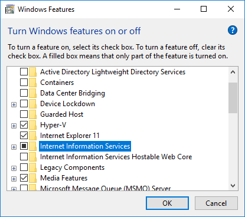

# Deploying an Internet Information Services-Hosted WCF Service

Developing and deploying a Windows Communication Foundation (WCF) service that is hosted in Internet Information Services (IIS) consists of the following tasks:

- Ensure that IIS, ASP.NET, WCF, and the WCF activation component are correctly installed and registered.

- Create a new IIS application, or reuse an existing ASP.NET application.

- Create a .svc file for the WCF service.

- Deploy the service implementation to the IIS application.

- Configure the WCF service.

For a detailed walkthrough of creating an IIS-hosted WCF service, see [How to: Host a WCF Service in IIS](how-to-host-a-wcf-service-in-iis.md).

## Ensure That IIS, ASP.NET and WCF Are Correctly Installed and Registered

WCF, IIS, and ASP.NET must be installed for IIS-hosted WCF services to function correctly. The procedures for installing WCF (as part of the .NET Framework), ASP.NET, and IIS vary depending on your operating system. For more information about installing WCF and the .NET Framework, see [Install the .NET Framework for developers](../../install/guide-for-developers.md). To install IIS on Windows 10, open **Programs and Features** in **Control Panel** and then select **Turn Windows features on or off**. In **Windows Features**, select **Internet Information Services** and then choose **OK**.



Instructions for installing IIS on other operating systems can be found at [Install IIS on Windows Vista and Windows 7](/iis/install/installing-iis-7/installing-iis-on-windows-vista-and-windows-7) and [Install IIS 8.5 on Windows Server 2012 R2](/iis/install/installing-iis-85/installing-iis-85-on-windows-server-2012-r2).

The installation process for .NET Framework automatically registers WCF with IIS if IIS is already present on the machine. If IIS is installed after the .NET Framework, an additional step is required to register WCF with IIS and ASP.NET. You can do this as follows, depending on your operating system:

- Windows 7 and Windows Server 2003: Use the [ServiceModel Registration Tool (ServiceModelReg.exe)](../../../../docs/framework/wcf/servicemodelreg-exe.md) tool to register WCF with IIS. To use this tool, type **ServiceModelReg.exe /i /x** in the [Developer Command Prompt for Visual Studio](../../tools/developer-command-prompt-for-vs.md).

- Windows 7: Finally, you must verify that ASP.NET is configured to use the .NET Framework version 4 or later. You do this by running the ASPNET_Regiis tool with the `–i` option. For more information, see [ASP.NET IIS Registration Tool](https://go.microsoft.com/fwlink/?LinkId=201186).

## Create a New IIS Application or Reuse an Existing ASP.NET Application

IIS-hosted WCF services must reside inside of an IIS application. You can create a new IIS application to host WCF services exclusively. Alternatively, you can deploy an WCF service into an existing application that is already hosting ASP.NET 2.0 content (such as .aspx pages and ASP.NET Web services [ASMX]). For more information about these options, see the "Hosting WCF Side-by-Side with ASP.NET" and "Hosting WCF Services in ASP.NET Compatibility Mode" sections in [WCF Services and ASP.NET](wcf-services-and-aspnet.md).

Note that IIS 6.0 and later versions periodically restart an isolated object-oriented programming application. The default value is 1740 minutes. The maximum value supported is 71,582 minutes. This restart can be disabled. For more information about this property, see the [PeriodicRestartTime](https://go.microsoft.com/fwlink/?LinkId=109968).

## Create an .svc File for the WCF Service

WCF services hosted in IIS are represented as special content files (.svc files) inside the IIS application. This model is similar to the way ASMX pages are represented inside of an IIS application as .asmx files. A .svc file contains a WCF-specific processing directive ([\@ServiceHost](../../../../docs/framework/configure-apps/file-schema/wcf-directive/servicehost.md)) that allows the WCF hosting infrastructure to activate hosted services in response to incoming messages. The most common syntax for a .svc file is in the following statement.

`<% @ServiceHost Service="MyNamespace.MyServiceImplementationTypeName" %>`

It consists of the [\@ServiceHost](../../../../docs/framework/configure-apps/file-schema/wcf-directive/servicehost.md) directive and a single attribute, `Service`. The value of the `Service` attribute is the common language runtime (CLR) type name of the service implementation. Using this directive is basically equivalent to creating a service host using the following code.

```csharp
new ServiceHost( typeof( MyNamespace.MyServiceImplementationTypeName ) );
```

Additional hosting configuration, such as creating a list of base addresses for the service can also be done. You can also use a custom <xref:System.ServiceModel.Activation.ServiceHostFactory> to extend the directive for use with custom hosting solutions. The IIS applications that host WCF services are not responsible for managing the creation and lifetime of <xref:System.ServiceModel.ServiceHost> instances. The managed WCF hosting infrastructure creates the necessary <xref:System.ServiceModel.ServiceHost> instance dynamically when the first request is received for the .svc file. The instance is not released until either it is closed explicitly by code or when the application is recycled.

For more information about the syntax for .svc files, see [\@ServiceHost](../../../../docs/framework/configure-apps/file-schema/wcf-directive/servicehost.md).

## Deploy the Service Implementation to the IIS Application

WCF services hosted in IIS use the same dynamic compilation model as ASP.NET 2.0. Just as with ASP.NET, you can deploy the implementation code for IIS-hosted WCF services in several ways at various locations, as follows:

- As a precompiled .dll file located in the global assembly cache (GAC) or in the application’s \bin directory. Precompiled binaries are not updated until a new version of the class library is deployed.

- As uncompiled source files located in the application’s \App_Code directory. Source files located in this directory are dynamically required when processing the application’s first request. Any changes to files in the \App_Code directory cause the entire application to be recycled and recompiled when the next request is received.

- As uncompiled code placed directly in the .svc file. Implementation code can also be located inline in the service’s .svc file, after the \@ServiceHost directive. Any changes to inline code cause the application to be recycled and recompiled when the next request is received.

For more information about the ASP.NET 2.0 compilation model, see [ASP.NET Compilation Overview](https://go.microsoft.com/fwlink/?LinkId=94773).

## Configure the WCF Service

IIS-hosted WCF services store their configuration in the applications Web.config file. IIS-hosted services use the same configuration elements and syntax as WCF services hosted outside of IIS. However, the following constraints are unique to the IIS hosting environment:

- Base addresses for IIS-hosted services.

- Applications hosting WCF services outside of IIS can control the base address of the services they host by passing a set of base address URIs to the <xref:System.ServiceModel.ServiceHost> constructor or by providing a [\<host>](../../../../docs/framework/configure-apps/file-schema/wcf/host.md) element in the service’s configuration. Services hosted in IIS do not have the ability to control their base address; the base address of an IIS-hosted service is the address of its .svc file.

### Endpoint Addresses for IIS-Hosted Services

When hosted in IIS, endpoint addresses are always considered to be relative to the address of the .svc file that represents the service. For example, if the base address of a WCF service is `http://localhost/Application1/MyService.svc` with the following endpoint configuration:

```xml
<endpoint address="anotherEndpoint" .../>
```

This provides an endpoint that can be reached at `http://localhost/Application1/MyService.svc/anotherEndpoint`.

Similarly, the endpoint configuration element that uses an empty string as the relative address provides an endpoint reachable at `http://localhost/Application1/MyService.svc`, which is the base address.

```xml
<endpoint address="" ... />
```

You must always use relative endpoint addresses for IIS-hosted service endpoints. Supplying a fully-qualified endpoint address (for example, `http://localhost/MyService.svc`) can lead to errors in the deployment of the service if the endpoint address does not point to the IIS-application that hosts the service exposing the endpoint. Using relative endpoint addresses for hosted services avoids these potential conflicts.

### Available Transports

WCF services hosted in IIS 5.1 and IIS 6.0 are restricted to using HTTP-based communication. On these IIS platforms, configuring a hosted service to use a non-HTTP binding results in an error during service activation. For IIS 7.0, the supported transports include HTTP, Net.TCP, Net.Pipe, Net.MSMQ, and msmq.formatname for backwards compatibility with existing MSMQ applications.

### HTTP Transport Security

IIS-hosted WCF services can make use of HTTP transport security (for example, HTTPS and HTTP authentication schemes such as Basic, Digest, and Windows Integrated Authentication) as long as the IIS virtual directory that contains the service supports those settings. The HTTP Transport Security settings on a hosted endpoint’s binding must match the transport security settings on the IIS virtual directory that contains it.

For example, a WCF endpoint configured to use HTTP digest authentication must reside in an IIS virtual directory that is also configured to allow HTTP digest authentication. Unmatched combinations of IIS settings and WCF endpoint settings result in an error during service activation.

## See also

- [Hosting in Internet Information Services](hosting-in-internet-information-services.md)
- [Internet Information Services Hosting Best Practices](internet-information-services-hosting-best-practices.md)
- [Windows Server App Fabric Hosting Features](https://go.microsoft.com/fwlink/?LinkId=201276)
