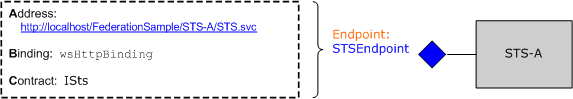

# Federation
This topic provides a brief overview of the concept of federated security. It also describes [!INCLUDE[indigo1](../../../../includes/indigo1-md.md)] support for deploying federated security architectures. For a sample application that demonstrates federation, see [Federation Sample](../../../../docs/framework/wcf/samples/federation-sample.md).  
  
## Definition of Federated Security  
 Federated security allows for clean separation between the service a client is accessing and the associated authentication and authorization procedures. Federated security also enables collaboration across multiple systems, networks, and organizations in different trust realms.  
  
 [!INCLUDE[indigo2](../../../../includes/indigo2-md.md)] provides support for building and deploying distributed systems that employ federated security.  
  
### Elements of a Federated Security Architecture  
 The federated security architecture has three key elements, as described in the following table.  
  
|Element|Description|  
|-------------|-----------------|  
|Domain/realm|A single unit of security administration or trust. A typical domain might include a single organization.|  
|Federation|A collection of domains that have established trust. The level of trust may vary, but typically includes authentication and almost always includes authorization. A typical federation might include a number of organizations that have established trust for shared access to a set of resources.|  
|Security Token Service (STS)|A Web service that issues security tokens; that is, it makes assertions based on evidence that it trusts, to whomever trusts it. This forms the basis of trust brokering between domains.|  
  
### Example Scenario  
 The following illustration shows an example of federated security.  
  
   
  
 This scenario includes two organizations: A and B. Organization B has a Web resource (a Web service) that some users in organization A find valuable.  
  
> [!NOTE]
>  This section uses the terms *resource*, *service*, and *Web service* interchangeably.  
  
 Typically, organization B requires that a user from organization A provide some valid form of authentication before accessing the service. In addition, the organization may also require that the user be authorized to access the specific resource in question. One way to address this problem and enable users in organization A to access the resource in organization B is as follows:  
  
-   Users from organization A register their credentials (a user name and password) with organization B.  
  
-   During the resource access, users from organization A present their credentials to organization B and are authenticated before accessing the resource.  
  
 This approach has three significant drawbacks:  
  
-   Organization B has to manage the credentials for users from organization A in addition to managing the credentials of its local users.  
  
-   Users in organization A need to maintain an additional set of credentials (that is, remember an additional user name and password) apart from the credentials they normally use to gain access to resources within organization A. This usually encourages the practice of using the same user name and password at multiple service sites, which is a weak security measure.  
  
-   The architecture does not scale as more organizations perceive the resource at organization B as being of some value.  
  
 An alternative approach, which addresses the previously mentioned drawbacks, is to employ federated security. In this approach, organizations A and B establish a trust relationship and employ Security Token Service (STS) to enable brokering of the established trust.  
  
 In a federated security architecture, users from organization A know that if they want to access the Web service in organization B that they must present a valid security token from the STS at organization B, which authenticates and authorizes their access to the specific service.  
  
 On contacting the STS B, the users receive another level of indirection from the policy associated with the STS. They must present a valid security token from the STS A (that is, the client trust realm) before the STS B can issue them a security token. This is a corollary of the trust relationship established between the two organizations and implies that organization B does not have to manage identities for users from organization A. In practice, STS B typically has a null `issuerAddress` and `issuerMetadataAddress`. [!INCLUDE[crdefault](../../../../includes/crdefault-md.md)] [How to: Configure a Local Issuer](../../../../docs/framework/wcf/feature-details/how-to-configure-a-local-issuer.md). In that case, the client consults a local policy to locate STS A. This configuration is called *home realm federation* and it scales better because STS B does not have to maintain information about STS A.  
  
 The users then contact the STS at organization A and obtain a security token by presenting authentication credentials that they normally use to gain access to any other resource within organization A. This also alleviates the problem of users having to maintain multiple sets of credentials or using the same set of credentials at multiple service sites.  
  
 Once the users obtain a security token from the STS A, they present the token to the STS B. Organization B proceeds to perform authorization of the users' requests and issues a security token to the users from its own set of security tokens. The users can then present their token to the resource at organization B and access the service.  
  
## Support for Federated Security in WCF  
 [!INCLUDE[indigo2](../../../../includes/indigo2-md.md)] provides turnkey support for deploying federated security architectures through the [\<wsFederationHttpBinding>](../../../../docs/framework/configure-apps/file-schema/wcf/wsfederationhttpbinding.md).  
  
 The [\<wsFederationHttpBinding>](../../../../docs/framework/configure-apps/file-schema/wcf/wsfederationhttpbinding.md) element provides for a secure, reliable, interoperable binding that entails the use of HTTP as the underlying transport mechanism for request-reply communication style, employing text and XML as the wire format for encoding.  
  
 The use of [\<wsFederationHttpBinding>](../../../../docs/framework/configure-apps/file-schema/wcf/wsfederationhttpbinding.md) in a federated security scenario can be decoupled into two logically independent phases, as described in the following sections.  
  
### Phase 1: Design Phase  
 During the design phase, the client uses the [ServiceModel Metadata Utility Tool (Svcutil.exe)](../../../../docs/framework/wcf/servicemodel-metadata-utility-tool-svcutil-exe.md) to read the policy the service endpoint exposes and to collect the service's authentication and authorization requirements. The appropriate proxies are constructed to create the following federated security communication pattern at the client:  
  
-   Obtain a security token from the STS in the client trust realm.  
  
-   Present the token to the STS in the service trust realm.  
  
-   Obtain a security token from the STS in the service trust realm.  
  
-   Present the token to the service to access the service.  
  
### Phase 2: Run-Time Phase  
 During the run-time phase, the client instantiates an object of the [!INCLUDE[indigo2](../../../../includes/indigo2-md.md)] client class and makes a call using the [!INCLUDE[indigo2](../../../../includes/indigo2-md.md)] client. The underlying framework of [!INCLUDE[indigo2](../../../../includes/indigo2-md.md)] handles the previously mentioned steps in the federated security communication pattern and enables the client to seamlessly consume the service.  
  
## Sample Implementation Using WCF  
 The following illustration shows a sample implementation for a federated security architecture using native support from [!INCLUDE[indigo2](../../../../includes/indigo2-md.md)].  
  
   
  
### Example MyService  
 The service `MyService` exposes a single endpoint through `MyServiceEndpoint`. The following illustration shows the address, binding, and contract associated with the endpoint.  
  
   
  
 The service endpoint `MyServiceEndpoint` uses the [\<wsFederationHttpBinding>](../../../../docs/framework/configure-apps/file-schema/wcf/wsfederationhttpbinding.md) and requires a valid Security Assertions Markup Language (SAML) token with an `accessAuthorized` claim issued by STS B. This is declaratively specified in the service configuration.  
  
```xml  
<system.serviceModel>  
  <services>  
    <service type="FederationSample.MyService"      
        behaviorConfiguration='MyServiceBehavior'>  
        <endpoint address=""  
            binding=" wsFederationHttpBinding"  
            bindingConfiguration='MyServiceBinding'  
            contract="Federation.IMyService" />  
   </service>  
  </services>  
  
  <bindings>  
    <wsFederationHttpBinding>  
    <!-- This is the binding used by MyService. It redirects   
    clients to STS-B. -->  
      <binding name='MyServiceBinding'>  
        <security mode="Message">  
           <message issuedTokenType=  
"http://docs.oasis-open.org/wss/oasis-wss-saml-token-profile-1.1#SAMLV1.1">  
           <issuer address="http://localhost/FederationSample/STS-B/STS.svc" />  
            <issuerMetadata   
           address=  
"http://localhost/FederationSample/STS-B/STS.svc/mex" />  
         <requiredClaimTypes>  
            <add claimType="http://tempuri.org:accessAuthorized" />  
         </requiredClaimTypes>  
        </message>  
      </security>  
      </binding>  
    </wsFederationHttpBinding>  
  </bindings>  
  
  <behaviors>  
    <behavior name='MyServiceBehavior'>  
      <serviceAuthorization   
operationRequirementType="FederationSample.MyServiceOperationRequirement, MyService" />  
       <serviceCredentials>  
         <serviceCertificate findValue="CN=FederationSample.com"  
         x509FindType="FindBySubjectDistinguishedName"  
         storeLocation='LocalMachine'  
         storeName='My' />  
      </serviceCredentials>  
    </behavior>  
  </behaviors>  
</system.serviceModel>  
```  
  
> [!NOTE]
>  A subtle point should be noted about the claims required by `MyService`. The second figure indicates that `MyService` requires a SAML token with the `accessAuthorized` claim. To be more precise, this specifies the claim type that `MyService` requires. The fully-qualified name of this claim type is http://tempuri.org:accessAuthorized (along with the associated namespace), which is used in the service configuration file. The value of this claim indicates the presence of this claim and is assumed to be set to `true` by STS B.  
  
 At runtime, this policy is enforced by the `MyServiceOperationRequirement` class that is implemented as part of the `MyService`.  
  
 [!code-csharp[C_Federation#0](../../../../samples/snippets/csharp/VS_Snippets_CFX/c_federation/cs/source.cs#0)]
 [!code-vb[C_Federation#0](../../../../samples/snippets/visualbasic/VS_Snippets_CFX/c_federation/vb/source.vb#0)]  
[!code-csharp[C_Federation#1](../../../../samples/snippets/csharp/VS_Snippets_CFX/c_federation/cs/source.cs#1)]
[!code-vb[C_Federation#1](../../../../samples/snippets/visualbasic/VS_Snippets_CFX/c_federation/vb/source.vb#1)]  
  
#### STS B  
 The following illustration shows the STS B. As stated earlier, a security token service (STS) is also a Web service and can have its associated endpoints, policy, and so on.  
  
   
  
 STS B exposes a single endpoint, called `STSEndpoint` that can be use to request security tokens. Specifically, STS B issues SAML tokens with the `accessAuthorized` claim, which can be presented at the `MyService` service site for accessing the service. However, STS B requires users to present a valid SAML token issued by STS A that contains the `userAuthenticated` claim. This is declaratively specified in the STS configuration.  
  
```xml  
<system.serviceModel>  
  <services>  
    <service type="FederationSample.STS_B" behaviorConfiguration=  
     "STS-B_Behavior">  
    <endpoint address=""  
              binding="wsFederationHttpBinding"  
              bindingConfiguration='STS-B_Binding'  
      contract="FederationSample.ISts" />  
    </service>  
  </services>  
  <bindings>  
    <wsFederationHttpBinding>  
    <!-- This is the binding used by STS-B. It redirects clients to   
         STS-A. -->  
      <binding name='STS-B_Binding'>  
        <security mode='Message'>  
          <message issuedTokenType="http://docs.oasis-open.org/wss/oasis-wss-saml-token-profile-1.1#SAMLV1.1">  
          <issuer address='http://localhost/FederationSample/STS-A/STS.svc' />  
          <issuerMetadata address='http://localhost/FederationSample/STS-A/STS.svc/mex'/>  
          <requiredClaimTypes>  
            <add claimType='http://tempuri.org:userAuthenticated'/>  
          </requiredClaimTypes>  
          </message>  
        </security>  
    </binding>  
   </wsFederationHttpBinding>  
  </bindings>  
  <behaviors>  
  <behavior name='STS-B_Behavior'>  
    <serviceAuthorization   operationRequirementType='FederationSample.STS_B_OperationRequirement, STS_B' />  
    <serviceCredentials>  
      <serviceCertificate findValue='CN=FederationSample.com'  
      x509FindType='FindBySubjectDistinguishedName'  
       storeLocation='LocalMachine'  
       storeName='My' />  
     </serviceCredentials>  
   </behavior>  
  </behaviors>  
</system.serviceModel>  
```  
  
> [!NOTE]
>  Again, the `userAuthenticated` claim is the claim type that is required by STS B. The fully-qualified name of this claim type is http://tempuri.org:userAuthenticated (along with the associated namespace), which is used in the STS configuration file. The value of this claim indicates the presence of this claim and is assumed to be set to `true` by STS A.  
  
 At runtime, the `STS_B_OperationRequirement` class enforces this policy, which is implemented as part of STS B.  
  
 [!code-csharp[C_Federation#2](../../../../samples/snippets/csharp/VS_Snippets_CFX/c_federation/cs/source.cs#2)]
 [!code-vb[C_Federation#2](../../../../samples/snippets/visualbasic/VS_Snippets_CFX/c_federation/vb/source.vb#2)]  
  
 If the access check is clear, STS B issues a SAML token with the `accessAuthorized` claim.  
  
 [!code-csharp[C_Federation#3](../../../../samples/snippets/csharp/VS_Snippets_CFX/c_federation/cs/source.cs#3)]
 [!code-vb[C_Federation#3](../../../../samples/snippets/visualbasic/VS_Snippets_CFX/c_federation/vb/source.vb#3)]  
  
#### STS A  
 The following illustration shows the STS A.  
  
   
  
 Similar to the STS B, the STS A is also a Web service that issues security tokens and exposes a single endpoint for this purpose. However, it uses a different binding (`wsHttpBinding`) and requires users to present a valid [!INCLUDE[infocard](../../../../includes/infocard-md.md)] with an `emailAddress` claim. In response, it issues SAML tokens with the `userAuthenticated` claim. This is declaratively specified in the service configuration.  
  
```xml  
<system.serviceModel>  
  <services>  
    <service type="FederationSample.STS_A" behaviorConfiguration="STS-A_Behavior">  
      <endpoint address=""  
                binding="wsHttpBinding"  
                bindingConfiguration="STS-A_Binding"  
                contract="FederationSample.ISts">  
       <identity>  
       <certificateReference findValue="CN=FederationSample.com"    
                       x509FindType="FindBySubjectDistinguishedName"  
                       storeLocation="LocalMachine"   
                       storeName="My" />  
       </identity>  
    <endpoint>  
  </service>  
</services>  
  
<bindings>  
  <wsHttpBinding>  
  <!-- This is the binding used by STS-A. It requires users to present  
   a CardSpace. -->  
    <binding name='STS-A_Binding'>  
      <security mode='Message'>  
        <message clientCredentialType="CardSpace" />  
      </security>  
    </binding>  
  </wsHttpBinding>  
</bindings>  
  
<behaviors>  
  <behavior name='STS-A_Behavior'>  
    <serviceAuthorization operationRequirementType=  
     "FederationSample.STS_A_OperationRequirement, STS_A" />  
      <serviceCredentials>  
  <serviceCertificate findValue="CN=FederationSample.com"  
                     x509FindType='FindBySubjectDistinguishedName'  
                     storeLocation='LocalMachine'  
                     storeName='My' />  
      </serviceCredentials>  
    </behavior>  
  </behaviors>  
</system.serviceModel>  
```  
  
 At runtime, the `STS_A_OperationRequirement` class enforces this policy, which is implemented as part of STS A.  
  
 [!code-csharp[C_Federation#4](../../../../samples/snippets/csharp/VS_Snippets_CFX/c_federation/cs/source.cs#4)]
 [!code-vb[C_Federation#4](../../../../samples/snippets/visualbasic/VS_Snippets_CFX/c_federation/vb/source.vb#4)]  
  
 If the access is `true`, STS A issues a SAML token with `userAuthenticated` claim.  
  
 [!code-csharp[C_Federation#5](../../../../samples/snippets/csharp/VS_Snippets_CFX/c_federation/cs/source.cs#5)]
 [!code-vb[C_Federation#5](../../../../samples/snippets/visualbasic/VS_Snippets_CFX/c_federation/vb/source.vb#5)]  
  
### Client at Organization A  
 The following illustration shows the client at organization A, along with the steps involved in making a `MyService` service call. The other functional components are also included for completeness.  
  
   
  
## Summary  
 Federated security provides a clean division of responsibility and helps to build secure, scalable service architectures. As a platform for building and deploying distributed applications, [!INCLUDE[indigo2](../../../../includes/indigo2-md.md)] provides native support for implementing federated security.  
  
## See Also  
 [Security](../../../../docs/framework/wcf/feature-details/security.md)
