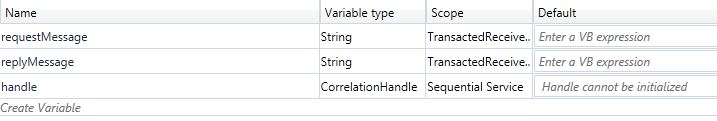
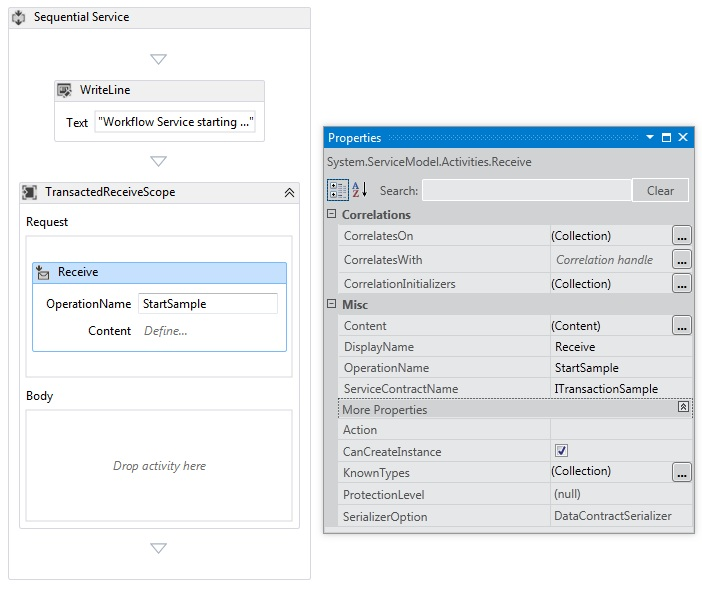

# Flowing Transactions into and out of Workflow Services
Workflow services and clients can participate in transactions.  For a service operation to become part of an ambient transaction, place a <xref:System.ServiceModel.Activities.Receive> activity within a <xref:System.ServiceModel.Activities.TransactedReceiveScope> activity. Any calls made by a <xref:System.ServiceModel.Activities.Send> or a <xref:System.ServiceModel.Activities.SendReply> activity within the <xref:System.ServiceModel.Activities.TransactedReceiveScope> will also be made within the ambient transaction. A workflow client application can create an ambient transaction by using the <xref:System.Activities.Statements.TransactionScope> activity and call service operations using the ambient transaction. This topic walks you through creating a workflow service and workflow client that participate in transactions.  
  
> [!WARNING]
>  If a workflow service instance is loaded within a transaction and the workflow contains a <xref:System.Activities.Statements.Persist> activity, the workflow instance will hang until the transaction times out.  
  
> [!IMPORTANT]
>  Whenever you use a <xref:System.ServiceModel.Activities.TransactedReceiveScope> it is recommended to place all Receives in the workflow within <xref:System.ServiceModel.Activities.TransactedReceiveScope> activities.  
  
> [!IMPORTANT]
>  When using <xref:System.ServiceModel.Activities.TransactedReceiveScope> and messages arrive in the incorrect order, the workflow will be aborted when trying to deliver the first out of order message. You must make sure your workflow is always at a consistent stopping point when the workflow idles. This will allow you to restart the workflow from a previous persistence point should the workflow be aborted.  
  
### Create a shared library  
  
1.  Create a new empty Visual Studio Solution.  
  
2.  Add a new class library project called `Common`. Add references to the following assemblies:  
  
    -   System.Activities.dll  
  
    -   System.ServiceModel.dll  
  
    -   System.ServiceModel.Activities.dll  
  
    -   System.Transactions.dll  
  
3.  Add a new class called `PrintTransactionInfo` to the `Common` project. This class is derived from <xref:System.Activities.NativeActivity> and overloads the <xref:System.Activities.NativeActivity.Execute%2A> method.  
  
    ```  
    using System;  
    using System;  
    using System.Activities;  
    using System.Transactions;  
  
    namespace Common  
    {  
        public class PrintTransactionInfo : NativeActivity  
        {  
            protected override void Execute(NativeActivityContext context)  
            {  
                RuntimeTransactionHandle rth = context.Properties.Find(typeof(RuntimeTransactionHandle).FullName) as RuntimeTransactionHandle;  
  
                if (rth == null)  
                {  
                    Console.WriteLine("There is no ambient RuntimeTransactionHandle");  
                }  
  
                Transaction t = rth.GetCurrentTransaction(context);  
  
                if (t == null)  
                {  
                    Console.WriteLine("There is no ambient transaction");  
                }  
                else  
                {  
                    Console.WriteLine("Transaction: {0} is {1}", t.TransactionInformation.DistributedIdentifier, t.TransactionInformation.Status);  
                }  
            }  
        }  
  
    }  
    ```  
  
     This is a native activity that displays information about the ambient transaction and is used in both the service and client workflows used in this topic. Build the solution to make this activity available in the **Common** section of the **Toolbox**.  
  
### Implement the workflow service  
  
1.  Add a new WCF Workflow Service, called `WorkflowService` to the `Common` project. To do this right click the `Common` project, select **Add**, **New Item ...**, Select **Workflow** under **Installed Templates** and select **WCF Workflow Service**.  
  
       
  
2.  Delete the default `ReceiveRequest` and `SendResponse` activities.  
  
3.  Drag and drop a <xref:System.Activities.Statements.WriteLine> activity into the `Sequential Service` activity. Set the text property to `"Workflow Service starting ..."` as shown in the following example.  
  
     ![Adding a WriteLine activity to the Sequential Service activity(./media/flowing-transactions-into-and-out-of-workflow-services/add-writeline-sequential-service.jpg)  
  
4.  Drag and drop a <xref:System.ServiceModel.Activities.TransactedReceiveScope> after the <xref:System.Activities.Statements.WriteLine> activity. The <xref:System.ServiceModel.Activities.TransactedReceiveScope> activity can be found in the **Messaging** section of the **Toolbox**. The <xref:System.ServiceModel.Activities.TransactedReceiveScope> activity is composed of two sections **Request** and **Body**. The **Request** section contains the <xref:System.ServiceModel.Activities.Receive> activity. The **Body** section contains the activities to execute within a transaction after a message has been received.  
  
       
  
5.  Select the <xref:System.ServiceModel.Activities.TransactedReceiveScope> activity and click the **Variables** button. Add the following variables.  
  
       
  
    > [!NOTE]
    >  You can delete the data variable that is there by default. You can also use the existing handle variable.  
  
6.  Drag and drop a <xref:System.ServiceModel.Activities.Receive> activity within the **Request** section of the <xref:System.ServiceModel.Activities.TransactedReceiveScope> activity. Set the following properties:  
  
    |Property|Value|  
    |--------------|-----------|  
    |CanCreateInstance|True (check the checkbox)|  
    |OperationName|StartSample|  
    |ServiceContractName|ITransactionSample|  
  
     The workflow should look like this:  
  
       
  
7.  Click the **Define...** link in the <xref:System.ServiceModel.Activities.Receive> activity and make the following settings:  
  
       
  
8.  Drag and drop a <xref:System.Activities.Statements.Sequence> activity into the Body section of the <xref:System.ServiceModel.Activities.TransactedReceiveScope>. Within the <xref:System.Activities.Statements.Sequence> activity drag and drop two <xref:System.Activities.Statements.WriteLine> activities and set the <xref:System.Activities.Statements.WriteLine.Text%2A> properties as shown in the following table.  
  
    |Activity|Value|  
    |--------------|-----------|  
    |1st WriteLine|"Service: Receive Completed"|  
    |2nd WriteLine|"Service: Received = " + requestMessage|  
  
     The workflow should now look like this:  
  
       
  
9. Drag and drop the `PrintTransactionInfo` activity after the second <xref:System.Activities.Statements.WriteLine> activity in the **Body** in the <xref:System.ServiceModel.Activities.TransactedReceiveScope> activity.  
  
       
  
10. Drag and drop an <xref:System.Activities.Statements.Assign> activity after the `PrintTransactionInfo` activity and set its properties according to the following table.  
  
    |Property|Value|  
    |--------------|-----------|  
    |To|replyMessage|  
    |Value|"Service: Sending reply."|  
  
11. Drag and drop a <xref:System.Activities.Statements.WriteLine> activity after the <xref:System.Activities.Statements.Assign> activity and set its <xref:System.Activities.Statements.WriteLine.Text%2A> property to "Service: Begin reply."  
  
     The workflow should now look like this:  
  
       
  
12. Right click the <xref:System.ServiceModel.Activities.Receive> activity and select **Create SendReply** and paste it after the last <xref:System.Activities.Statements.WriteLine> activity. Click the **Define...** link in the `SendReplyToReceive` activity and make the following settings.  
  
       
  
13. Drag and drop a <xref:System.Activities.Statements.WriteLine> activity after the `SendReplyToReceive` activity and set it’s <xref:System.Activities.Statements.WriteLine.Text%2A> property to "Service: Reply sent."  
  
14. Drag and drop a <xref:System.Activities.Statements.WriteLine> activity at the bottom of the workflow and set its <xref:System.Activities.Statements.WriteLine.Text%2A> property to "Service: Workflow ends, press ENTER to exit."  
  
     The completed service workflow should look like this:  
  
       
  
### Implement the workflow client  
  
1.  Add a new WCF Workflow application, called `WorkflowClient` to the `Common` project. To do this right click the `Common` project, select **Add**, **New Item ...**, Select **Workflow** under **Installed Templates** and select **Activity**.  
  
       
  
2.  Drag and drop a <xref:System.Activities.Statements.Sequence> activity onto the design surface.  
  
3.  Within the <xref:System.Activities.Statements.Sequence> activity drag and drop a <xref:System.Activities.Statements.WriteLine> activity and set its <xref:System.Activities.Statements.WriteLine.Text%2A> property to `"Client: Workflow starting"`. The workflow should now look like this:  
  
       
  
4.  Drag and drop a <xref:System.Activities.Statements.TransactionScope> activity after the <xref:System.Activities.Statements.WriteLine> activity.  Select the <xref:System.Activities.Statements.TransactionScope> activity, click the Variables button and add the following variables.  
  
       
  
5.  Drag and drop a <xref:System.Activities.Statements.Sequence> activity into the body of the <xref:System.Activities.Statements.TransactionScope> activity.  
  
6.  Drag and drop a `PrintTransactionInfo` activity within the <xref:System.Activities.Statements.Sequence>  
  
7.  Drag and drop a <xref:System.Activities.Statements.WriteLine> activity after the `PrintTransactionInfo` activity and set its <xref:System.Activities.Statements.WriteLine.Text%2A> property to "Client: Beginning Send". The workflow should now look like this:  
  
       
  
8.  Drag and drop a <xref:System.ServiceModel.Activities.Send> activity after the <xref:System.Activities.Statements.Assign> activity and set the following properties:  
  
    |Property|Value|  
    |--------------|-----------|  
    |EndpointConfigurationName|workflowServiceEndpoint|  
    |OperationName|StartSample|  
    |ServiceContractName|ITransactionSample|  
  
     The workflow should now look like this:  
  
       
  
9. Click the **Define...** link and make the following settings:  
  
       
  
10. Right click the <xref:System.ServiceModel.Activities.Send> activity and select **Create ReceiveReply**. The <xref:System.ServiceModel.Activities.ReceiveReply> activity will be automatically placed after the <xref:System.ServiceModel.Activities.Send> activity.  
  
11. Click the Define... link on the ReceiveReplyForSend activity and make the following settings:  
  
       
  
12. Drag and drop a <xref:System.Activities.Statements.WriteLine> activity between the <xref:System.ServiceModel.Activities.Send> and <xref:System.ServiceModel.Activities.ReceiveReply> activities and set its <xref:System.Activities.Statements.WriteLine.Text%2A> property to "Client: Send complete."  
  
13. Drag and drop a <xref:System.Activities.Statements.WriteLine> activity after the <xref:System.ServiceModel.Activities.ReceiveReply> activity and set its <xref:System.Activities.Statements.WriteLine.Text%2A> property to "Client side: Reply received = " + replyMessage  
  
14. Drag and drop a `PrintTransactionInfo` activity after the <xref:System.Activities.Statements.WriteLine> activity.  
  
15. Drag and drop a <xref:System.Activities.Statements.WriteLine> activity at the end of the workflow and set its <xref:System.Activities.Statements.WriteLine.Text%2A> property to "Client workflow ends." The completed client workflow should look like the following diagram.  
  
       
  
16. Build the solution.  
  
### Create the Service application  
  
1.  Add a new Console Application project called `Service` to the solution. Add references to the following assemblies:  
  
    1.  System.Activities.dll  
  
    2.  System.ServiceModel.dll  
  
    3.  System.ServiceModel.Activities.dll  
  
2.  Open the generated Program.cs file and the following code:  
  
    ```  
    static void Main()  
          {  
              Console.WriteLine("Building the server.");  
              using (WorkflowServiceHost host = new WorkflowServiceHost(new DeclarativeServiceWorkflow(), new Uri("net.tcp://localhost:8000/TransactedReceiveService/Declarative")))  
              {                
                  //Start the server  
                  host.Open();  
                  Console.WriteLine("Service started.");  
  
                  Console.WriteLine();  
                  Console.ReadLine();  
                  //Shutdown  
                  host.Close();  
              };         
          }  
    ```  
  
3.  Add the following app.config file to the project.  
  
    ```xml  
    <?xml version="1.0" encoding="utf-8" ?>  
    <!-- Copyright © Microsoft Corporation.  All rights reserved. -->  
    <configuration>  
        <system.serviceModel>  
            <bindings>  
                <netTcpBinding>  
                    <binding transactionFlow="true" />  
                </netTcpBinding>  
            </bindings>  
        </system.serviceModel>  
    </configuration>  
    ```  
  
### Create the client application  
  
1.  Add a new Console Application project called `Client` to the solution. Add a reference to System.Activities.dll.  
  
2.  Open the program.cs file and add the following code.  
  
    ```  
    class Program  
        {  
  
            private static AutoResetEvent syncEvent = new AutoResetEvent(false);  
  
            static void Main(string[] args)  
            {  
                //Build client  
                Console.WriteLine("Building the client.");  
                WorkflowApplication client = new WorkflowApplication(new DeclarativeClientWorkflow());  
                client.Completed = Program.Completed;  
                client.Aborted = Program.Aborted;  
                client.OnUnhandledException = Program.OnUnhandledException;  
  
                //Wait for service to start  
                Console.WriteLine("Press ENTER once service is started.");  
                Console.ReadLine();  
  
                //Start the client              
                Console.WriteLine("Starting the client.");  
                client.Run();  
                syncEvent.WaitOne();  
  
                //Sample complete  
                Console.WriteLine();  
                Console.WriteLine("Client complete. Press ENTER to exit.");  
                Console.ReadLine();  
            }  
  
            private static void Completed(WorkflowApplicationCompletedEventArgs e)  
            {  
                Program.syncEvent.Set();  
            }  
  
            private static void Aborted(WorkflowApplicationAbortedEventArgs e)  
            {  
                Console.WriteLine("Client Aborted: {0}", e.Reason);  
                Program.syncEvent.Set();  
            }  
  
            private static UnhandledExceptionAction OnUnhandledException(WorkflowApplicationUnhandledExceptionEventArgs e)  
            {  
                Console.WriteLine("Client had an unhandled exception: {0}", e.UnhandledException);  
                return UnhandledExceptionAction.Cancel;  
            }  
        }  
    ```  
  
## See also

- [Workflow Services](../../../../docs/framework/wcf/feature-details/workflow-services.md)
- [Windows Communication Foundation Transactions Overview](../../../../docs/framework/wcf/feature-details/transactions-overview.md)
