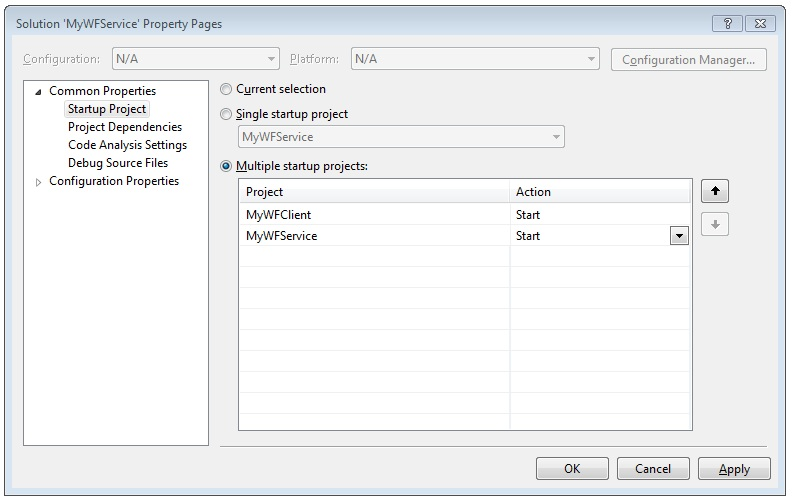

# How To: Access a Service From a Workflow Application
This topic describes how to call a workflow service from a workflow console application. It depends on completion of the [How to: Create a Workflow Service with Messaging Activities](../../../../docs/framework/wcf/feature-details/how-to-create-a-workflow-service-with-messaging-activities.md) topic. Although this topic describes how to call a workflow service from a workflow application, the same methods can be used to call any [!INCLUDE[indigo1](../../../../includes/indigo1-md.md)] service from a workflow application.  
  
### Create a Workflow Console Application Project  
  
1.  Start [!INCLUDE[vs_current_long](../../../../includes/vs-current-long-md.md)].  
  
2.  Load the MyWFService project you created in the [How to: Create a Workflow Service with Messaging Activities](../../../../docs/framework/wcf/feature-details/how-to-create-a-workflow-service-with-messaging-activities.md) topic.  
  
3.  Right click the **MyWFService** solution in the **Solution Explorer** and select **Add**, **New Project**. Select **Workflow** in the **Installed Templates** and **Workflow Console Application** from the list of project types. Name the project MyWFClient and use the default location as shown in the following illustration.  
  
       
  
     Click the **OK** button to dismiss the **Add New Project Dialog**.  
  
4.  After the project is created, the Workflow1.xaml file is opened in the designer. Click the **Toolbox** tab to open the toolbox if it is not already open and click the pushpin to keep the toolbox window open.  
  
5.  Press Ctrl + F5 to build and launch the service. As before, the ASP.NET Development Server is launched and Internet Explorer displays the WCF Help Page. Notice the URI for this page as you must use it in the next step.  
  
       
  
6.  Right click the **MyWFClient** project in the **Solution Explorer** and select **Add Service Reference**. Click the **Discover** button to search the current solution for any services. Click the triangle next to Service1.xamlx in the Services list. Click the triangle next to Service1 to list the contracts implemented by the Service1 service. Expand the **Service1** node in the **Services** list. The Echo operation is displayed in the **Operations** list as shown in the following illustration.  
  
       
  
     Keep the default namespace and click **OK** to dismiss the **Add Service Reference** dialog. The following dialog is displayed.  
  
       
  
     Click **OK** to dismiss the dialog. Next, press CTRL+SHIFT+B to build the solution. Notice in the toolbox a new section has been added called **MyWFClient.ServiceReference1.Activities**. Expand this section and notice the Echo activity that has been added as shown in the following illustration.  
  
       
  
7.  Drag and drop a <!--zz <xref:System.ServiceModel.Activities.Sequence>--> `System.ServiceModel.Activities.Sequence` activity onto the designer surface. It is under the **Control Flow** section of the toolbox.  
  
8.  With the <!--zz <xref:System.ServiceModel.Activities.Sequence>--> `System.ServiceModel.Activities.Sequence` activity in focus, click the **Variables** link and add a string variable named `inString`. Give the variable a default value of `"Hello, world"` as well as a string variable named `outString` as shown in the following diagram.  
  
       
  
9. Drag and drop an **Echo** activity into the <!--zz <xref:System.ServiceModel.Activities.Sequence>--> `System.ServiceModel.Activities.Sequence`. In the properties window bind the `inMsg` argument to the `inString` variable and the `outMsg` argument to the `outString` variable as shown in the following illustration. This passes in the value of the `inString` variable to the operation and then takes the return value and places it in the `outString` variable.  
  
       
  
10. Drag and drop a **WriteLine** activity below the **Echo** activity to display the string returned by the service call. The **WriteLine** activity is located in the **Primitives** node in the toolbox. Bind the **Text** argument of the **WriteLine** activity to the `outString` variable by typing `outString` into the text box on the **WriteLine** activity. The workflow should now look like the following illustration.  
  
       
  
11. Right-click the MyWFService solution and select **Set Startup Projects ...**. Select the **Multiple startup projects** radio button and select **Start** for each project in the **Action** column as shown in the following illustration.  
  
       
  
12. Press Ctrl + F5 to launch both the service and the client. The ASP.NET Development Server hosts the service, Internet Explorer displays the WCF help page, and the client workflow application is launched in a console window and displays the string returned from the service ("Hello, world").  
  
## See Also  
 [Workflow Services](../../../../docs/framework/wcf/feature-details/workflow-services.md)  
 [How to: Create a Workflow Service with Messaging Activities](../../../../docs/framework/wcf/feature-details/how-to-create-a-workflow-service-with-messaging-activities.md)  
 [Consuming a WCF Service from a Workflow in a Web Project](http://go.microsoft.com/fwlink/?LinkId=207725)
