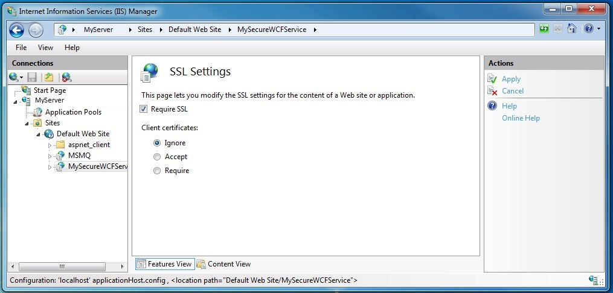

# How to: Configure an IIS-hosted WCF service with SSL
This topic describes how to set up an IIS-hosted WCF service to use HTTP transport security. HTTP transport security requires an SSL certificate to be registered with IIS. If you do not have an SSL certificate you can use IIS to generate a test certificate. Next you must add an SSL binding to the web site and configure the web site’s authentication properties. Finally you need to configure the WCF service to use HTTPS.  
  
### Creating a Self-Signed Certificate  
  
1.  Open Internet Information Services Manager (inetmgr.exe), and select your computer name in the left-hand tree view. On the right-hand side of the screen select Server Certificates  
  
       
  
2.  In the Server Certificates window click the **Create Self-Signed Certificate….** Link.  
  
       
  
3.  Enter a friendly name for the self-signed certificate and click **OK**.  
  
       
  
     The newly created self-signed certificate details are now shown in the **Server Certificates** window.  
  
       
  
     The generated certificate is installed in the Trusted Root Certification Authorities store.  
  
### Add SSL Binding  
  
1.  Still in Internet Information Services Manager, expand the **Sites** folder and then the **Default Web Site** folder in the tree view on the left-hand side of the screen.  
  
2.  Click the **Bindings….** Link in the **Actions** section in the upper right hand portion of the window.  
  
       
  
3.  In the Site Bindings window click the **Add** button.  
  
       
  
4.  In the **Add Site Binding** dialog, select https for the type and the friendly name of the self-signed certificate you just created.  
  
       
  
### Configure Virtual Directory for SSL  
  
1.  Still in Internet Information Services Manager, select the virtual directory that contains your WCF secure service.  
  
2.  In the center pane of the window, select **SSL Settings** in the IIS section.  
  
       
  
3.  In the SSL Settings pane, select the **Require SSL** checkbox and click the **Apply** link in the **Actions** section on the right hand side of the screen.  
  
       
  
### Configure WCF Service for HTTP Transport Security  
  
1.  In the WCF service’s web.config configure the HTTP binding to use transport security as shown in the following XML.  
  
    ```xml  
    <bindings>  
          <basicHttpBinding>  
            <binding name="secureHttpBinding">  
              <security mode="Transport">  
                <transport clientCredentialType="None"/>  
              </security>  
            </binding>  
          </basicHttpBinding>  
    </bindings>  
    ```  
  
2.  Specify your service and service endpoint as shown in the following XML.  
  
    ```xml  
    <services>  
          <service name="MySecureWCFService.Service1">  
            <endpoint address=""  
                      binding="basicHttpBinding"  
                      bindingConfiguration="secureHttpBinding"  
                      contract="MySecureWCFService.IService1"/>  
  
            <endpoint address="mex"  
                      binding="mexHttpsBinding"  
                      contract="IMetadataExchange" />  
          </service>  
    </services>  
    ```  
  
## Example  
 The following is a complete example of a web.config file for a WCF service using HTTP transport security  
  
```xml  
<?xml version="1.0"?>  
<configuration>  
  
  <system.web>  
    <compilation debug="true" targetFramework="4.0" />  
  </system.web>  
  <system.serviceModel>  
    <services>  
      <service name="MySecureWCFService.Service1">  
        <endpoint address=""  
                  binding="basicHttpBinding"  
                  bindingConfiguration="secureHttpBinding"  
                  contract="MySecureWCFService.IService1"/>  
  
        <endpoint address="mex"  
                  binding="mexHttpsBinding"  
                  contract="IMetadataExchange" />  
      </service>  
    </services>  
    <bindings>  
      <basicHttpBinding>  
        <binding name="secureHttpBinding">  
          <security mode="Transport">  
            <transport clientCredentialType="None"/>  
          </security>  
        </binding>  
      </basicHttpBinding>  
    </bindings>  
    <behaviors>  
      <serviceBehaviors>  
        <behavior>  
          <!-- To avoid disclosing metadata information, set the value below to false and remove the metadata endpoint above before deployment -->  
          <serviceMetadata httpsGetEnabled="true"/>  
          <!-- To receive exception details in faults for debugging purposes, set the value below to true.  Set to false before deployment to avoid disclosing exception information -->  
          <serviceDebug includeExceptionDetailInFaults="false"/>  
        </behavior>  
      </serviceBehaviors>  
    </behaviors>  
    <serviceHostingEnvironment multipleSiteBindingsEnabled="true" />  
  </system.serviceModel>  
  <system.webServer>  
    <modules runAllManagedModulesForAllRequests="true"/>  
  </system.webServer>  
  
</configuration>  
```  
  
## See Also  
 [Hosting in Internet Information Services](../../../../docs/framework/wcf/feature-details/hosting-in-internet-information-services.md)  
 [Internet Information Service Hosting Instructions](../../../../docs/framework/wcf/samples/internet-information-service-hosting-instructions.md)  
 [Internet Information Services Hosting Best Practices](../../../../docs/framework/wcf/feature-details/internet-information-services-hosting-best-practices.md)  
 [IIS Hosting Using Inline Code](../../../../docs/framework/wcf/samples/iis-hosting-using-inline-code.md)
