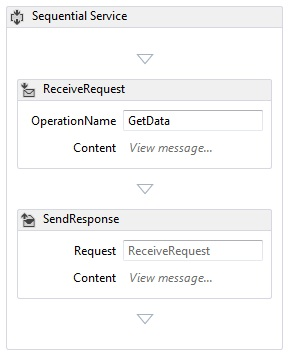
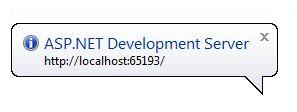
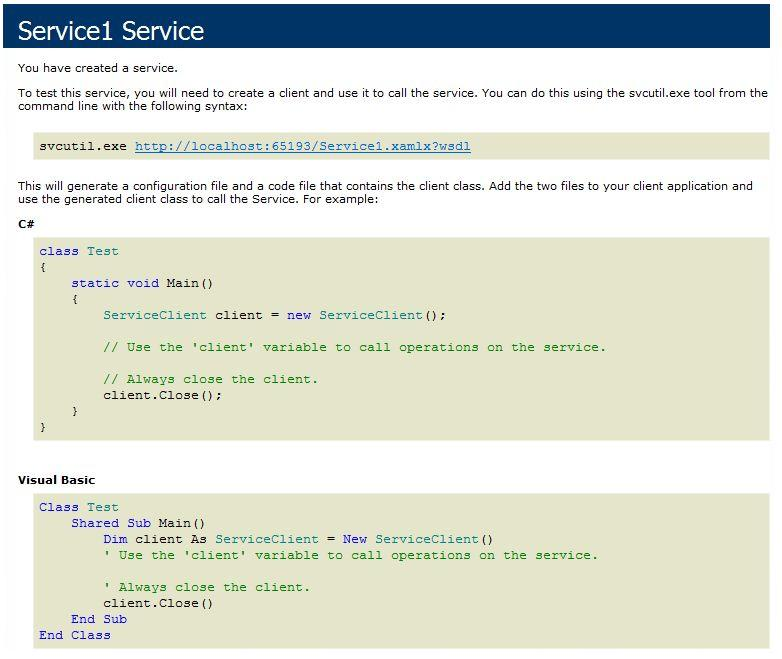

# How to: Create a Workflow Service with Messaging Activities
This topic describes how to create a simple workflow service using messaging activities. This topic focuses on the mechanics of creating a workflow service where the service consists solely of messaging activities. In a real-world service, the workflow contains many other activities. The service implements one operation called Echo, which takes a string and returns the string to the caller. This topic is the first in a series of two topics. The next topic [How To: Access a Service From a Workflow Application](../../../../docs/framework/wcf/feature-details/how-to-access-a-service-from-a-workflow-application.md) discusses how to create a workflow application that can call the service created in this topic.  
  
### To create a workflow service project  
  
1.  Start [!INCLUDE[vs_current_long](../../../../includes/vs-current-long-md.md)].  
  
2.  Click the **File** menu, select **New**, and then **Project** to display the **New Project Dialog**. Select **Workflow** from the list of installed templates and **WCF Workflow Service Application** from the list of project types. Name the project `MyWFService` and use the default location as shown in the following illustration.  
  
     Click the **OK** button to dismiss the **New Project Dialog**.  
  
3.  When the project is created, the Service1.xamlx file is opened in the designer as shown in the following illustration.  
  
       
  
     Right-click the activity labeled **Sequential Service** and select **Delete**.  
  
### To implement the workflow service  
  
1.  Select the **Toolbox** tab on the left side of the screen to display the toolbox and click the pushpin to keep the window open. Expand the **Messaging** section of the toolbox to display the messaging activities and the messaging activity templates as shown in the following illustration.  
  
       
  
2.  Drag and drop a **ReceiveAndSendReply** template to the workflow designer. This creates a <!--zz <xref:System.ServiceModel.Activities.Sequence>--> `System.ServiceModel.Activities.Sequence` activity with a **Receive** activity followed by a <xref:System.ServiceModel.Activities.SendReply> activity as shown in the following illustration.  
  
       
  
     Notice that the <xref:System.ServiceModel.Activities.SendReply> activity’s <xref:System.ServiceModel.Activities.SendReply.Request%2A> property is set to `Receive`, the name of the <xref:System.ServiceModel.Activities.Receive> activity to which the <xref:System.ServiceModel.Activities.SendReply> activity is replying.  
  
3.  In the <xref:System.ServiceModel.Activities.Receive> activity type `Echo` into the textbox labeled **OperationName**. This defines the name of the operation the service implements.  
  
       
  
4.  With the <xref:System.ServiceModel.Activities.Receive> activity selected, open the properties window if not already open by clicking the **View** menu and selecting **Properties Window**. In the **Properties Window** scroll down until you see **CanCreateInstance** and click the checkbox as shown in the following illustration. This setting enables the workflow service host to create a new instance of the service (if needed) when a message is received.  
  
       
  
5.  Select the <!--zz <xref:System.ServiceModel.Activities.Sequence>--> `System.ServiceModel.Activities.Sequence` activity and click the **Variables** button in the lower left corner of the designer. This displays the variables editor. Click the **Create Variable** link to add a variable to store the string sent to the operation. Name the variable `msg` and set its **Variable** type to String as shown in the following illustration.  
  
       
  
     Click the **Variables** button again to close the variables editor.  
  
6.  Click the **Define..** link in the **Content** text box in the <xref:System.ServiceModel.Activities.Receive> activity to display the **Content Definition** dialog. Select the **Parameters** radio button, click the **Add new Parameter** link, type `inMsg` in the **name** text box, select **String** in the **Type** drop down list box, and type `msg` in the **Assign To** text box as shown in the following illustration.  
  
       
  
     This specifies that the Receive activity receives string parameter and that data is bound to the `msg` variable. Click **OK** to close the **Content Definition** dialog.  
  
7.  Click the **Define...** link in the **Content** box in the <xref:System.ServiceModel.Activities.SendReply> activity to display the **Content Definition** dialog. Select the **Parameters** radio button, click the **Add new Parameter** link, type `outMsg` in the **name** textbox, select **String** in the **Type** dropdown list box, and `msg` in the **Value** text box as shown in the following illustration.  
  
       
  
     This specifies that the <xref:System.ServiceModel.Activities.SendReply> activity sends a message or message contract type and that data is bound to the `msg` variable. Because this is a <xref:System.ServiceModel.Activities.SendReply> activity, this means the data in `msg` is used to populate the message the activity sends back to the client. Click **OK** to close the **Content Definition** dialog.  
  
8.  Save and build the solution by clicking the **Build** menu and selecting **Build Solution**.  
  
## Configure the Workflow Service Project  
 The workflow service is complete. This section explains how to configure the workflow service solution to make it easy to host and run. This solution uses the ASP.NET Development Server to host the service.  
  
#### To set project start up options  
  
1.  In the **Solution Explorer**, right-click **MyWFService** and select **Properties** to display the **Project Properties** dialog.  
  
2.  Select the **Web** tab and select **Specific Page** under **Start Action** and type `Service1.xamlx` in the text box as shown in the following illustration.  
  
       
  
     This hosts the service defined in Service1.xamlx in the ASP.NET Development Server.  
  
3.  Press Ctrl + F5 to launch the service. The ASP.NET Development Server icon is displayed in the lower right side of the desktop as shown in the following image.  
  
       
  
     In addition, Internet Explorer displays the WCF Service Help Page for the service.  
  
       
  
4.  Continue on to the [How To: Access a Service From a Workflow Application](../../../../docs/framework/wcf/feature-details/how-to-access-a-service-from-a-workflow-application.md) topic to create a workflow client that calls this service.  
  
## See Also  
 [Workflow Services](../../../../docs/framework/wcf/feature-details/workflow-services.md)  
 [Hosting Workflow Services Overview](../../../../docs/framework/wcf/feature-details/hosting-workflow-services-overview.md)  
 [Messaging Activities](../../../../docs/framework/wcf/feature-details/messaging-activities.md)
