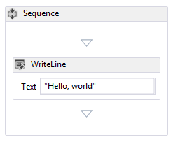
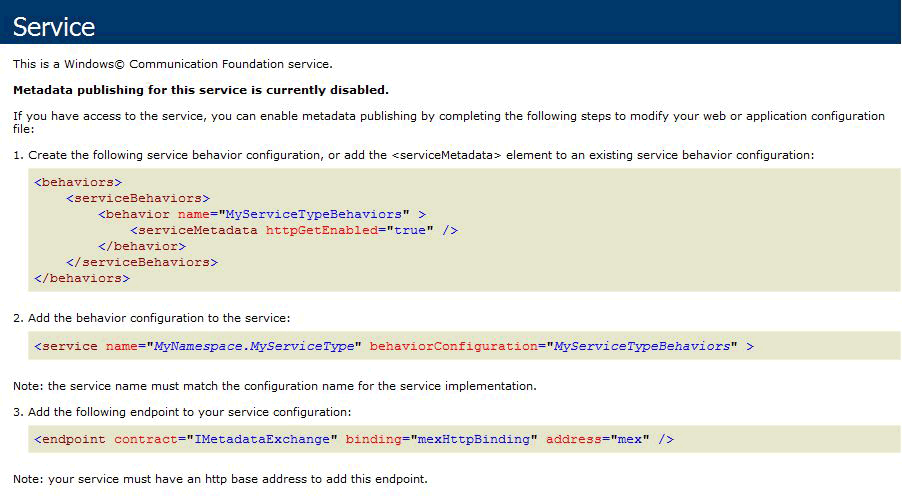

# How to: Host a non-service workflow in IIS
Workflows that are not workflow services can be hosted under IIS/WAS. This is useful when you need to host a workflow written by somebody else. For example, if you rehost the workflow designer and allow users to create their own workflows.  Hosting non-service workflows in IIS provides support for features like process recycling, idle shutdown, process health monitoring, and message-based activation. Workflow services hosted in IIS contain <xref:System.ServiceModel.Activities.Receive> activities and are activated when a message is received by IIS. Non-service workflows do not contain messaging activities, and by default cannot be activated by sending a message.  You must derive a class from <xref:System.ServiceModel.Activities.WorkflowHostingEndpoint> and define a service contract that contains operations to create an instance of the workflow. This topic will walk you through creating a simple workflow, defining a service contract a client can use to activate the workflow, and deriving a class from <xref:System.ServiceModel.Activities.WorkflowHostingEndpoint> which uses the service contract to listen for workflow creating requests.  
  
### Create a simple workflow  
  
1.  Create a new [!INCLUDE[vs_current_long](../../../../includes/vs-current-long-md.md)] empty solution called `CreationEndpointTest`.  
  
2.  Add a new WCF Workflow Service Application project called `SimpleWorkflow` to the solution. The workflow designer will open.  
  
3.  Delete the ReceiveRequest and SendResponse activities. These activities are what makes a workflow a workflow service. Since we are not working with a workflow service, we no longer need them.  
  
4.  Set the DisplayName for the sequence activity to "Sequential Workflow".  
  
5.  Rename Service1.xamlx to Workflow1.xamlx.  
  
6.  Click the designer outside of the sequence activity, and set the Name and ConfigurationName properties to "Workflow1"  
  
7.  Drag a <xref:System.Activities.Statements.WriteLine> activity into the <xref:System.Activities.Statements.Sequence>. The <xref:System.Activities.Statements.WriteLine> activity can be found in the **Primitives** section of the toolbox. Set the <xref:System.Activities.Statements.WriteLine.Text%2A> property of the <xref:System.Activities.Statements.WriteLine> activity to "Hello, world".  
  
     The workflow should now look like the following diagram.  
  
       
  
### Create the workflow creation service contract  
  
1.  Add a new class library project called `Shared` to the `CreationEndpointTest` solution.  
  
2.  Add a reference to System.ServiceModel.dll, System.Configuration, and System.ServiceModel.Activities to the `Shared` project.  
  
3.  Rename the Class1.cs file to IWorkflowCreation.cs and the following code to the file.  
  
    ```  
    using System;  
    using System.Collections.Generic;  
    using System.Linq;  
    using System.Text;  
    using System.ServiceModel;  
  
    namespace Shared  
    {  
        //service contract exposed from the endpoint  
        [ServiceContract(Name = "IWorkflowCreation")]  
        public interface IWorkflowCreation  
        {  
            [OperationContract(Name = "Create")]  
            Guid Create(IDictionary<string, object> inputs);  
  
            [OperationContract(Name = "CreateWithInstanceId", IsOneWay = true)]  
            void CreateWithInstanceId(IDictionary<string, object> inputs, Guid instanceId);  
        }  
    }  
    ```  
  
     This contract defines two operations both create a new instance of the non-service workflow you just created. One creates a new instance with a generated instance ID and the other allows you to specify the instance ID for the new workflow instance.  Both methods allow you to pass in parameters to the new workflow instance. This contract will be exposed by the <xref:System.ServiceModel.Activities.WorkflowHostingEndpoint> to allow clients to create new instances of a non-service workflow.  
  
### Derive a class from WorkflowHostingEndpoint  
  
1.  Add a new class called `CreationEndpoint` derived from <xref:System.ServiceModel.Activities.WorkflowHostingEndpoint> to the `Shared` project.  
  
    ```  
    using System;  
    using System.Collections.Generic;  
    using System.Diagnostics;  
    using System.Globalization;  
    using System.ServiceModel;  
    using System.ServiceModel.Activities;  
    using System.ServiceModel.Channels;  
  
    namespace Shared  
    {  
        public class CreationEndpoint : WorkflowHostingEndpoint  
        {  
        }  
    }  
    ```  
  
2.  Add a local static <xref:System.Uri> variable called `defaultBaseUri` to the `CreationEndpoint` class.  
  
    ```  
    public class CreationEndpoint : WorkflowHostingEndpoint  
    {  
        static Uri defaultBaseUri;  
    }  
    ```  
  
3.  Add the following constructor to the `CreationEndpoint` class. Notice we specify the `IWorkflowCreation` service contract in the call to the base constructor.  
  
    ```  
    public CreationEndpoint(Binding binding, EndpointAddress address)  
       : base(typeof(IWorkflowCreation), binding, address)  
       {  
       }  
    ```  
  
4.  Add the following default constructor to the `CreationEndpoint` class.  
  
    ```  
    public CreationEndpoint()  
       : this(GetDefaultBinding(),  
       new EndpointAddress(new Uri(DefaultBaseUri, new Uri(Guid.NewGuid().ToString(), UriKind.Relative))))  
       {  
       }  
    ```  
  
5.  Add a static `DefaultBaseUri` property to the `CreationEndpoint` class. This property will be used to hold a default base URI if one is not provided.  
  
    ```  
    static Uri DefaultBaseUri  
    {  
       get  
       {  
          if (defaultBaseUri == null)  
          {  
             defaultBaseUri = new Uri(string.Format(CultureInfo.InvariantCulture, "net.pipe://localhost/workflowCreationEndpoint/{0}/{1}",  
                Process.GetCurrentProcess().Id,  
                AppDomain.CurrentDomain.Id));  
          }  
          return defaultBaseUri;  
       }  
     }  
    ```  
  
6.  Create the following method to get the default binding to use for the creation endpoint.  
  
    ```  
    //defaults to NetNamedPipeBinding  
    public static Binding GetDefaultBinding()  
    {  
       return new NetNamedPipeBinding(NetNamedPipeSecurityMode.None) { TransactionFlow = true };  
    }  
    ```  
  
7.  Override the <xref:System.ServiceModel.Activities.WorkflowHostingEndpoint.OnGetInstanceId%2A> method to return the workflow instance ID. If the `Action` header ends with "Create" return an empty GUID, if the `Action` header ends with "CreateWithInstanceId" return the GUID passed into the method. Otherwise, throw an <xref:System.InvalidOperationException>. These `Action` headers correspond to the two operations defined in the `IWorkflowCreation` service contract.  
  
    ```  
    protected override Guid OnGetInstanceId(object[] inputs, OperationContext operationContext)  
    {  
       //Create was called by client  
       if (operationContext.IncomingMessageHeaders.Action.EndsWith("Create"))  
       {  
          return Guid.Empty;  
       }  
       //CreateWithInstanceId was called by client  
       else if (operationContext.IncomingMessageHeaders.Action.EndsWith("CreateWithInstanceId"))  
       {  
          return (Guid)inputs[1];  
       }  
       else  
       {  
          throw new InvalidOperationException("Invalid Action: " + operationContext.IncomingMessageHeaders.Action);  
       }  
    }  
    ```  
  
8.  Override the <xref:System.ServiceModel.Activities.WorkflowHostingEndpoint.OnGetCreationContext%2A> method to create a <xref:System.ServiceModel.Activities.WorkflowCreationContext> and add any arguments for the workflow, send the instance ID to the client, and then return the <xref:System.ServiceModel.Activities.WorkflowCreationContext>.  
  
    ```  
    protected override WorkflowCreationContext OnGetCreationContext(object[] inputs, OperationContext operationContext, Guid instanceId, WorkflowHostingResponseContext responseContext)  
    {  
       WorkflowCreationContext creationContext = new WorkflowCreationContext();  
       if (operationContext.IncomingMessageHeaders.Action.EndsWith("Create") || (operationContext.IncomingMessageHeaders.Action.EndsWith("CreateWithInstanceId")))  
       {  
          Dictionary<string, object> arguments = (Dictionary<string, object>)inputs[0];  
          if (arguments != null && arguments.Count > 0)  
          {  
             foreach (KeyValuePair<string, object> pair in arguments)  
             {  
                //arguments to pass to the workflow  
                creationContext.WorkflowArguments.Add(pair.Key, pair.Value);  
             }  
          }  
          //reply to client with instanceId  
          responseContext.SendResponse(instanceId, null);  
       }  
       else  
       {  
          throw new InvalidOperationException("Invalid Action: " + operationContext.IncomingMessageHeaders.Action);  
       }  
       return creationContext;  
    }  
    ```  
  
### Create a standard endpoint element to allow you to configure the WorkflowCreationEndpoint  
  
1.  Add a reference to Shared in the `CreationEndpoint` project  
  
2.  Add a new class called `CreationEndpointElement`, derived from <xref:System.ServiceModel.Configuration.StandardEndpointElement> to the `CreationEndpoint` project. This class will represent a `CreationEndpoint` in a web.config file.  
  
    ```  
    using System;  
    using System.Configuration;  
    using System.ServiceModel.Activities;  
    using System.ServiceModel.Configuration;  
    using System.ServiceModel.Description;  
    using Shared;  
  
    namespace CreationEndpointTest  
    {  
        //config element for CreationEndpoint  
        public class CreationEndpointElement : StandardEndpointElement  
        {  
       }  
    ```  
  
3.  Add a property called `EndpointType` to return the type of the endpoint.  
  
    ```  
    protected override Type EndpointType  
    {  
       get { return typeof(CreationEndpoint); }  
    }  
    ```  
  
4.  Override the <xref:System.ServiceModel.Configuration.StandardEndpointElement.CreateServiceEndpoint%2A> method and return a new `CreationEndpoint`.  
  
    ```  
    protected override ServiceEndpoint CreateServiceEndpoint(ContractDescription contractDescription)  
    {  
       return new CreationEndpoint();  
    }  
    ```  
  
5.  Overload the <xref:System.ServiceModel.Configuration.StandardEndpointElement.OnApplyConfiguration%2A>, <xref:System.ServiceModel.Configuration.StandardEndpointElement.OnApplyConfiguration%2A>, <xref:System.ServiceModel.Configuration.StandardEndpointElement.OnInitializeAndValidate%2A>, and <xref:System.ServiceModel.Configuration.StandardEndpointElement.OnInitializeAndValidate%2A> methods. These methods just need to be defined, you do not need to add any code to them.  
  
    ```  
    protected override void OnApplyConfiguration(ServiceEndpoint endpoint, ChannelEndpointElement channelEndpointElement)  
    {  
    }  
  
    protected override void OnApplyConfiguration(ServiceEndpoint endpoint, ServiceEndpointElement serviceEndpointElement)  
    {  
    }  
  
    protected override void OnInitializeAndValidate(ChannelEndpointElement channelEndpointElement)  
    {  
    }  
  
    protected override void OnInitializeAndValidate(ServiceEndpointElement serviceEndpointElement)  
    {  
    }  
    ```  
  
6.  Add the collection class for `CreationEndpoint` to the CreationEndpointElement.cs file in the `CreationEndpoint` project. This class is used by configuration to hold a number of `CreationEndpoint` instances in a web.config file.  
  
    ```  
    public class CreationEndpointCollection : StandardEndpointCollectionElement<CreationEndpoint, CreationEndpointElement>  
    {  
    }  
    ```  
  
7.  Build the solution.  
  
### Host the workflow in IIS  
  
1.  Create a new application called `MyCreationEndpoint` in IIS.  
  
2.  Copy the workflow1.xaml file generated by the workflow designer to the application directory and rename it to workflow1.xamlx.  
  
3.  Copy the shared.dll and CreationEndpoint.dll files to the application’s bin directory (create the bin directory if it is not present).  
  
4.  Replace the contents of the Web.config file in the `CreationEndpoint` project with the following code.  
  
    ```xaml  
    <?xml version="1.0" encoding="utf-8" ?>  
    <configuration>  
      <system.web>  
        <compilation debug="true" targetFramework="4.0" />  
      </system.web>   
    </configuration>  
    ```  
  
5.  After the `<system.web>` element, register `CreationEndpoint` by adding the following configuration code.  
  
    ```xml  
    <system.serviceModel>  
        <!--register CreationEndpoint-->  
        <serviceHostingEnvironment multipleSiteBindingsEnabled="true" />  
        <extensions>  
          <endpointExtensions>  
            <add name="creationEndpoint" type="CreationEndpointTest.CreationEndpointCollection, CreationEndpoint, Version=1.0.0.0, Culture=neutral, PublicKeyToken=null" />  
          </endpointExtensions>  
        </extensions>  
    </system.serviceModel>  
    ```  
  
     This registers the `CreationEndpointCollection` class so you can configure a `CreationEndpoint` in a web.config file.  
  
6.  Add a `<service>` element (after the \</extensions> tag) with a `CreationEndpoint` which will listen for incoming messages.  
  
    ```xml  
    <services>  
          <!-- add endpoint to service-->  
          <service name="Workflow1" behaviorConfiguration="basicConfig" >  
            <endpoint kind="creationEndpoint" binding="basicHttpBinding" address=""/>  
          </service>  
        </services>  
    ```  
  
7.  Add a \<behaviors> element (after the \</services> tag) to enable service metadata.  
  
    ```xml  
    <behaviors>  
          <serviceBehaviors>  
            <behavior name="basicConfig">  
              <serviceMetadata httpGetEnabled="true" />  
            </behavior>  
          </serviceBehaviors>  
        </behaviors>  
    ```  
  
8.  Copy the web.config to your IIS application directory.  
  
9. Test to see if the creation endpoint is working by starting Internet Explorer and browsing to http://localhost/MyCreationEndpoint/Workflow1.xamlx. Internet Explorer should display the following screen:  
  
       
  
### Create a client that will call the CreationEndpoint.  
  
1.  Add a new Console application to the `CreationEndpointTest` solution.  
  
2.  Add references to System.ServiceModel.dll, System.ServiceModel.Activities, and the `Shared` project.  
  
3.  In the `Main` method create a <xref:System.ServiceModel.ChannelFactory%601> of type `IWorkflowCreation` and call <xref:System.ServiceModel.ChannelFactory%601.CreateChannel%2A>. This will return a proxy. You can then call `Create` on that proxy to create the workflow instance hosted under IIS:  
  
    ```  
    using System.Text;  
    using Shared;  
    using System.ServiceModel;  
  
    namespace CreationEndpointClient  
    {  
        class Program  
        {  
            static void Main(string[] args)  
            {  
                try  
                {  
                    //client using BasicHttpBinding  
                    IWorkflowCreation client = new ChannelFactory<IWorkflowCreation>(new BasicHttpBinding(), new EndpointAddress("http://localhost/CreationEndpoint/Workflow1.xamlx")).CreateChannel();  
  
                    Console.WriteLine("Workflow Instance created using CreationEndpoint added in config. Instance Id: {0}", client.Create(null));  
                    Console.WriteLine("Press return to exit ...");  
                    Console.ReadLine();  
                }  
                catch (Exception ex)  
                {  
                    Console.WriteLine(ex);  
                    Console.ReadLine();  
                }  
            }  
        }  
    }  
    ```  
  
4.  Run the CreationEndpointClient. The output should look like the following:  
  
    ```Output  
    Workflow Instance created using CreationEndpoint added in config. Instance Id: 0875dac0-2b8b-473e-b3cc-abcb235e9693Press return to exit ...  
    ```  
  
    > [!NOTE]
    >  You will not see the output of the workflow because it is running under IIS which has no console output.  
  
## Example  
 The following is the complete code for this sample.  
  
```xaml  
<!-— workflow1.xamlx -->  
<WorkflowService mc:Ignorable="sap"   
                 ConfigurationName="Workflow1"   
                 sap:VirtualizedContainerService.HintSize="263,230"   
                 Name="Workflow1"   
                 mva:VisualBasic.Settings="Assembly references and imported namespaces serialized as XML namespaces"   
                 xmlns="http://schemas.microsoft.com/netfx/2009/xaml/servicemodel"   
                 xmlns:mc="http://schemas.openxmlformats.org/markup-compatibility/2006"   
                 xmlns:mv="clr-namespace:Microsoft.VisualBasic;assembly=System"   
                 xmlns:mva="clr-namespace:Microsoft.VisualBasic.Activities;assembly=System.Activities"   
                 xmlns:p="http://schemas.microsoft.com/netfx/2009/xaml/activities"   
                 xmlns:s="clr-namespace:System;assembly=mscorlib"   
                 xmlns:s1="clr-namespace:System;assembly=System"   
                 xmlns:s2="clr-namespace:System;assembly=System.Xml"   
                 xmlns:s3="clr-namespace:System;assembly=System.Core"   
                 xmlns:sad="clr-namespace:System.Activities.Debugger;assembly=System.Activities"   
                 xmlns:sap="http://schemas.microsoft.com/netfx/2009/xaml/activities/presentation"   
                 xmlns:scg="clr-namespace:System.Collections.Generic;assembly=System"   
                 xmlns:scg1="clr-namespace:System.Collections.Generic;assembly=System.ServiceModel"   
                 xmlns:scg2="clr-namespace:System.Collections.Generic;assembly=System.Core"   
                 xmlns:scg3="clr-namespace:System.Collections.Generic;assembly=mscorlib"   
                 xmlns:sd="clr-namespace:System.Data;assembly=System.Data"   
                 xmlns:sl="clr-namespace:System.Linq;assembly=System.Core"   
                 xmlns:st="clr-namespace:System.Text;assembly=mscorlib"   
                 xmlns:x="http://schemas.microsoft.com/winfx/2006/xaml">  
  <p:Sequence DisplayName="Sequential Service"   
              sad:XamlDebuggerXmlReader.FileName="c:\projects\CreationEndpointTest\CreationEndpoint\Service1.xamlx"   
              sap:VirtualizedContainerService.HintSize="233,200"   
              mva:VisualBasic.Settings="Assembly references and imported namespaces serialized as XML namespaces">  
    <p:Sequence.Variables>  
      <p:Variable x:TypeArguments="CorrelationHandle" Name="handle" />  
      <p:Variable x:TypeArguments="x:Int32" Name="data" />  
    </p:Sequence.Variables>  
    <sap:WorkflowViewStateService.ViewState>  
      <scg3:Dictionary x:TypeArguments="x:String, x:Object">  
        <x:Boolean x:Key="IsExpanded">True</x:Boolean>  
      </scg3:Dictionary>  
    </sap:WorkflowViewStateService.ViewState>  
    <p:WriteLine sap:VirtualizedContainerService.HintSize="211,61" Text="Hello, world" />  
  </p:Sequence>  
</WorkflowService>  
```  
  
```csharp  
// CreationEndpointElement.cs  
using System;  
using System.Configuration;  
using System.ServiceModel.Activities;  
using System.ServiceModel.Configuration;  
using System.ServiceModel.Description;  
using Shared;  
  
namespace CreationEndpointTest  
{  
    //config element for CreationEndpoint  
    public class CreationEndpointElement : StandardEndpointElement  
    {  
        protected override Type EndpointType  
        {  
            get { return typeof(CreationEndpoint); }  
        }  
  
        protected override ConfigurationPropertyCollection Properties  
        {  
            get  
            {  
                ConfigurationPropertyCollection properties = base.Properties;  
                properties.Add(new ConfigurationProperty("name", typeof(String), null, ConfigurationPropertyOptions.IsRequired));  
                return properties;  
            }  
        }  
  
        protected override ServiceEndpoint CreateServiceEndpoint(ContractDescription contractDescription)  
        {  
            return new CreationEndpoint();  
        }  
  
        protected override void OnApplyConfiguration(ServiceEndpoint endpoint, ChannelEndpointElement channelEndpointElement)  
        {  
        }  
  
        protected override void OnApplyConfiguration(ServiceEndpoint endpoint, ServiceEndpointElement serviceEndpointElement)  
        {  
        }  
  
        protected override void OnInitializeAndValidate(ChannelEndpointElement channelEndpointElement)  
        {  
        }  
  
        protected override void OnInitializeAndValidate(ServiceEndpointElement serviceEndpointElement)  
        {  
        }  
    }  
  
    public class CreationEndpointCollection : StandardEndpointCollectionElement<CreationEndpoint, CreationEndpointElement>  
    {  
    }  
}  
```  
  
```xml  
<!-- web.config -->  
<?xml version="1.0" encoding="utf-8" ?>  
<configuration>  
  <system.web>  
    <compilation debug="true" targetFramework="4.0" />  
  </system.web>  
  <system.serviceModel>  
    <!--register CreationEndpoint-->  
    <serviceHostingEnvironment multipleSiteBindingsEnabled="true" />  
    <extensions>  
      <endpointExtensions>  
        <add name="creationEndpoint" type="CreationEndpointTest.CreationEndpointCollection, Shared, Version=1.0.0.0, Culture=neutral, PublicKeyToken=null" />  
      </endpointExtensions>  
    </extensions>  
    <services>  
      <!-- add endpoint to service-->  
      <service name="Workflow1" behaviorConfiguration="basicConfig" >  
        <endpoint kind="creationEndpoint" binding="basicHttpBinding" address=""/>  
      </service>  
    </services>  
    <behaviors>  
      <serviceBehaviors>  
        <behavior name="basicConfig">  
          <serviceMetadata httpGetEnabled="true" />  
        </behavior>  
      </serviceBehaviors>  
    </behaviors>  
  </system.serviceModel>  
</configuration>  
```  
  
```csharp  
// IWorkflowCreation.cs  
using System;  
using System.Collections.Generic;  
using System.Linq;  
using System.Text;  
using System.ServiceModel;  
  
namespace Shared  
{  
    //service contract exposed from the endpoint  
    [ServiceContract(Name = "IWorkflowCreation")]  
    public interface IWorkflowCreation  
    {  
        [OperationContract(Name = "Create")]  
        Guid Create(IDictionary<string, object> inputs);  
  
        [OperationContract(Name = "CreateWithInstanceId", IsOneWay = true)]  
        void CreateWithInstanceId(IDictionary<string, object> inputs, Guid instanceId);  
    }  
}  
```  
  
```csharp  
// CreationEndpoint.cs  
using System;  
using System.Collections.Generic;  
using System.Linq;  
using System.Text;  
using System.ServiceModel.Activities;  
using System.ServiceModel.Channels;  
using System.ServiceModel;  
using System.Globalization;  
using System.Diagnostics;  
  
namespace Shared  
{  
    public class CreationEndpoint : WorkflowHostingEndpoint  
    {  
        static Uri defaultBaseUri;  
  
        public CreationEndpoint(Binding binding, EndpointAddress address)  
            : base(typeof(IWorkflowCreation), binding, address) { }  
  
        public CreationEndpoint()  
            : this(GetDefaultBinding(),  
                new EndpointAddress(new Uri(DefaultBaseUri, new Uri(Guid.NewGuid().ToString(), UriKind.Relative)))) { }  
  
        static Uri DefaultBaseUri  
        {  
            get  
            {  
                if (defaultBaseUri == null)  
                {  
                    defaultBaseUri = new Uri(string.Format(CultureInfo.InvariantCulture, "net.pipe://localhost/workflowCreationEndpoint/{0}/{1}",  
                        Process.GetCurrentProcess().Id,  
                        AppDomain.CurrentDomain.Id));  
                }  
                return defaultBaseUri;  
            }  
        }  
  
        //defaults to NetNamedPipeBinding  
        public static Binding GetDefaultBinding()  
        {  
            return new NetNamedPipeBinding(NetNamedPipeSecurityMode.None) { TransactionFlow = true };  
        }  
  
        protected override Guid OnGetInstanceId(object[] inputs, OperationContext operationContext)  
        {  
            //Create was called by client  
            if (operationContext.IncomingMessageHeaders.Action.EndsWith("Create"))  
            {  
                return Guid.Empty;  
            }  
  
            //CreateWithInstanceId was called by client  
            else if (operationContext.IncomingMessageHeaders.Action.EndsWith("CreateWithInstanceId"))  
            {  
                return (Guid)inputs[1];  
            }  
            else  
            {  
                throw new InvalidOperationException("Invalid Action: " + operationContext.IncomingMessageHeaders.Action);  
            }  
        }  
  
        protected override WorkflowCreationContext OnGetCreationContext(object[] inputs, OperationContext operationContext, Guid instanceId, WorkflowHostingResponseContext responseContext)  
        {  
            WorkflowCreationContext creationContext = new WorkflowCreationContext();  
            if (operationContext.IncomingMessageHeaders.Action.EndsWith("Create"))  
            {  
                Dictionary<string, object> arguments = (Dictionary<string, object>)inputs[0];  
                if (arguments != null && arguments.Count > 0)  
                {  
                    foreach (KeyValuePair<string, object> pair in arguments)  
                    {  
                        //arguments to pass to the workflow  
                        creationContext.WorkflowArguments.Add(pair.Key, pair.Value);  
                    }  
                }  
                //reply to client with instanceId  
                responseContext.SendResponse(instanceId, null);  
            }  
            else if (operationContext.IncomingMessageHeaders.Action.EndsWith("CreateWithInstanceId"))  
            {  
                Dictionary<string, object> arguments = (Dictionary<string, object>)inputs[0];  
                if (arguments != null && arguments.Count > 0)  
                {  
                    foreach (KeyValuePair<string, object> pair in arguments)  
                    {  
                        //arguments to pass to workflow  
                        creationContext.WorkflowArguments.Add(pair.Key, pair.Value);  
                    }  
                }  
            }  
            else  
            {  
                throw new InvalidOperationException("Invalid Action: " + operationContext.IncomingMessageHeaders.Action);  
            }  
            return creationContext;  
        }  
    }  
}  
```  
  
```csharp  
// CreationEndpointClient.cs  
using System;  
using System.Collections.Generic;  
using System.Linq;  
using System.Text;  
using Shared;  
using System.ServiceModel;  
  
namespace CreationClient  
{  
    class Program  
    {  
        static void Main(string[] args)  
        {  
            try  
            {  
                //client using BasicHttpBinding  
                IWorkflowCreation client = new ChannelFactory<IWorkflowCreation>(new BasicHttpBinding(), new EndpointAddress("http://localhost/MyCreationEndpoint/Workflow1.xamlx")).CreateChannel();  
  
                Console.WriteLine("Workflow Instance created using CreationEndpoint added in config. Instance Id: {0}", client.Create(null));  
                Console.WriteLine("Press return to exit ...");  
                Console.ReadLine();  
            }  
            catch (Exception ex)  
            {  
                Console.WriteLine(ex);  
                Console.ReadLine();  
            }  
  
        }  
    }  
  
}  
```  
  
 This example may seem confusing because you never implement a service that implements `IWorkflowCreation`. This is because the `CreationEndpoint` does this for you.  
  
## See Also  
 [Workflow Services](../../../../docs/framework/wcf/feature-details/workflow-services.md)  
 [Hosting in Internet Information Services](../../../../docs/framework/wcf/feature-details/hosting-in-internet-information-services.md)  
 [Internet Information Services Hosting Best Practices](../../../../docs/framework/wcf/feature-details/internet-information-services-hosting-best-practices.md)  
 [Internet Information Service Hosting Instructions](../../../../docs/framework/wcf/samples/internet-information-service-hosting-instructions.md)  
 [Windows Workflow Architecture](../../../../docs/framework/windows-workflow-foundation/architecture.md)  
 [WorkflowHostingEndpoint Resume Bookmark](../../../../docs/framework/windows-workflow-foundation/samples/workflowhostingendpoint-resume-bookmark.md)  
 [Rehosting the Workflow Designer](../../../../docs/framework/windows-workflow-foundation/rehosting-the-workflow-designer.md)  
 [Windows Workflow Overview](../../../../docs/framework/windows-workflow-foundation/overview.md)
