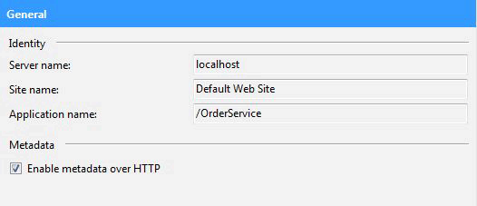
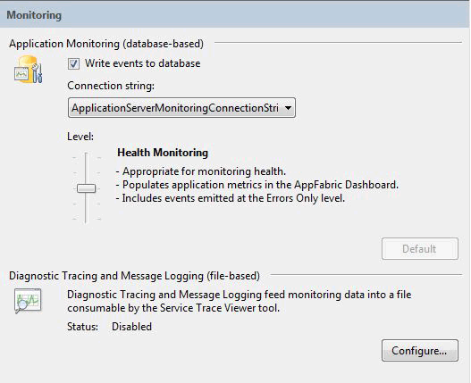
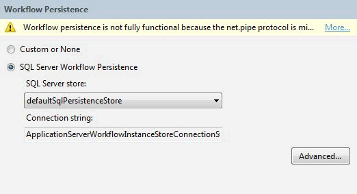
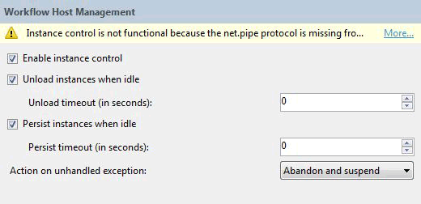
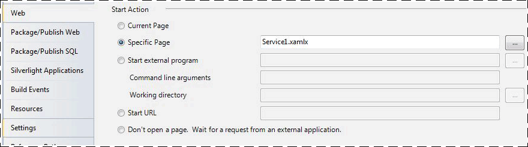
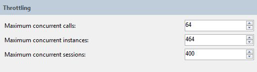
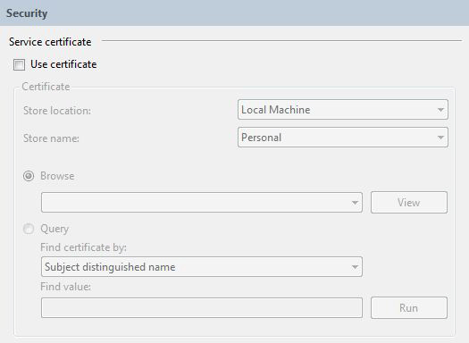
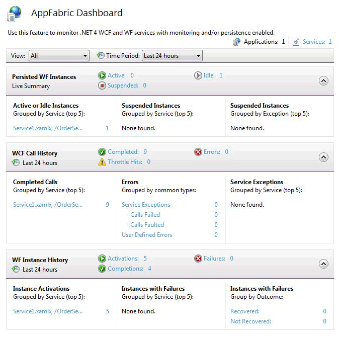
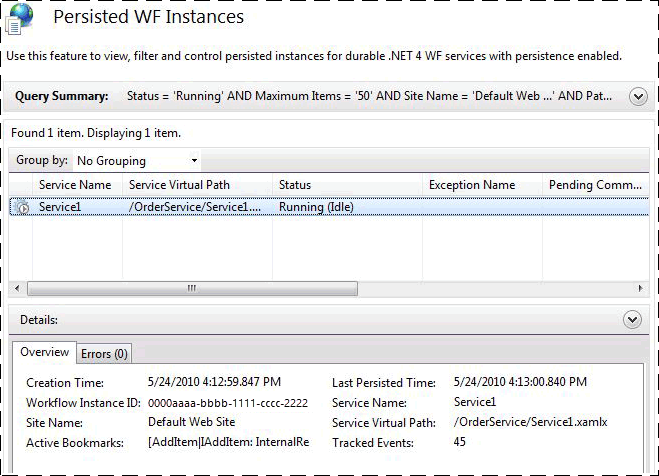

# How to: Host a Workflow Service with Windows Server App Fabric
Hosting workflow services in App Fabric is similar to hosting under IIS/WAS. The only difference is the tools App Fabric provides for deploying, monitoring, and managing workflow services. This topic uses the workflow service created in the [Creating a Long-running Workflow Service](../../../../docs/framework/wcf/feature-details/creating-a-long-running-workflow-service.md). That topic will walk you through creating a workflow service. This topic will explain how to host the workflow service using App Fabric. For more information about Windows Server App Fabric, see [Windows Server App Fabric Documentation](https://go.microsoft.com/fwlink/?LinkID=193037&clcid=0x409). Before completing the steps below make sure you have Windows Server App Fabric installed.  To do this open up Internet Information Services (inetmgr.exe), click your server name in the **Connections** view, click Sites, and click **Default Web Site**. In the right-hand side of the screen you should see a section called **App Fabric**. If you don’t see this section (it will be on the top of the right-hand pane) you do not have App Fabric installed. For more information about installing Windows Server App Fabric see [Installing Windows Server App Fabric](https://go.microsoft.com/fwlink/?LinkId=193136).  
  
### Creating a Simple Workflow Service  
  
1. Open Visual Studio 2012 and load the OrderProcessing solution you created in the [Creating a Long-running Workflow Service](../../../../docs/framework/wcf/feature-details/creating-a-long-running-workflow-service.md) topic.  
  
2. Right click the **OrderService** project and select **Properties** and select the **Web** tab.  
  
3. In the **Start Action** section of the property page select **Specific Page** and type Service1.xamlx in the edit box.  
  
4. In the **Servers** section of the property page select **Use Local IIS Web Server** and type in the following URL: `http://localhost/OrderService`.  
  
5. Click the **Create Virtual Directory** button. This will create a new virtual directory and set up the project to copy the needed files to the virtual directory when the project is built.  Alternatively you could manually copy the .xamlx, the web.config, and any needed DLLs to the virtual directory.  
  
### Configuring a Workflow Service Hosted in Windows Server App Fabric  
  
1. Open Internet Information Services Manager (inetmgr.exe).  
  
2. Navigate to the OrderService virtual directory in the **Connections** pane.  
  
3. Right click OrderService and select **Manage WCF and WF Services**, **Configure…**. The **Configure WCF and WF for Application** dialog box is displayed.  
  
4. Select the **General** tab to display general information about the application as shown in the following screenshot.  
  
       
  
5. Select the **Monitoring** tab. This shows various monitoring settings as shown in the following screenshot.  
  
       
  
     For more information about configuring workflow service monitoring in App Fabric see [Configuring monitoring with App Fabric](https://go.microsoft.com/fwlink/?LinkId=193153).  
  
6. Select the **Workflow Persistence** tab. This allows you to configure your application to use App Fabric’s default persistence provider as shown in the following screenshot.  
  
       
  
     For more information about configuring workflow persistence in Windows Server App Fabric see [Configuring Workflow Persistence in App Fabric](https://go.microsoft.com/fwlink/?LinkId=193148).  
  
7. Select the **Workflow Host Management** tab. This allows you to specify when idle workflow service instances should be unloaded and persisted as shown in the following screenshot.  
  
       
  
     For more information about workflow host management configuration see [Configuring Workflow Host Management in App Fabric](https://go.microsoft.com/fwlink/?LinkId=193151).  
  
8. Select the **Auto-Start** tab. This allows you to specify auto-start settings for the workflow services in the application as shown in the following screenshot.  
  
       
  
     For more information about configuring Auto-Start see [Configuring Auto-Start with App Fabric](https://go.microsoft.com/fwlink/?LinkId=193150).  
  
9. Select the **Throttling** tab. This allows you to configure throttling settings for the workflow service as shown in the following screenshot.  
  
       
  
     For more information about configuring throttling see [Configuring Throttling with App Fabric](https://go.microsoft.com/fwlink/?LinkId=193149).  
  
10. Select the **Security** tab. This allows you to configure security settings for the application as shown in the following screenshot.  
  
       
  
     For more information about configuring security with Windows Server App Fabric see [Configuring Security with App Fabric](https://go.microsoft.com/fwlink/?LinkId=193152).  
  
### Using Windows Server App Fabric  
  
1. Build the solution to copy the necessary files to the virtual directory.  
  
2. Right click the OrderClient project and select **Debug**, **Start New Instance** to launch the client application.  
  
3. The client will run and Visual Studio will display an **Attach Security Warning** dialog box, click the **Don’t Attach** button. This tells Visual Studio to not attach to the IIS process for debugging.  
  
4. The client application will immediately call the Workflow service and then wait. The workflow service will go idle and be persisted. You can verify this by starting Internet Information Services (inetmgr.exe), navigating to the OrderService in the Connections pane and selecting it. Next, click the App Fabric Dashboard icon in the right-hand pane. Under Persisted WF Instances you will see there is one persisted workflow service instance as shown in the following screenshot.  
  
       
  
     The **WF Instance History** lists information about the workflow service such as the number of workflow service activations, the number of workflow service instance completions, and the number of workflow instances with failures. Under Active or Idle instances a link will be displayed, clicking on the link will display more information about the idle workflow instances as shown in the following screenshot.  
  
       
  
     For more information about Windows Server App Fabric features and how to use them see [Windows Server App Fabric Hosting Features](https://go.microsoft.com/fwlink/?LinkID=193143&clcid=0x409)  
  
## See also

- [Creating a Long-running Workflow Service](../../../../docs/framework/wcf/feature-details/creating-a-long-running-workflow-service.md)
- [Windows Server App Fabric Hosting Features](https://go.microsoft.com/fwlink/?LinkId=193143)
- [Installing Windows Server App Fabric](https://go.microsoft.com/fwlink/?LinkId=193136)
- [Windows Server App Fabric Documentation](https://go.microsoft.com/fwlink/?LinkID=193037&clcid=0x409)
