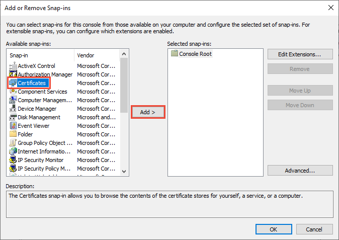
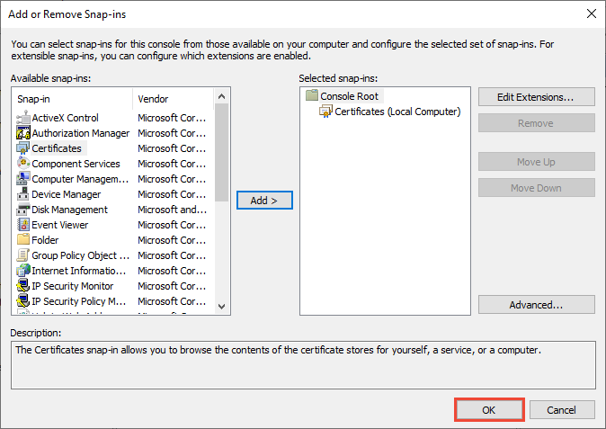

# How to: View certificates with the MMC snap-in

When you create a secure client or service, you can use a [certificate](working-with-certificates.md) as the credential. For example, a common type of credential is the X.509 certificate, which you create with the <xref:System.ServiceModel.Security.X509CertificateInitiatorClientCredential.SetCertificate%2A?displayProperty=nameWithType> method.

There are three different types of certificate stores that you can examine with the Microsoft Management Console (MMC) on Windows systems:

- Local computer: The store is local to the device and global to all users on the device.

- Current user: The store is local to the current user account on the device.

- Service account: The store is local to a particular service on the device.

## View certificates in the MMC snap-in

The following procedure demonstrates how to examine the stores on your local device to find an appropriate certificate:
  
1. Select **Run** from the **Start** menu, and then enter *mmc*.

    The MMC appears.
  
2. From the **File** menu, select **Add/Remove Snap In**.

    The **Add or Remove Snap-ins** window appears.
  
3. From the **Available snap-ins** list, choose **Certificates**, then select **Add**.  

    
  
4. In the **Certificates snap-in** window, select **Computer account**, and then select **Next**.
  
    Optionally, you can select **My user account** for the current user or **Service account** for a particular service.

    > [!NOTE]
    > If you're not an administrator for your device, you can manage certificates only for your user account.
  
5. In the **Select Computer** window, leave **Local computer** selected, and then select **Finish**.  
  
6. In the **Add or Remove Snap-in** window, select **OK**.  
  
    

7. Optional: From the **File** menu, select **Save** or **Save As** to save the MMC console file for later use.  

8. To view your certificates in the MMC snap-in, select **Console Root** in the left pane, then expand **Certificates (Local Computer)**.

    A list of directories for each type of certificate appears. From each certificate directory, you can view, export, import, and delete its certificates.

## View certificates with the Certificate Manager tool

You can also view, export, import, and delete certificates by using the Certificate Manager tool.

### To view certificates for the local device

1. Select **Run** from the **Start** menu, and then enter *certlm.msc*.

    The Certificate Manager tool for the local device appears.
  
2. To view your certificates, under **Certificates - Local Computer** in the left pane, expand the directory for the type of certificate you want to view.

### To view certificates for the current user

1. Select **Run** from the **Start** menu, and then enter *certmgr.msc*.

    The Certificate Manager tool for the current user appears.
  
2. To view your certificates, under **Certificates - Current User** in the left pane, expand the directory for the type of certificate you want to view.

## See also

- [Working with certificates](working-with-certificates.md)
- [How to: Create temporary certificates for use during development](how-to-create-temporary-certificates-for-use-during-development.md)
- [How to: Retrieve the thumbprint of a certificate](how-to-retrieve-the-thumbprint-of-a-certificate.md)
