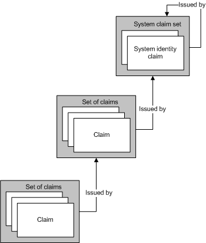
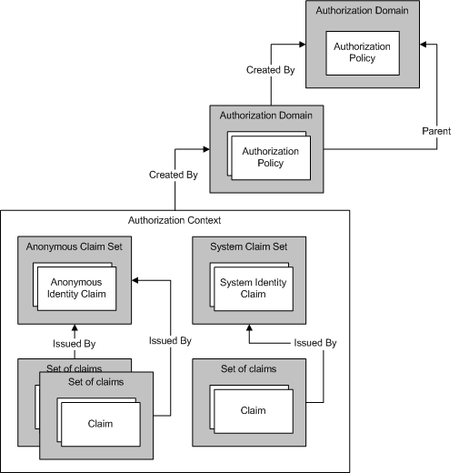

# Managing Claims and Authorization with the Identity Model
Authorization is the process of determining which entities have permission to change, view, or otherwise access a computer resource. For example, in a business, only managers may be allowed to access the files of their employees. [!INCLUDE[indigo1](../../../../includes/indigo1-md.md)] supports two mechanisms for performing authorization processing. The first mechanism enables you to control authorization using existing common language runtime (CLR) constructs. The second is a claims-based model known as the *Identity Model*. [!INCLUDE[indigo2](../../../../includes/indigo2-md.md)] uses the Identity Model to create claims from incoming messages; Identity Model classes can be extended to support new claim types for custom authorization schemes. This topic presents an overview of the major programming concepts of the Identity Model feature, as well as a listing of the most important classes the feature uses.  
  
## Identity Model Scenarios  
 The following scenarios represent Identity Model use.  
  
### Scenario 1: Supporting Identity, Role, and Group Claims  
 Users send messages to a Web service. The access control requirements of the Web service use identity, roles, or groups. The message sender is mapped to a set of roles or groups. Role or group information is used to perform access checks.  
  
### Scenario 2: Supporting Rich Claims  
 Users send messages to a Web service. The access control requirements of the Web service require a richer model than identity, roles, or groups. The Web service determines whether a given user has access to a particular protected resource using the rich claims-based model. For example, one user may be able to read particular information, such as salary information, that other users do not have access to.  
  
### Scenario 3: Mapping Disparate Claims  
 A user sends a message to a Web service. The user may specify their credentials in a number of different ways: X.509 certificate, user name token, or Kerberos token. The Web service is required to perform access control checks in the same way, regardless of the user credential type. If additional credential types are supported over time, the system should evolve accordingly.  
  
### Scenario 4: Determining Access to Multiple Resources  
 A Web service attempts to access multiple resources. The service determines which protected resources a given user has access to by comparing the claims associated with the user with the claims required to access the resource.  
  
## Identity Model Terms  
 The following list defines key terms used to describe Identity Model concepts.  
  
 Authorization policy  
 A set of rules for mapping a set of input claims to a set of output claims. Evaluating authorization policy results in claim sets being added to an evaluation context and subsequently an authorization context.  
  
 Authorization context  
 A set of claim sets and zero or more properties. The result of evaluating one or more authorization policies.  
  
 Claim  
 A combination of a claim type, right, and a value.  
  
 Claim set  
 A set of claims issued by a particular issuer.  
  
 Claim type  
 A kind of claim. Claims defined by the Identity Model API are properties of the <xref:System.IdentityModel.Claims.Claim.ClaimType%2A> class. Examples of system-provided claim types are <xref:System.IdentityModel.Claims.ClaimTypes.Dns%2A>, <xref:System.IdentityModel.Claims.ClaimTypes.Email%2A>, <xref:System.IdentityModel.Claims.ClaimTypes.Hash%2A>, <xref:System.IdentityModel.Claims.ClaimTypes.Name%2A>, <xref:System.IdentityModel.Claims.ClaimTypes.Rsa%2A>, <xref:System.IdentityModel.Claims.ClaimTypes.Sid%2A>, <xref:System.IdentityModel.Claims.ClaimTypes.Spn%2A>, <xref:System.IdentityModel.Claims.ClaimTypes.System%2A>, <xref:System.IdentityModel.Claims.ClaimTypes.Thumbprint%2A>, <xref:System.IdentityModel.Claims.ClaimTypes.Uri%2A>, and <xref:System.IdentityModel.Claims.ClaimTypes.X500DistinguishedName%2A>.  
  
 Evaluation context  
 A context in which an authorization policy is evaluated. Contains properties and claim sets. Becomes the basis of an authorization context once evaluation is complete.  
  
 Identity claim  
 A claim whose right is identity.  
  
 Issuer  
 A claim set that contains at least one identity claim and is considered to have issued another claim set.  
  
 Properties  
 A set of information associated with an evaluation context or authorization context.  
  
 Protected resource  
 Something in the system that can only be used, accessed, or otherwise manipulated if certain requirements are first met.  
  
 Right  
 A capability over a resource. Rights defined by the Identity Model API are properties of the <xref:System.IdentityModel.Claims.Rights> class. Examples of system-provided rights are <xref:System.IdentityModel.Claims.Rights.Identity%2A> and <xref:System.IdentityModel.Claims.Rights.PossessProperty%2A>.  
  
 Value  
 Something over which a right is claimed.  
  
## Claims  
 The Identity Model is a claims-based system. Claims describe the capabilities associated with some entity in the system, often a user of that system. The set of claims associated with a given entity can be thought of as a key. The particular claims define the shape of that key, similar to a physical key used to open a lock in a door. Claims are used to gain access to resources. Access to a given protected resource is determined by comparing the claims needed to access that resource with the claims associated with the entity attempting access.  
  
 A claim is the expression of a right with respect to a particular value. A right could be something like "Read", "Write", or "Execute." A value could be a database, a file, a mailbox, or a property. Claims also have a claim type. The combination of claim type and right provides the mechanism for specifying capabilities with respect to the value. For example, a claim of type "File", with right "Read" over the value "Biography.doc", indicates that the entity with which such a claim is associated has read access to the file Biography.doc. A claim of type "Name", with right "PossessProperty" over the value "Martin", indicates that the entity with which such a claim is associated possesses a Name property with the value "Martin".  
  
 Although various claim types and rights are defined as part of the Identity Model, the system is extensible, allowing the various systems, building on top of the Identity Model infrastructure, to define additional claim types and rights as required.  
  
### Identity Claims  
 One particular right is that of identity. Claims that possess this right make a statement about the identity of the entity. For example, a claim of type "user principal name" (UPN) with a value of "someone@example.com" and a right of Identity indicates a particular identity in a particular domain.  
  
#### System Identity Claim  
 The Identity Model defines one identity claim: System. The System identity claim indicates that an entity is the current application or system.  
  
### Sets of Claims  
 The model of claims that represent identity is important because claims are always issued by some entity in the system, even if that entity is ultimately some concept of "self". Claims are grouped together as a set and each set has an issuer. An issuer is just a set of claims. Such a recursive relationship must eventually end and any claim set can be its own issuer.  
  
 The following figure shows an example of three sets of claims where one set of claims has, as its issuer, another set of claims, which in turn has the System claim set as its issuer. Therefore, sets of claims form a hierarchy that may be arbitrarily deep.  
  
   
  
 Multiple sets of claims may have the same issuing claim set, as illustrated in the following figure.  
  
   
  
 With the exception of a claim set that is its own issuer, the Identity Model does not provide any support for claim sets to form a loop. Thus a situation where claim set A is issued by claim set B, which is itself issued by claim set A, can never arise. Also, the Identity Model does not provide any support for claim sets to have multiple issuers. If two or more issuers must issue a given set of claims, then you must use multiple claim sets, each containing the same claims, but having different issuers.  
  
### The Origin of Claims  
 Claims can come from a variety of sources. One common source of claims is credentials presented by a user, for example as part of a message sent to a Web service. The system validates such claims, and they become part of a set of claims associated with the user. Other system components may also be sources of claims, including, but not limited to, the operating system, the network stack, the run-time environment, or the application. In addition, remote services may also be a source of claims.  
  
### Authorization Policies  
 In the Identity Model, claims are generated as part of the process of evaluating the authorization policy. An authorization policy examines the (possibly empty) set of existing claims and may choose to add additional claims based on the claims already present and additional information at its disposal. This provides the basis of mapping between claims. The presence or absence of claims in the system influences the behavior of an authorization policy with respect to whether it adds additional claims.  
  
 For example, the authorization policy has access to a database that includes the birthdates of the various entities using the system. The authorization policy uses that information to add an "Over18" claim to the context. Note that this Over18 claim does not disclose any information about the entity other than the fact that it is over 18 years of age. Note that interpretation of the 'Over18' claim depends on understanding the semantics of that claim. The authorization policy that added the claim understands those semantics at some level. Code that subsequently examines the claims that result from policy evaluation also be informed of those semantics.  
  
 A given authorization policy may require that it be evaluated multiple times because, as other authorization policies add claims, that authorization policy might add yet more claims. Identity Model is designed to continue evaluation until no more claims are added to the context by any of the authorization policies in force. This continued evaluation of authorization policies prevents the requirement to enforce any specific evaluation order with respect to authorization policies; they can be evaluated in any order. For example, if policy X only adds Claim Z if policy A has added Claim B, then if X is evaluated first, it initially does not add the Claim Z. Subsequently, A is evaluated and adds Claim B. X is then evaluated a second time, and this time it adds Claim Z.  
  
 A given system may have many authorization policies in force.  
  
### A Key-Making Machine  
 Evaluating a group of associated authorization policies is like using a machine that makes keys. The authorization policies are each evaluated and sets of claims are generated, building up the shape of the key. Once the shape of the key is completed, it can be used to try to open some locks. The shape of the key is stored in an "authorization context," which is created by an authorization manager.  
  
### Authorization Context  
 An authorization manager evaluates the various authorization policies as described, and the result is an authorization context (a set of claim sets and some associated properties). The authorization context can be examined to determine what claims are present in that context, the relationships between those various claims (for example, the issuing claim set), and ultimately compare them against some requirements they must meet to access a resource.  
  
### Locks  
 If an authorization context (a set of claims) is a key, then the requirements that must be satisfied to grant access to a particular protected resource constitute the lock that the key must fit. Identity Model does not formalize how such requirements are expressed but they do, given the claim-based nature of the system, involve comparing the claims in the authorization context against some set of required claims.  
  
### A Recap  
 Identity Model is based around the concept of claims. Claims are grouped into sets and aggregated in an authorization context. An authorization context contains a set of claims and is the result of evaluating one or more authorization policies associated with an authorization manager. These claim sets can be examined to determine if access requirements have been met. The following figure shows the relationships between these various Identity Model concepts.  
  
   
  
## WCF and Identity Model  
 [!INCLUDE[indigo2](../../../../includes/indigo2-md.md)] uses the Identity Model infrastructure as the basis for performing authorization. In [!INCLUDE[indigo2](../../../../includes/indigo2-md.md)], the <xref:System.ServiceModel.Description.ServiceAuthorizationBehavior> class allows you to specify *authorization* policies as part of a service. Such authorization policies are known as *external authorization policies*, and they can perform claim processing based on local policy or by interaction with a remote service. The authorization manager, represented by the <xref:System.ServiceModel.ServiceAuthorizationManager> class evaluates external authorization policies together with authorization policies that recognize the various credential types (tokens) and populates what is called an *authorization context* with the claims appropriate to an incoming message. The authorization context is represented by the <xref:System.IdentityModel.Policy.AuthorizationContext> class.  
  
## Identity Model Programming  
 The following table describes the object model used to program Identity Model extensions. These classes all exist in either the <xref:System.IdentityModel.Policy> or the <xref:System.IdentityModel.Claims> namespaces.  
  
|Class|Description|  
|-----------|-----------------|  
|Authorization Component|An Identity Model class that implements the <xref:System.IdentityModel.Policy.IAuthorizationComponent> interface.|  
|<xref:System.IdentityModel.Policy.IAuthorizationComponent>|An interface that provides a single read-only string property: Id. The value of this property is unique for each instance in the system that implements this interface.|  
|<xref:System.IdentityModel.Policy.AuthorizationContext>|An *authorization component* that contains a set of `ClaimSet` instances with zero or more properties; the result of evaluating one or more Authorization Policies.|  
|<xref:System.IdentityModel.Claims.Claim>|A combination of a claim type, right, and value. The right and value parts are constrained by the claim type.|  
|<xref:System.IdentityModel.Claims.ClaimSet>|An abstract base class. A collection of `Claim` instances.|  
|<xref:System.IdentityModel.Claims.DefaultClaimSet>|A sealed class. An implementation of the `ClaimSet` class.|  
|<xref:System.IdentityModel.Policy.EvaluationContext>|An abstract base class. Passed to an authorization policy during policy evaluation.|  
|<xref:System.IdentityModel.Policy.IAuthorizationPolicy>|An interface derived from `IAuthorizationComponent` and implemented by authorization policy classes.|  
|<xref:System.IdentityModel.Claims.Rights>|A static class that contains predefined right values.|  
  
 The following classes are also used for Identity Model programming, but are not found in the <xref:System.IdentityModel.Policy> or <xref:System.IdentityModel.Claims> namespaces.  
  
|Class|Description|  
|-----------|-----------------|  
|<xref:System.ServiceModel.ServiceAuthorizationManager>|A class that provides a method— <xref:System.ServiceModel.ServiceAuthorizationManager.CheckAccessCore%2A>—to perform claim-based authorization checks for each operation in a service. You must derive from the class and override the method.|  
|<xref:System.ServiceModel.Description.ServiceAuthorizationBehavior>|A sealed class that provides various properties related to the behavior of a service as it pertains to authorization.|  
|<xref:System.ServiceModel.ServiceSecurityContext>|A class that provides security context, including authorization context, for the currently running (or about to be run) operation. An instance of this class is part of the <xref:System.ServiceModel.OperationContext>.|  
  
### Significant Members  
 The following members are commonly used to create new claim types.  
  
|Member|Description|  
|------------|-----------------|  
|<xref:System.ServiceModel.ServiceAuthorizationManager.CheckAccessCore%2A>|Derived classes implement this method to perform claim-based access checks prior to running operations in a service. Any and all information in the supplied <xref:System.ServiceModel.OperationContext>, or elsewhere, can be examined when making the access check decision. If <xref:System.ServiceModel.ServiceAuthorizationManager.CheckAccessCore%2A> returns `true`, then access is granted and the operation is allowed to run. If `CheckAccessCore` returns `false`, then access is denied and the operation does not run. For an example, see [How to: Create a Custom Authorization Manager for a Service](../../../../docs/framework/wcf/extending/how-to-create-a-custom-authorization-manager-for-a-service.md).|  
|<xref:System.ServiceModel.Description.ServiceAuthorizationBehavior.ServiceAuthorizationManager%2A>|Returns the <xref:System.ServiceModel.ServiceAuthorizationManager> for the service. The <xref:System.ServiceModel.ServiceAuthorizationManager> is responsible for making authorization decisions.|  
|<xref:System.ServiceModel.Description.ServiceAuthorizationBehavior.ExternalAuthorizationPolicies%2A>|The collection of custom authorization policies specified for the service. These policies are evaluated in addition to those policies associated with credentials in incoming messages.|  
  
## See Also  
 <xref:System.IdentityModel.Policy.AuthorizationContext>  
 <xref:System.IdentityModel.Claims.Claim>  
 <xref:System.IdentityModel.Policy.EvaluationContext>  
 <xref:System.IdentityModel.Policy.IAuthorizationComponent>  
 <xref:System.IdentityModel.Policy.IAuthorizationPolicy>  
 <xref:System.IdentityModel.Claims.Rights>  
 <xref:System.IdentityModel.Claims>  
 <xref:System.IdentityModel.Policy>  
 <xref:System.IdentityModel.Tokens>  
 <xref:System.IdentityModel.Selectors>  
 [Claims and Tokens](../../../../docs/framework/wcf/feature-details/claims-and-tokens.md)  
 [Claims and Denying Access to Resources](../../../../docs/framework/wcf/feature-details/claims-and-denying-access-to-resources.md)  
 [Claim Creation and Resource Values](../../../../docs/framework/wcf/feature-details/claim-creation-and-resource-values.md)  
 [How to: Create a Custom Claim](../../../../docs/framework/wcf/extending/how-to-create-a-custom-claim.md)  
 [How to: Compare Claims](../../../../docs/framework/wcf/extending/how-to-compare-claims.md)  
 [How to: Create a Custom Authorization Policy](../../../../docs/framework/wcf/extending/how-to-create-a-custom-authorization-policy.md)  
 [How to: Create a Custom Authorization Manager for a Service](../../../../docs/framework/wcf/extending/how-to-create-a-custom-authorization-manager-for-a-service.md)  
 [Security Overview](../../../../docs/framework/wcf/feature-details/security-overview.md)  
 [Authorization](../../../../docs/framework/wcf/feature-details/authorization-in-wcf.md)
