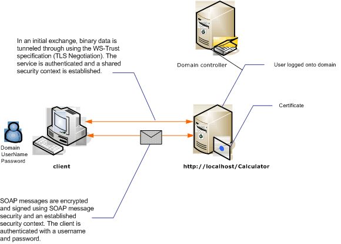

# Message Security with a User Name Client
The following illustration shows an [!INCLUDE[indigo1](../../../../includes/indigo1-md.md)] service and client secured using message-level security. The service is authenticated with an X.509 certificate. The client authenticates using a user name and password.  
  
 For a sample application, see [Message Security User Name](../../../../docs/framework/wcf/samples/message-security-user-name.md).  
  
   
  
|Characteristic|Description|  
|--------------------|-----------------|  
|Security Mode|Message|  
|Interoperability|[!INCLUDE[indigo1](../../../../includes/indigo1-md.md)] only|  
|Authentication (Server)|Initial negotiation requires server authentication|  
|Authentication (Client)|User name/password|  
|Integrity|Yes, using shared security context|  
|Confidentiality|Yes, using shared security context|  
|Transport|HTTP|  
|Binding|<xref:System.ServiceModel.WSHttpBinding>|  
  
## Service  
 The following code and configuration are meant to run independently. Do one of the following:  
  
-   Create a stand-alone service using the code with no configuration.  
  
-   Create a service using the supplied configuration, but do not define any endpoints.  
  
### Code  
 The following code shows how to create a service endpoint that uses message security.  
  
 [!code-csharp[C_SecurityScenarios#9](../../../../samples/snippets/csharp/VS_Snippets_CFX/c_securityscenarios/cs/source.cs#9)]
 [!code-vb[C_SecurityScenarios#9](../../../../samples/snippets/visualbasic/VS_Snippets_CFX/c_securityscenarios/vb/source.vb#9)]  
  
### Configuration  
 The following configuration can be used instead of the code:  
  
```xml  
<?xml version="1.0" encoding="utf-8"?>  
<configuration>  
  <system.serviceModel>  
    <behaviors>  
      <serviceBehaviors>  
        <behavior name="ServiceCredentialsBehavior">  
          <serviceCredentials>  
            <serviceCertificate findValue="Contoso.com"   
                                storeLocation="LocalMachine"  
                                storeName="My"     
                                x509FindType="FindBySubjectName" />  
          </serviceCredentials>  
        </behavior>  
      </serviceBehaviors>  
    </behaviors>  
    <services>  
      <service behaviorConfiguration="ServiceCredentialsBehavior"  
               name="ServiceModel.Calculator">  
        <endpoint address="http://localhost/Calculator"  
                  binding="wsHttpBinding"  
                  bindingConfiguration="MessageAndUserName"  
                  name="SecuredByTransportEndpoint"  
                  contract="ServiceModel.ICalculator" />  
      </service>  
    </services>  
    <bindings>  
      <wsHttpBinding>  
        <binding name="MessageAndUserName">  
          <security mode="Message">              
            <message clientCredentialType="UserName" />  
          </security>  
        </binding>  
      </wsHttpBinding>  
    </bindings>  
    <client />  
  </system.serviceModel>  
</configuration>  
```  
  
## Client  
  
### Code  
 The following code creates the client. The binding is to message mode security, and the client credential type is set to `UserName`. The user name and password can only be specified using code (it is not configurable). The code to return the user name and password is not shown here because it must be done at the application level. For example, use a Windows Forms dialog box to query the user for the data.  
  
 [!code-csharp[C_SecurityScenarios#16](../../../../samples/snippets/csharp/VS_Snippets_CFX/c_securityscenarios/cs/source.cs#16)]
 [!code-vb[C_SecurityScenarios#16](../../../../samples/snippets/visualbasic/VS_Snippets_CFX/c_securityscenarios/vb/source.vb#16)]  
  
### Configuration  
 The following code configures the client. The binding is to message mode security, and the client credential type is set to `UserName`. The user name and password can only be specified using code (it is not configurable).  
  
```xml  
<?xml version="1.0" encoding="utf-8"?>  
<configuration>  
  <system.serviceModel>  
    <bindings>  
      <wsHttpBinding>  
        <binding name="WSHttpBinding_ICalculator" >  
          <security mode="Message">  
            <message clientCredentialType="UserName" />  
          </security>  
        </binding>  
      </wsHttpBinding>  
    </bindings>  
    <client>  
      <endpoint address="http://machineName/Calculator"   
                binding="wsHttpBinding"  
                bindingConfiguration="WSHttpBinding_ICalculator"   
                contract="ICalculator"  
                name="WSHttpBinding_ICalculator">  
        <identity>  
          <dns value ="Contoso.com" />  
        </identity>  
      </endpoint>  
    </client>  
  </system.serviceModel>  
</configuration>  
```  
  
## See Also  
 [Security Overview](../../../../docs/framework/wcf/feature-details/security-overview.md)  
 [Message Security User Name](../../../../docs/framework/wcf/samples/message-security-user-name.md)  
 [Service Identity and Authentication](../../../../docs/framework/wcf/feature-details/service-identity-and-authentication.md)  
 [\<identity>](../../../../docs/framework/configure-apps/file-schema/wcf/identity.md)  
 [Security Model for Windows Server App Fabric](http://go.microsoft.com/fwlink/?LinkID=201279&clcid=0x409)
