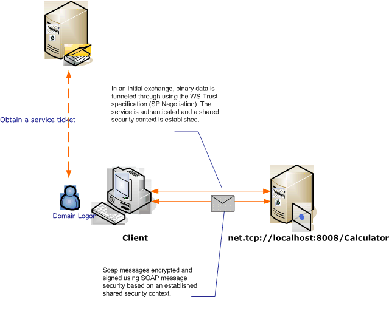

# Message Security with a Windows Client
This scenario shows a [!INCLUDE[indigo1](../../../../includes/indigo1-md.md)] client and server secured by message security mode. The client and service are authenticated using Windows credentials.  
  
   
  
|Characteristic|Description|  
|--------------------|-----------------|  
|Security Mode|Message|  
|Interoperability|[!INCLUDE[indigo2](../../../../includes/indigo2-md.md)] Only|  
|Authentication (Server)|Mutual authentication of the server and client|  
|Authentication (Client)|Mutual authentication of the server and client|  
|Integrity|Yes, using shared security context|  
|Confidentiality|Yes, using shared security context|  
|Transport|NET.TCP|  
|Binding|<xref:System.ServiceModel.NetTcpBinding>|  
  
## Service  
 The following code and configuration are meant to run independently. Do one of the following:  
  
-   Create a stand-alone service using the code with no configuration.  
  
-   Create a service using the supplied configuration, but do not define any endpoints.  
  
### Code  
 The following code shows how to create a service endpoint that uses message security to establish a secure context with a Windows machine.  
  
 [!code-csharp[C_SecurityScenarios#11](../../../../samples/snippets/csharp/VS_Snippets_CFX/c_securityscenarios/cs/source.cs#11)]
 [!code-vb[C_SecurityScenarios#11](../../../../samples/snippets/visualbasic/VS_Snippets_CFX/c_securityscenarios/vb/source.vb#11)]  
  
### Configuration  
 The following configuration can be used instead of the code to set up the service:  
  
```xml  
<?xml version="1.0" encoding="utf-8"?>  
<configuration>  
  <system.serviceModel>  
    <services>  
      <service behaviorConfiguration=""  
               name="ServiceModel.Calculator">  
        <endpoint address="net.tcp://localhost:8008/Calculator"  
                  binding="netTcpBinding"  
                  bindingConfiguration="Windows"  
                  name="WindowsOverMessage"  
                  contract="ServiceModel.ICalculator" />  
      </service>  
    </services>  
    <bindings>  
      <netTcpBinding>  
        <binding name="Windows">  
          <security mode="Message">  
            <message clientCredentialType="Windows" />  
          </security>  
        </binding>  
      </netTcpBinding>  
    </bindings>  
    <client />  
  </system.serviceModel>  
</configuration>  
```  
  
## Client  
 The following code and configuration are meant to run independently. Do one of the following:  
  
-   Create a stand-alone client using the code (and client code).  
  
-   Create a client that does not define any endpoint addresses. Instead, use the client constructor that takes the configuration name as an argument. For example:  
  
     [!code-csharp[C_SecurityScenarios#0](../../../../samples/snippets/csharp/VS_Snippets_CFX/c_securityscenarios/cs/source.cs#0)]
     [!code-vb[C_SecurityScenarios#0](../../../../samples/snippets/visualbasic/VS_Snippets_CFX/c_securityscenarios/vb/source.vb#0)]  
  
### Code  
 The following code creates a client. The binding is to Message mode security, and the client credential type is set to `Windows`.  
  
 [!code-csharp[C_SecurityScenarios#18](../../../../samples/snippets/csharp/VS_Snippets_CFX/c_securityscenarios/cs/source.cs#18)]
 [!code-vb[C_SecurityScenarios#18](../../../../samples/snippets/visualbasic/VS_Snippets_CFX/c_securityscenarios/vb/source.vb#18)]  
  
### Configuration  
 The following configuration is used to set the client properties.  
  
```xml  
<?xml version="1.0" encoding="utf-8"?>  
<configuration>  
  <system.serviceModel>  
    <bindings>  
      <netTcpBinding>  
        <binding name="NetTcpBinding_ICalculator" >  
         <security mode="Message">  
            <message clientCredentialType="Windows" />  
          </security>  
        </binding>  
      </netTcpBinding>  
    </bindings>  
    <client>  
      <endpoint address="net.tcp://machineName:8008/Calculator"   
                binding="netTcpBinding"  
                bindingConfiguration="NetTcpBinding_ICalculator"  
                contract="ICalculator"  
                name="NetTcpBinding_ICalculator">          
      </endpoint>  
    </client>  
  </system.serviceModel>  
</configuration>  
```  
  
## See Also  
 [Security Overview](../../../../docs/framework/wcf/feature-details/security-overview.md)  
 [Security Model for Windows Server App Fabric](http://go.microsoft.com/fwlink/?LinkID=201279&clcid=0x409)
