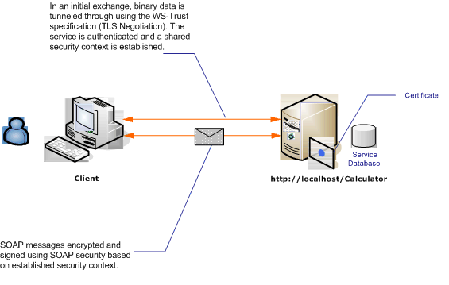

# Message Security with an Anonymous Client
The following scenario shows a client and service secured by [!INCLUDE[indigo1](../../../../includes/indigo1-md.md)] message security. A design goal is to use message security rather than transport security, so that in the future it can support a richer claims-based model. [!INCLUDE[crabout](../../../../includes/crabout-md.md)] using rich claims for authorization, see [Managing Claims and Authorization with the Identity Model](../../../../docs/framework/wcf/feature-details/managing-claims-and-authorization-with-the-identity-model.md).  
  
 For a sample application, see [Message Security Anonymous](../../../../docs/framework/wcf/samples/message-security-anonymous.md).  
  
   
  
|Characteristic|Description|  
|--------------------|-----------------|  
|Security Mode|Message|  
|Interoperability|[!INCLUDE[indigo2](../../../../includes/indigo2-md.md)] only|  
|Authentication (Server)|Initial negotiation requires server authentication, but not client authentication|  
|Authentication (Client)|None|  
|Integrity|Yes, using shared security context|  
|Confidentiality|Yes, using shared security context|  
|Transport|HTTP|  
  
## Service  
 The following code and configuration are meant to run independently. Do one of the following:  
  
-   Create a stand-alone service using the code with no configuration.  
  
-   Create a service using the supplied configuration, but do not define any endpoints.  
  
### Code  
 The following code shows how to create a service endpoint that uses message security.  
  
 [!code-csharp[C_SecurityScenarios#8](../../../../samples/snippets/csharp/VS_Snippets_CFX/c_securityscenarios/cs/source.cs#8)]
 [!code-vb[C_SecurityScenarios#8](../../../../samples/snippets/visualbasic/VS_Snippets_CFX/c_securityscenarios/vb/source.vb#8)]  
  
### Configuration  
 The following configuration can be used instead of the code. The service behavior element is used to specify a certificate that is used to authenticate the service to the client. The service element must specify the behavior using the `behaviorConfiguration` attribute. The binding element specifies that the client credential type is `None`, allowing anonymous clients to use the service.  
  
```xml  
<?xml version="1.0" encoding="utf-8"?>  
<configuration>  
  <system.serviceModel>  
    <behaviors>  
      <serviceBehaviors>  
        <behavior name="ServiceCredentialsBehavior">  
          <serviceCredentials>  
            <serviceCertificate findValue="contoso.com"   
                                storeLocation="LocalMachine"  
                                storeName="My" />  
          </serviceCredentials>  
        </behavior>  
      </serviceBehaviors>  
    </behaviors>  
    <services>  
      <service behaviorConfiguration="ServiceCredentialsBehavior"   
               name="ServiceModel.Calculator">  
        <endpoint address="http://localhost/Calculator"   
                  binding="wsHttpBinding"  
                  bindingConfiguration="WSHttpBinding_ICalculator"   
                  name="CalculatorService"  
                  contract="ServiceModel.ICalculator" />  
      </service>  
    </services>  
    <bindings>  
      <wsHttpBinding>  
        <binding name="WSHttpBinding_ICalculator" >  
          <security mode="Message">  
            <message clientCredentialType="None" />  
          </security>  
        </binding>  
      </wsHttpBinding>  
    </bindings>  
    <client />  
  </system.serviceModel>  
</configuration>  
```  
  
## Client  
 The following code and configuration are meant to run independently. Do one of the following:  
  
-   Create a stand-alone client using the code (and client code).  
  
-   Create a client that does not define any endpoint addresses. Instead, use the client constructor that takes the configuration name as an argument. For example:  
  
     [!code-csharp[C_SecurityScenarios#0](../../../../samples/snippets/csharp/VS_Snippets_CFX/c_securityscenarios/cs/source.cs#0)]
     [!code-vb[C_SecurityScenarios#0](../../../../samples/snippets/visualbasic/VS_Snippets_CFX/c_securityscenarios/vb/source.vb#0)]  
  
### Code  
 The following code creates an instance of the client. The binding uses message mode security, and the client credential type is set to none.  
  
 [!code-csharp[C_SecurityScenarios#15](../../../../samples/snippets/csharp/VS_Snippets_CFX/c_securityscenarios/cs/source.cs#15)]
 [!code-vb[C_SecurityScenarios#15](../../../../samples/snippets/visualbasic/VS_Snippets_CFX/c_securityscenarios/vb/source.vb#15)]  
  
### Configuration  
 The following code configures the client.  
  
```xml  
<?xml version="1.0" encoding="utf-8"?>  
<configuration>  
  <system.serviceModel>  
    <bindings>  
      <wsHttpBinding>  
        <binding name="WSHttpBinding_ICalculator" >  
          <security mode="Message">  
            <message clientCredentialType="None" />  
          </security>  
        </binding>  
      </wsHttpBinding>  
    </bindings>  
    <client>  
      <endpoint address="http://machineName/Calculator"  
        binding="wsHttpBinding"  
        bindingConfiguration="WSHttpBinding_ICalculator"   
        contract="ICalculator"  
        name="WSHttpBinding_ICalculator">  
        <identity>  
          <dns value="contoso.com" />  
        </identity>  
      </endpoint>  
    </client>  
  </system.serviceModel>  
</configuration>  
```  
  
## See Also  
 [Security Overview](../../../../docs/framework/wcf/feature-details/security-overview.md)  
 [Distributed Application Security](../../../../docs/framework/wcf/feature-details/distributed-application-security.md)  
 [Message Security Anonymous](../../../../docs/framework/wcf/samples/message-security-anonymous.md)  
 [Service Identity and Authentication](../../../../docs/framework/wcf/feature-details/service-identity-and-authentication.md)  
 [Security Model for Windows Server App Fabric](http://go.microsoft.com/fwlink/?LinkID=201279&clcid=0x409)
