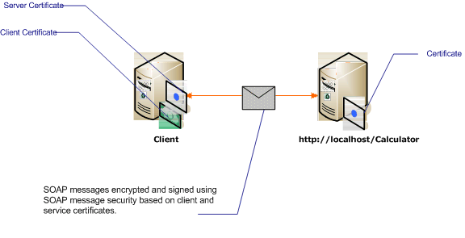

# Message Security with Mutual Certificates

The following scenario shows a Windows Communication Foundation (WCF) service and client secured using message security mode. The client and the service are authenticated with certificates.

 This scenario is interoperable because it uses WS-Security with the X.509 certificate token profile.

> [!NOTE]
> This scenario does not perform negotiation of the service certificate. The service certificate must be provided to the client in advance of any communication. The server certificate can be distributed with the application or provided in an out-of-band communication.

 

| Characteristic   | Description                                                                                |
|------------------|--------------------------------------------------------------------------------------------|
| Security Mode    | Message                                                                                    |
| Interoperability | Yes, with WS-Security and X.509 certificate token profile compatible clients and services. |
| Authentication   | Mutual authentication of the server and client.                                            |
| Integrity        | Yes                                                                                        |
| Confidentiality  | Yes                                                                                        |
| Transport        | HTTP                                                                                       |
| Binding          | <xref:System.ServiceModel.WSHttpBinding>                                                   |

## Service

 The following code and configuration are meant to run independently. Do one of the following:

- Create a stand-alone service using the code with no configuration.

- Create a service using the supplied configuration, but do not define any endpoints.

### Code

 The following code shows creates a service endpoint that uses message security. The service requires a certificate to authenticate itself.

 [!code-csharp[C_SecurityScenarios#13](../../../../samples/snippets/csharp/VS_Snippets_CFX/c_securityscenarios/cs/source.cs#13)]
 [!code-vb[C_SecurityScenarios#13](../../../../samples/snippets/visualbasic/VS_Snippets_CFX/c_securityscenarios/vb/source.vb#13)]

### Configuration

 The following configuration can be used instead of the code to create the same service.

```xml
<?xml version="1.0" encoding="utf-8"?>
<configuration>
  <system.serviceModel>
    <behaviors>
      <serviceBehaviors>
        <behavior name="serviceCredentialBehavior">
          <serviceCredentials>
            <serviceCertificate findValue="Contoso.com"
                                storeLocation="LocalMachine"
                                storeName="My"
                                x509FindType="FindBySubjectName" />
          </serviceCredentials>
        </behavior>
      </serviceBehaviors>
    </behaviors>
    <services>
      <service behaviorConfiguration="serviceCredentialBehavior"
               name="ServiceModel.Calculator">
        <endpoint address="http://localhost/Calculator"
                  binding="wsHttpBinding"
                  bindingConfiguration="InteropCertificateBinding"
                  name="WSHttpBinding_ICalculator"
                  contract="ServiceModel.ICalculator" />
      </service>
    </services>
    <bindings>
      <wsHttpBinding>
        <binding name="InteropCertificateBinding">
          <security mode="Message">
            <message clientCredentialType="Certificate"
                     negotiateServiceCredential="false"
                     establishSecurityContext="false" />
          </security>
        </binding>
      </wsHttpBinding>
    </bindings>
    <client />
  </system.serviceModel>
</configuration>
```

## Client

 The following code and configuration are meant to run independently. Do one of the following:

- Create a stand-alone client using the code (and client code).

- Create a client that does not define any endpoint addresses. Instead, use the client constructor that takes the configuration name as an argument. For example:

     [!code-csharp[C_SecurityScenarios#0](../../../../samples/snippets/csharp/VS_Snippets_CFX/c_securityscenarios/cs/source.cs#0)]
     [!code-vb[C_SecurityScenarios#0](../../../../samples/snippets/visualbasic/VS_Snippets_CFX/c_securityscenarios/vb/source.vb#0)]

### Code

 The following code creates the client. The security mode is set to Message, and the client credential type is set to Certificate.

 [!code-csharp[C_SecurityScenarios#20](../../../../samples/snippets/csharp/VS_Snippets_CFX/c_securityscenarios/cs/source.cs#20)]
 [!code-vb[C_SecurityScenarios#20](../../../../samples/snippets/visualbasic/VS_Snippets_CFX/c_securityscenarios/vb/source.vb#20)]

### Configuration

 The following configures the client. A client certificate must be specified using the [\<clientCertificate>](../../configure-apps/file-schema/wcf/clientcertificate-of-clientcredentials-element.md). Also, the service certificate is specified using the [\<defaultCertificate>](../../configure-apps/file-schema/wcf/defaultcertificate-element.md).

```xml
<?xml version="1.0" encoding="utf-8"?>
<configuration>
  <system.serviceModel>
    <behaviors>
      <endpointBehaviors>
        <behavior name="ClientCredentialsBehavior">
          <clientCredentials>
            <clientCertificate findValue="Cohowinery.com"
                 storeLocation="CurrentUser"
                 storeName="My"
                 x509FindType="FindBySubjectName" />
            <serviceCertificate>
              <defaultCertificate findValue="Contoso.com"
                                  storeLocation="CurrentUser"
                                  storeName="TrustedPeople"
                                  x509FindType="FindBySubjectName" />
            </serviceCertificate>
          </clientCredentials>
        </behavior>
      </endpointBehaviors>
    </behaviors>
    <bindings>
      <wsHttpBinding>
        <binding name="WSHttpBinding_ICalculator" >
          <security mode="Message">
            <message clientCredentialType="Certificate"
                     negotiateServiceCredential="false"
                     establishSecurityContext="false" />
          </security>
        </binding>
      </wsHttpBinding>
    </bindings>
    <client>
      <endpoint address="http://machineName/Calculator"
                behaviorConfiguration="ClientCredentialsBehavior"
                binding="wsHttpBinding"
                bindingConfiguration="WSHttpBinding_ICalculator"
                contract="ICalculator"
                name="WSHttpBinding_ICalculator">
        <identity>
          <certificate encodedValue="Encoded_Value_Not_Shown" />
        </identity>
      </endpoint>
    </client>
  </system.serviceModel>
</configuration>
```

## See also

- [Security Overview](security-overview.md)
- [Security Model for Windows Server App Fabric](/previous-versions/appfabric/ee677202(v=azure.10))
- [How to: Create and Install Temporary Certificates in WCF for Transport Security During Development](/previous-versions/msp-n-p/ff648498(v=pandp.10))
