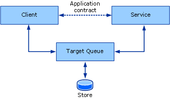
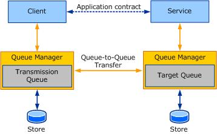
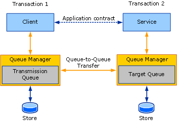

# Queues Overview
This section introduces the general and core concepts behind queued communication. Subsequent sections go into details about how the queuing concepts described here are manifested in [!INCLUDE[indigo1](../../../../includes/indigo1-md.md)].  
  
## Basic Queuing Concepts  
 When designing a distributed application, choosing the right transport for communication between services and clients is important. Several factors affect the kind of transport to use. One important factor—isolation between the service, the client, and the transport—determines use of a queued transport or a direct transport, such as TCP or HTTP. Due to the nature of direct transports such as TCP and HTTP, communication stops altogether if the service or the client stop functioning or if the network fails. The service, the client, and the network must be running at the same time for the application to work. Queued transports provide isolation, which means that if the service or client fail or if communication links between them fail, the client and service can continue to function.  
  
 Queues provide reliable communication even with failures in the communicating parties or the network. Queues capture and deliver messages exchanged between the communicating parties. Queues are typically backed by some kind of a store, which can be volatile or durable. Queues store messages from a client on behalf of a service and later forward these messages to the service. The indirection queues provide ensured isolation of failure by either party, thus making it the preferred communication mechanism for high-availability systems and disconnected services. The indirection comes with the cost of high latency. *Latency* is the time delay between the time the client sends a message and the time the service receives it. This means that once a message is sent, you do not know when that message may be processed. Most queued applications cope with high latency. The following illustration shows a conceptual model of queued communication.  
  
   
  
 Queued communication conceptual model  
  
 In reality, the queue is a distributed concept. As such, they can be local to either party or remote to both parties. Typically, the queue is local to the service. In this configuration, the client cannot depend on connectivity to the remote queue to be constantly available. Similarly, the queue must be available independent of the availability of the service reading from the queue. A queue manager manages a collection of queues. It is responsible for accepting messages sent to its queues from other queue managers. It is also responsible for managing connectivity to remote queues and transferring messages to those remote queues. To ensure availability of queues despite client or service application failures, the queue manager is typically run as an external service.  
  
 When a client sends a message to a queue, it addresses the message to the target queue, which is the queue managed by the service's queue manager. The queue manager on the client sends the message to a transmission (or outgoing) queue. The transmission queue is a queue on the client queue manager that stores messages for transmission to the target queue. The queue manager then finds a path to the queue manager that owns the target queue and transfers the message to it. To ensure reliable communication, the queue managers implement a reliable transfer protocol to prevent data loss. The destination queue manager accepts messages addressed to the target queues it owns and stores the messages. The service makes requests to read from the target queue, at which time the queue manager then delivers the message to the destination application. The following illustration shows communication between the four parties.  
  
   
  
 Queued communication in a typical deployment scenario  
  
 Thus, the queue manager provides the required isolation so that the sender and receiver can independently fail without affecting actual communication. The benefit of extra indirection that queues provide also enables multiple application instances to read from the same queue, so that farming work among the nodes achieves higher throughput. Therefore, it is not uncommon to see queues being used to achieve higher scale and throughput requirements.  
  
## Queues and Transactions  
 Transactions allow you to group a set of operations together so that if one operation fails, all of the operations fail. An example of how to use transactions is when a person uses an ATM to transfer $1,000 from his savings account to his checking account. This entails the following operations:  
  
-   Withdrawing $1,000 from the savings account.  
  
-   Depositing $1,000 into the checking account.  
  
 If the first operation succeeds and $1,000 is withdrawn from the savings account but the second operation fails, the $1,000 is lost because it has already been withdrawn from the savings account. To keep the accounts in a valid state, if one operation fails, both operations must fail.  
  
 In transactional messaging, messages can be sent to the queue and received from the queue under a transaction. Thus, if a message is sent in a transaction and the transaction is rolled back, then the outcome is as if the message had never been sent to the queue. Similarly if a message is received in a transaction and the transaction is rolled back, then the outcome is as if the message had never been received. The message remains in the queue to be read.  
  
 Because of high latency, when you send a message you have no way of knowing how long it takes to reach its target queue, nor do you know how long it takes for the service to process the message. Because of this, you do not want to use a single transaction to send the message, receive the message, and then process the message. This creates a transaction that is not committed for an indeterminate amount of time. When a client and service communicate through a queue using a transaction, two transactions are involved: one on the client and one on the service. The following illustration shows the transaction boundaries in typical queued communication.  
  
   
  
 Queued communication showing separate transactions for capture and delivery  
  
 The client transaction processes and sends the message. When the transaction is committed, the message is in the transmission queue. On the service, the transaction reads the message from the target queue, processes the message, and then commits the transaction. If an error occurs during the processing, the message is rolled back and placed in the target queue.  
  
## Asynchronous Communication Using Queues  
 Queues provide an asynchronous means of communication. Applications that send messages using queues cannot wait for the message to be received and processed by the receiver because of high latency introduced by the queue manager. Messages can remain in the queue for a far longer time than the application intended. To avoid this, the application can specify a Time-To-Live value on the message. This value specifies how long the message should remain in the transmission queue. If this time value is exceeded, and the message still has not been sent to the target queue, the message can be transferred to a dead-letter queue.  
  
 When the sender sends a message, the return from the send operation implies that the message only made it to the transmission queue on the sender. As such, if there is a failure in getting the message to the target queue, the sending application cannot know about it immediately. To take note of such failures, the failed message is transferred to a dead-letter queue.  
  
 Any error, such as a message failing to reach the target queue or the Time-To-Live expiring, must be processed separately. It is not uncommon, therefore, for queued applications to write two sets of logic:  
  
-   The normal client and service logic of sending and receiving messages.  
  
-   Compensation logic to handle messages from the failed transmission or delivery.  
  
 The following sections discuss these concepts.  
  
## Dead-Letter Queue Programming  
 Dead-letter queues contain messages that failed to reach the target queue for various reasons. The reasons can range from expired messages to connectivity issues preventing transfer of the message to the target queue.  
  
 Typically, an application can read messages from a system-wide dead-letter queue, determine what went wrong, and take appropriate action, such as correcting the errors and resending the message or taking note of it.  
  
## Poison Message Queue Programming  
 After a message makes it to the target queue, the service may repeatedly fail to process the message. For example, an application reading a message from the queue under a transaction and updating a database may find the database temporarily disconnected. In this case, the transaction is rolled back, a new transaction is created, and the message is reread from the queue. A second attempt may succeed or fail. In some cases, depending on the cause of the error, the message may repeatedly fail delivery to the application. In this case, the message is deemed as "poison." Such messages are moved to a poison queue that can be read by a poison-handling application.  
  
## See Also  
 [Queuing in WCF](../../../../docs/framework/wcf/feature-details/queuing-in-wcf.md)  
 [Queuing in WCF](../../../../docs/framework/wcf/feature-details/queuing-in-wcf.md)  
 [Sessions and Queues](../../../../docs/framework/wcf/samples/sessions-and-queues.md)  
 [Dead Letter Queues](../../../../docs/framework/wcf/samples/dead-letter-queues.md)  
 [Volatile Queued Communication](../../../../docs/framework/wcf/samples/volatile-queued-communication.md)  
 [Windows Communication Foundation to Message Queuing](../../../../docs/framework/wcf/samples/wcf-to-message-queuing.md)  
 [Installing Message Queuing (MSMQ)](../../../../docs/framework/wcf/samples/installing-message-queuing-msmq.md)  
 [Message Queuing Integration Binding Samples](http://msdn.microsoft.com/library/997d11cb-f2c5-4ba0-9209-92843d4d0e1a)  
 [Message Queuing to Windows Communication Foundation](../../../../docs/framework/wcf/samples/message-queuing-to-wcf.md)  
 [Message Security over Message Queuing](../../../../docs/framework/wcf/samples/message-security-over-message-queuing.md)
