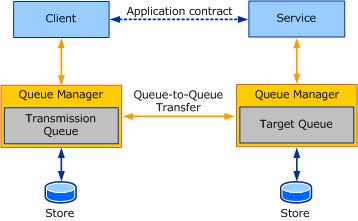

# Queuing in WCF
This section describes how to use queued communication in [!INCLUDE[indigo1](../../../../includes/indigo1-md.md)].  
  
## Queues as a WCF transport binding  
 In [!INCLUDE[indigo2](../../../../includes/indigo2-md.md)], the contracts specify what is being exchanged. Contracts are business-dependent or application-specific message exchanges. The mechanism used to exchange messages (or the "how") is specified in the bindings. Bindings in [!INCLUDE[indigo2](../../../../includes/indigo2-md.md)] encapsulate details of the message exchange. They expose configuration knobs for the user to control various aspects of the transport or the protocol that the bindings represent. Queuing in [!INCLUDE[indigo2](../../../../includes/indigo2-md.md)] is treated like any other transport binding, which is a big advantage for many queuing applications. Today, many queuing applications are written differently from other remote procedure call (RPC)-style distributed applications, making it harder to follow and maintain. With [!INCLUDE[indigo2](../../../../includes/indigo2-md.md)], the style of writing a distributed application is much the same, making it easier to follow and maintain. Moreover, by factoring out the mechanism of exchange separately from the business logic, it is easier to configure the transport or make changes to it without affecting application specific code. The following figure illustrates the structure of a WCF service and client using MSMQ as a transport.  
  
   
  
 As you can see from the preceding figure, the client and service must define only the application semantics, that is, the contract and implementation. The service configures a queued binding with preferred settings. The client uses the [ServiceModel Metadata Utility Tool (Svcutil.exe)](../../../../docs/framework/wcf/servicemodel-metadata-utility-tool-svcutil-exe.md) to generate a [!INCLUDE[indigo2](../../../../includes/indigo2-md.md)] client to the service and to generate a configuration file that describes the bindings to use to send messages to the service. Thus, to send a queued message, the client instantiates a [!INCLUDE[indigo2](../../../../includes/indigo2-md.md)] client and invokes an operation on it. This causes the message to be sent to the transmission queue and transferred to the target queue. All the complexities of queued communication are hidden from the application that is sending and receiving messages.  
  
 Caveats about queued binding in [!INCLUDE[indigo2](../../../../includes/indigo2-md.md)] include:  
  
-   All service operations must be one-way because the default queued binding in [!INCLUDE[indigo2](../../../../includes/indigo2-md.md)] does not support duplex communication using queues. A two-way communication sample ([Two-Way Communication](../../../../docs/framework/wcf/samples/two-way-communication.md)) illustrates how to use two one-way contracts to implement duplex communication using queues.  
  
-   To generate a [!INCLUDE[indigo2](../../../../includes/indigo2-md.md)] client using metadata exchange requires an additional HTTP endpoint on the service so that it can be queried directly to generate the [!INCLUDE[indigo2](../../../../includes/indigo2-md.md)] client and obtain binding information to appropriately configure queued communication.  
  
-   Based on the queued binding, extra configuration outside of [!INCLUDE[indigo2](../../../../includes/indigo2-md.md)] is required. For example, the <xref:System.ServiceModel.NetMsmqBinding> class that is shipped with [!INCLUDE[indigo2](../../../../includes/indigo2-md.md)] requires you to configure the bindings as well as minimally configure Message Queuing (MSMQ).  
  
 The following sections describe the specific queued bindings shipped with [!INCLUDE[indigo2](../../../../includes/indigo2-md.md)], which are based on MSMQ.  
  
### MSMQ  
 The queued transport in [!INCLUDE[indigo2](../../../../includes/indigo2-md.md)] uses MSMQ for its queued communication.  
  
 MSMQ ships as an optional component with Windows and runs as an NT service. It captures messages for transmission in a transmission queue and for delivery in a target queue. The MSMQ queue managers implement a reliable message-transfer protocol so that messages are not lost in transmission. The protocol can be either native or SOAP-based, such as the SOAP Reliable Message Protocol (SRMP).  
  
 In MSMQ, queues can be transactional or non-transactional. A transactional queue allows messages to be captured and delivered in a transaction and then stored durably in the queue. Messages sent to a transactional queue are transferred exactly once in order. You can use a non-transactional queue to send both volatile and durable messages. A message sent to a non-transactional queue does not carry any reliable transfer assurances; thus, messages can be lost.  
  
 MSMQ queues can also be secured using a Windows identity registered with the Active Directory directory service. When installing MSMQ, you can install Active Directory integration, which requires the computer to be part of a Windows domain network.  
  
 [!INCLUDE[crabout](../../../../includes/crabout-md.md)] MSMQ, see [Installing Message Queuing (MSMQ)](../../../../docs/framework/wcf/samples/installing-message-queuing-msmq.md).  
  
### NetMsmqBinding  
 The [\<netMsmqBinding>](../../../../docs/framework/configure-apps/file-schema/wcf/netmsmqbinding.md) is the queued binding [!INCLUDE[indigo2](../../../../includes/indigo2-md.md)] provides for two [!INCLUDE[indigo2](../../../../includes/indigo2-md.md)] endpoints to communicate using MSMQ. The binding, therefore, exposes properties that are specific to MSMQ. However, not all MSMQ features and properties are exposed in the `NetMsmqBinding`. The compact `NetMsmqBinding` is designed with an optimal set of features that most customers should find sufficient.  
  
 The `NetMsmqBinding` manifests the core queuing concepts discussed thus far in the form of properties on the bindings. These properties, in turn, communicate to MSMQ how to transfer and deliver the messages. A discussion of the property categories is in the following sections. [!INCLUDE[crdefault](../../../../includes/crdefault-md.md)] the conceptual topics that describe specific properties more completely.  
  
#### ExactlyOnce and Durable Properties  
 The `ExactlyOnce` and `Durable` properties affect how messages are transferred between queues:  
  
-   `ExactlyOnce`: When set to `true` (the default), the queued channel ensures that the message, if delivered, is not duplicated. It also ensures that the message is not lost. If the message cannot be delivered, or the message Time-To Live expires before the message can be delivered, the failed message along with the delivery failure reason is recorded in a dead-letter queue. When set to `false`, the queued channel makes an effort to transfer the message. In this case, you can optionally choose a dead-letter queue.  
  
-   `Durable:` When set to `true` (the default), the queued channel ensures that MSMQ stores the message durably on disk. Thus, if the MSMQ service were to stop and restart, the messages on disk is transferred to the target queue or delivered to the service. When set to `false`, the messages are stored in volatile store and are lost on stopping and restarting the MSMQ service.  
  
 For `ExactlyOnce` reliable transfer, MSMQ requires the queue to be transactional. Also, MSMQ requires a transaction to read from a transactional queue. As such, when you use the `NetMsmqBinding`, remember that a transaction is required to send or receive messages when `ExactlyOnce` is set to `true`. Similarly, MSMQ requires the queue to be non-transactional for best-effort assurances, such as when `ExactlyOnce` is `false` and for volatile messaging. Thus, when setting `ExactlyOnce` to `false` or durable to `false`, you cannot send or receive using a transaction.  
  
> [!NOTE]
>  Ensure that the correct queue (transactional or non-transactional) is created based on settings in the bindings. If `ExactlyOnce` is `true`, use a transactional queue; otherwise, use a non-transactional queue.  
  
#### Dead-Letter Queue Properties  
 The dead-letter queue is used to store messages that fail delivery. The user can write compensating logic that reads messages out of the dead-letter queue.  
  
 Many queuing systems provide for a system-wide dead-letter queue. MSMQ provides a system-wide non-transactional dead-letter queue for messages that fail delivery to non-transactional queues and a system-wide transactional dead-letter queue for messages that fail delivery to transactional queues.  
  
 If multiple clients sending messages to different target queues share the MSMQ service, all messages sent by the clients go to the same dead-letter queue. This is not always preferable. For better isolation, [!INCLUDE[indigo2](../../../../includes/indigo2-md.md)] and MSMQ in [!INCLUDE[wv](../../../../includes/wv-md.md)] provide a custom dead-letter queue (or application-specific dead-letter queue) that the user can specify to store messages that fail delivery. Therefore, different clients do not share the same dead-letter queue.  
  
 The binding has two properties of interest:  
  
-   `DeadLetterQueue`: This property is an enumeration that indicates whether a dead-letter queue is requested. The enumeration also contains the kind of dead-letter queue, if one is requested. The values are `None`, `System`, and `Custom`. [!INCLUDE[crabout](../../../../includes/crabout-md.md)] the interpretation of these properties, see [Using Dead-Letter Queues to Handle Message Transfer Failures](../../../../docs/framework/wcf/feature-details/using-dead-letter-queues-to-handle-message-transfer-failures.md)  
  
-   `CustomDeadLetterQueue`: This property is the Uniform Resource Identifier (URI) address of the application-specific dead-letter queue. This is required if `DeadLetterQueue`.`Custom` is chosen.  
  
#### Poison Message Handling properties  
 When the service reads messages from the target queue under a transaction, the service may fail to process the message for various reasons. The message is then put back into the queue to be read again. To deal with messages that fail repeatedly, a set of poison-message handling properties can be configured in the binding. There are four properties: `ReceiveRetryCount`, `MaxRetryCycles`, `RetryCycleDelay`, and `ReceiveErrorHandling`. [!INCLUDE[crabout](../../../../includes/crabout-md.md)] these properties, see [Poison Message Handling](../../../../docs/framework/wcf/feature-details/poison-message-handling.md).  
  
#### Security Properties  
 MSMQ exposes its own security model, such as access control lists (ACLs) on a queue or sending authenticated messages. The `NetMsmqBinding` exposes these security properties as part of its transport security settings. There are two properties in the binding for transport security: `MsmqAuthenticationMode` and `MsmqProtectionLevel`. Settings in these properties depend on how MSMQ is configured. [!INCLUDE[crdefault](../../../../includes/crdefault-md.md)] [Securing Messages Using Transport Security](../../../../docs/framework/wcf/feature-details/securing-messages-using-transport-security.md).  
  
 In addition to transport security, the actual SOAP message itself can be secured using message security. [!INCLUDE[crdefault](../../../../includes/crdefault-md.md)] [Securing Messages Using Message Security](../../../../docs/framework/wcf/feature-details/securing-messages-using-message-security.md).  
  
 `MsmqTransportSecurity` also exposes two properties, `MsmqEncryptionAlgorithm` and `MsmqHashAlgorithm`. These are enumerations of different algorithms to choose for queue-to-queue transfer encryption of messages and hashing of the signatures.  
  
#### Other Properties  
 In addition to the preceding properties, other MSMQ-specific properties exposed in the binding include:  
  
-   `UseSourceJournal`: A property to indicate that source journaling is turned on. Source journaling is an MSMQ feature that keeps track of messages that have been successfully transmitted from the transmission queue.  
  
-   `UseMsmqTracing`: A property to indicate that MSMQ tracing is turned on. MSMQ tracing sends report messages to a report queue each time a message leaves or arrives at a machine hosting an MSMQ queue manager.  
  
-   `QueueTransferProtocol`: An enumeration of the protocol to use for queue-to-queue message transfers. MSMQ implements a native queue-to-queue transfer protocol and a SOAP-based protocol called SOAP Reliable Messaging Protocol (SRMP). SRMP is used when using HTTP transport for queue-to-queue transfers. SRMP secure is used when using HTTPS for queue-to-queue transfers.  
  
-   `UseActiveDirectory`: A Boolean value to indicate whether the Active Directory must be used for queue address resolution. By default, this is off. [!INCLUDE[crdefault](../../../../includes/crdefault-md.md)] [Service Endpoints and Queue Addressing](../../../../docs/framework/wcf/feature-details/service-endpoints-and-queue-addressing.md).  
  
### MsmqIntegrationBinding  
 The `MsmqIntegrationBinding` is used when you want a [!INCLUDE[indigo2](../../../../includes/indigo2-md.md)] endpoint to communicate with an existing MSMQ application written in C, C++, COM, or System.Messaging APIs.  
  
 The binding properties are the same as for `NetMsmqBinding`. However, the following differences apply:  
  
-   The operation contract for `MsmqIntegrationBinding` is restricted to taking a single parameter of type <xref:System.ServiceModel.MsmqIntegration.MsmqMessage%601> where the type parameter is the body type.  
  
-   Much of MSMQ native message properties are exposed in the <xref:System.ServiceModel.MsmqIntegration.MsmqMessage%601> for use.  
  
-   To help with serialization and deserialization of the message body, serializers such as XML and ActiveX are provided.  
  
### Sample Code  
 For step by step instructions on how to write WCF services that use MSMQ see the following topics:  
  
-   [How to: Exchange Messages with WCF Endpoints and Message Queuing Applications](../../../../docs/framework/wcf/feature-details/how-to-exchange-messages-with-wcf-endpoints-and-message-queuing-applications.md)  
  
-   [How to: Exchange Queued Messages with WCF Endpoints](../../../../docs/framework/wcf/feature-details/how-to-exchange-queued-messages-with-wcf-endpoints.md)  
  
 For a completed code sample illustrating the use of MSMQ in WCF see the following topics:  
  
-   [Transacted MSMQ Binding](../../../../docs/framework/wcf/samples/transacted-msmq-binding.md)  
  
-   [Volatile Queued Communication](../../../../docs/framework/wcf/samples/volatile-queued-communication.md)  
  
-   [Dead Letter Queues](../../../../docs/framework/wcf/samples/dead-letter-queues.md)  
  
-   [Sessions and Queues](../../../../docs/framework/wcf/samples/sessions-and-queues.md)  
  
-   [Two-Way Communication](../../../../docs/framework/wcf/samples/two-way-communication.md)  
  
-   [Transacted Batching](../../../../docs/framework/wcf/samples/transacted-batching.md)  
  
-   [SRMP](../../../../docs/framework/wcf/samples/srmp.md)  
  
-   [Message Security over Message Queuing](../../../../docs/framework/wcf/samples/message-security-over-message-queuing.md)  
  
## See Also  
 [Service Endpoints and Queue Addressing](../../../../docs/framework/wcf/feature-details/service-endpoints-and-queue-addressing.md)  
 [Web Hosting a Queued Application](../../../../docs/framework/wcf/feature-details/web-hosting-a-queued-application.md)
