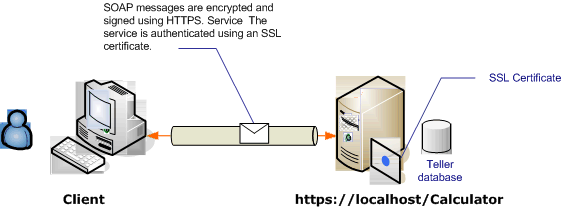

# Transport Security with an Anonymous Client
This [!INCLUDE[indigo1](../../../../includes/indigo1-md.md)] scenario uses transport security (HTTPS) to ensure confidentiality and integrity. The server must be authenticated with a Secure Sockets Layer (SSL) certificate, and the clients must trust the server's certificate. The client is not authenticated by any mechanism and is, therefore, anonymous.  
  
 For a sample application, see [WS Transport Security](../../../../docs/framework/wcf/samples/ws-transport-security.md). [!INCLUDE[crabout](../../../../includes/crabout-md.md)] transport security, see [Transport Security Overview](../../../../docs/framework/wcf/feature-details/transport-security-overview.md).  
  
 [!INCLUDE[crabout](../../../../includes/crabout-md.md)] using a certificate with a service, see [Working with Certificates](../../../../docs/framework/wcf/feature-details/working-with-certificates.md) and [How to: Configure a Port with an SSL Certificate](../../../../docs/framework/wcf/feature-details/how-to-configure-a-port-with-an-ssl-certificate.md).  
  
   
  
|Characteristic|Description|  
|--------------------|-----------------|  
|Security Mode|Transport|  
|Interoperability|With existing Web services and clients|  
|Authentication (Server)<br /><br /> Authentication (Client)|Yes<br /><br /> Application level (no [!INCLUDE[indigo2](../../../../includes/indigo2-md.md)] support)|  
|Integrity|Yes|  
|Confidentiality|Yes|  
|Transport|HTTPS|  
|Binding|<<!--zz xref:System.ServiceModel.WsHttpBinding --> `xref:System.ServiceModel.WsHttpBinding`>|  
  
## Service  
 The following code and configuration are meant to run independently. Do one of the following:  
  
-   Create a stand-alone service using the code with no configuration.  
  
-   Create a service using the supplied configuration, but do not define any endpoints.  
  
### Code  
 The following code shows how to create an endpoint using transport security:  
  
 [!code-csharp[c_SecurityScenarios#5](../../../../samples/snippets/csharp/VS_Snippets_CFX/c_securityscenarios/cs/source.cs#5)]
 [!code-vb[c_SecurityScenarios#5](../../../../samples/snippets/visualbasic/VS_Snippets_CFX/c_securityscenarios/vb/source.vb#5)]  
  
### Configuration  
 The following code sets up the same endpoint using configuration. The client is not authenticated by any mechanism, and is therefore anonymous.  
  
```xml  
<?xml version="1.0" encoding="utf-8"?>  
<configuration>  
  <system.serviceModel>  
    <services>  
      <service name="ServiceModel.Calculator">  
        <endpoint address="http://localhost/Calculator"   
                  binding="wsHttpBinding"  
                  bindingConfiguration="WSHttpBinding_ICalculator"   
                  name="SecuredByTransportEndpoint"  
                  contract="ServiceModel.ICalculator" />  
      </service>  
    </services>  
    <bindings>  
      <wsHttpBinding>  
        <binding name="WSHttpBinding_ICalculator">  
          <security mode="Transport">  
            <transport clientCredentialType="None" />  
          </security>  
        </binding>  
      </wsHttpBinding>  
    </bindings>  
    <client />  
  </system.serviceModel>  
</configuration>  
```  
  
## Client  
 The following code and configuration are meant to run independently. Do one of the following:  
  
-   Create a stand-alone client using the code (and client code).  
  
-   Create a client that does not define any endpoint addresses. Instead, use the client constructor that takes the configuration name as an argument. For example:  
  
     [!code-csharp[C_SecurityScenarios#0](../../../../samples/snippets/csharp/VS_Snippets_CFX/c_securityscenarios/cs/source.cs#0)]
     [!code-vb[C_SecurityScenarios#0](../../../../samples/snippets/visualbasic/VS_Snippets_CFX/c_securityscenarios/vb/source.vb#0)]  
  
### Code  
 [!code-csharp[c_SecurityScenarios#6](../../../../samples/snippets/csharp/VS_Snippets_CFX/c_securityscenarios/cs/source.cs#6)]
 [!code-vb[c_SecurityScenarios#6](../../../../samples/snippets/visualbasic/VS_Snippets_CFX/c_securityscenarios/vb/source.vb#6)]  
  
### Configuration  
 The following configuration can be used instead of the code to set up the service.  
  
```xml  
<configuration>  
  <system.serviceModel>  
    <bindings>  
      <wsHttpBinding>  
        <binding name="WSHttpBinding_ICalculator" >  
          <security mode="Transport">  
            <transport clientCredentialType="None" />  
          </security>  
        </binding>  
      </wsHttpBinding>  
    </bindings>  
    <client>  
      <endpoint address="https://machineName/Calculator"   
                binding="wsHttpBinding"  
                bindingConfiguration="WSHttpBinding_ICalculator"   
                contract="ICalculator"  
                name="WSHttpBinding_ICalculator" />  
    </client>  
  </system.serviceModel>  
</configuration>  
```  
  
## See Also  
 [Security Overview](../../../../docs/framework/wcf/feature-details/security-overview.md)  
 [WS Transport Security](../../../../docs/framework/wcf/samples/ws-transport-security.md)  
 [Transport Security Overview](../../../../docs/framework/wcf/feature-details/transport-security-overview.md)  
 [Security Model for Windows Server App Fabric](http://go.microsoft.com/fwlink/?LinkID=201279&clcid=0x409)
