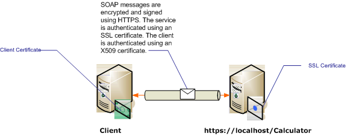

# Transport Security with Certificate Authentication
This topic discusses using X.509 certificates for server and client authentication when using transport security. For more information about X.509 certificates see [X.509 Public Key Certificates](http://msdn.microsoft.com/library/bb540819\(VS.85\).aspx). Certificates must be issued by a certification authority, which is often a third-party issuer of certificates. On a Windows Server domain, Active Directory Certificate Services can be used to issue certificates to client computers on the domain. For more information see [Windows 2008 R2 Certificate Services](http://go.microsoft.com/fwlink/?LinkID=209949&clcid=0x409). In this scenario, the service is hosted under Internet Information Services (IIS) which is configured with Secure Sockets Layer (SSL). The service is configured with an SSL (X.509) certificate to allow clients to verify the identity of the server. The client is also configured with an X.509 certificate that allows the service to verify the identity of the client. The server’s certificate must be trusted by the client and the client’s certificate must be trusted by the server. The actual mechanics of how the service and client verifies each other’s identity is beyond the scope of this topic. For more information see [Digital Signature on Wikipedia](http://go.microsoft.com/fwlink/?LinkId=253157).  
  
 This scenario implements a request/reply message pattern as illustrated by the following diagram.  
  
   
  
 [!INCLUDE[crabout](../../../../includes/crabout-md.md)] using a certificate with a service, see [Working with Certificates](../../../../docs/framework/wcf/feature-details/working-with-certificates.md) and [How to: Configure a Port with an SSL Certificate](../../../../docs/framework/wcf/feature-details/how-to-configure-a-port-with-an-ssl-certificate.md). The following table describes the various characteristics of the scenario.  
  
|Characteristic|Description|  
|--------------------|-----------------|  
|Security Mode|Transport|  
|Interoperability|With existing Web service clients and services.|  
|Authentication (Server)<br /><br /> Authentication (Client)|Yes (using an SSL certificate)<br /><br /> Yes (using an X.509 certificate)|  
|Data Integrity|Yes|  
|Data Confidentiality|Yes|  
|Transport|HTTPS|  
|Binding|<xref:System.ServiceModel.WSHttpBinding>|  
  
## Configure the Service  
 Since the service in this scenario is hosted under IIS, it is configured with a web.config file. The following web.config shows how to configure the <xref:System.ServiceModel.WSHttpBinding> to use transport security and X.509 client credentials.  
  
```xml  
<configuration>  
  <system.serviceModel>  
    <protocolMapping>  
      <add scheme="https" binding="wsHttpBinding" />  
    </protocolMapping>  
    <bindings>  
      <wsHttpBinding>  
        <!-- configure wsHttp binding with Transport security mode and clientCredentialType as Certificate -->  
        <binding>  
          <security mode="Transport">  
            <transport clientCredentialType="Certificate"/>              
          </security>  
        </binding>  
      </wsHttpBinding>  
    </bindings>  
    <!--For debugging purposes set the includeExceptionDetailInFaults attribute to true-->  
    <behaviors>  
      <serviceBehaviors>  
        <behavior>            
           <serviceDebug includeExceptionDetailInFaults="True" />  
        </behavior>  
      </serviceBehaviors>  
    </behaviors>  
  </system.serviceModel>  
</configuration>  
```  
  
## Configure the Client  
 The client can be configured in code or in an app.config file. The following example shows how to configure the client in code.  
  
```vb  
// Create the binding.  
WSHttpBinding myBinding = new WSHttpBinding();  
myBinding.Security.Mode = SecurityMode.Transport;  
myBinding.Security.Transport.ClientCredentialType =  
   HttpClientCredentialType.Certificate;  
  
// Create the endpoint address. Note that the machine name   
// must match the subject or DNS field of the X.509 certificate  
// used to authenticate the service.   
EndpointAddress ea = new  
   EndpointAddress("https://localhost/CalculatorService/service.svc");  
  
// Create the client. The code for the calculator   
// client is not shown here. See the sample applications  
// for examples of the calculator code.  
CalculatorClient cc =  
   new CalculatorClient(myBinding, ea);  
  
// The client must specify a certificate trusted by the server.  
cc.ClientCredentials.ClientCertificate.SetCertificate(  
    StoreLocation.CurrentUser,  
    StoreName.My,  
    X509FindType.FindBySubjectName,  
    "contoso.com");  
  
// Begin using the client.  
Console.WriteLine(cc.Add(100, 1111));  
//...  
cc.Close();  
```  
  
 Alternatively you can configure the client in an App.config file as shown in the following example:  
  
```xml  
<configuration>  
  <system.serviceModel>  
    <client>  
      <!-- this endpoint has an https: address -->  
      <endpoint address=" https://localhost/CalculatorService/service.svc "   
                behaviorConfiguration="endpointCredentialBehavior"  
                binding="wsHttpBinding"   
                bindingConfiguration="Binding1"   
                contract="Microsoft.Samples.TransportSecurity.ICalculator"/>  
    </client>  
    <behaviors>  
      <endpointBehaviors>  
        <behavior name="endpointCredentialBehavior">  
          <clientCredentials>  
            <clientCertificate findValue="contoso.com"  
                               storeLocation="CurrentUser"  
                               storeName="My"  
                               x509FindType="FindBySubjectName" />  
          </clientCredentials>  
        </behavior>  
      </endpointBehaviors>  
    </behaviors>  
    <bindings>  
      <wsHttpBinding>  
        <!-- configure wsHttpbinding with Transport security mode  
                   and clientCredentialType as Certificate -->  
        <binding name="Binding1">  
          <security mode="Transport">  
            <transport clientCredentialType="Certificate"/>  
          </security>  
        </binding>  
      </wsHttpBinding>  
    </bindings>  
  </system.serviceModel>  
  
<startup><supportedRuntime version="v4.0" sku=".NETFramework,Version=v4.0"/></startup></configuration>  
```  
  
## See Also  
 [Security Overview](../../../../docs/framework/wcf/feature-details/security-overview.md)  
 [Security Model for Windows Server App Fabric](http://go.microsoft.com/fwlink/?LinkID=201279&clcid=0x409)
