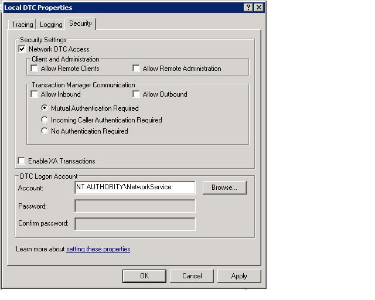

# Troubleshooting Queued Messaging
This section contains common questions and troubleshooting help for using queues in [!INCLUDE[indigo1](../../../../includes/indigo1-md.md)].  
  
## Common Questions  
 **Q:** I used [!INCLUDE[indigo2](../../../../includes/indigo2-md.md)] Beta 1 and I installed the MSMQ hotfix. Do I need to remove the hotfix?  
  
 **A:** Yes. This hotfix is no longer supported. [!INCLUDE[indigo2](../../../../includes/indigo2-md.md)] now works on MSMQ without a hotfix requirement.  
  
 **Q:** There are two bindings for MSMQ: <xref:System.ServiceModel.NetMsmqBinding> and <xref:System.ServiceModel.MsmqIntegration.MsmqIntegrationBinding>. What should I use and when?  
  
 **A:** Use the <xref:System.ServiceModel.NetMsmqBinding> when you want to use MSMQ as a transport for queued communication between two [!INCLUDE[indigo2](../../../../includes/indigo2-md.md)] applications. Use the <xref:System.ServiceModel.MsmqIntegration.MsmqIntegrationBinding> when you want to use existing MSMQ applications to communicate with new [!INCLUDE[indigo2](../../../../includes/indigo2-md.md)] applications.  
  
 **Q:** Do I have to upgrade MSMQ to use the <xref:System.ServiceModel.NetMsmqBinding> and `MsmqIntegration` bindings?  
  
 **A:** No. Both bindings work with MSMQ 3.0 on [!INCLUDE[wxp](../../../../includes/wxp-md.md)] and [!INCLUDE[ws2003](../../../../includes/ws2003-md.md)]. Certain features of the bindings become available when you upgrade to MSMQ 4.0 in [!INCLUDE[wv](../../../../includes/wv-md.md)].  
  
 **Q:** What features of the <xref:System.ServiceModel.NetMsmqBinding> and <xref:System.ServiceModel.MsmqIntegration.MsmqIntegrationBinding> bindings are available in MSMQ 4.0 but not in MSMQ 3.0?  
  
 **A:** The following features are available in MSMQ 4.0 but not in MSMQ 3.0:  
  
-   Custom dead-letter queue is supported only on MSMQ 4.0.  
  
-   MSMQ 3.0 and 4.0 handle poison messages differently.  
  
-   Only MSMQ 4.0 supports remote transacted read.  
  
 [!INCLUDE[crdefault](../../../../includes/crdefault-md.md)] [Differences in Queuing Features in Windows Vista, Windows Server 2003, and Windows XP](../../../../docs/framework/wcf/feature-details/diff-in-queue-in-vista-server-2003-windows-xp.md).  
  
 **Q:** Can I use MSMQ 3.0 on one side of a queued communication and MSMQ 4.0 on the other side?  
  
 **A:** Yes.  
  
 **Q:** I want to integrate existing MSMQ applications with new [!INCLUDE[indigo2](../../../../includes/indigo2-md.md)] clients or servers. Do I need to upgrade both sides of my MSMQ infrastructure?  
  
 **A:** No. You do not have to upgrade to MSMQ 4.0 on either side.  
  
## Troubleshooting  
 This section contains answers to most common troubleshooting issues. Some issues that are known limitations are also described in the release notes.  
  
 **Q:** I am trying to use a private queue and I get the following exception: `System.InvalidOperationException`: The URL is invalid. The URL for the queue cannot contain the '$' character. Use the syntax in net.msmq://machine/private/queueName to address a private queue.  
  
 **A:** Please check the queue Uniform Resource Identifier (URI) in your configuration and code. Do not use the "$" character in the URI. For example, to address a private queue named OrdersQueue, specify the URI as net.msmq://localhost/private/ordersQueue.  
  
 **Q:** Calling `ServiceHost.Open()` on my queued application throws the following exception: `System.ArgumentException`: A base address cannot contain a URI query string. Why?  
  
 **A:** Check the queue URI in your configuration file and in your code. While MSMQ queues support the use of the '?' character, URIs interpret this character as the beginning of a string query. To avoid this issue, use queue names that do not contain '?' characters.  
  
 **Q:** My send succeeded but no service operation is invoked on the receiver. Why?  
  
 **A:** To determine the answer, work through the following check list:  
  
-   Check that the transactional queue requirements are compatible with the assurances specified. Note the following principles:  
  
    -   You can send durable messages (datagrams and sessions) with "exactly once" assurances (<xref:System.ServiceModel.MsmqBindingBase.ExactlyOnce%2A> = `true`) only to a transactional queue.  
  
    -   You can send sessions only with "exactly once" assurances.  
  
    -   A transaction is required to receive messages in a session from a transactional queue.  
  
    -   You can send or receive volatile or durable messages (datagrams only) with no assurances (<xref:System.ServiceModel.MsmqBindingBase.ExactlyOnce%2A> = `false`) only to a non-transactional queue.  
  
-   Check the dead-letter queue. If you find the messages there, determine why they were not delivered.  
  
-   Check the outgoing queues for connectivity or addressing problems.  
  
 **Q:** I have specified a custom dead-letter queue, but when I start the sender application, I get an exception that either the dead-letter queue is not found, or the sending application has no permission to the dead-letter queue. Why is this happening?  
  
 **A:** The custom dead-letter queue URI must include a "localhost" or the computer name in the first segment, for example, net.msmq://localhost/private/myAppdead-letter queue.  
  
 **Q:** Is it always necessary to define a custom dead-letter queue, or is there a default dead-letter queue?  
  
 **A:** If assurances are "exactly once" (<xref:System.ServiceModel.MsmqBindingBase.ExactlyOnce%2A> = `true`), and if you do not specify a custom dead-letter queue, the default is a system-wide transactional dead-letter queue.  
  
 If assurances are none (<xref:System.ServiceModel.MsmqBindingBase.ExactlyOnce%2A> = `false`), then the default is no dead-letter queue functionality.  
  
 **Q:** My service throws on SvcHost.Open with a message "EndpointListener requirements cannot be met by the ListenerFactory". Why?  
  
 A. Check your service contract. You may have forgotten to put "IsOneWay=`true`" on all the service operations. Queues support only one-way service operations.  
  
 **Q:** There are messages in the queue but no service operation is invoked. What is the problem?  
  
 **A:** Determine if your service host is faulted. You can check by looking at the trace or implementing `IErrorHandler`. Service host faults, by default, if a poison message is detected.  
  
 **Q:** There are messages in the queue but my Web-hosted queued service is not getting activated. Why?  
  
 **A:** The most common reason is permissions.  
  
1.  Ensure that the `NetMsmqActivator` process is running and the identity of the `NetMsmqActivator` process is given read and seek permission on the queue.  
  
2.  If the `NetMsmqActivator` is monitoring queues on a remote machine, ensure that `NetMsmqActivator` does not run under a restricted token. To run the `NetMsmqActivator` with an unrestricted token:  
  
    ```  
    sc sidtype NetMsmqActivator unrestricted  
    ```  
  
 For non-security related Web host issues refer to: [Web Hosting a Queued Application](../../../../docs/framework/wcf/feature-details/web-hosting-a-queued-application.md).  
  
 **Q:** What is the easiest way to access sessions?  
  
 **A:** Set AutoComplete=`true` on the operation that corresponds to the last message in the session, and set AutoComplete=`false` on all remaining service operations.  
  
 **Q:** Where can I find answers to common questions on MSMQ?  
  
 **A:** [!INCLUDE[crabout](../../../../includes/crabout-md.md)] MSMQ, see [Microsoft Message Queuing](http://go.microsoft.com/fwlink/?LinkId=87810).  
  
 **Q:** Why does my service throw a `ProtocolException` when reading from a queue that contains both queued session messages and queued datagram messages?  
  
 **A:** There is a fundamental difference in the way queued session messages and queued datagram messages are composed. Because of this, a service that is expecting to read a queued session message cannot receive a queued datagram message and a service expecting to read a queued datagram message cannot receive a session message. Attempting to read both types of messages from the same queue throws the following exception:  
  
```  
System.ServiceModel.MsmqPoisonMessageException: The transport channel detected a poison message. This occurred because the message exceeded the maximum number of delivery attempts or because the channel detected a fundamental problem with the message. The inner exception may contain additional information.   
---> System.ServiceModel.ProtocolException: An incoming MSMQ message contained invalid or unexpected .NET Message Framing information in its body. The message cannot be received. Ensure that the sender is using a compatible service contract with a matching SessionMode.  
```  
  
 The system dead-letter queue, as well as any custom dead-letter queue, is particularly susceptible to this issue if an application sends both queued session messages and queued datagram messages from the same computer. If a message cannot be sent successfully, it is moved to the dead-letter queue. Under these circumstances, it is possible to have both session and datagram messages in the dead-letter queue. There is no way to separate both types of messages at runtime when reading from a queue, therefore, applications should not send both queued session messages and queued datagram messages from the same computer.  
  
### MSMQ Integration: Specific Troubleshooting  
 **Q:** When I send a message, or when I open the service host, I get an error that indicates the scheme is wrong. Why?  
  
 **A:** When you use the MSMQ integration binding, you must use the msmq.formatname scheme. For example, msmq.formatname:DIRECT=OS:.\private$\OrdersQueue. But when you specify the custom dead-letter queue, you must use the net.msmq scheme.  
  
 **Q:** When I use a public or private format name and open the service host on [!INCLUDE[wv](../../../../includes/wv-md.md)], I get an error. Why?  
  
 **A:** The [!INCLUDE[indigo2](../../../../includes/indigo2-md.md)] integration channel on [!INCLUDE[wv](../../../../includes/wv-md.md)] checks to see if a sub-queue can be opened for the main application queue for handling poison messages. The sub-queue name is derived from an msmq.formatname URI passed to the listener. The sub-queue name in MSMQ can only be a direct format name. So you see the error. Change the queue URI to a direct format name.  
  
 **Q:** When receiving a message from an MSMQ application, the message sits in the queue and is not read by the receiving [!INCLUDE[indigo2](../../../../includes/indigo2-md.md)] application. Why?  
  
 **A:** Check to see whether the message has a body. If the message has no body, the MSMQ integration channel ignores the message. Implement `IErrorHandler` to be notified of exceptions and check the traces.  
  
### Security-Related Troubleshooting  
 **Q:** When I run the sample that uses a default binding in workgroup mode, messages seem to get sent but are never received by the receiver.  
  
 **A:** By default, messages are signed using an MSMQ internal certificate that requires the Active Directory directory service. In workgroup mode, because Active Directory is not available, signing the message fails. So the message lands in the dead-letter queue and failure cause, such as "Bad signature", is indicated.  
  
 The workaround is to turn off security. This is done by setting <xref:System.ServiceModel.NetMsmqSecurity.Mode%2A> = <xref:System.ServiceModel.NetMsmqSecurityMode.None> to make it work in workgroup mode.  
  
 Another workaround is to get the <xref:System.ServiceModel.MsmqTransportSecurity> from the <xref:System.ServiceModel.NetMsmqSecurity.Transport%2A> property and set it to <xref:System.ServiceModel.MsmqAuthenticationMode.Certificate>, and set the client certificate.  
  
 Yet another workaround is to install MSMQ with Active Directory integration.  
  
 **Q:** When I send a message with default binding (transport security turned on) in Active Directory to a queue, I get an "internal certificate not found" message. How do I fix this?  
  
 **A:** This means that the certificate in Active Directory for the sender must be renewed. To do so, open **Control Panel**, **Administrative Tools**, **Computer Management**, right-click **MSMQ**, and select **Properties**. Select the **User Certificate** tab and click the **Renew** button.  
  
 **Q:** When I send a message using <xref:System.ServiceModel.MsmqAuthenticationMode.Certificate> and specify the certificate to use, I get an "Invalid certificate" message. How do I fix this?  
  
 **A:** You cannot use a local machine certificate store with certificate mode. You have to copy the certificate from the machine certificate store to the current user store using the Certificate snap-in. To get the Certificate snap-in:  
  
1.  Click **Start**, select **Run**, type `mmc`, and click **OK**.  
  
2.  In the **Microsoft Management Console**, open the **File** menu and select **Add/Remove Snap-in**.  
  
3.  In the **Add/Remove Snap-in** dialog box, click the **Add** button.  
  
4.  In the **Add Standalone Snap-in** dialog box, select Certificates and click **Add**.  
  
5.  In the **Certificates** snap-in dialog box, select **My user account,** and click **Finish**.  
  
6.  Next, add a second Certificates snap-in using the previous steps, but this time select **Computer account** and click **Next**.  
  
7.  Select **Local Computer** and click **Finish**. You can now drag and drop certificates from the machine certificate store to the current user store.  
  
 **Q:** When my service reads from a queue on another computer in workgroup mode, I get an "access denied" exception.  
  
 **A:** In workgroup mode, for a remote application to gain access to the queue, the application must have permission to access the queue. Add "Anonymous login" to the queue's access control list (ACL) and give it read permission.  
  
 **Q:** When a network service client (or any client that does not have a domain account) sends a queued message, the send fails with an invalid certificate. How do I fix this?  
  
 **A:** Check the binding configuration. The default binding has MSMQ transport security turned on to sign the message. Turn it off.  
  
### Remote Transacted Receives  
 **Q:** When I have a queue on machine A, and a [!INCLUDE[indigo2](../../../../includes/indigo2-md.md)] service that reads messages from a queue on machine B (the remote transacted receive scenario), messages are not read from the queue. Tracing information indicates the receive failed with the message "Transaction cannot be imported." What can I do to fix this?  
  
 **A:** There are three possible reasons for this:  
  
-   If you are in domain mode, remote transacted receive requires Microsoft Distributed Transaction Coordinator (MSDTC) network access. You can enable this using **Add/Remove Components**.  
  
       
  
-   Check the authentication mode for communicating with the transaction manager. If you are in workgroup mode, "No Authentication Required" must be selected. If you are in domain mode, then "Mutual Authentication Required" must be selected.  
  
       
  
-   Make sure that MSDTC is in the list of exceptions in the **Internet Connection Firewall** settings.  
  
-   Ensure that you are using [!INCLUDE[wv](../../../../includes/wv-md.md)]. MSMQ on [!INCLUDE[wv](../../../../includes/wv-md.md)] supports remote transacted read. MSMQ on earlier Windows releases does not support remote transacted read.  
  
 **Q:** When the service reading from the queue is a network service, for example, in a Web host, why do I get an access-denied exception is raised when reading from the queue?  
  
 **A:** Network service read access must be added to the queue ACL to ensure that a network service can read from the queue.  
  
 **Q:** Can I use the MSMQ activation service to activate applications based on messages in a queue on a remote machine?  
  
 **A:** Yes. To do this, you must configure the MSMQ activation service to run as a network service, and add network service access to the queue on the remote machine.  
  
## Using Custom MSMQ Bindings with ReceiveContext Enabled  
 When using a custom MSMQ binding with <xref:System.ServiceModel.Channels.ReceiveContext> enabled processing an incoming message will use a thread pool thread because native MSMQ does not support I/O completion for asynchronous <xref:System.ServiceModel.Channels.ReceiveContext> receives. This is because processing such a message uses internal transactions for <xref:System.ServiceModel.Channels.ReceiveContext> and MSMQ does not support asynchronous processing. To work around this issue you can add a <xref:System.ServiceModel.Description.SynchronousReceiveBehavior> to the endpoint to force synchronous processing or set <xref:System.ServiceModel.Description.DispatcherSynchronizationBehavior.MaxPendingReceives%2A> to 1.
