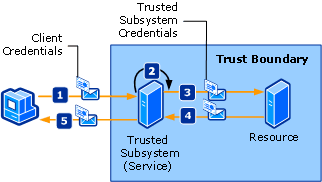

# Trusted Subsystem
A client accesses one or more Web services that are distributed across a network. The Web services are designed so that access to additional resources (such as databases or other Web services) is encapsulated in the business logic of the Web service. These resources must be protected against unauthorized access. The following illustration depicts a trusted subsystem process.  
  
   
  
 The following steps describe the trusted subsystem process as illustrated:  
  
1.  The client submits a request to the trusted subsystem, along with credentials.  
  
2.  The trusted subsystem authenticates and authorizes the user.  
  
3.  The trusted subsystem sends a request message to the remote resource. This request is accompanied by the credentials for the trusted subsystem (or the service account under which the trusted subsystem process is being executed).  
  
4.  The back-end resource authenticates and authorizes the trusted subsystem. It then processes the request and issues a response to the trusted subsystem.  
  
5.  The trusted subsystem processes the response and issues its own response to the client.  
  
|Characteristic|Description|  
|--------------------|-----------------|  
|Security Mode|Message|  
|Interoperability|[!INCLUDE[indigo1](../../../../includes/indigo1-md.md)] only.|  
|Authentication (service)|Security token service authenticates and authorizes clients.|  
|Authentication (client)|The trusted subsystem authenticates the client and the resource authenticates the trusted subsystem service.|  
|Integrity|Yes|  
|Confidentiality|Yes|  
|Transport|HTTP between client and the trusted subsystem service.<br /><br /> NET.TCP between trusted subsystem service and the resource (back-end service).|  
|Binding|<xref:System.ServiceModel.WSHttpBinding> and <xref:System.ServiceModel.NetTcpBinding>[\<wsFederationHttpBinding>](../../../../docs/framework/configure-apps/file-schema/wcf/wsfederationhttpbinding.md)|  
  
## Resource (Back-End Service)  
  
### Code  
 The following code shows how to create a service endpoint for the resource, which uses transport security over the TCP transport protocol.  
  
 [!code-csharp[TrustedSubSystemsResource#1](../../../../samples/snippets/csharp/VS_Snippets_CFX/trustedsubsystemsresource/cs/source.cs#1)]
 [!code-vb[TrustedSubSystemsResource#1](../../../../samples/snippets/visualbasic/VS_Snippets_CFX/trustedsubsystemsresource/vb/source.vb#1)]  
  
### Configuration  
 The following configuration sets up the same endpoint using configuration.  
  
```xml  
<?xml version="1.0" encoding="utf-8" ?>  
<configuration>  
  <system.serviceModel>  
    <services>  
      <service name="Microsoft.ServiceModel.Samples.BackendService"  
               behaviorConfiguration="BackendServiceBehavior">  
        <endpoint address="net.tcp://localhost.com:8001/BackendService"  
                  binding="customBinding"  
                  bindingConfiguration="Binding1"  
                  contract="Microsoft.ServiceModel.Samples.ICalculator"/>  
      </service>  
    </services>  
    <bindings>  
      <customBinding>  
        <binding name="Binding1">  
          <security authenticationMode="UserNameOverTransport"/>  
          <windowsStreamSecurity/>  
          <tcpTransport/>  
        </binding>  
      </customBinding>  
    </bindings>  
    <behaviors>  
      <serviceBehaviors>  
        <behavior name="BackendServiceBehavior">  
          <serviceCredentials>  
            <userNameAuthentication userNamePasswordValidationMode="Custom"  
                                    customUserNamePasswordValidatorType="Microsoft.ServiceModel.Samples.MyUserNamePasswordValidator, BackendService"/>  
          </serviceCredentials>  
        </behavior>  
      </serviceBehaviors>  
    </behaviors>  
  </system.serviceModel>  
</configuration>  
```  
  
## Trusted Subsystem  
  
### Code  
 The following code shows how to create a service endpoint for the trusted subsystem that uses message security over the HTTP protocol and a user name and password for authentication.  
  
 [!code-csharp[TrustedSubSystems#1](../../../../samples/snippets/csharp/VS_Snippets_CFX/trustedsubsystems/cs/source.cs#1)]
 [!code-vb[TrustedSubSystems#1](../../../../samples/snippets/visualbasic/VS_Snippets_CFX/trustedsubsystems/vb/source.vb#1)]  
  
 The following code shows a service in a trusted subsystem that communicates with a back-end service using transport security over the TCP transport protocol.  
  
 [!code-csharp[TrustedSubSystems#2](../../../../samples/snippets/csharp/VS_Snippets_CFX/trustedsubsystems/cs/source.cs#2)]
 [!code-vb[TrustedSubSystems#2](../../../../samples/snippets/visualbasic/VS_Snippets_CFX/trustedsubsystems/vb/source.vb#2)]  
  
### Configuration  
 The following configuration sets up the same endpoint using configuration. Note the two bindings: One secures the service hosted in the trusted subsystem and the other communicates between the trusted subsystem and the back-end service.  
  
```xml  
<?xml version="1.0" encoding="utf-8" ?>  
<configuration>  
  <system.serviceModel>  
    <services>  
      <service name="Microsoft.ServiceModel.Samples.FacadeService"  
               behaviorConfiguration="FacadeServiceBehavior">  
        <host>  
          <baseAddresses>  
            <add baseAddress="http://localhost:8000/FacadeService"/>  
          </baseAddresses>  
        </host>  
        <endpoint address="http://localhost:8000/FacadeService"  
                  binding="wsHttpBinding"  
                  bindingConfiguration="Binding1"  
                  contract="Microsoft.ServiceModel.Samples.ICalculator"/>  
      </service>  
    </services>  
    <client>  
      <endpoint name=""   
                address="net.tcp://contoso.com:8001/BackendService"  
                binding="customBinding"  
                bindingConfiguration="ClientBinding"  
                contract="Microsoft.ServiceModel.Samples.ICalculator"/>  
    </client>  
    <bindings>  
      <wsHttpBinding>  
        <binding name="Binding1">  
          <security mode="Message">  
            <message clientCredentialType="UserName"/>  
          </security>  
        </binding>  
      </wsHttpBinding>  
      <customBinding>  
        <binding name="ClientBinding">  
          <security authenticationMode="UserNameOverTransport"/>  
          <windowsStreamSecurity/>  
          <tcpTransport/>  
        </binding>  
      </customBinding>  
    </bindings>  
    <behaviors>  
      <serviceBehaviors>  
        <behavior name="FacadeServiceBehavior">  
          <serviceMetadata httpGetEnabled="True"/>  
          <serviceCredentials>  
            <serviceCertificate findValue="Contoso.com"  
                                storeLocation="LocalMachine"  
                                storeName="My"  
                                x509FindType="FindBySubjectName" />  
            <userNameAuthentication userNamePasswordValidationMode="Custom"  
                                    customUserNamePasswordValidatorType="Microsoft.ServiceModel.Samples.MyUserNamePasswordValidator, FacadeService"/>  
          </serviceCredentials>  
        </behavior>  
      </serviceBehaviors>  
    </behaviors>  
  </system.serviceModel>  
</configuration>  
```  
  
## Client  
  
### Code  
 The following code shows how to create the client that communicates with the trusted subsystem by using message security over the HTTP protocol and a user name and password for authentication.  
  
 [!code-csharp[TrustedSubSystemsClient#1](../../../../samples/snippets/csharp/VS_Snippets_CFX/trustedsubsystemsclient/cs/source.cs#1)]
 [!code-vb[TrustedSubSystemsClient#1](../../../../samples/snippets/visualbasic/VS_Snippets_CFX/trustedsubsystemsclient/vb/source.vb#1)]  
  
### Configuration  
 The following code configures the client to use message security over the HTTP protocol and a user name and password for authentication. The user name and password can only be specified using code (it is not configurable).  
  
```xml  
<?xml version="1.0" encoding="utf-8" ?>  
<configuration>  
  <system.serviceModel>  
    <client>  
        <endpoint name=""   
                  address="http://www.cohowinery.com:8000/FacadeService"  
                  binding="wsHttpBinding"  
                  bindingConfiguration="Binding1"  
                  behaviorConfiguration="ClientUserNameBehavior"  
                  contract="Microsoft.ServiceModel.Samples.ICalculator"/>  
    </client>  
    <bindings>  
      <wsHttpBinding>  
        <binding name="Binding1">  
          <security mode="Message">  
            <message clientCredentialType="UserName"/>  
          </security>  
        </binding>  
      </wsHttpBinding>  
    </bindings>  
    <behaviors>  
      <endpointBehaviors>  
        <behavior name="ClientUserNameBehavior">  
          <clientCredentials>  
            <serviceCertificate>  
              <authentication certificateValidationMode="PeerOrChainTrust"/>  
            </serviceCertificate>  
          </clientCredentials>  
        </behavior>  
      </endpointBehaviors>  
    </behaviors>  
  </system.serviceModel>  
</configuration>  
```  
  
## See Also  
 [Security Overview](../../../../docs/framework/wcf/feature-details/security-overview.md)  
 [Security Model for Windows Server App Fabric](http://go.microsoft.com/fwlink/?LinkID=201279&clcid=0x409)
