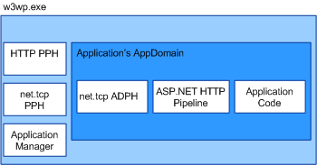

# WAS Activation Architecture
This topic itemizes and discusses the components of the Windows Process Activation Service (also known as WAS).  
  
## Activation Components  
 WAS consists of several architectural components:  
  
-   Listener adapters. Windows services that receive messages on specific network protocols and communicate with WAS to route incoming messages to the correct worker process.  
  
-   WAS. The Windows service that manages the creation and lifetime of worker processes.  
  
-   The generic worker process executable (w3wp.exe).  
  
-   Application manager. Manages the creation and lifetime of application domains that host applications within the worker process.  
  
-   Protocol handlers. Protocol-specific components that run in the worker process and manage communication between the worker process and the individual listener adapters. Two types of protocol handlers exist: process protocol handlers and AppDomain protocol handlers.  
  
 When WAS activates a worker process instance, it loads the process protocol handlers required into the worker process and uses the application manager to create an application domain to host the application. The application domain loads the application’s code as well as the AppDomain protocol handlers that the network protocols used by the application require.  
  
   
  
### Listener Adapters  
 Listener adapters are individual Windows services that implement the network communication logic used to receive messages using the network protocol on which they listen. The following table lists the listener adapters for [!INCLUDE[indigo1](../../../../includes/indigo1-md.md)] protocols.  
  
|Listener adapter service name|Protocol|Notes|  
|-----------------------------------|--------------|-----------|  
|W3SVC|http|Common component that provides HTTP activation for both IIS 7.0 and [!INCLUDE[indigo2](../../../../includes/indigo2-md.md)].|  
|NetTcpActivator|net.tcp|Depends on the NetTcpPortSharing service.|  
|NetPipeActivator|net.pipe||  
|NetMsmqActivator|net.msmq|For use with [!INCLUDE[indigo2](../../../../includes/indigo2-md.md)]-based Message Queuing applications.|  
|NetMsmqActivator|msmq.formatname|Provides backwards compatibility with existing Message Queuing applications.|  
  
 Listener adapters for specific protocols are registered during installation in the applicationHost.config file, as shown in the following XML example.  
  
```xml  
<system.applicationHost>  
    <listenerAdapters>  
        <add name="http" />  
        <add name="net.tcp"   
          identity="S-1-5-80-3579033775-2824656752-1522793541-1960352512-462907086" />  
         <add name="net.pipe"   
           identity="S-1-5-80-2943419899-937267781-4189664001-1229628381-3982115073" />  
          <add name="net.msmq"   
            identity="S-1-5-80-89244771-1762554971-1007993102-348796144-2203111529" />  
           <add name="msmq.formatname"   
             identity="S-1-5-80-89244771-1762554971-1007993102-348796144-2203111529" />  
    </listenerAdapters>  
</system.applicationHost>  
```  
  
### Protocol Handlers  
 Process and AppDomain protocol handlers for specific protocols are registered in the machine-level Web.config file.  
  
```xml  
<system.web>  
   <protocols>  
      <add name="net.tcp"   
        processHandlerType=  
         "System.ServiceModel.WasHosting.TcpProcessProtocolHandler"  
        appDomainHandlerType=  
         "System.ServiceModel.WasHosting.TcpAppDomainProtocolHandler"  
        validate="false" />  
      <add name="net.pipe"   
        processHandlerType=  
         "System.ServiceModel.WasHosting.NamedPipeProcessProtocolHandler"  
          appDomainHandlerType=  
           "System.ServiceModel.WasHosting.NamedPipeAppDomainProtocolHandler"/>  
      <add name="net.msmq"  
        processHandlerType=  
         "System.ServiceModel.WasHosting.MsmqProcessProtocolHandler"  
        appDomainHandlerType=  
         "System.ServiceModel.WasHosting.MsmqAppDomainProtocolHandler"  
        validate="false" />  
   </protocols>  
</system.web>  
```  
  
## See Also  
 [Configuring WAS for Use with WCF](../../../../docs/framework/wcf/feature-details/configuring-the-wpa--service-for-use-with-wcf.md)  
 [Windows Server App Fabric Hosting Features](http://go.microsoft.com/fwlink/?LinkId=201276)
