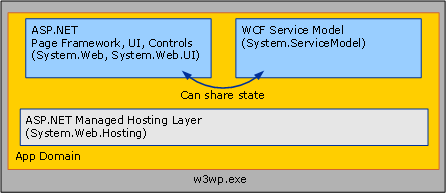

# WCF Services and ASP.NET
This topic discusses hosting [!INCLUDE[indigo1](../../../../includes/indigo1-md.md)] services side-by-side with ASP.NET and hosting them in ASP.NET compatibility mode.  
  
## Hosting WCF Side-by-Side with ASP.NET  
 [!INCLUDE[indigo2](../../../../includes/indigo2-md.md)] services hosted in Internet Information Services (IIS) can be located with .ASPX pages and ASMX Web services inside of a single, common Application Domain. ASP.NET provides common infrastructure services such as AppDomain management and dynamic compilation for both [!INCLUDE[indigo2](../../../../includes/indigo2-md.md)] and the ASP.NET HTTP runtime. The default configuration for [!INCLUDE[indigo2](../../../../includes/indigo2-md.md)] is side-by-side with ASP.NET.  
  
   
  
 The ASP.NET HTTP runtime handles ASP.NET requests but does not participate in the processing of requests destined for [!INCLUDE[indigo2](../../../../includes/indigo2-md.md)] services, even though these services are hosted in the same AppDomain as is the ASP.NET content. Instead, the [!INCLUDE[indigo2](../../../../includes/indigo2-md.md)] Service Model intercepts messages addressed to [!INCLUDE[indigo2](../../../../includes/indigo2-md.md)] services and routes them through the [!INCLUDE[indigo2](../../../../includes/indigo2-md.md)] transport/channel stack.  
  
 The results of the side-by-side model are as follows:  
  
-   ASP.NET and [!INCLUDE[indigo2](../../../../includes/indigo2-md.md)] services can share AppDomain state. Because the two frameworks can coexist in the same AppDomain, [!INCLUDE[indigo2](../../../../includes/indigo2-md.md)] can also share AppDomain state with ASP.NET (including static variables, events, and so on).  
  
-   [!INCLUDE[indigo2](../../../../includes/indigo2-md.md)] services behave consistently, independent of hosting environment and transport. The ASP.NET HTTP runtime is intentionally coupled to the IIS/ASP.NET hosting environment and HTTP communication. Conversely, [!INCLUDE[indigo2](../../../../includes/indigo2-md.md)] is designed to behave consistently across hosting environments ([!INCLUDE[indigo2](../../../../includes/indigo2-md.md)] behaves consistently both inside and outside of IIS) and across transport (a service hosted in IIS 7.0 and later has consistent behavior across all endpoints it exposes, even if some of those endpoints use protocols other than HTTP).  
  
-   Within an AppDomain, features implemented by the HTTP runtime apply to ASP.NET content but not to [!INCLUDE[indigo2](../../../../includes/indigo2-md.md)]. Many HTTP-specific features of the ASP.NET application platform do not apply to [!INCLUDE[indigo2](../../../../includes/indigo2-md.md)] Services hosted inside of an AppDomain that contains ASP.NET content. Examples of these features include the following:  
  
    -   HttpContext: <xref:System.Web.HttpContext.Current%2A> is always `null` when accessed from within a [!INCLUDE[indigo2](../../../../includes/indigo2-md.md)] service. Use <!--zz <xref:System.ServiceModel.OperationContext.Current.RequestContext>--> `RequestContext` instead.  
  
    -   File-based authorization: The [!INCLUDE[indigo2](../../../../includes/indigo2-md.md)] security model does not allow for the access control list (ACL) applied to the .svc file of the service when deciding if a service request is authorized.  
  
    -   Configuration-based URL Authorization: Similarly, the [!INCLUDE[indigo2](../../../../includes/indigo2-md.md)] security model does not adhere to any URL-based authorization rules specified in System.Web’s \<authorization> configuration element. These settings are ignored for [!INCLUDE[indigo2](../../../../includes/indigo2-md.md)] requests if a service resides in a URL space secured by ASP.NET’s URL authorization rules.  
  
    -   HttpModule extensibility: The [!INCLUDE[indigo2](../../../../includes/indigo2-md.md)] hosting infrastructure intercepts [!INCLUDE[indigo2](../../../../includes/indigo2-md.md)] requests when the <xref:System.Web.HttpApplication.PostAuthenticateRequest> event is raised and does not return processing to the ASP.NET HTTP pipeline. Modules that are coded to intercept requests at later stages of the pipeline do not intercept [!INCLUDE[indigo2](../../../../includes/indigo2-md.md)] requests.  
  
    -   ASP.NET impersonation: By default, [!INCLUDE[indigo2](../../../../includes/indigo2-md.md)] requests always runs as the IIS process identity, even if ASP.NET is set to enable impersonation using System.Web’s \<identity impersonate="true" /> configuration option.  
  
 These restrictions apply only to [!INCLUDE[indigo2](../../../../includes/indigo2-md.md)] services hosted in IIS application. The behavior of ASP.NET content is not affected by the presence of [!INCLUDE[indigo2](../../../../includes/indigo2-md.md)].  
  
 [!INCLUDE[indigo2](../../../../includes/indigo2-md.md)] applications that require functionality traditionally provided by the HTTP pipeline should consider using the [!INCLUDE[indigo2](../../../../includes/indigo2-md.md)] equivalents, which are host and transport independent:  
  
-   <xref:System.ServiceModel.OperationContext> instead of <xref:System.Web.HttpContext>.  
  
-   <xref:System.ServiceModel.Description.ServiceAuthorizationBehavior> instead of ASP.NET’s File/URL Authorization.  
  
-   <xref:System.ServiceModel.Dispatcher.IDispatchMessageInspector> or custom layered channels instead of HTTP modules.  
  
-   Impersonation for each operation using [!INCLUDE[indigo2](../../../../includes/indigo2-md.md)] instead of System.Web impersonation.  
  
 Alternatively, you can consider running your services in [!INCLUDE[indigo2](../../../../includes/indigo2-md.md)]’s ASP.NET compatibility mode.  
  
## Hosting WCF Services in ASP.NET Compatibility Mode  
 Although the [!INCLUDE[indigo2](../../../../includes/indigo2-md.md)] model is designed to behave consistently across hosting environments and transports, there are often scenarios where an application does not require this degree of flexibility. [!INCLUDE[indigo2](../../../../includes/indigo2-md.md)]’s ASP.NET compatibility mode is suitable for scenarios that do not require the ability to host outside of IIS or to communicate over protocols other than HTTP, but that use all of features of the ASP.NET Web application platform.  
  
 Unlike the default side-by-side configuration, where the [!INCLUDE[indigo2](../../../../includes/indigo2-md.md)] hosting infrastructure intercepts [!INCLUDE[indigo2](../../../../includes/indigo2-md.md)] messages and routes them out of the HTTP pipeline, [!INCLUDE[indigo2](../../../../includes/indigo2-md.md)] services running in ASP.NET Compatibility Mode participate fully in the ASP.NET HTTP request lifecycle. In compatibility mode, [!INCLUDE[indigo2](../../../../includes/indigo2-md.md)] services use the HTTP pipeline through an <xref:System.Web.IHttpHandler> implementation, similar to the way requests for ASPX pages and ASMX Web services are handled. As a result, [!INCLUDE[indigo2](../../../../includes/indigo2-md.md)] behaves identically to ASMX with respect to the following ASP.NET features:  
  
-   <xref:System.Web.HttpContext>: [!INCLUDE[indigo2](../../../../includes/indigo2-md.md)] services running in ASP.NET Compatibility Mode can access <xref:System.Web.HttpContext.Current%2A> and its associated state.  
  
-   File-based authorization: [!INCLUDE[indigo2](../../../../includes/indigo2-md.md)] services running in ASP.NET compatibility mode can be secure by attaching file system access control lists (ACLs) to the service’s .svc file.  
  
-   Configurable URL authorization: ASP.NET’s URL authorization rules are enforced for [!INCLUDE[indigo2](../../../../includes/indigo2-md.md)] requests when the [!INCLUDE[indigo2](../../../../includes/indigo2-md.md)] service is running in ASP.NET Compatibility Mode.  
  
-   <xref:System.Web.HttpModuleCollection> extensibility: Because [!INCLUDE[indigo2](../../../../includes/indigo2-md.md)] services running in ASP.NET Compatibility Mode participate fully in the ASP.NET HTTP request lifecycle, any HTTP module configured in the HTTP pipeline is able to operate on [!INCLUDE[indigo2](../../../../includes/indigo2-md.md)] requests both before and after service invocation.  
  
-   ASP.NET Impersonation: [!INCLUDE[indigo2](../../../../includes/indigo2-md.md)] services run using the current identity of the ASP.NET impersonated thread, which may be different than the IIS process identity if ASP.NET impersonation has been enabled for the application. If ASP.NET impersonation and [!INCLUDE[indigo2](../../../../includes/indigo2-md.md)] impersonation are both enabled for a particular service operation, the service implementation ultimately runs using the identity obtained from [!INCLUDE[indigo2](../../../../includes/indigo2-md.md)].  
  
 [!INCLUDE[indigo2](../../../../includes/indigo2-md.md)]’s ASP.NET compatibility mode is enabled at the application level through the following configuration (located in the application’s Web.config file):  
  
```xml  
<system.serviceModel>  
    <serviceHostingEnvironment aspNetCompatibilityEnabled="true" />  
</system.serviceModel>  
```  
  
 This value defaults to "`true`" if not specified. Setting this value to "`false`" indicates that all [!INCLUDE[indigo2](../../../../includes/indigo2-md.md)] services running in the application will not run in ASP.NET Compatibility Mode.  
  
 Because ASP.NET Compatibility Mode implies request processing semantics that are fundamentally different from the [!INCLUDE[indigo2](../../../../includes/indigo2-md.md)] default, individual service implementations have the ability to control whether they run inside of an application for which ASP.NET Compatibility Mode has been enabled. Services can use the <xref:System.ServiceModel.Activation.AspNetCompatibilityRequirementsAttribute> to indicate whether they support ASP.NET Compatibility Mode. The default value for this attribute is <xref:System.ServiceModel.Activation.AspNetCompatibilityRequirementsMode.Allowed>.  
  
 `[AspNetCompatibilityRequirements(RequirementsMode = AspNetCompatibilityRequirementsMode.Allowed)]`  
  
 `public class CalculatorService : ICalculatorSession`  
  
 `{//Implement calculator service methods.}`  
  
 The following table illustrates how the application-wide compatibility mode setting interacts with the individual service’s stated level of support:  
  
|Application-wide Compatibility Mode setting|[AspNetCompatibilityRequirementsMode]<br /><br /> Setting|Observed Result|  
|--------------------------------------------------|---------------------------------------------------------|---------------------|  
|aspNetCompatibilityEnabled = "`true`"|<xref:System.ServiceModel.Activation.AspNetCompatibilityRequirementsMode.Required>|Service activates successfully.|  
|aspNetCompatibilityEnabled = "`true`"|<xref:System.ServiceModel.Activation.AspNetCompatibilityRequirementsMode.Allowed>|Service activates successfully.|  
|aspNetCompatibilityEnabled = "`true`"|<xref:System.ServiceModel.Activation.AspNetCompatibilityRequirementsMode.NotAllowed>|An activation error occurs when the service receives a message.|  
|aspNetCompatibilityEnabled = "`false`"|<xref:System.ServiceModel.Activation.AspNetCompatibilityRequirementsMode.Required>|An activation error occurs when the service receives a message.|  
|aspNetCompatibilityEnabled = "`false`"|<xref:System.ServiceModel.Activation.AspNetCompatibilityRequirementsMode.Allowed>|Service activates successfully.|  
|aspNetCompatibilityEnabled = "`false`"|<xref:System.ServiceModel.Activation.AspNetCompatibilityRequirementsMode.NotAllowed>|Service activates successfully.|  
  
> [!NOTE]
>  IIS 7.0 and WAS allows [!INCLUDE[indigo2](../../../../includes/indigo2-md.md)] services to communicate over protocols other than HTTP. However, [!INCLUDE[indigo2](../../../../includes/indigo2-md.md)] services running in applications that have enabled ASP.NET compatibility mode are not permitted to expose non-HTTP endpoints. Such a configuration generates an activation exception when the service receives its first message.  
  
 For more information about enabling ASP.NET compatibility mode for [!INCLUDE[indigo2](../../../../includes/indigo2-md.md)] services, see <xref:System.ServiceModel.Activation.AspNetCompatibilityRequirementsMode> and the [ASP.NET Compatibility](../../../../docs/framework/wcf/samples/aspnet-compatibility.md) sample.  
  
## See Also  
 <xref:System.ServiceModel.Activation.AspNetCompatibilityRequirementsAttribute>  
 [Windows Server App Fabric Hosting Features](http://go.microsoft.com/fwlink/?LinkId=201276)
