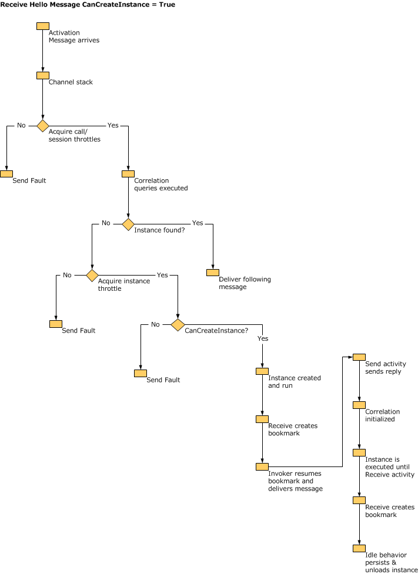

# Workflow Service Host Internals
<xref:System.ServiceModel.WorkflowServiceHost> provides a host for workflow services. It is responsible for listening for incoming messages and routing them to the appropriate workflow service instance, it controls unloading and persisting of idle workflows, and more. This topic describes how WorkflowServiceHost processes incoming messages.  
  
## WorkflowServiceHost Overview  
 The <xref:System.ServiceModel.WorkflowServiceHost> class is used to host workflow services. It listens for incoming messages and routes them to the appropriate service instance, creating new instances or loading existing instances from durable storage as needed.  The following diagram illustrates on a high level how <xref:System.ServiceModel.WorkflowServiceHost> works.  
  
   
  
 This diagram shows that <xref:System.ServiceModel.WorkflowServiceHost> loads workflow service definitions from .xamlx files and loads configuration information from a configuration file. It also loads tracking configuration from the tracking profile. <xref:System.ServiceModel.WorkflowServiceHost> exposes a workflow control endpoint which allows you to send control operations to workflow instances.  For more information see [Workflow Control Endpoint](../../../../docs/framework/wcf/feature-details/workflow-control-endpoint.md) and [Workflow Management Endpoint Sample](../../../../docs/framework/windows-workflow-foundation/samples/workflow-management-endpoint-sample.md).  
  
 <xref:System.ServiceModel.WorkflowServiceHost> also exposes application endpoints that listen for incoming application messages. When an incoming message arrives it is sent to the appropriate workflow service instance (if it is currently loaded). If needed a new workflow instance is created. Or if an existing instance has been persisted it is loaded from the persistence store.  
  
## WorkflowServiceHost Details  
 The following diagram shows how <xref:System.ServiceModel.WorkflowServiceHost> handles messages in a bit more detail.  
  
   
  
 This diagram shows three different endpoints, an application endpoint, a workflow control endpoint, and a workflow hosting endpoint. The application endpoint receives messages that are bound for a specific workflow instance. The workflow control endpoint listens for control operations. The workflow hosting endpoint listens for messages that cause <xref:System.ServiceModel.WorkflowServiceHost> to load and execute non-service workflows. As shown in the diagram all messages are processed through the WCF runtime.  Workflow service instance throttling is achieved by using the <xref:System.ServiceModel.Description.ServiceThrottlingBehavior.MaxConcurrentInstances%2A> property. This property will limit the number of concurrent workflow service instances. When this throttle is exceeded any additional requests for new workflow service instances or requests to activate persisted workflow instances will be queued. The queued requests are processed in FIFO order regardless of whether they are requests for a new instance or a running, persisted instance. Host policy information is loaded that determines how unhandled exceptions are dealt with, and how idle workflow services are unloaded and persisted. [!INCLUDE[crabout](../../../../includes/crabout-md.md)] these topics see [How to: Configure Workflow Unhandled Exception Behavior with WorkflowServiceHost](../../../../docs/framework/wcf/feature-details/config-workflow-unhandled-exception-workflowservicehost.md) and [How to: Configure Idle Behavior with WorkflowServiceHost](../../../../docs/framework/wcf/feature-details/how-to-configure-idle-behavior-with-workflowservicehost.md). Workflow instances are persisted according to host policies and are reloaded when needed. For more information about workflow persistence see: [How to: Configure Persistence with WorkflowServiceHost](../../../../docs/framework/wcf/feature-details/how-to-configure-persistence-with-workflowservicehost.md), [Creating a Long-running Workflow Service](../../../../docs/framework/wcf/feature-details/creating-a-long-running-workflow-service.md), and [Workflow Persistence](../../../../docs/framework/windows-workflow-foundation/workflow-persistence.md).  
  
 The following illustration shows what the WorkflowServiceHost.Open is called.  
  
   
  
 The workflow is loaded from XAML and the activity tree is created. <xref:System.ServiceModel.WorkflowServiceHost> walks the activity tree and creates the service description. Configuration is applied to the host. Finally the host begins to listen for incoming messages.  
  
 The following illustration shows what the <xref:System.ServiceModel.WorkflowServiceHost> does when it receives a message bound for a Receive activity that has CanCreateInstance set to `true`.  
  
   
  
 The message arrives and is processed by the WCF channel stack. Throttles are checked and correlation queries are executed. If the message is bound for an existing instance the message is delivered. If a new instance needs to be created, the Receive activity’s CanCreateInstance property is checked. If it is set to true, a new instance is created and the message is delivered.  
  
 The following illustration shows what the <xref:System.ServiceModel.WorkflowServiceHost> does when it receives a message bound for a Receive activity that has CanCreateInstance set to false.  
  
   
  
 The message arrives and is processed by the WCF channel stack. Throttles are checked and correlation queries are executed. The message is bound for an existing instance (because CanCreateInstance is false) so the instance is loaded from persistence store, the bookmark is resumed and the workflow executes.  
  
> [!WARNING]
>  Workflow Service Host will fail to open if SQL Server is configured to listen on NamedPipe protocol only.  
  
## See Also  
 [Workflow Services](../../../../docs/framework/wcf/feature-details/workflow-services.md)  
 [Hosting Workflow Services](../../../../docs/framework/wcf/feature-details/hosting-workflow-services.md)  
 [Workflow Control Endpoint](../../../../docs/framework/wcf/feature-details/workflow-control-endpoint.md)  
 [Workflow Management Endpoint Sample](../../../../docs/framework/windows-workflow-foundation/samples/workflow-management-endpoint-sample.md)  
 [How to: Configure Workflow Unhandled Exception Behavior with WorkflowServiceHost](../../../../docs/framework/wcf/feature-details/config-workflow-unhandled-exception-workflowservicehost.md)  
 [Creating a Long-running Workflow Service](../../../../docs/framework/wcf/feature-details/creating-a-long-running-workflow-service.md)  
 [Workflow Persistence](../../../../docs/framework/windows-workflow-foundation/workflow-persistence.md)
