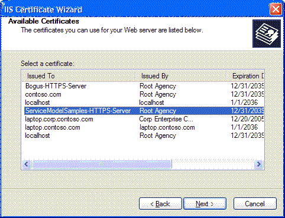

# Internet Information Services (IIS) Server Certificate Installation Instructions
To run the samples that securely communicate with Internet Information Services (IIS), you must create and install a server certificate.  
  
## Step 1. Creating Certificates  
 To create a certificate for your computer, open a Visual Studio command prompt with administrator privileges and run the Setup.bat that is included in each of the samples that use secure communication with IIS. Ensure that the path includes the folder that contains Makecert.exe before you run this batch file. The following command is used to create the certificate in Setup.bat.  
  
```  
makecert -sr LocalMachine -ss My -n CN=ServiceModelSamples-HTTPS-Server -sky exchange -sk ServiceModelSamples-HTTPS-Key  
```  
  
## Step 2. Installing Certificates  
 The steps required to install the certificates you just created depend on which version of IIS you are using.  
  
#### To install IIS on IIS 5.1 (Windows XP) and IIS 6.0 (Windows Server 2003)  
  
1.  Open the Internet Information Services Manager MMC Snap-In.  
  
2.  Right-click the default Web site and select **Properties**.  
  
3.  Select the **Directory Security** tab.  
  
4.  Click the **Server Certificate** button. The Web Server Certificate Wizard starts.  
  
5.  Complete the wizard. Select the option to assign a certificate. Select the ServiceModelSamples-HTTPS-Server certificate from the list of certificates that are displayed.  
  
       
  
6.  Test access to the service in a browser by using the HTTPS address https://localhost/servicemodelsamples/service.svc.  
  
#### If SSL was previously configured by using Httpcfg.exe  
  
1.  Use Makecert.exe (or run Setup.bat) to create the server certificate.  
  
2.  Run the IIS manager and install the certificate according to the previous steps.  
  
3.  Add the following line of code to the client program.  
  
> [!IMPORTANT]
>  This code is only required for test certificates such as those created by Makecert.exe. It is not recommended for production code.  
  
```  
PermissiveCertificatePolicy.Enact("CN=ServiceModelSamples-HTTPS-Server");  
```  
  
#### To install IIS on IIS 7.0 (Windows Vista and Windows Server 2008)  
  
1.  From the **Start** menu, click **Run**, then type **inetmgr** to open the Internet Information Services (IIS) MMC snap-in.  
  
2.  Right-click the **Default Web Site** and select **Edit Bindings…**  
  
3.  Click the **Add** button of the **Site Bindings** dialog box.  
  
4.  Select **HTTPS** from the **Type** drop-down list.  
  
5.  Select the **ServiceModelSamples-HTTPS-Server** from the **SSL certificate** drop-down list and click **OK**.  
  
6.  Test access to the service in a browser by using the HTTPS address https://localhost/servicemodelsamples/service.svc.  
  
> [!NOTE]
>  Because the test certificate you have just installed is not a trusted certificate, you may encounter additional Internet Explorer security warnings when browsing to local Web addresses secured with this certificate.  
  
## Removing Certificates  
  
-   Use the Internet Information Services Manager as previously directed, but remove the certificate or binding instead of adding it.  
  
-   Remove the computer certificate by using the following command.  
  
    ```  
    httpcfg delete ssl -i 0.0.0.0:443  
    ```
