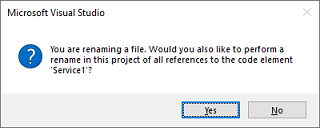
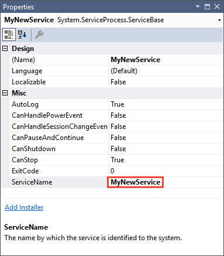
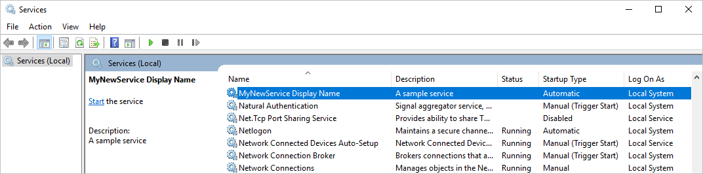
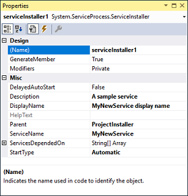

# Tutorial: Create a Windows service app

This article demonstrates how to create a Windows service app in Visual Studio that writes messages to an event log.

## Create a service

To begin, create the project and set the values that are required for the service to function correctly.

1. From the Visual Studio **File** menu, select **New** > **Project** (or press **Ctrl**+**Shift**+**N**) to open the **New Project** window.

2. Navigate to and select the **Windows Service (.NET Framework)** project template. To find it, expand **Installed** and **Visual C#** or **Visual Basic**, then select **Windows Desktop**. Or, enter *Windows Service* in the search box on the upper right and press **Enter**.

   

   > [!NOTE]
   > If you don't see the **Windows Service** template, you may need to install the **.NET desktop development** workload:
   >
   > In the **New Project** dialog, select **Open Visual Studio Installer** on the lower left. Select the **.NET desktop development** workload, and then select **Modify**.

3. For **Name**, enter *MyNewService*, and then select **OK**.

   The **Design** tab appears (**Service1.cs [Design]** or **Service1.vb [Design]**).

   The project template includes a component class named `Service1` that inherits from <xref:System.ServiceProcess.ServiceBase?displayProperty=nameWithType>. It includes much of the basic service code, such as the code to start the service.

## Rename the service

Rename the service from **Service1** to **MyNewService**.

1. In **Solution Explorer**, select **Service1.cs**, or **Service1.vb**, and choose **Rename** from the shortcut menu. Rename the file to **MyNewService.cs**, or **MyNewService.vb**, and then press **Enter**

    A pop-up window appears asking whether you would like to rename all references to the code element *Service1*.

2. In the pop-up window, select **Yes**.

    

3. In the **Design** tab, select **Properties** from the shortcut menu. From the **Properties** window, change the **ServiceName** value to *MyNewService*.

    

4. Select **Save All** from the **File** menu.

## Add features to the service

In this section, you add a custom event log to the Windows service. The <xref:System.Diagnostics.EventLog> component is an example of the type of component you can add to a Windows service.

### Add custom event log functionality

1. In **Solution Explorer**, from the shortcut menu for **MyNewService.cs**, or **MyNewService.vb**, choose **View Designer**.

2. In **Toolbox**, expand **Components**, and then drag the **EventLog** component to the **Service1.cs [Design]**, or **Service1.vb [Design]** tab.

3. In **Solution Explorer**, from the shortcut menu for **MyNewService.cs**, or **MyNewService.vb**, choose **View Code**.

4. Define a custom event log. For C#, edit the existing `MyNewService()` constructor; for Visual Basic, add the `New()` constructor:

   [!code-csharp[VbRadconService#2](../../../samples/snippets/csharp/VS_Snippets_VBCSharp/VbRadconService/CS/MyNewService.cs#2)]
   [!code-vb[VbRadconService#2](../../../samples/snippets/visualbasic/VS_Snippets_VBCSharp/VbRadconService/VB/MyNewService.vb#2)]

5. Add a `using` statement to **MyNewService.cs** (if it doesn't already exist), or an `Imports` statement **MyNewService.vb**, for the <xref:System.Diagnostics?displayProperty=nameWithType> namespace:

    ```csharp
    using System.Diagnostics;
    ```

    ```vb
    Imports System.Diagnostics
    ```

6. Select **Save All** from the **File** menu.

### Define what occurs when the service starts

In the code editor for **MyNewService.cs** or **MyNewService.vb**, locate the <xref:System.ServiceProcess.ServiceBase.OnStart%2A> method; Visual Studio automatically created an empty method definition when you created the project. Add code that writes an entry to the event log when the service starts:

[!code-csharp[VbRadconService#3](../../../samples/snippets/csharp/VS_Snippets_VBCSharp/VbRadconService/CS/MyNewService.cs#3)]
[!code-vb[VbRadconService#3](../../../samples/snippets/visualbasic/VS_Snippets_VBCSharp/VbRadconService/VB/MyNewService.vb#3)]

#### Polling

Because a service application is designed to be long-running, it usually polls or monitors the system, which you set up in the <xref:System.ServiceProcess.ServiceBase.OnStart%2A> method. The `OnStart` method must return to the operating system after the service's operation has begun so that the system isn't blocked.

To set up a simple polling mechanism, use the <xref:System.Timers.Timer?displayProperty=nameWithType> component. The timer raises an <xref:System.Timers.Timer.Elapsed> event at regular intervals, at which time your service can do its monitoring. You use the <xref:System.Timers.Timer> component as follows:

- Set the properties of the <xref:System.Timers.Timer> component in the `MyNewService.OnStart` method.
- Start the timer by calling the <xref:System.Timers.Timer.Start%2A> method.

##### Set up the polling mechanism.

1. Add the following code in the `MyNewService.OnStart` event to set up the polling mechanism:

   ```csharp
   // Set up a timer that triggers every minute.
   Timer timer = new Timer();
   timer.Interval = 60000; // 60 seconds
   timer.Elapsed += new ElapsedEventHandler(this.OnTimer);
   timer.Start();
   ```

   ```vb
   ' Set up a timer that triggers every minute.
   Dim timer As Timer = New Timer()
   timer.Interval = 60000 ' 60 seconds
   AddHandler timer.Elapsed, AddressOf Me.OnTimer
   timer.Start()
   ```

2. Add a `using` statement to **MyNewService.cs**, or an `Imports` statement to **MyNewService.vb**, for the <xref:System.Timers?displayProperty=nameWithType> namespace:

   ```csharp
   using System.Timers;
   ```

   ```vb
   Imports System.Timers
   ```

3. In the `MyNewService` class, add the `OnTimer` method to handle the <xref:System.Timers.Timer.Elapsed?displayProperty=nameWithType> event:

   ```csharp
   public void OnTimer(object sender, ElapsedEventArgs args)
   {
       // TODO: Insert monitoring activities here.
       eventLog1.WriteEntry("Monitoring the System", EventLogEntryType.Information, eventId++);
   }
   ```

   ```vb
   Private Sub OnTimer(sender As Object, e As Timers.ElapsedEventArgs)
      ' TODO: Insert monitoring activities here.
      eventLog1.WriteEntry("Monitoring the System", EventLogEntryType.Information, eventId)
      eventId = eventId + 1
   End Sub
   ```

4. In the `MyNewService` class, add a member variable. It contains the identifier of the next event to write into the event log:

   ```csharp
   private int eventId = 1;
   ```

   ```vb
   Private eventId As Integer = 1
   ```

Instead of running all your work on the main thread, you can run tasks by using background worker threads. For more information, see <xref:System.ComponentModel.BackgroundWorker?displayProperty=fullName>.

### Define what occurs when the service is stopped

Insert a line of code in the <xref:System.ServiceProcess.ServiceBase.OnStop%2A> method that adds an entry to the event log when the service is stopped:

[!code-csharp[VbRadconService#2](../../../samples/snippets/csharp/VS_Snippets_VBCSharp/VbRadconService/CS/MyNewService.cs#4)]
[!code-vb[VbRadconService#4](../../../samples/snippets/visualbasic/VS_Snippets_VBCSharp/VbRadconService/VB/MyNewService.vb#4)]

### Define other actions for the service

You can override the <xref:System.ServiceProcess.ServiceBase.OnPause%2A>, <xref:System.ServiceProcess.ServiceBase.OnContinue%2A>, and <xref:System.ServiceProcess.ServiceBase.OnShutdown%2A> methods to define additional processing for your component.

The following code shows how you to override the <xref:System.ServiceProcess.ServiceBase.OnContinue%2A> method in the `MyNewService` class:

[!code-csharp[VbRadconService#5](../../../samples/snippets/csharp/VS_Snippets_VBCSharp/VbRadconService/CS/MyNewService.cs#5)]
[!code-vb[VbRadconService#5](../../../samples/snippets/visualbasic/VS_Snippets_VBCSharp/VbRadconService/VB/MyNewService.vb#5)]

## Set service status

Services report their status to the [Service Control Manager](/windows/desktop/Services/service-control-manager) so that a user can tell whether a service is functioning correctly. By default, a service that inherits from <xref:System.ServiceProcess.ServiceBase> reports a limited set of status settings, which include SERVICE_STOPPED, SERVICE_PAUSED, and SERVICE_RUNNING. If a service takes a while to start up, it's useful to report a SERVICE_START_PENDING status.

You can implement the SERVICE_START_PENDING and SERVICE_STOP_PENDING status settings by adding code that calls the Windows [SetServiceStatus](/windows/desktop/api/winsvc/nf-winsvc-setservicestatus) function.

### Implement service pending status

1. Add a `using` statement to **MyNewService.cs**, or an `Imports` statement to **MyNewService.vb**, for the <xref:System.Runtime.InteropServices?displayProperty=nameWithType> namespace:

    ```csharp
    using System.Runtime.InteropServices;
    ```

    ```vb
    Imports System.Runtime.InteropServices
    ```

2. Add the following code to **MyNewService.cs**, or **MyNewService.vb**, to declare the `ServiceState` values and to add a structure for the status, which you'll use in a platform invoke call:

    ```csharp
    public enum ServiceState
    {
        SERVICE_STOPPED = 0x00000001,
        SERVICE_START_PENDING = 0x00000002,
        SERVICE_STOP_PENDING = 0x00000003,
        SERVICE_RUNNING = 0x00000004,
        SERVICE_CONTINUE_PENDING = 0x00000005,
        SERVICE_PAUSE_PENDING = 0x00000006,
        SERVICE_PAUSED = 0x00000007,
    }

    [StructLayout(LayoutKind.Sequential)]
    public struct ServiceStatus
    {
        public int dwServiceType;
        public ServiceState dwCurrentState;
        public int dwControlsAccepted;
        public int dwWin32ExitCode;
        public int dwServiceSpecificExitCode;
        public int dwCheckPoint;
        public int dwWaitHint;
    };
    ```

    ```vb
    Public Enum ServiceState
        SERVICE_STOPPED = 1
        SERVICE_START_PENDING = 2
        SERVICE_STOP_PENDING = 3
        SERVICE_RUNNING = 4
        SERVICE_CONTINUE_PENDING = 5
        SERVICE_PAUSE_PENDING = 6
        SERVICE_PAUSED = 7
    End Enum

    <StructLayout(LayoutKind.Sequential)>
    Public Structure ServiceStatus
        Public dwServiceType As Long
        Public dwCurrentState As ServiceState
        Public dwControlsAccepted As Long
        Public dwWin32ExitCode As Long
        Public dwServiceSpecificExitCode As Long
        Public dwCheckPoint As Long
        Public dwWaitHint As Long
    End Structure
    ```

    > [!NOTE]
    > The Service Control Manager uses the `dwWaitHint` and `dwCheckpoint` members of the [SERVICE_STATUS structure](/windows/win32/api/winsvc/ns-winsvc-service_status) to determine how much time to wait for a Windows service to start or shut down. If your `OnStart` and `OnStop` methods run long, your service can request more time by calling `SetServiceStatus` again with an incremented `dwCheckPoint` value.

3. In the `MyNewService` class, declare the [SetServiceStatus](/windows/desktop/api/winsvc/nf-winsvc-setservicestatus) function by using [platform invoke](../interop/consuming-unmanaged-dll-functions.md):

    ```csharp
    [DllImport("advapi32.dll", SetLastError = true)]
    private static extern bool SetServiceStatus(System.IntPtr handle, ref ServiceStatus serviceStatus);
    ```

    ```vb
    Declare Auto Function SetServiceStatus Lib "advapi32.dll" (ByVal handle As IntPtr, ByRef serviceStatus As ServiceStatus) As Boolean
    ```

4. To implement the SERVICE_START_PENDING status, add the following code to the beginning of the <xref:System.ServiceProcess.ServiceBase.OnStart%2A> method:

    ```csharp
    // Update the service state to Start Pending.
    ServiceStatus serviceStatus = new ServiceStatus();
    serviceStatus.dwCurrentState = ServiceState.SERVICE_START_PENDING;
    serviceStatus.dwWaitHint = 100000;
    SetServiceStatus(this.ServiceHandle, ref serviceStatus);
    ```

    ```vb
    ' Update the service state to Start Pending.
    Dim serviceStatus As ServiceStatus = New ServiceStatus()
    serviceStatus.dwCurrentState = ServiceState.SERVICE_START_PENDING
    serviceStatus.dwWaitHint = 100000
    SetServiceStatus(Me.ServiceHandle, serviceStatus)
    ```

5. Add code to the end of the `OnStart` method to set the status to SERVICE_RUNNING:

    ```csharp
    // Update the service state to Running.
    serviceStatus.dwCurrentState = ServiceState.SERVICE_RUNNING;
    SetServiceStatus(this.ServiceHandle, ref serviceStatus);
    ```

    ```vb
    ' Update the service state to Running.
    serviceStatus.dwCurrentState = ServiceState.SERVICE_RUNNING
    SetServiceStatus(Me.ServiceHandle, serviceStatus)
    ```

6. (Optional) If <xref:System.ServiceProcess.ServiceBase.OnStop%2A> is a long-running method, repeat this procedure in the `OnStop` method. Implement the SERVICE_STOP_PENDING status and return the SERVICE_STOPPED status before the `OnStop` method exits.

   For example:

    ```csharp
    // Update the service state to Stop Pending.
    ServiceStatus serviceStatus = new ServiceStatus();
    serviceStatus.dwCurrentState = ServiceState.SERVICE_STOP_PENDING;
    serviceStatus.dwWaitHint = 100000;
    SetServiceStatus(this.ServiceHandle, ref serviceStatus);

    // Update the service state to Stopped.
    serviceStatus.dwCurrentState = ServiceState.SERVICE_STOPPED;
    SetServiceStatus(this.ServiceHandle, ref serviceStatus);
    ```

    ```vb
    ' Update the service state to Stop Pending.
    Dim serviceStatus As ServiceStatus = New ServiceStatus()
    serviceStatus.dwCurrentState = ServiceState.SERVICE_STOP_PENDING
    serviceStatus.dwWaitHint = 100000
    SetServiceStatus(Me.ServiceHandle, serviceStatus)

    ' Update the service state to Stopped.
    serviceStatus.dwCurrentState = ServiceState.SERVICE_STOPPED
    SetServiceStatus(Me.ServiceHandle, serviceStatus)
    ```

## Add installers to the service

Before you run a Windows service, you need to install it, which registers it with the Service Control Manager. Add installers to your project to handle the registration details.

1. In **Solution Explorer**, from the shortcut menu for **MyNewService.cs**, or **MyNewService.vb**, choose **View Designer**.

2. In the **Design** view, select the background area, then choose **Add Installer** from the shortcut menu.

     By default, Visual Studio adds a component class named `ProjectInstaller`, which contains two installers, to your project. These installers are for your service and for the service's associated process.

3. In the **Design** view for **ProjectInstaller**, select **serviceInstaller1** for a Visual C# project, or **ServiceInstaller1** for a Visual Basic project, then choose **Properties** from the shortcut menu.

4. In the **Properties** window, verify the <xref:System.ServiceProcess.ServiceInstaller.ServiceName%2A> property is set to **MyNewService**.

5. Add text to the <xref:System.ServiceProcess.ServiceInstaller.Description%2A> property, such as *A sample service*.

     This text appears in the **Description** column of the **Services** window and describes the service to the user.

    

6. Add text to the <xref:System.ServiceProcess.ServiceInstaller.DisplayName%2A> property. For example, *MyNewService Display Name*.

     This text appears in the **Display Name** column of the **Services** window. This name can be different from the <xref:System.ServiceProcess.ServiceInstaller.ServiceName%2A> property, which is the name the system uses (for example, the name you use for the `net start` command to start your service).

7. Set the <xref:System.ServiceProcess.ServiceInstaller.StartType%2A> property to <xref:System.ServiceProcess.ServiceStartMode.Automatic> from the drop-down list.

8. When you're finished, the **Properties** windows should look like the following figure:

     

9. In the **Design** view for **ProjectInstaller**, choose **serviceProcessInstaller1** for a Visual C# project, or **ServiceProcessInstaller1** for a Visual Basic project, then choose **Properties** from the shortcut menu. Set the <xref:System.ServiceProcess.ServiceProcessInstaller.Account%2A> property to <xref:System.ServiceProcess.ServiceAccount.LocalSystem> from the drop-down list.

     This setting installs the service and runs it by using the local system account.

    > [!IMPORTANT]
    > The <xref:System.ServiceProcess.ServiceAccount.LocalSystem> account has broad permissions, including the ability to write to the event log. Use this account with caution, because it might increase your risk of attacks from malicious software. For other tasks, consider using the <xref:System.ServiceProcess.ServiceAccount.LocalService> account, which acts as a non-privileged user on the local computer and presents anonymous credentials to any remote server. This example fails if you try to use the <xref:System.ServiceProcess.ServiceAccount.LocalService> account, because it needs permission to write to the event log.

For more information about installers, see [How to: Add installers to your service application](how-to-add-installers-to-your-service-application.md).

## (Optional) Set startup parameters

> [!NOTE]
> Before you decide to add startup parameters, consider whether it's the best way to pass information to your service. Although they're easy to use and parse, and a user can easily override them, they might be harder for a user to discover and use without documentation. Generally, if your service requires more than just a few startup parameters, you should use the registry or a configuration file instead.

A Windows service can accept command-line arguments, or startup parameters. When you add code to process startup parameters, a user can start your service with their own custom startup parameters in the service properties window. However, these startup parameters aren't persisted the next time the service starts. To set startup parameters permanently, set them in the registry.

Each Windows service has a registry entry under the **HKEY_LOCAL_MACHINE\SYSTEM\CurrentControlSet\Services** subkey. Under each service's subkey, use the **Parameters** subkey to store information that your service can access. You can use application configuration files for a Windows service the same way you do for other types of programs. For sample code, see <xref:System.Configuration.ConfigurationManager.AppSettings?displayProperty=nameWithType>.

### To add startup parameters

1. Select **Program.cs**, or **MyNewService.Designer.vb**, then choose **View Code** from the shortcut menu. In the `Main` method, change the code to add an input parameter and pass it to the service constructor:

   [!code-csharp[VbRadconService](../../../samples/snippets/csharp/VS_Snippets_VBCSharp/VbRadconService/CS/Program-add-parameter.cs?highlight=1,6)]
   [!code-vb[VbRadconService](../../../samples/snippets/visualbasic/VS_Snippets_VBCSharp/VbRadconService/VB/MyNewService.Designer-add-parameter.vb?highlight=1-2)]

2. In **MyNewService.cs**, or **MyNewService.vb**, change the `MyNewService` constructor to process the input parameter as follows:

   ```csharp
   using System.Diagnostics;

   public MyNewService(string[] args)
   {
       InitializeComponent();

       string eventSourceName = "MySource";
       string logName = "MyNewLog";

       if (args.Length > 0)
       {
          eventSourceName = args[0];
       }

       if (args.Length > 1)
       {
           logName = args[1];
       }

       eventLog1 = new EventLog();

       if (!EventLog.SourceExists(eventSourceName))
       {
           EventLog.CreateEventSource(eventSourceName, logName);
       }

       eventLog1.Source = eventSourceName;
       eventLog1.Log = logName;
   }
   ```

   ```vb
   Imports System.Diagnostics

   Public Sub New(ByVal cmdArgs() As String)
       InitializeComponent()
       Dim eventSourceName As String = "MySource"
       Dim logName As String = "MyNewLog"
       If (cmdArgs.Count() > 0) Then
           eventSourceName = cmdArgs(0)
       End If
       If (cmdArgs.Count() > 1) Then
           logName = cmdArgs(1)
       End If
       eventLog1 = New EventLog()
       If (Not EventLog.SourceExists(eventSourceName)) Then
           EventLog.CreateEventSource(eventSourceName, logName)
       End If
       eventLog1.Source = eventSourceName
       eventLog1.Log = logName
   End Sub
   ```

   This code sets the event source and log name according to the startup parameters that the user supplies. If no arguments are supplied, it uses default values.

3. To specify the command-line arguments, add the following code to the `ProjectInstaller` class in **ProjectInstaller.cs**, or **ProjectInstaller.vb**:

   ```csharp
   protected override void OnBeforeInstall(IDictionary savedState)
   {
       string parameter = "MySource1\" \"MyLogFile1";
       Context.Parameters["assemblypath"] = "\"" + Context.Parameters["assemblypath"] + "\" \"" + parameter + "\"";
       base.OnBeforeInstall(savedState);
   }
   ```

   ```vb
   Protected Overrides Sub OnBeforeInstall(ByVal savedState As IDictionary)
       Dim parameter As String = "MySource1"" ""MyLogFile1"
       Context.Parameters("assemblypath") = """" + Context.Parameters("assemblypath") + """ """ + parameter + """"
       MyBase.OnBeforeInstall(savedState)
   End Sub
   ```

   Typically, this value contains the full path to the executable for the Windows service. For the service to start up correctly, the user must supply quotation marks for the path and each individual parameter. A user can change the parameters in the **ImagePath** registry entry to change the startup parameters for the Windows service. However, a better way is to change the value programmatically and expose the functionality in a user-friendly way, such as by using a management or configuration utility.

## Build the service

1. In **Solution Explorer**, choose **Properties** from the shortcut menu for the **MyNewService** project.

   The property pages for your project appear.

2. On the **Application** tab, in the **Startup object** list, choose **MyNewService.Program**, or **Sub Main** for Visual Basic projects.

3. To build the project, in **Solution Explorer**, choose **Build** from the shortcut menu for your project (or press **Ctrl**+**Shift**+**B**).

## Install the service

Now that you've built the Windows service, you can install it. To install a Windows service, you must have administrator credentials on the computer where it's installed.

1. Open [Developer Command Prompt for Visual Studio](https://docs.microsoft.com/dotnet/framework/tools/developer-command-prompt-for-vs) with administrative credentials. From the Windows **Start** menu, select **Developer Command Prompt for VS 2017** in the Visual Studio folder, then select **More** > **Run as Administrator** from the shortcut menu.

2. In the **Developer Command Prompt for Visual Studio** window, navigate to the folder that contains your project's output (by default, the *\bin\Debug* subdirectory of your project).

3. Enter the following command:

    ```shell
    installutil MyNewService.exe
    ```

    If the service installs successfully, the command reports success.

    If the system can't find *installutil.exe*, make sure that it exists on your computer. This tool is installed with the .NET Framework to the folder *%windir%\Microsoft.NET\Framework[64]\\&lt;framework version&gt;*. For example, the default path for the 64-bit version is *%windir%\Microsoft.NET\Framework64\v4.0.30319\InstallUtil.exe*.

    If the **installutil.exe** process fails, check the install log to find out why. By default, the log is in the same folder as the service executable. The installation can fail if:
    - The <xref:System.ComponentModel.RunInstallerAttribute> class isn't present on the `ProjectInstaller` class.
    - The attribute isn't set to `true`.
    - The `ProjectInstaller` class isn't defined as `public`.

For more information, see [How to: Install and uninstall services](how-to-install-and-uninstall-services.md).

## Start and run the service

1. In Windows, open the **Services** desktop app. Press **Windows**+**R** to open the **Run** box, enter *services.msc*, and then press **Enter** or select **OK**.

     You should see your service listed in **Services**, displayed alphabetically by the display name that you set for it.

     

2. To start the service, choose **Start** from the service's shortcut menu.

3. To stop the service, choose **Stop** from the service's shortcut menu.

4. (Optional) From the command line, use the commands **net start &lt;service name&gt;** and **net stop &lt;service name&gt;** to start and stop your service.

### Verify the event log output of your service

1. In Windows, open the **Event Viewer** desktop app. Enter *Event Viewer* in the Windows search bar, and then select **Event Viewer** from the search results.

   > [!TIP]
   > In Visual Studio, you can access event logs by opening **Server Explorer** from the **View** menu (or press **Ctrl**+**Alt**+**S**) and expanding the **Event Logs** node for the local computer.

2. In **Event Viewer**, expand **Applications and Services Logs**.

3. Locate the listing for **MyNewLog** (or **MyLogFile1** if you followed the procedure to add command-line arguments) and expand it. You should see the entries for the two actions (start and stop) that your service performed.

     

## Clean up resources

If you no longer need the Windows service app, you can remove it.

1. Open **Developer Command Prompt for Visual Studio** with administrative credentials.

2. In the **Developer Command Prompt for Visual Studio** window, navigate to the folder that contains your project's output.

3. Enter the following command:

    ```shell
    installutil.exe /u MyNewService.exe
    ```

   If the service uninstalls successfully, the command reports that your service was successfully removed. For more information, see [How to: Install and uninstall services](how-to-install-and-uninstall-services.md).

## Next steps

Now that you've created the service, you can:

- Create a standalone setup program for others to use to install your Windows service. Use the [WiX Toolset](https://wixtoolset.org/) to create an installer for a Windows service. For other ideas, see [Create an installer package](/visualstudio/deployment/deploying-applications-services-and-components#create-an-installer-package-windows-desktop).

- Explore the <xref:System.ServiceProcess.ServiceController> component, which enables you to send commands to the service you've installed.

- Instead of creating the event log when the application runs, use an installer to create an event log when you install the application. The event log is deleted by the installer when you uninstall the application. For more information, see <xref:System.Diagnostics.EventLogInstaller>.

## See also

- [Windows service applications](index.md)
- [Introduction to Windows service applications](introduction-to-windows-service-applications.md)
- [How to: Debug Windows service applications](how-to-debug-windows-service-applications.md)
- [Services (Windows)](/windows/desktop/Services/services)
