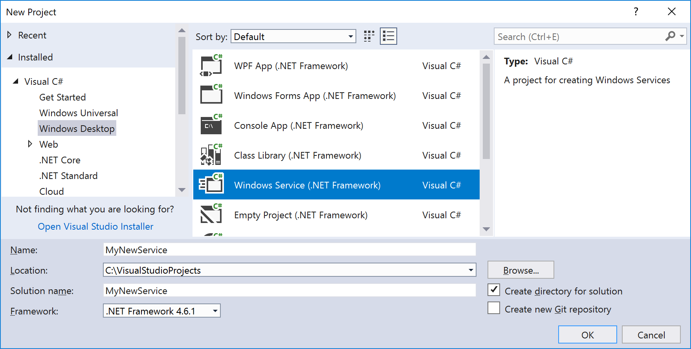
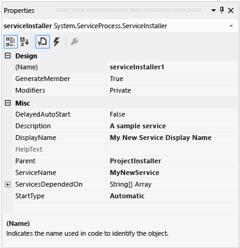
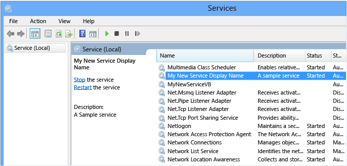
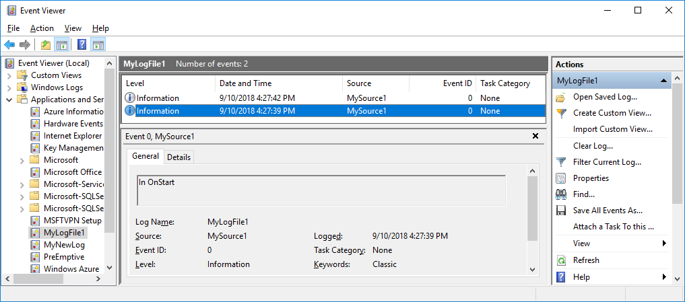

# Walkthrough: Create a Windows service app

This article demonstrates how to create a simple Windows service app in Visual Studio that writes messages to an event log.

## Create a service

To begin, create the project and set values that are required for the service to function correctly.

1. In Visual Studio, on the menu bar, choose **File** > **New** > **Project** (or press **Ctrl**+**Shift**+**N**) to open the **New Project** dialog.

2. Navigate to and select the **Windows Service** project template. Expand **Installed** > [**Visual C#** or **Visual Basic**] > **Windows Desktop**, or type **Windows Service** in the search box on the upper right.

   

   > [!NOTE]
   > If you don't see the **Windows Service** template, you may need to install the **.NET desktop development** workload. In the **New Project** dialog, click the link that says **Open Visual Studio Installer** on the lower left. In **Visual Studio Installer**, select the **.NET desktop development** workload and then choose **Modify**.

3. Name the project **MyNewService**, and then choose **OK**.

   The project template includes a component class named `Service1` that inherits from <xref:System.ServiceProcess.ServiceBase?displayProperty=nameWithType>. It includes much of the basic service code, such as the code to start the service.

## Rename the service

Rename the service from **Service1** to **MyNewService**.

1. In the **Design** view for Service1.cs (or Service1.vb), click the link to **switch to code view**. Right-click on **Service1** and select **Rename** from the context menu. Enter **MyNewService** and then press **Enter** or click **Apply**.

2. In the **Properties** window for **Service1.cs [Design]** or **Service1.vb [Design]**, change the **ServiceName** value to **MyNewService**.

3. In **Solution Explorer**, rename **Service1.cs** to **MyNewService.cs**, or rename **Service1.vb** to **MyNewService.vb**.

## Add features to the service

In this section, you add a custom event log to the Windows service. Event logs are not associated in any way with Windows services. The <xref:System.Diagnostics.EventLog> component is used here as an example of the type of component you can add to a Windows service.

### Add custom event log functionality

1. In **Solution Explorer**, open the context menu for **MyNewService.cs** or **MyNewService.vb**, and then choose **View Designer**.

2. From the **Components** section of the **Toolbox**, drag an <xref:System.Diagnostics.EventLog> component to the designer.

3. In **Solution Explorer**, open the context menu for **MyNewService.cs** or **MyNewService.vb**, and then choose **View Code**.

4. Edit the constructor to define a custom event log:

   ```csharp
   public MyNewService()
   {
        InitializeComponent();

        eventLog1 = new System.Diagnostics.EventLog();
        if (!System.Diagnostics.EventLog.SourceExists("MySource"))
        {
            System.Diagnostics.EventLog.CreateEventSource(
                "MySource", "MyNewLog");
        }
        eventLog1.Source = "MySource";
        eventLog1.Log = "MyNewLog";
    }
   ```

   [!code-vb[VbRadconService#2](../../../samples/snippets/visualbasic/VS_Snippets_VBCSharp/VbRadconService/VB/MyNewService.vb#2)]

### Define what occurs when the service starts

In the code editor, locate the <xref:System.ServiceProcess.ServiceBase.OnStart%2A> method that was automatically overridden when you created the project. Add a line of code that writes an entry to the event log when the service starts:

[!code-csharp[VbRadconService#3](../../../samples/snippets/csharp/VS_Snippets_VBCSharp/VbRadconService/CS/MyNewService.cs#3)]
[!code-vb[VbRadconService#3](../../../samples/snippets/visualbasic/VS_Snippets_VBCSharp/VbRadconService/VB/MyNewService.vb#3)]

A service application is designed to be long-running, so it usually polls or monitors something in the system. The monitoring is set up in the <xref:System.ServiceProcess.ServiceBase.OnStart%2A> method. However, <xref:System.ServiceProcess.ServiceBase.OnStart%2A> doesn’t actually do the monitoring. The <xref:System.ServiceProcess.ServiceBase.OnStart%2A> method must return to the operating system after the service's operation has begun. It must not loop forever or block. To set up a simple polling mechanism, you can use the <xref:System.Timers.Timer?displayProperty=nameWithType> component as follows: In the <xref:System.ServiceProcess.ServiceBase.OnStart%2A> method, set parameters on the component, and then set the <xref:System.Timers.Timer.Enabled%2A> property to `true`. The timer raises events in your code periodically, at which time your service could do its monitoring. You can use the following code to do this:

```csharp
// Set up a timer that triggers every minute.
System.Timers.Timer timer = new System.Timers.Timer();
timer.Interval = 60000; // 60 seconds
timer.Elapsed += new System.Timers.ElapsedEventHandler(this.OnTimer);
timer.Start();
```

```vb
' Set up a timer that triggers every minute.
Dim timer As System.Timers.Timer = New System.Timers.Timer()
timer.Interval = 60000 ' 60 seconds
AddHandler timer.Elapsed, AddressOf Me.OnTimer
timer.Start()
```

Add a member variable to the class. It contains the identifier of the next event to write into the event log.

```csharp
private int eventId = 1;
```

```vb
Private eventId As Integer = 1
```

Add a new method to handle the timer event:

```csharp
public void OnTimer(object sender, System.Timers.ElapsedEventArgs args)
{
    // TODO: Insert monitoring activities here.
    eventLog1.WriteEntry("Monitoring the System", EventLogEntryType.Information, eventId++);
}
```

```vb
Private Sub OnTimer(sender As Object, e As Timers.ElapsedEventArgs)
    ' TODO: Insert monitoring activities here.
    eventLog1.WriteEntry("Monitoring the System", EventLogEntryType.Information, eventId)
    eventId = eventId + 1
End Sub
```

You might want to perform tasks by using background worker threads instead of running all your work on the main thread. For more information, see <xref:System.ComponentModel.BackgroundWorker?displayProperty=fullName>.

### Define what occurs when the service is stopped

Add a line of code to the <xref:System.ServiceProcess.ServiceBase.OnStop%2A> method that adds an entry to the event log when the service is stopped:

```csharp
eventLog1.WriteEntry("In OnStop.");
```

[!code-vb[VbRadconService#4](../../../samples/snippets/visualbasic/VS_Snippets_VBCSharp/VbRadconService/VB/MyNewService.vb#4)]

### Define other actions for the service

You can override the <xref:System.ServiceProcess.ServiceBase.OnPause%2A>, <xref:System.ServiceProcess.ServiceBase.OnContinue%2A>, and <xref:System.ServiceProcess.ServiceBase.OnShutdown%2A> methods to define additional processing for your component. The following code shows how you can override the <xref:System.ServiceProcess.ServiceBase.OnContinue%2A> method:

[!code-csharp[VbRadconService#5](../../../samples/snippets/csharp/VS_Snippets_VBCSharp/VbRadconService/CS/MyNewService.cs#5)]
[!code-vb[VbRadconService#5](../../../samples/snippets/visualbasic/VS_Snippets_VBCSharp/VbRadconService/VB/MyNewService.vb#5)]

Some custom actions have to occur when a Windows service is installed by the <xref:System.Configuration.Install.Installer> class. Visual Studio can create these installers specifically for a Windows service and add them to your project.

## Set service status

Services report their status to the Service Control Manager, so that users can tell whether a service is functioning correctly. By default, services that inherit from <xref:System.ServiceProcess.ServiceBase> report a limited set of status settings, including Stopped, Paused, and Running. If a service takes a little while to start up, it might be helpful to report a Start Pending status. You can also implement the Start Pending and Stop Pending status settings by adding code that calls into the Windows [SetServiceStatus function](/windows/desktop/api/winsvc/nf-winsvc-setservicestatus).

To implement service pending status:

1. Add a `using` statement or `Imports` declaration for the <xref:System.Runtime.InteropServices?displayProperty=nameWithType> namespace in the MyNewService.cs or MyNewService.vb file:

    ```csharp
    using System.Runtime.InteropServices;
    ```

    ```vb
    Imports System.Runtime.InteropServices
    ```

2. Add the following code to MyNewService.cs to declare the `ServiceState` values and to add a structure for the status, which you'll use in a platform invoke call:

    ```csharp
    public enum ServiceState
    {
        SERVICE_STOPPED = 0x00000001,
        SERVICE_START_PENDING = 0x00000002,
        SERVICE_STOP_PENDING = 0x00000003,
        SERVICE_RUNNING = 0x00000004,
        SERVICE_CONTINUE_PENDING = 0x00000005,
        SERVICE_PAUSE_PENDING = 0x00000006,
        SERVICE_PAUSED = 0x00000007,
    }

    [StructLayout(LayoutKind.Sequential)]
    public struct ServiceStatus
    {
        public int dwServiceType;
        public ServiceState dwCurrentState;
        public int dwControlsAccepted;
        public int dwWin32ExitCode;
        public int dwServiceSpecificExitCode;
        public int dwCheckPoint;
        public int dwWaitHint;
    };
    ```

    ```vb
    Public Enum ServiceState
        SERVICE_STOPPED = 1
        SERVICE_START_PENDING = 2
        SERVICE_STOP_PENDING = 3
        SERVICE_RUNNING = 4
        SERVICE_CONTINUE_PENDING = 5
        SERVICE_PAUSE_PENDING = 6
        SERVICE_PAUSED = 7
    End Enum

    <StructLayout(LayoutKind.Sequential)>
    Public Structure ServiceStatus
        Public dwServiceType As Long
        Public dwCurrentState As ServiceState
        Public dwControlsAccepted As Long
        Public dwWin32ExitCode As Long
        Public dwServiceSpecificExitCode As Long
        Public dwCheckPoint As Long
        Public dwWaitHint As Long
    End Structure
    ```

3. Now, in the `MyNewService` class, declare the [SetServiceStatus function](/windows/desktop/api/winsvc/nf-winsvc-setservicestatus) by using [platform invoke](../interop/consuming-unmanaged-dll-functions.md):

    ```csharp
    [DllImport("advapi32.dll", SetLastError = true)]
    private static extern bool SetServiceStatus(System.IntPtr handle, ref ServiceStatus serviceStatus);
    ```

    ```vb
    Declare Auto Function SetServiceStatus Lib "advapi32.dll" (ByVal handle As IntPtr, ByRef serviceStatus As ServiceStatus) As Boolean
    ```

4. To implement the Start Pending status, add the following code to the beginning of the <xref:System.ServiceProcess.ServiceBase.OnStart%2A> method:

    ```csharp
    // Update the service state to Start Pending.
    ServiceStatus serviceStatus = new ServiceStatus();
    serviceStatus.dwCurrentState = ServiceState.SERVICE_START_PENDING;
    serviceStatus.dwWaitHint = 100000;
    SetServiceStatus(this.ServiceHandle, ref serviceStatus);
    ```

    ```vb
    ' Update the service state to Start Pending.
    Dim serviceStatus As ServiceStatus = New ServiceStatus()
    serviceStatus.dwCurrentState = ServiceState.SERVICE_START_PENDING
    serviceStatus.dwWaitHint = 100000
    SetServiceStatus(Me.ServiceHandle, serviceStatus)
    ```

5. Add code to set the status to Running at the end of the <xref:System.ServiceProcess.ServiceBase.OnStart%2A> method.

    ```csharp
    // Update the service state to Running.
    serviceStatus.dwCurrentState = ServiceState.SERVICE_RUNNING;
    SetServiceStatus(this.ServiceHandle, ref serviceStatus);
    ```

    ```vb
    ' Update the service state to Running.
    serviceStatus.dwCurrentState = ServiceState.SERVICE_RUNNING
    SetServiceStatus(Me.ServiceHandle, serviceStatus)
    ```

6. (Optional) Repeat this procedure for the <xref:System.ServiceProcess.ServiceBase.OnStop%2A> method.

> [!NOTE]
> The [Service Control Manager](/windows/desktop/Services/service-control-manager) uses the `dwWaitHint` and `dwCheckpoint` members of the [SERVICE_STATUS structure](/windows/desktop/api/winsvc/ns-winsvc-_service_status) to determine how much time to wait for a Windows service to start or shut down. If your <xref:System.ServiceProcess.ServiceBase.OnStart%2A> and <xref:System.ServiceProcess.ServiceBase.OnStop%2A> methods run long, your service can request more time by calling [SetServiceStatus](/windows/desktop/api/winsvc/nf-winsvc-setservicestatus) again with an incremented `dwCheckPoint` value.

## Add installers to the service

Before you can run a Windows service, you need to install it, which registers it with the Service Control Manager. You can add installers to your project that handle the registration details.

1. In **Solution Explorer**, open the context menu for **MyNewService.cs** or **MyNewService.vb**, and then choose **View Designer**.

2. Click the background of the designer to select the service itself, instead of any of its contents.

3. Open the context menu for the designer window (if you’re using a pointing device, right-click inside the window), and then choose **Add Installer**.

   By default, a component class that contains two installers is added to your project. The component is named **ProjectInstaller**, and the installers it contains are the installer for your service and the installer for the service's associated process.

4. In **Design** view for **ProjectInstaller**, choose **serviceInstaller1** for a Visual C# project, or **ServiceInstaller1** for a Visual Basic project.

5. In the **Properties** window, make sure the <xref:System.ServiceProcess.ServiceInstaller.ServiceName%2A> property is set to **MyNewService**.

6. Set the **Description** property to some text, such as "A sample service". This text appears in the Services window and helps the user identify the service and understand what it’s used for.

7. Set the <xref:System.ServiceProcess.ServiceInstaller.DisplayName%2A> property to the text that you want to appear in the Services window in the **Name** column. For example, you can enter "MyNewService Display Name". This name can be different from the <xref:System.ServiceProcess.ServiceInstaller.ServiceName%2A> property, which is the name used by the system (for example, when you use the `net start` command to start your service).

8. Set the <xref:System.ServiceProcess.ServiceInstaller.StartType%2A> property to <xref:System.ServiceProcess.ServiceStartMode.Automatic>.

     

9. In the designer, choose **serviceProcessInstaller1** for a Visual C# project, or **ServiceProcessInstaller1** for a Visual Basic project. Set the <xref:System.ServiceProcess.ServiceProcessInstaller.Account%2A> property to <xref:System.ServiceProcess.ServiceAccount.LocalSystem>. This causes the service to be installed and to run using the local system account.

    > [!IMPORTANT]
    > The <xref:System.ServiceProcess.ServiceAccount.LocalSystem> account has broad permissions, including the ability to write to the event log. Use this account with caution, because it might increase your risk of attacks from malicious software. For other tasks, consider using the <xref:System.ServiceProcess.ServiceAccount.LocalService> account, which acts as a non-privileged user on the local computer and presents anonymous credentials to any remote server. This example fails if you try to use the <xref:System.ServiceProcess.ServiceAccount.LocalService> account, because it needs permission to write to the event log.

For more information about installers, see [How to: Add Installers to Your service Application](../../../docs/framework/windows-services/how-to-add-installers-to-your-service-application.md).

## (Optional) Set startup parameters

A Windows service, like any other executable, can accept command-line arguments, or startup parameters. When you add code to process startup parameters, users can start your service with their own custom startup parameters by using the Services window in the Windows Control Panel. However, these startup parameters are not persisted the next time the service starts. To set startup parameters permanently, you can set them in the registry, as shown in this procedure.

> [!NOTE]
> Before you decide to add startup parameters, consider whether that is the best way to pass information to your service. Although startup parameters are easy to use and to parse, and users can easily override them, they might be harder for users to discover and use without documentation. Generally, if your service requires more than just a few startup parameters, you should consider using the registry or a configuration file instead. Every Windows service has an entry in the registry under **HKLM\System\CurrentControlSet\services**. Under the service's key, you can use the **Parameters** subkey to store information that your service can access. You can use application configuration files for a Windows service the same way you do for other types of programs. For example code, see <xref:System.Configuration.ConfigurationManager.AppSettings%2A>.

To add startup parameters:

1. In the `Main` method in Program.cs or in MyNewService.Designer.vb, add an input parameter to pass to the service constructor:

   ```csharp
   static void Main(string[] args)
   {
       ServiceBase[] ServicesToRun;
       ServicesToRun = new ServiceBase[]
       {
           new MyNewService(args)
       };
       ServiceBase.Run(ServicesToRun);
   }
   ```

   ```vb
   Shared Sub Main(ByVal cmdArgs() As String)
       Dim ServicesToRun() As System.ServiceProcess.ServiceBase = New System.ServiceProcess.ServiceBase() {New MyNewServiceVB(cmdArgs)}
       System.ServiceProcess.ServiceBase.Run(ServicesToRun)
   End Sub
   ```

2. Change the `MyNewService` constructor as follows:

   ```csharp
   public MyNewService(string[] args)
   {
       InitializeComponent();

        string eventSourceName = "MySource";
        string logName = "MyNewLog";

        if (args.Length > 0)
        {
            eventSourceName = args[0];
        }

        if (args.Length > 1)
        {
            logName = args[1];
        }

        eventLog1 = new System.Diagnostics.EventLog();

        if (!System.Diagnostics.EventLog.SourceExists(eventSourceName))
        {
            System.Diagnostics.EventLog.CreateEventSource(eventSourceName, logName);
        }

        eventLog1.Source = eventSourceName;
        eventLog1.Log = logName;
   }
   ```

   ```vb
   Public Sub New(ByVal cmdArgs() As String)
       InitializeComponent()
       Dim eventSourceName As String = "MySource"
       Dim logName As String = "MyNewLog"
       If (cmdArgs.Count() > 0) Then
           eventSourceName = cmdArgs(0)
       End If
       If (cmdArgs.Count() > 1) Then
           logName = cmdArgs(1)
       End If
       eventLog1 = New System.Diagnostics.EventLog()
       If (Not System.Diagnostics.EventLog.SourceExists(eventSourceName)) Then
           System.Diagnostics.EventLog.CreateEventSource(eventSourceName, logName)
       End If
       eventLog1.Source = eventSourceName
       eventLog1.Log = logName
   End Sub
   ```

   This code sets the event source and log name according to the supplied startup parameters, or uses default values if no arguments are supplied.

3. To specify the command-line arguments, add the following code to the `ProjectInstaller` class in ProjectInstaller.cs or ProjectInstaller.vb:

   ```csharp
   protected override void OnBeforeInstall(IDictionary savedState)
   {
       string parameter = "MySource1\" \"MyLogFile1";
       Context.Parameters["assemblypath"] = "\"" + Context.Parameters["assemblypath"] + "\" \"" + parameter + "\"";
       base.OnBeforeInstall(savedState);
   }
   ```

   ```vb
   Protected Overrides Sub OnBeforeInstall(ByVal savedState As IDictionary)
       Dim parameter As String = "MySource1"" ""MyLogFile1"
       Context.Parameters("assemblypath") = """" + Context.Parameters("assemblypath") + """ """ + parameter + """"
       MyBase.OnBeforeInstall(savedState)
   End Sub
   ```

   This code modifies the **ImagePath** registry key, which typically contains the full path to the executable for the Windows service, by adding the default parameter values. The quotation marks around the path (and around each individual parameter) are required for the service to start up correctly. To change the startup parameters for this Windows service, users can change the parameters given in the **ImagePath** registry key, although the better way is to change it programmatically and expose the functionality to users in a friendly way (for example, in a management or configuration utility).

## Build the service

1. In **Solution Explorer**, open the context menu for your project, and then choose **Properties**.

   The property pages for your project appear.

2. On the **Application** tab, in the **Startup object** list, choose **MyNewService.Program**.

3. In **Solution Explorer**, open the context menu for your project, and then choose **Build** to build the project (or press **Ctrl**+**Shift**+**B**).

## Install the service

Now that you've built the Windows service, you can install it. To install a Windows service, you must have administrator credentials on the computer on which you're installing it.

1. Open **Developer Command Prompt for Visual Studio** with administrative credentials. If you’re using a mouse, right-click on **Developer Command Prompt for VS 2017** in the Windows Start menu, and then choose **More** > **Run as Administrator**.

2. In the **Developer Command Prompt** window, navigate to the folder that contains your project's output (by default, it's the *\bin\Debug* subdirectory of your project).

3. Enter the following command:

    ```shell
    installutil.exe MyNewService.exe
    ```

    If the service installs successfully, **installutil.exe** reports success. If the system could not find **InstallUtil.exe**, make sure that it exists on your computer. This tool is installed with the .NET Framework to the folder *%windir%\Microsoft.NET\Framework[64]\\[framework version]*. For example, the default path for the 32-bit version is *%windir%\Microsoft.NET\Framework\v4.0.30319\InstallUtil.exe*.

    If the **installutil.exe** process reports failure, check the install log to find out why. By default the log is in the same folder as the service executable. The installation can fail if  the <xref:System.ComponentModel.RunInstallerAttribute> Class is not present on the `ProjectInstaller` class, if the attribute is not set to **true**, or if the `ProjectInstaller` class is not marked **public**.

For more information, see [How to: Install and Uninstall Services](../../../docs/framework/windows-services/how-to-install-and-uninstall-services.md).

## Start and run the service

1. In Windows, open the **Services** desktop app. Press **Windows**+**R** to open the **Run** box, and then enter **services.msc** and press **Enter** or click **OK**.

     You should see your service listed in **Services**, displayed alphabetically by the display name that you set for it.

     

2. In **Services**, open the shortcut menu for your service, and then choose **Start**.

3. To stop the service, open the shortcut menu for the service, and then choose **Stop**.

4. (Optional) From the command line, you can use the commands `net start ServiceName` and `net stop ServiceName` to start and stop your service.

### Verify the event log output of your service

1. Open **Event Viewer** by starting to type **Event Viewer** in the search box on the Windows task bar, and then selecting **Event Viewer** from the search results.

   > [!TIP]
   > In Visual Studio, you can access event logs by opening **Server Explorer** (Keyboard: **Ctrl**+**Alt**+**S**) and expanding the **Event Logs** node for the local computer.

2. In **Event Viewer**, expand **Applications and Services Logs**.

3. Locate the listing for **MyNewLog** (or **MyLogFile1**, if you followed the optional procedure to add command-line arguments) and expand it. You should see entries for the two actions (start and stop) that your service performed.

     

## Uninstall the service

1. Open **Developer Command Prompt for Visual Studio** with administrative credentials.

2. In the command prompt window, navigate to the folder that contains your project's output.

3. Enter the following command:

    ```shell
    installutil.exe /u MyNewService.exe
    ```

   If the service uninstalls successfully, **installutil.exe** reports that your service was successfully removed. For more information, see [How to: Install and Uninstall Services](../../../docs/framework/windows-services/how-to-install-and-uninstall-services.md).

## Next steps

Now that you've created the service, you might want to create a standalone setup program that others can use to install your Windows service. ClickOnce doesn't support Windows services, but you can use the [WiX Toolset](http://wixtoolset.org/) to create an installer for a Windows service. For other ideas, see [Create an installer package](/visualstudio/deployment/deploying-applications-services-and-components#create-an-installer-package-windows-client).

You might explore the use of a <xref:System.ServiceProcess.ServiceController> component, which enables you to send commands to the service you've installed.

You can use an installer to create an event log when the application is installed instead of creating the event log when the application runs. Additionally, the event log will be deleted by the installer when the application is uninstalled. For more information, see the <xref:System.Diagnostics.EventLogInstaller> reference page.

## See also

- [Windows service applications](../../../docs/framework/windows-services/index.md)
- [Introduction to Windows service applications](../../../docs/framework/windows-services/introduction-to-windows-service-applications.md)
- [How to: Debug Windows service applications](../../../docs/framework/windows-services/how-to-debug-windows-service-applications.md)
- [Services (Windows)](https://msdn.microsoft.com/library/windows/desktop/ms685141.aspx)
