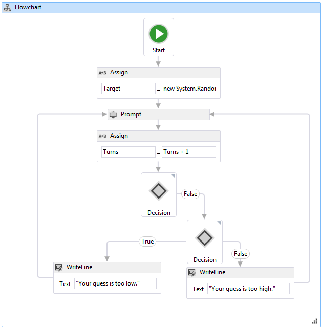

# How to: Create a Flowchart Workflow
Workflows can be constructed from built-in activities as well as from custom activities. This topic steps through creating a workflow that uses both built-in activities such as the <xref:System.Activities.Statements.Flowchart> activity, and the custom activities from the previous [How to: Create an Activity](../../../docs/framework/windows-workflow-foundation/how-to-create-an-activity.md) topic. The workflow models a number guessing game.  
  
> [!NOTE]
>  Each topic in the Getting Started tutorial depends on the previous topics. To complete this topic, you must first complete [How to: Create an Activity](../../../docs/framework/windows-workflow-foundation/how-to-create-an-activity.md).  
  
> [!NOTE]
>  To download a completed version of the tutorial, see [Windows Workflow Foundation (WF45) - Getting Started Tutorial](http://go.microsoft.com/fwlink/?LinkID=248976).  
  
### To create the workflow  
  
1.  Right-click **NumberGuessWorkflowActivities** in **Solution Explorer** and select **Add**, **New Item**.  
  
2.  In the **Installed**, **Common Items** node, select **Workflow**. Select **Activity** from the **Workflow** list.  
  
3.  Type `FlowchartNumberGuessWorkflow` into the **Name** box and click **Add**.  
  
4.  Drag a **Flowchart** activity from the **Flowchart** section of the **Toolbox** and drop it onto the **Drop activity here** label on the workflow design surface.  
  
### To create the workflow variables and arguments  
  
1.  Double-click **FlowchartNumberGuessWorkflow.xaml** in **Solution Explorer** to display the workflow in the designer, if it is not already displayed.  
  
2.  Click **Arguments** in the lower-left side of the workflow designer to display the **Arguments** pane.  
  
3.  Click **Create Argument**.  
  
4.  Type `MaxNumber` into the **Name** box, select **In** from the **Direction** drop-down list, select **Int32** from the **Argument type** drop-down list, and then press ENTER to save the argument.  
  
5.  Click **Create Argument**.  
  
6.  Type `Turns` into the **Name** box that is below the newly added `MaxNumber` argument, select **Out** from the **Direction** drop-down list, select **Int32** from the **Argument type** drop-down list, and then press ENTER.  
  
7.  Click **Arguments** in the lower-left side of the activity designer to close the **Arguments** pane.  
  
8.  Click **Variables** in the lower-left side of the workflow designer to display the **Variables** pane.  
  
9. Click **Create Variable**.  
  
    > [!TIP]
    >  If no **Create Variable** box is displayed, click the <xref:System.Activities.Statements.Flowchart> activity on the workflow designer surface to select it.  
  
10. Type `Guess` into the **Name** box, select **Int32** from the **Variable type** drop-down list, and then press ENTER to save the variable.  
  
11. Click **Create Variable**.  
  
12. Type `Target` into the **Name** box, select **Int32** from the **Variable type** drop-down list, and then press ENTER to save the variable.  
  
13. Click **Variables** in the lower-left side of the activity designer to close the **Variables** pane.  
  
### To add the workflow activities  
  
1.  Drag an **Assign** activity from the **Primitives** section of the **Toolbox** and hover it over the **Start** node, which is at the top of the flowchart. When the **Assign** activity is over the **Start** node, three triangles will appear around the **Start** node. Drop the **Assign** activity on the triangle that is directly below the **Start** node. This will link the two items together and designates the **Assign** activity as the first activity in the flowchart.  
  
    > [!NOTE]
    >  Activities can also be indicated as the starting activity in the workflow by manually linking them activity to the start node. To do this, hover the mouse over the **Start** node, click one of the rectangles that appear when the mouse is over the **Start** node, and drag the connecting line down to the desired activity and drop it on one of the rectangles that appear. You can also designate and activity as the starting activity by right-clicking the it and choosing **Set as Start Node**.  
  
2.  Type `Target` into the **To** box and the following expression into the **Enter a C# Expression** or **Enter a VB expression** box.  
  
    ```vb  
    New System.Random().Next(1, MaxNumber + 1)  
    ```  
  
    ```csharp  
    new System.Random().Next(1, MaxNumber + 1)  
    ```  
  
    > [!TIP]
    >  If the **Toolbox** window is not displayed, select **Toolbox** from the **View** menu.  
  
3.  Drag a **Prompt** activity from the **NumberGuessWorkflowActivities** section of the **Toolbox**, drop it below the **Assign** activity from the previous step, and connect the **Prompt** activity to the **Assign** activity. There are three ways to connect the two activities. The first way is to connect them as you drop the **Prompt** activity on the workflow. As you are dragging the **Prompt** activity to the workflow, hover it over the **Assign** activity and drop it onto one of the four triangles that appear when the **Prompt** activity is over the **Assign** activity. The second way is to drop the **Prompt** activity onto the workflow at the desired location. Then, hover the mouse over the **Assign** activity and drag one of the rectangles that appears down to the **Prompt** activity. Drag the mouse so that the connecting line from the **Assign** activity connects to one of the rectangles of the **Prompt** activity, and then release the mouse button. The third way is very similar to the first way, except that instead of dragging the **Prompt** activity from the **Toolbox**, you drag it from its location on the workflow design surface, hover it over the **Assign** activity, and drop it onto one of the triangles that appears.  
  
4.  In the **Properties Window** for the **Prompt** activity, type `"EnterGuess"` including the quotes into the **BookmarkName** property value box. Type `Guess` into the **Result** property value box, and type the following expression into the **Text** property box.  
  
    ```vb  
    "Please enter a number between 1 and " & MaxNumber  
    ```  
  
    ```csharp  
    "Please enter a number between 1 and " + MaxNumber  
    ```  
  
    > [!TIP]
    >  If the **Properties Window** is not displayed, select **Properties Window** from the **View** menu.  
  
5.  Drag an **Assign** activity from the **Primitives** section of the **Toolbox** and connect it using one of the methods described in the previous step so that it is below the **Prompt** activity.  
  
6.  Type `Turns` into the **To** box and `Turns + 1` into the **Enter a C# expression**  or **Enter a VB expression** box.  
  
7.  Drag a **FlowDecision** from the **Flowchart** section of the **Toolbox** and connect it below the **Assign** activity. In the **Properties Window**, type the following expression into the **Condition** property value box.  
  
    ```vb  
    Guess = Target  
    ```  
  
    ```csharp  
    Guess == Target  
    ```  
  
8.  Drag another **FlowDecision** activity from the **Toolbox** and drop it below the first one. Connect the two activities by dragging from the rectangle that is labeled **False** on the top **FlowDecision** activity to the rectangle at the top of the second **FlowDecision** activity.  
  
    > [!TIP]
    >  If you do not see the **True** and **False** labels on the **FlowDecision**, hover the mouse over the **FlowDecision**.  
  
9. Click the second **FlowDecision** activity to select it. In the **Properties Window**, type the following expression into the **Condition** property value box.  
  
    ```
    Guess < Target  
    ```  
  
10. Drag two **WriteLine** activities from the **Primitives** section of the **Toolbox** and drop them so that they are side by side below the two **FlowDecision** activities. Connect the **True** action of the bottom **FlowDecision** activity to the leftmost **WriteLine** activity, and the **False** action to the rightmost **WriteLine** activity.  
  
11. Click the leftmost **WriteLine** activity to select it, and type the following expression into the **Text** property value box in the **Properties Window**.  
  
    ```
    "Your guess is too low."  
    ```  
  
12. Connect the **WriteLine** to the left side of the **Prompt** activity that is above it.  
  
13. Click the rightmost **WriteLine** activity to select it, and type the following expression into the **Text** property value box in the **Properties Window**.  
  
    ```
    "Your guess is too high."  
    ```  
  
14. Connect the **WriteLine** activity to the right side of the **Prompt** activity above it.  
  
     The following example illustrates the completed workflow.  
  
       
  
### To build the workflow  
  
1.  Press CTRL+SHIFT+B to build the solution.  
  
     For instructions on how to run the workflow, please see the next topic, [How to: Run a Workflow](../../../docs/framework/windows-workflow-foundation/how-to-run-a-workflow.md). If you have already completed the [How to: Run a Workflow](../../../docs/framework/windows-workflow-foundation/how-to-run-a-workflow.md) step with a different style of workflow and wish to run it using the flowchart workflow from this step, skip ahead to the [To build and run the application](../../../docs/framework/windows-workflow-foundation/how-to-run-a-workflow.md#BKMK_ToRunTheApplication) section of [How to: Run a Workflow](../../../docs/framework/windows-workflow-foundation/how-to-run-a-workflow.md).  
  
## See Also  
 <xref:System.Activities.Statements.Flowchart>  
 <xref:System.Activities.Statements.FlowDecision>  
 [Windows Workflow Foundation Programming](../../../docs/framework/windows-workflow-foundation/programming.md)  
 [Designing Workflows](../../../docs/framework/windows-workflow-foundation/designing-workflows.md)  
 [Getting Started Tutorial](../../../docs/framework/windows-workflow-foundation/getting-started-tutorial.md)  
 [How to: Create an Activity](../../../docs/framework/windows-workflow-foundation/how-to-create-an-activity.md)  
 [How to: Run a Workflow](../../../docs/framework/windows-workflow-foundation/how-to-run-a-workflow.md)
