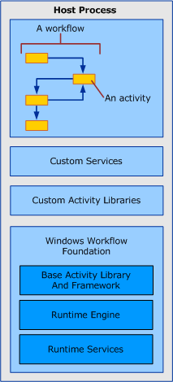

# Windows Workflow Overview
A workflow is a set of elemental units called *activities* that are stored as a model that describes a real-world process. Workflows provide a way of describing the order of execution and dependent relationships between pieces of short- or long-running work. This work passes through the model from start to finish, and activities might be executed by people or by system functions.  
  
## Workflow Run-time Engine  
 Every running workflow instance is created and maintained by an in-process run-time engine that the host process interacts with through one of the following:  
  
-   A <xref:System.Activities.WorkflowInvoker>, which invokes the workflow like a method.  
  
-   A <xref:System.Activities.WorkflowApplication> for explicit control over the execution of a single workflow instance.  
  
-   A <xref:System.ServiceModel.WorkflowServiceHost> for message-based interactions in multi-instance scenarios.  
  
 Each of these classes wraps the core activity runtime represented as a <xref:System.Activities.ActivityInstance> responsible for activity execution. There can be several <xref:System.Activities.ActivityInstance> objects within an application domain running concurrently.  
  
 Each of the preceding three host interaction objects is created from a tree of activities referred to as a workflow program. Using these types or a custom host that wraps <xref:System.Activities.ActivityInstance>, workflows can be executed inside any Windows process including console applications, forms-based applications, Windows Services, [!INCLUDE[vstecasp](../../../includes/vstecasp-md.md)] Web sites, and [!INCLUDE[indigo1](../../../includes/indigo1-md.md)]services.  
  
   
Workflow components in the host process  
  
## Interaction between Workflow Components  
 The following diagram demonstrates how workflow components interact with one another.  
  
   
  
 In the preceding diagram, the <xref:System.Activities.WorkflowInvoker.Invoke%2A> method of the <xref:System.Activities.WorkflowInvoker> class is used to invoke several workflow instances. <xref:System.Activities.WorkflowInvoker> is used for lightweight workflows that do not need management from the host; workflows that need management from the host (such as <xref:System.Activities.Bookmark> resumption) must be executed using <xref:System.Activities.WorkflowApplication.Run%2A> instead. It isn’t required to wait for one workflow instance to complete before invoking another; the runtime engine supports running multiple workflow instances simultaneously.  The workflows invoked are as follows:  
  
-   A <xref:System.Activities.Statements.Sequence> activity that contains a <xref:System.Activities.Statements.WriteLine> child activity. A <xref:System.Activities.Variable> of the parent activity is bound to an <xref:System.Activities.InArgument> of the child activity. [!INCLUDE[crabout](../../../includes/crabout-md.md)] on variables, arguments, and binding, see [Variables and Arguments](../../../docs/framework/windows-workflow-foundation/variables-and-arguments.md).  
  
-   A custom activity called `ReadLine`. An <xref:System.Activities.OutArgument> of the `ReadLine` activity is returned to the calling <xref:System.Activities.WorkflowInvoker.Invoke%2A> method.  
  
-   A custom activity that derives from the <xref:System.Activities.CodeActivity> abstract class. The <xref:System.Activities.CodeActivity> can access run-time features (such as tracking and properties) using the <xref:System.Activities.CodeActivityContext> that is available as a parameter of the <xref:System.Activities.CodeActivity.Execute%2A> method. [!INCLUDE[crabout](../../../includes/crabout-md.md)] these run-time features, see [Workflow Tracking and Tracing](../../../docs/framework/windows-workflow-foundation/workflow-tracking-and-tracing.md) and [Workflow Execution Properties](../../../docs/framework/windows-workflow-foundation/workflow-execution-properties.md).  
  
## See Also  
 [BizTalk Server 2006 or WF? Choosing the Right Workflow Tool for Your Project](http://go.microsoft.com/fwlink/?LinkId=154901)
