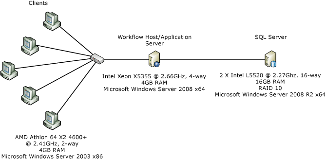
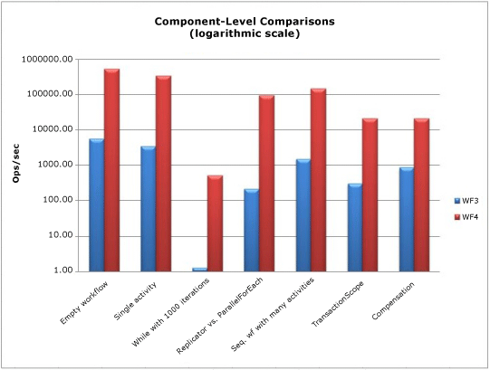
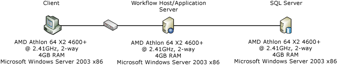
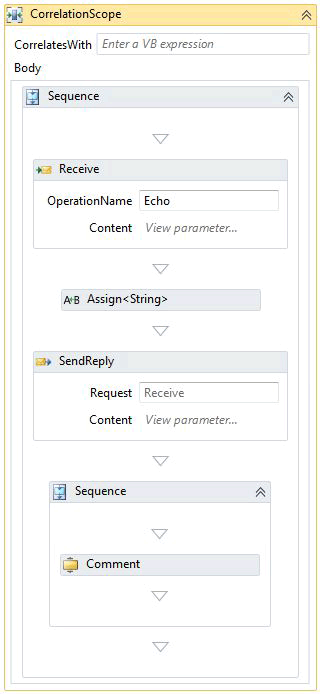
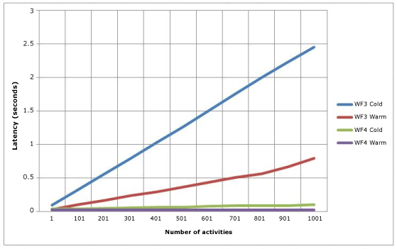
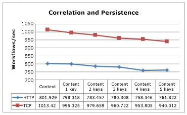
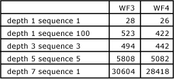
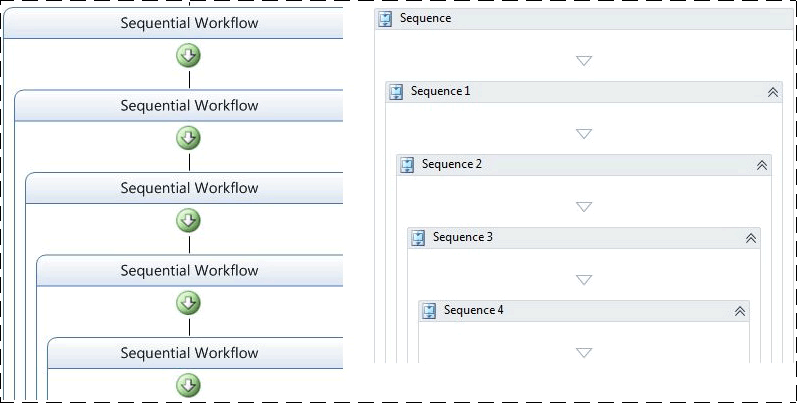
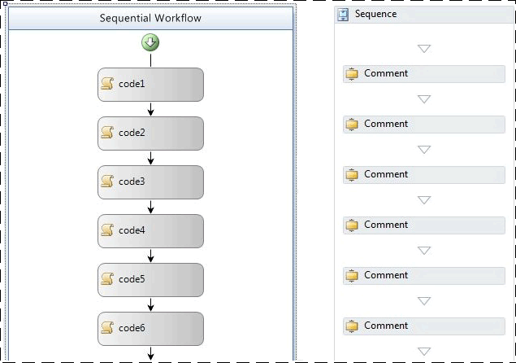
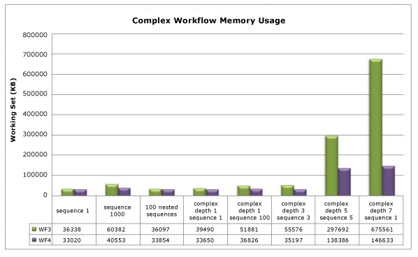

# Windows Workflow Foundation 4 Performance
Dustin Metzgar  
  
 Wenlong Dong  
  
 Microsoft Corporation, September 2010  
  
 Microsoft [!INCLUDE[netfx40_long](../../../includes/netfx40-long-md.md)] includes a major revision of the [!INCLUDE[wf](../../../includes/wf-md.md)] with heavy investments in performance.  This new revision introduces significant design changes from the previous versions of [!INCLUDE[wf1](../../../includes/wf1-md.md)] that shipped as part of .NET Framework 3.0 and [!INCLUDE[netfx35_short](../../../includes/netfx35-short-md.md)]. It has been re-architected from the core of the programming model, runtime, and tooling to greatly improve performance and usability. This topic shows the important performance characteristics of these revisions and compares them against those of the previous version.  
  
 Individual workflow component performance has increased by orders of magnitude between WF3 and WF4.  This leaves the gap between hand-coded [!INCLUDE[indigo1](../../../includes/indigo1-md.md)] services and [!INCLUDE[indigo2](../../../includes/indigo2-md.md)] workflow services to be quite small.  Workflow latency has been significantly reduced in WF4.  Persistence performance has increased by a factor of 2.5 - 3.0.  Health monitoring by means of workflow tracking has significantly less overhead.  These are compelling reasons to migrate to or adopt WF4 in your applications.  
  
## Terminology  
 The version of [!INCLUDE[wf1](../../../includes/wf1-md.md)] introduced in [!INCLUDE[netfx40_short](../../../includes/netfx40-short-md.md)] will be referred to as WF4 for the rest of this topic.  [!INCLUDE[wf1](../../../includes/wf1-md.md)] was introduced in .Net 3.0 and had a few minor revisions through [!INCLUDE[netfx35_short](../../../includes/netfx35-short-md.md)] SP1. The [!INCLUDE[netfx35_short](../../../includes/netfx35-short-md.md)] version of Workflow Foundation will be referred to as WF3 for the rest of this topic. WF3 is shipped in [!INCLUDE[netfx40_short](../../../includes/netfx40-short-md.md)] side-by-side with WF4. [!INCLUDE[crabout](../../../includes/crabout-md.md)] migrating WF3 artifacts to WF4 see: [Windows Workflow Foundation 4 Migration Guide](http://go.microsoft.com/fwlink/?LinkID=153313)  
  
 [!INCLUDE[indigo1](../../../includes/indigo1-md.md)] is Microsoft’s unified programming model for building service-oriented applications. It was first introduced as part of .Net 3.0 together with WF3 and now is one of the key components of the [!INCLUDE[dnprdnshort](../../../includes/dnprdnshort-md.md)].  
  
 Windows Server AppFabric is a set of integrated technologies that make it easier to build, scale and manage Web and composite applications that run on IIS. It provides tools for monitoring and managing services and workflows. [!INCLUDE[crdefault](../../../includes/crdefault-md.md)] [Windows Server AppFabric](http://msdn.microsoft.com/windowsserver/ee695849.aspx)  
  
## Goals  
 The goal of this topic is to show the performance characteristics of WF4 with data measured for different scenarios. It also provides detailed comparisons between WF4 and WF3, and thus shows the great improvements that have been made in this new revision. The scenarios and data presented in this article quantify the underlying cost of different aspects of WF4 and WF3. This data is useful in understanding the performance characteristics of WF4 and can be helpful in planning migrations from WF3 to WF4 or using WF4 in application development. However, care should be taken in the conclusions drawn from the data presented in this article. The performance of a composite workflow application is highly dependent on how the workflow is implemented and how different components are integrated. One must measure each application to determine the performance characteristics of that application.  
  
## Overview of WF4 Performance Enhancements  
 WF4 was carefully designed and implemented with high performance and scalability which are described in the following sections.  
  
### WF Runtime  
 At the core of the [!INCLUDE[wf1](../../../includes/wf1-md.md)] runtime is an asynchronous scheduler that drives the execution of the activities in a workflow. It provides a performant, predictable execution environment for activities. The environment has a well-defined contract for execution, continuation, completion, cancellation, exceptions, and a predictable threading model.  
  
 In comparison to WF3, the WF4 runtime has a more efficient scheduler. It leverages the same I/O thread pool that is used for [!INCLUDE[indigo2](../../../includes/indigo2-md.md)], which is very efficient at executing batched work items. The internal work item scheduler queue is optimized for most common usage patterns. The WF4 runtime also manages the execution states in a very light-weight way with minimal synchronization and event handling logic, while WF3 depends on heavy-weight event registration and invocation to perform complex synchronization for state transitions.  
  
### Data Storage and Flow  
 In WF3, data associated with an activity is modeled through dependency properties implemented by the type <xref:System.Windows.DependencyProperty>. The dependency property pattern was introduced in [!INCLUDE[avalon1](../../../includes/avalon1-md.md)]. In general, this pattern is very flexible to support easy data binding and other UI features. However, the pattern requires the properties to be defined as static fields in the workflow definition. Whenever the [!INCLUDE[wf1](../../../includes/wf1-md.md)] runtime sets or gets the property values, it involves heavily-weighted look-up logic.  
  
 WF4 uses clear data scoping logic to greatly improve how data is handled in a workflow. It separates the data stored in an activity from the data that is flowing across the activity boundaries by using two different concepts: variables and arguments. By using a clear hierarchical scope for variables and "In/Out/InOut" arguments, the data usage complexity for activities is dramatically reduced and the lifetime of the data is also automatically scoped. Activities have a well-defined signature described by its arguments. By simply inspecting an activity you can determine what data it expects to receive and what data will be produced by it as the result of its execution.  
  
 In WF3 activities were initialized when a workflow was created. In WF 4 activities are initialized only when the corresponding activities are executing. This allows a simpler activity lifecycle without performing Initialize/Uninitialize operations when a new workflow instance is created, and thus has achieved more efficiency  
  
### Control Flow  
 Just as in any programming language, [!INCLUDE[wf1](../../../includes/wf1-md.md)] provides support for control flows for workflow definitions by introducing a set of control flow activities for sequencing, looping, branching and other patterns. In WF3, when the same activity needs to be re-executed, a new <xref:System.Workflow.ComponentModel.ActivityExecutionContext> is created and the activity is cloned through a heavy-weight serialization and deserialization logic based on <xref:System.Runtime.Serialization.Formatters.Binary.BinaryFormatter>. Usually the performance for iterative control flows is much slower than executing a sequence of activities.  
  
 WF4 handles this quite differently. It takes the activity template, creates a new ActivityInstance object, and adds it to the scheduler queue. This whole process only involves explicit object creation and is very light-weight.  
  
### Asynchronous Programming  
 Applications usually have better performance and scalability with asynchronous programming for long running blocking operations such as I/O or distributed computing operations. WF4 provides asynchronous support through base activity types <xref:System.Activities.AsyncCodeActivity>, <xref:System.Activities.AsyncCodeActivity%601>. The runtime natively understands asynchronous activities and therefore can automatically put the instance in a no-persist zone while the asynchronous work is outstanding. Custom activities can derive from these types to perform asynchronous work without holding the workflow scheduler thread and blocking any activities that may be able to run in parallel.  
  
### Messaging  
 Initially WF3 had very limited messaging support through external events or web services invocations. In .Net 3.5, workflows could be implemented as [!INCLUDE[indigo2](../../../includes/indigo2-md.md)] clients or exposed as [!INCLUDE[indigo2](../../../includes/indigo2-md.md)] services through <xref:System.Workflow.Activities.SendActivity> and <xref:System.Workflow.Activities.ReceiveActivity>. In WF4, the concept of workflow-based messaging programming has been further strengthened through the tight integration of [!INCLUDE[indigo2](../../../includes/indigo2-md.md)] messaging logic into WF.  
  
 The unified message processing pipeline provided in [!INCLUDE[indigo2](../../../includes/indigo2-md.md)] in .Net 4 helps WF4 services to have significantly better performance and scalability than WF3. WF4 also provides richer messaging programming support that can model complex Message Exchange Patterns (MEPs). Developers can use either typed service contracts to achieve easy programming or un-typed service contracts to achieve better performance without paying serialization costs. The client-side channel caching support through the <xref:System.ServiceModel.Activities.SendMessageChannelCache> class in WF4 helps developers build fast applications with minimal effort. [!INCLUDE[crdefault](../../../includes/crdefault-md.md)] [Changing the Cache Sharing Levels for Send Activities](../../../docs/framework/wcf/feature-details/changing-the-cache-sharing-levels-for-send-activities.md).  
  
### Declarative Programming  
 WF4 provides a clean and simple declarative programming framework to model business processes and services. The programming model supports fully declarative composition of activities, with no code-beside, greatly simplifying workflow authoring. In [!INCLUDE[netfx40_short](../../../includes/netfx40-short-md.md)], the XAML-based declarative programming framework has been unified into the single assembly System.Xaml.dll to support both WPF and WF.  
  
 In WF4, XAML provides a truly declarative experience and allows for the entire definition of the workflow to be defined in XML markup, referencing activities and types built using .NET. This was difficult to do in WF3 with XOML format without involving custom code-behind logic. The new XAML-stack in .Net 4 has much better performance in serializing/deserializing workflow artifacts and makes declarative programming more attractive and solid.  
  
### Workflow Designer  
 Fully declarative programming support for WF4 explicitly imposes higher requirements for design time performance for large workflows. The Workflow designer in WF4 has much better scalability for large workflows than that for WF3. With UI virtualization support, the designer can easily load a large workflow of 1000 activities in a few seconds, while it is almost impossible to load a workflow of a few hundred activities with the WF3 designer.  
  
## Component-level Performance Comparisons  
 This section contains data on direct comparisons between individual activities in WF3 and WF4 workflows.  Key areas like persistence have a more profound impact on performance than the individual activity components.  The performance improvements in individual components in WF4 are important though because the components are now fast enough to be compared against hand-coded orchestration logic.  An example of which is covered in the next section: "Service Composition Scenario."  
  
### Environment Setup  
   
  
 The above figure shows the machine configuration used for component-level performance measurement. A single server and five clients connected over one 1-Gbps Ethernet network interface. For easy measurements, the server is configured to use a single core of a dual-proc/quad-core server  running Windows Server 2008 x86. The system CPU utilization is maintained at nearly 100%.  
  
### Test Details  
 The WF3 <xref:System.Workflow.Activities.CodeActivity> is likely the simplest activity that can be used in a WF3 workflow.  The activity calls a method in the code-behind that the workflow programmer can put custom code into.  In WF4, there is no direct analog to the WF3 <xref:System.Workflow.Activities.CodeActivity> that provides the same functionality.  Note that there is a <xref:System.Activities.CodeActivity> base class in WF4 that is not related to the WF3 <xref:System.Workflow.Activities.CodeActivity>.  Workflow authors are encouraged to create custom activities and build XAML-only workflows.  In the tests below, an activity called `Comment` is used in place of an empty <xref:System.Workflow.Activities.CodeActivity> in WF4 workflows.  The code in the `Comment` activity is as follows:  
  
```  
[ContentProperty("Body")]  
    public sealed class Comment : CodeActivity  
    {  
        public Comment()  
            : base()  
        {  
        }  
  
        [DefaultValue(null)]  
        public Activity Body  
        {  
            get;  
            set;  
        }  
  
        protected override void Execute(CodeActivityContext context)  
        {  
        }  
    }  
```  
  
### Empty Workflow  
 This test uses a sequence workflow with no child activities.  
  
### Single Activity  
 The workflow is a sequence workflow containing one child activity.  The activity is a <xref:System.Workflow.Activities.CodeActivity> with no code in the WF3 case and a `Comment` activity in the WF4 case.  
  
### While with 1000 Iterations  
 The sequence workflow contains one <xref:System.Activities.Statements.While> activity with one child activity in the loop that does not perform any work.  
  
### Replicator compared to ParallelForEach  
 <xref:System.Workflow.Activities.ReplicatorActivity> in WF3 has sequential and parallel execution modes.  In sequential mode, the activity’s performance is similar to the <xref:System.Workflow.Activities.WhileActivity>.  The <xref:System.Workflow.Activities.ReplicatorActivity> is most useful for parallel execution.  The WF4 analog for this is the <xref:System.Activities.Statements.ParallelForEach%601> activity.  
  
 The following diagram shows the workflows used for this test. The WF3 workflow is on the left and the WF4 workflow is on the right.  
  
   
  
### Sequential Workflow with Five Activities  
 This test is meant to show the effect of having several activities execute in sequence.  There are five activities in the sequence.  
  
### Transaction Scope  
 The transaction scope test differs from the other tests slightly in that a new workflow instance is not created for every iteration.  Instead, the workflow is structured with a while loop containing a <xref:System.Activities.Statements.TransactionScope> activity containing a single activity that does no work.  Each run of a batch of 50 iterations through the while loop is counted as a single operation.  
  
### Compensation  
 The WF3 workflow has a single compensatable activity named `WorkScope`.  The activity simply implements the <xref:System.Workflow.ComponentModel.ICompensatableActivity> interface:  
  
```  
class WorkScope :   
        CompositeActivity, ICompensatableActivity  
    {  
        public WorkScope() : base() { }  
  
        public WorkScope(string name)  
        {  
            this.Name = name;  
        }  
  
        public ActivityExecutionStatus Compensate(  
            ActivityExecutionContext executionContext)  
        {  
            return ActivityExecutionStatus.Closed;  
        }  
    }  
```  
  
 The fault handler targets the `WorkScope` activity.The WF4 workflow is equally simplistic.  A <xref:System.Activities.Statements.CompensableActivity> has a body and a compensation handler.  An explicit compensate is next in the sequence.  The body activity and compensation handler activity are both empty implementations:  
  
```  
public sealed class CompensableActivityEmptyCompensation : CodeActivity  
    {  
        public CompensableActivityEmptyCompensation()  
            : base() { }  
  
        public Activity Body { get; set; }  
  
        protected override void Execute(CodeActivityContext context) { }  
    }  
    public sealed class CompensableActivityEmptyBody : CodeActivity  
    {  
        public CompensableActivityEmptyBody()  
            : base() { }  
  
        public Activity Body { get; set; }  
  
        protected override void Execute(CodeActivityContext context) { }  
    }  
```  
  
   
  
 Figure 2 – WF3 (left) and WF4 (right) basic compensation workflows  
  
### Performance Test Results  
   
  
   
  
 All tests are measured in workflows per second with the exception of the transaction scope test.  As can be seen above, the [!INCLUDE[wf1](../../../includes/wf1-md.md)] runtime performance has improved across the board, especially in areas that require multiple executions of the same activity like the while loop.  
  
## Service Composition Scenario  
 As is shown in the previous section, "Component-level Performance Comparisons," there has been a significant reduction in overhead between WF3 and WF4.  [!INCLUDE[indigo2](../../../includes/indigo2-md.md)] workflow services can now almost match the performance of hand-coded [!INCLUDE[indigo2](../../../includes/indigo2-md.md)] services but still have all the benefits of the [!INCLUDE[wf1](../../../includes/wf1-md.md)] runtime.  This test scenario compares a [!INCLUDE[indigo2](../../../includes/indigo2-md.md)] service against a [!INCLUDE[indigo2](../../../includes/indigo2-md.md)] workflow service in WF4.  
  
### Online Store Service  
 One of the strengths of [!INCLUDE[wf2](../../../includes/wf2-md.md)] is the ability to compose processes using several services.  For this example, there is an online store service that orchestrates two service calls to purchase an order.  The first step is to validate the order using an Order Validating Service.  The second step is to fill the order using a Warehouse Service.  
  
 The two backend services, Order Validating Service and Warehouse Service, remain the same for both tests.  The part that changes is the Online Store Service that performs the orchestration.  In one case, the service is hand-coded as a [!INCLUDE[indigo2](../../../includes/indigo2-md.md)] service.  For the other case, the service is written as a [!INCLUDE[indigo2](../../../includes/indigo2-md.md)] workflow service in WF4. [!INCLUDE[wf1](../../../includes/wf1-md.md)]-specific features like tracking and persistence are turned off for this test.  
  
### Environment  
   
  
 Client requests are made to the Online Store Service via HTTP from multiple computers.  A single computer hosts all three services.  The transport layer between the Online Store Service and the backend services is TCP or HTTP.  The measurement of operations/second is based on the number of completed `PurchaseOrder` calls made to the Online Store Service.  Channel pooling is a new feature available in WF4.  In the [!INCLUDE[indigo2](../../../includes/indigo2-md.md)] portion of this test channel pooling is not provided out of the box so a hand-coded implementation of a simple pooling technique was used in the Online Store Service.  
  
### Performance  
   
  
 Connecting to backend TCP services without channel pooling, the [!INCLUDE[wf1](../../../includes/wf1-md.md)] service has a 17.2% impact on throughput.  With channel pooling, the penalty is about 23.8%.  For HTTP, the impact is much less: 4.3% without pooling and 8.1% with pooling.  It is also important to note that the channel pooling provides very little benefit when using HTTP.  
  
 While there is overhead from the WF4 runtime compared with a hand-coded [!INCLUDE[indigo2](../../../includes/indigo2-md.md)] service in this test, it could be considered a worst-case scenario.  The two backend services in this test do very little work.  In a real end-to-end scenario, these services would perform more expensive operations like database calls, making the performance impact of the transport layer less important.  This plus the benefits of the features available in WF4 makes Workflow Foundation a viable choice for creating orchestration services.  
  
## Key Performance Considerations  
 The feature areas in this section, with the exception of interop, have dramatically changed between WF3 and WF4.  This affects the design of workflow applications as well as the performance.  
  
#### Workflow Activation Latency  
 In a [!INCLUDE[indigo2](../../../includes/indigo2-md.md)] workflow service application, the latency for starting a new workflow or loading an existing workflow is important as it can be blocking.  This test case measures a WF3 XOML host against a WF4 XAMLX host in a typical scenario.  
  
##### Environment Setup  
   
  
##### Test Setup  
 In the scenario, a client computer contacts a [!INCLUDE[indigo2](../../../includes/indigo2-md.md)] workflow service using context-based correlation.  Context correlation requires a special context binding and uses a context header or cookie to relate messages to the correct workflow instance.  It has a performance benefit in that the correlation Id is located in the message header so the message body does not need to be parsed. [!INCLUDE[crabout](../../../includes/crabout-md.md)] context correlation see [Context Exchange Correlation](../../../docs/framework/wcf/feature-details/context-exchange-correlation.md)  
  
 The service will create a new workflow with the request and send an immediate response so that the measurement of latency does not include the time spent running the workflow.  The WF3 workflow is XOML with a code-behind and the WF4 workflow is entirely XAML.  The WF4 workflow looks like this:  
  
   
  
 The <xref:System.ServiceModel.Activities.Receive> activity creates the workflow instance.  A value passed in the received message is echoed in the reply message.  A sequence following the reply contains the rest of the workflow.  In the above case, only one comment activity is shown.  The number of comment activities is changed to simulate workflow complexity.  A comment activity is equivalent to a WF3 <xref:System.Workflow.Activities.CodeActivity> that performs no work. [!INCLUDE[crabout](../../../includes/crabout-md.md)] the comment activity, see the "Component-level Performance Comparison" section earlier in this article.  
  
##### Test Results  
   
  
 Figure 3 – Cold and warm latency for WCF workflow services  
  
 In the graph above, cold refers to the case where there is not an existing <xref:System.ServiceModel.WorkflowServiceHost> for the given workflow.  In other words, cold latency is when the workflow is being used for the first time and the XOML or XAML needs to be compiled.  Warm latency is the time to create a new workflow instance when the workflow type has already been compiled.  The complexity of the workflow makes very little difference in the WF4 case but has a linear progression in the WF3 case.  
  
#### Correlation Throughput  
 WF4 introduces a new content-based correlation feature.  WF3 provided only context-based correlation.  Context-based correlation could only be done over specific [!INCLUDE[indigo2](../../../includes/indigo2-md.md)] channel bindings.  The workflow Id is inserted into the message header when using these bindings.  The WF3 runtime could only identify a workflow by its Id.  With content-based correlation, the workflow author can create a correlation key out of a relevant piece of data like an account number or customer Id. [!INCLUDE[crabout](../../../includes/crabout-md.md)] content-based correlation see [Content Based Correlation](../../../docs/framework/wcf/feature-details/content-based-correlation.md).  
  
 Context-based correlation has a performance advantage in that the correlation key is located in the message header.  The key can be read from the message without de-serialization/message-copying.  In content-based correlation, the correlation key is stored in the message body.  An XPath expression is used to locate the key.  The cost of this extra processing depends on the size of the message, depth of the key in the body, and the number of keys.  This test compares context- and content-based correlation and also shows the performance degradation when using multiple keys.  
  
#### Environment Setup  
   
  
#### Test Setup  
   
  
 The workflow shown above is the same one used in the "Persistence" section below.  For the correlation tests without persistence there is no persistence provider installed in the runtime.  Correlation occurs in two places: CreateOrder and CompleteOrder.  
  
#### Test Results  
   
  
 This graph shows a decrease in performance as the number of keys used in content-based correlation increases.  The similarity in the curves between TCP and HTTP indicates the overhead associated with these protocols.  
  
#### Correlation with Persistence  
 With a persisted workflow, the CPU pressure from content-based correlation shifts from the workflow runtime to the SQL database.  The stored procedures in the SQL persistence provider do the work of matching the keys to locate the appropriate workflow.  
  
   
  
 Context-based correlation is still faster than content-based correlation.  However, the difference is less pronounced as persistence has more impact on performance than correlation.  
  
### Complex Workflow Throughput  
 The complexity of a workflow is not measured only by the number of activities.  Composite activities can contain many children and those children can also be composite activities.  As the number of levels of nesting increases, so does the number of activities that can be currently in the executing state and the number of variables that can be in state.  This test compares throughput between WF3 and WF4 when executing complex workflows.  
  
### Test Setup  
 These tests were executed on an Intel Xeon X5355 @ 2.66GHz 4-way computer with 4GB RAM running Windows Server 2008 x64.  The test code runs in a single process with one thread per core to reach 100% CPU utilization.  
  
 The workflows generated for this test have two main variables: depth and number of activities in each sequence.  Each depth level includes a parallel activity, while loop, decisions, assignments, and sequences.  In the WF4 designer pictured below, the top-level flow chart is pictured.  Each flowchart activity resembles the main flowchart.  It may be helpful to think of a fractal when picturing this workflow, where the depth is limited to the parameters of the test.  
  
 The number of activities in a given test is determined by the depth and number of activities per sequence.  The following equation computes the number of activities in the WF4 test:  
  
   
  
 The WF3 test’s activity count can be computed with a slightly different equation due to an extra sequence:  
  
   
  
 Where d is the depth and a is the number of activities per sequence.  The logic behind these equations is that the first constant, multiplied by a, is the number of sequences and the second constant is the static number of activities in the current level.  There are three flowchart child activities in each flowchart.  At the bottom depth level, these flowcharts are empty but at the other levels they are copies of the main flowchart.  The number of activities in each test variation’s workflow definition is indicated in the following table:  
  
   
  
 The number of activities in the workflow definition increases sharply with each depth level.  But only one path per decision point is executed in a given workflow instance, so only a small subset of the actual activities are executed.  
  
   
  
 An equivalent workflow was created for WF3. The WF3 designer shows the entire workflow in the design area instead of nesting, therefore it is too big to display in this topic. A snippet of the workflow is shown below.  
  
   
  
 To exercise nesting in an extreme case, another workflow that is part of this test uses 100 nested sequences.  In the innermost sequence is a single `Comment` or <xref:System.Workflow.Activities.CodeActivity>.  
  
   
  
 Tracking and persistence are not used as part of this test.  
  
### Test Results  
   
  
 Even with complex workflows with lots of depth and a high number of activities, the performance results are consistent with other throughput numbers shown earlier in this article.  WF4’s throughput is orders of magnitude faster and has to be compared on a logarithmic scale.  
  
### Memory  
 The memory overhead of Windows Workflow Foundation is measured in two key areas: workflow complexity and number of workflow definitions.  Memory measurements were taken on a Windows 7 64-bit workstation.  There are many ways to obtain the measurement of working set size such as monitoring performance counters, polling Environment.WorkingSet, or using a tool like VMMap available from [VMMap](http://technet.microsoft.com/sysinternals/dd535533.aspx). A combination of methods was used to obtain and verify the results of each test.  
  
### Workflow Complexity Test  
 The workflow complexity test measures the working set difference based on the complexity of the workflow.  In addition to the complex workflows used in the previous section, new variations are added to cover two basic cases: a single activity workflow and a sequence with 1000 activities.  For these tests the workflows are initialized and executed to completion in a single serial loop for a period of one minute.  Each test variation is run three times and the data recorded is the average of those three runs.  
  
 The two new basic tests have workflows that look like those shown below:  
  
   
  
 In the WF3 workflow shown above, empty <xref:System.Workflow.Activities.CodeActivity> activities are used.  The WF4 workflow above uses `Comment` activities.  The `Comment` activity was described in the Component-level Performance Comparisons section earlier in this article.  
  
   
  
 One of the clear trends to notice in this graph is that nesting has relatively minimal impact on memory usage in both WF3 and WF4.  The most significant memory impact comes from the number of activities in a given workflow.  Given the data from the sequence 1000, complex depth 5 sequence 5, and complex depth 7 sequence 1 variations, it is clear that as the number of activities enters the thousands, the memory usage increase becomes more noticeable.  In the extreme case (depth 7 sequence 1) where there are ~29K activities, WF4 is using almost 79% less memory than WF3.  
  
### Multiple Workflow Definitions Test  
 Measuring memory per workflow definition is divided into two different tests because of the available options for hosting workflows in WF3 and WF4.  The tests are run in a different manner than the workflow complexity test in that a given workflow is instanced and executed only once per definition.  This is because the workflow definition and its host remain in memory for the lifetime of the AppDomain.  The memory used by running a given workflow instance should be cleaned up during garbage collection.  The migration guidance for WF4 contains more detailed information on the hosting options. [!INCLUDE[crdefault](../../../includes/crdefault-md.md)] [WF Migration Cookbook: Workflow Hosting](http://go.microsoft.com/fwlink/?LinkID=153313).  
  
 Creating many workflow definitions for a workflow definition test can be done in several ways.  For instance, one could use code generation to create a set of 1000 workflows that are identical except in name and save each of those workflows into separate files.  This approach was taken for the console-hosted test.  In WF3, the <xref:System.Workflow.Runtime.WorkflowRuntime> class was used to run the workflow definitions.  WF4 can either use <xref:System.Activities.WorkflowApplication> to create a single workflow instance or directly use <xref:System.Activities.WorkflowInvoker> to run the activity as if it were a method call.  <xref:System.Activities.WorkflowApplication> is a host of a single workflow instance and has closer feature parity to <xref:System.Workflow.Runtime.WorkflowRuntime> so that was used in this test.  
  
 When hosting workflows in IIS it is possible to use a <xref:System.Web.Hosting.VirtualPathProvider> to create a new <xref:System.ServiceModel.WorkflowServiceHost> instead of generating all of the XAMLX or XOML files.  The <xref:System.Web.Hosting.VirtualPathProvider> handles the incoming request and responds with a "virtual file" that can be loaded from a database or, in this case, generated on the fly.  It is therefore unnecessary to create 1000 physical files.  
  
 The workflow definitions used in the console test were simple sequential workflows with a single activity.  The single activity was an empty <xref:System.Workflow.Activities.CodeActivity> for the WF3 case and a `Comment` activity for the WF4 case.  The IIS-hosted case used workflows that start on receiving a message and end on sending a reply:  
  
   
  
 Figure 4 – WF3 workflow with ReceiveActivity and WF4 workflow with request/response pattern  
  
 The table below shows the delta in working set between a single workflow definition and 1001 definitions:  
  
|Hosting Options|WF3 Working Set Delta|WF4 Working Set Delta|  
|---------------------|---------------------------|---------------------------|  
|Console Application Hosted Workflows|18 MB|9 MB|  
|IIS Hosted Workflow Services|446 MB|364 MB|  
  
 Hosting workflow definitions in IIS consumes much more memory due to the <xref:System.ServiceModel.WorkflowServiceHost>, detailed [!INCLUDE[indigo2](../../../includes/indigo2-md.md)] service artifacts, and the message processing logic associated with the host.  
  
 For console hosting in WF3 the workflows were implemented in code instead of XOML.  In WF4 the default is to use XAML.  The XAML is stored as an embedded resource in the assembly and compiled during runtime to provide the implementation of the workflow.  There is some overhead associated with this process.  In order to make a fair comparison between WF3 and WF4, coded workflows were used instead of XAML.  An example of one of the WF4 workflows is shown below:  
  
```  
public class Workflow1 : Activity  
{  
    protected override Func<Activity> Implementation  
    {  
        get  
        {  
            return new Func<Activity>(() =>  
            {  
                return new Sequence  
                {  
                    Activities = {  
                        new Comment()  
                    }  
                };  
            });  
        }  
        set  
        {  
            base.Implementation = value;  
        }  
    }  
}  
```  
  
 There are many other factors that can affect memory consumption. The same advice for all managed programs still applies.  In IIS-hosted environments, the <xref:System.ServiceModel.WorkflowServiceHost> object created for a workflow definition stays in memory until the application pool is recycled.  This should be kept in mind when writing extensions.  Also, it is best to avoid "global" variables (variables scoped to the whole workflow) and limit the scope of variables wherever possible.  
  
## Workflow Runtime Services  
  
### Persistence  
 WF3 and WF4 both ship with a SQL persistence provider.  The WF3 SQL persistence provider is a simple implementation that serializes the workflow instance and stores it in a blob.  For this reason, the performance of this provider depends heavily on the size of the workflow instance.  In WF3, the instance size could increase for many reasons, as is discussed previously in this paper.  Many customers choose not to use the default SQL persistence provider because storing a serialized instance in a database gives no visibility into the state of the workflow.  In order to find a particular workflow without knowing the workflow id, one would have to deserialize each persisted instance and examine the contents.  Many developers prefer to write their own persistence providers to overcome this obstacle.  
  
 The WF4 SQL persistence provider has tried to address some of these concerns.  The persistence tables expose certain information such as the active bookmarks and promotable properties.  The new content-based correlation feature in WF4 would not perform well using the WF3 SQL persistence approach, which has driven some change in the organization of the persisted workflow instance.  This makes the job of the persistence provider more complex and puts extra stress on the database.  
  
### Environment Setup  
   
  
### Test Setup  
 Even with an improved feature set and better concurrency handling, the SQL persistence provider in WF4 is faster than the provider in WF3.  To showcase this, two workflows that perform essentially the same operations in WF3 and WF4 are compared below.  
  
   
  
 Figure 5 – Persistence workflow in WF3 on left and WF4 on right  
  
 The two workflows are both created by a received message.  After sending an initial reply, the workflow is persisted.  In the WF3 case, an empty <xref:System.Workflow.ComponentModel.TransactionScopeActivity> is used to initiate the persistence.  The same could be achieved in WF3 by marking an activity as "persist on close."  A second, correlated message completes the workflow.  The workflows are persisted but not unloaded.  
  
### Test Results  
   
  
 When the transport between client and middle tier is HTTP, persistence in WF4 shows an improvement of 2.6 times.  The TCP transport increases that factor to 3.0 times.  In all cases, CPU utilization on the middle tier is 98% or higher.  The reason that WF4 throughput is greater is due to the faster workflow runtime.  The size of the serialized instance is low for both cases and is not a major contributing element in this situation.  
  
 Both the WF3 and WF4 workflows in this test use an activity to explicitly indicate when persistence should occur.  This has the benefit of persisting the workflow without unloading it.  In WF3, it is also possible to persist using the <xref:System.ServiceModel.Activities.Description.WorkflowIdleBehavior.TimeToUnload%2A> feature, but this unloads the workflow instance from memory.  If a developer using WF3 wants to make sure a workflow persists at certain points, they either have to alter the workflow definition or pay the cost for unloading and re-loading the workflow instance.  A new feature in WF4 makes it possible to persist without unloading: <xref:System.ServiceModel.Activities.Description.WorkflowIdleBehavior.TimeToPersist%2A>.  This feature allows the workflow instance to be persisted on idle but stay in memory until the <xref:System.ServiceModel.Activities.Description.WorkflowIdleBehavior.TimeToUnload%2A> threshold is met or execution is resumed.  
  
 Note that the WF4 SQL persistence provider performs more work in the database tier.  The SQL database can become a bottleneck so it is important to monitor the CPU and disk usage there.  Be sure to include the following performance counters from the SQL database when performance testing workflow applications:  
  
-   PhysicalDisk\\%Disk Read Time  
  
-   PhysicalDisk\\% Disk Time  
  
-   PhysicalDisk\\% Disk Write Time  
  
-   PhysicalDisk\\% Avg. Disk Queue Length  
  
-   PhysicalDisk\Avg. Disk Read Queue Length  
  
-   PhysicalDisk\Avg. Disk Write Queue Length  
  
-   PhysicalDisk\Current Disk Queue Length  
  
-   Processor Information\\% Processor Time  
  
-   SQLServer:Latches\Average Latch Wait Time (ms)  
  
-   SQLServer:Latches\Latch Waits/sec  
  
### Tracking  
 Workflow tracking can be used to track the progress of a workflow.  The information that is included in the tracking events is determined by a tracking profile.  The more complex the tracking profile, the more expensive tracking becomes.  
  
 WF3 shipped with a SQL-based tracking service.  This service could work in batched and non-batched modes.  In non-batched mode, tracking events are written directly to the database.  In batched mode, tracking events are collected into the same batch as the workflow instance state.  The batched mode has the best performance for the widest range of workflow designs.  However, batching can have a negative performance impact if the workflow runs many activities without persisting and those activities are tracked.  This would commonly happen in loops and the best way to avoid this scenario is to design large loops to contain a persistence point.  Introducing a persistence point into a loop can negatively affect performance as well so it is important to measure the costs of each and come up with a balance.  
  
 WF4 is not shipped with a SQL tracking service.  Recording tracking information to a SQL database can be handled better from an application server rather than built into the [!INCLUDE[dnprdnshort](../../../includes/dnprdnshort-md.md)]. Therefore SQL tracking is now handled by AppFabric.  The out-of-the-box tracking provider in WF4 is based on Event Tracing for Windows (ETW).  
  
 ETW is a kernel-level, low-latency event system built into Windows.  It uses a provider/consumer model that makes it possible to only incur the penalty for event tracing when there is actually a consumer.  In addition to kernel events such as processor, disk, memory, and network usage, many applications leverage ETW as well.  ETW events are more powerful than performance counters in that events can be customized to the application.  An event can contain text such as a workflow ID or an informational message.  Also, events are categorized with bitmasks so that consuming a certain subset of events will have less performance impact than capturing all events.  
  
 Benefits to the approach of using ETW for tracking instead of SQL include:  
  
-   Collection of tracking events can be separated to another process.  This gives greater flexibility in how the events are recorded.  
  
-   ETW tracking events are easily combined with the [!INCLUDE[indigo2](../../../includes/indigo2-md.md)] ETW events or other ETW providers such as a SQL Server or kernel provider.  
  
-   Workflow authors do not need to alter a workflow to work better with a particular tracking implementation, such as the WF3 SQL tracking service’s batch mode.  
  
-   An administrator can turn tracking on or off without recycling the host process.  
  
 The performance benefits to ETW tracking come with a drawback.  ETW events can be lost if the system is under intense resource pressure.  The processing of events is not meant to block normal program execution and therefore it is not guaranteed that all ETW events will be broadcast to their subscribers.  This makes ETW tracking great for health monitoring but not suitable for auditing.  
  
 While WF4 does not have a SQL tracking provider, AppFabric does.  AppFabric’s SQL tracking approach is to subscribe to ETW events with a Windows Service that batches the events and writes them to a SQL table designed for quick inserts.  A separate job drains the data from this table and reforms it into reporting tables that can be viewed on the AppFabric dashboard.  This means that a batch of tracking events is handled independent of the workflow it came from and therefore does not have to wait for a persistence point before being recorded.  
  
 ETW events can be recorded with tools such as logman or xperf.  The compact ETL file can be viewed with a tool like xperfview or converted to a more readable format, such as XML, with tracerpt.  In WF3, the only option for getting tracking events without a SQL database is to create a custom tracking service. [!INCLUDE[crabout](../../../includes/crabout-md.md)] ETW, see [WCF Services and Event Tracing for Windows](../../../docs/framework/wcf/samples/wcf-services-and-event-tracing-for-windows.md) and [Event Tracing for Windows](http://msdn.microsoft.com/library/ff190903.aspx\)).  
  
 Enabling workflow tracking will impact performance in varying degrees.  The benchmark below uses the logman tool to consume the ETW tracking events and record them to an ETL file.  The cost of the SQL tracking in AppFabric is not in the scope of this article.  The basic tracking profile, also used in AppFabric, is shown in this benchmark.  Also included is the cost of tracking only health monitoring events.  These events are useful for troubleshooting problems and determining the average throughput of the system.  
  
### Environment Setup  
   
  
### Test Results  
   
  
 Health monitoring has roughly a 3% impact on throughput.  The basic profile’s cost is around 8%.  
  
## Interop  
 WF4 is almost a complete rewrite of [!INCLUDE[wf1](../../../includes/wf1-md.md)] and therefore WF3 workflows and activities are not directly compatible with WF4.  Many customers that adopted [!INCLUDE[wf2](../../../includes/wf2-md.md)] early will have in-house or third-party workflow definitions and custom activities for WF3.  One way to ease the transition to WF4 is to use the Interop activity, which can execute WF3 activities from within a WF4 workflow.  It is recommended that the <xref:System.Activities.Statements.Interop> activity only be used when necessary. [!INCLUDE[crabout](../../../includes/crabout-md.md)] migrating to WF4 check out the [WF4 Migration Guidance](http://go.microsoft.com/fwlink/?LinkID=153313).  
  
### Environment Setup  
   
  
### Test Results  
 The table below shows the results of running a workflow containing five activities in a sequence in various configurations.  
  
|Test|Throughput (workflows/sec)|  
|----------|-----------------------------------|  
|WF3 Sequence in WF3 runtime|1,576|  
|WF3 Sequence in WF4 runtime using Interop|2,745|  
|WF4 Sequence|153,582|  
  
 There is a notable performance increase to using Interop over straight WF3.  However, when compared against WF4 activities, the increase is negligible.  
  
## Summary  
 Heavy investments in performance for WF4 have paid off in many crucial areas.  Individual workflow component performance is in some cases hundreds of times faster in WF4 compared to WF3 due to a leaner [!INCLUDE[wf1](../../../includes/wf1-md.md)] runtime.  Latency numbers are significantly better as well.  This means the performance penalty for using [!INCLUDE[wf1](../../../includes/wf1-md.md)] as opposed to hand-coding [!INCLUDE[indigo2](../../../includes/indigo2-md.md)] orchestration services is very small considering the added benefits of using [!INCLUDE[wf1](../../../includes/wf1-md.md)].  Persistence performance has increased by a factor of 2.5 - 3.0.  Health monitoring by means of workflow tracking now has very little overhead.  A comprehensive set of migration guides are available for those that are considering moving from WF3 to WF4.  All of this should make WF4 an attractive option for writing complex applications.  
  
## Acknowledgements  
 Many thanks to the following contributors and reviewers for their efforts:  
  
-   Leon Welicki, Microsoft Corporation  
  
-   Ryszard Kwiecinski, Microsoft Corporation  
  
-   Emil Velinov, Microsoft Corporation  
  
-   Nate Talbert, Microsoft Corporation  
  
-   Bob Schmidt, Microsoft Corporation  
  
-   Stefan Batres, Microsoft Corporation
