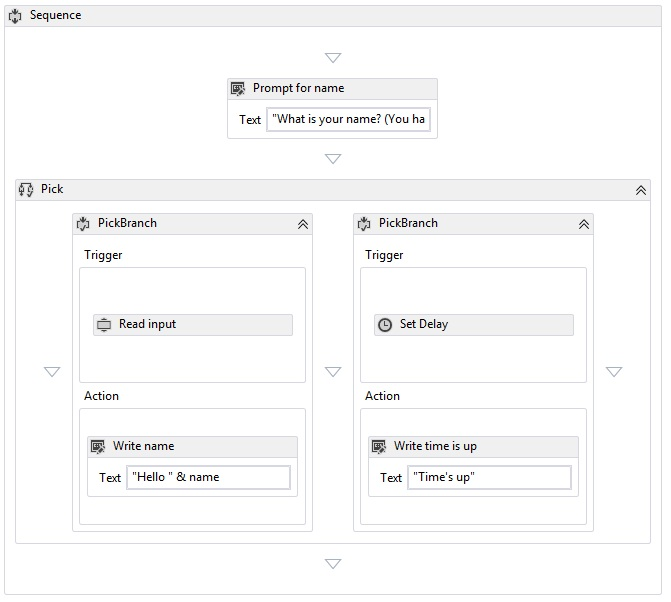

# Pick Activity
The <xref:System.Activities.Statements.Pick> activity simplifies the modeling of a set of event triggers followed by their corresponding handlers.  A <xref:System.Activities.Statements.Pick> activity contains a collection of <xref:System.Activities.Statements.PickBranch> activities, where each <xref:System.Activities.Statements.PickBranch> is a pairing between a <xref:System.Activities.Statements.PickBranch.Trigger%2A> activity and an <xref:System.Activities.Statements.PickBranch.Action%2A> activity.  At execution time, the triggers for all branches are executed in parallel.  When one trigger completes, then its corresponding action is executed, and all other triggers are canceled.  The behavior of the [!INCLUDE[netfx_current_short](../../../includes/netfx-current-short-md.md)]<xref:System.Activities.Statements.Pick> activity is similar to the [!INCLUDE[netfx35_short](../../../includes/netfx35-short-md.md)]<xref:System.Workflow.Activities.ListenActivity> activity.  
  
 The following screenshot from the [Using the Pick Activity](../../../docs/framework/windows-workflow-foundation/samples/using-the-pick-activity.md) SDK sample shows a Pick activity with two branches.  One branch has a trigger called **Read input**, a custom activity that reads input from the command line. The second branch has a <xref:System.Activities.Statements.Delay> activity trigger. If the **Read input** activity receives data before the <xref:System.Activities.Statements.Delay> activity finishes, <xref:System.Activities.Statements.Delay> Delay will be canceled and a greeting will be written to the console.  Otherwise, if the **Read input** activity does not receive data in the allotted time, then it will be canceled and a timeout message will be written to the console.  This is a common pattern used to add a timeout to any action.  
  
   
  
## Best practices  
 When using Pick, the branch that executes is the branch whose trigger completes first.  Conceptually, all triggers execute in parallel, and one trigger may have executed the majority of its logic before it is canceled by the completion of another trigger.  With this in mind, a general guideline to follow when using the Pick activity is to treat the trigger as representing a single event, and to put as little logic as possible into it.  Ideally, the trigger should contain just enough logic to receive an event, and all the processing of that event should go into the action of the branch.  This method minimizes the amount of overlap between the execution of the triggers.  For example, consider a <xref:System.Activities.Statements.Pick> with two triggers, where each trigger contains a <xref:System.ServiceModel.Activities.Receive> activity followed by additional logic.  If the additional logic introduces an idle point, then there is the possibility of both <xref:System.ServiceModel.Activities.Receive> activities completing successfully.  One trigger will fully complete, while another will partially complete.  In some scenarios, accepting a message, and then partially completing the processing of it is unacceptable.  Therefore, when using WF built-in messaging activities such as <xref:System.ServiceModel.Activities.Receive> and <xref:System.ServiceModel.Activities.SendReply>, while <xref:System.ServiceModel.Activities.Receive> is commonly used in the trigger, <xref:System.ServiceModel.Activities.SendReply> and other logic should be put in the action whenever possible.  
  
## Using the Pick activity in the designer  
 To use Pick in the designer, find **Pick** and **PickBranch** in the toolbox.  Drag and drop **Pick** onto the canvas.  By default, a new **Pick** Activity in the designer will contain two branches.  To add additional branches, drag the **PickBranch** activity and drop it next to existing branches. Activities can be dropped onto the **Pick** Activity into either the **Trigger** area or the **Action** area of any **PickBranch**.  
  
## Using the Pick Activity in code  
 The <xref:System.Activities.Statements.Pick> activity is used by populating its <xref:System.Activities.Statements.Pick.Branches%2A> collection with <xref:System.Activities.Statements.PickBranch> activities. The <xref:System.Activities.Statements.PickBranch> activities each have a <xref:System.Activities.Statements.PickBranch.Trigger%2A> property of type <xref:System.Activities.Activity>. When the specified activity completes execution, the <xref:System.Activities.Statements.PickBranch.Action%2A> executes.  
  
 The following code example demonstrates how to use a <xref:System.Activities.Statements.Pick> activity to implement a timeout for an activity that reads a line from the console.  
  
```csharp  
Sequence body = new Sequence()  
{  
    Variables = { name },  
    Activities =   
   {  
       new System.Activities.Statements.Pick  
        {  
           Branches =   
           {  
               new PickBranch  
               {  
                   Trigger = new ReadLine  
                   {  
                      Result = name,  
                      BookmarkName = "name"  
                   },  
                   Action = new WriteLine   
                   {   
                       Text = ExpressionServices.Convert<string>(ctx => "Hello " +   
                           name.Get(ctx))   
                   }  
               },  
               new PickBranch  
               {  
                   Trigger = new Delay  
                   {  
                      Duration = new TimeSpan(0, 0, 5)  
                   },  
                   Action = new WriteLine  
                   {  
                      Text = "Time is up."  
                   }  
               }  
           }  
       }  
   }  
};  
```  
  
```xaml  
<Sequence xmlns="http://schemas.microsoft.com/netfx/2009/xaml/activities" xmlns:x="http://schemas.microsoft.com/winfx/2006/xaml">  
  <Sequence.Variables>  
    <Variable x:TypeArguments="x:String" Name="username" />  
  </Sequence.Variables>  
  <Pick>  
    <PickBranch>  
      <PickBranch.Trigger>  
        <ReadLine BookmarkName="name" Result="username" />  
      </PickBranch.Trigger>  
      <WriteLine>[String.Concat("Hello ", username)]</WriteLine>  
    </PickBranch>  
    <PickBranch>  
      <PickBranch.Trigger>  
        <Delay>00:00:05</Delay>  
      </PickBranch.Trigger>  
      <WriteLine>Time is up.</WriteLine>  
    </PickBranch>  
  </Pick>  
</Sequence>  
```
