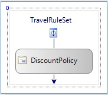
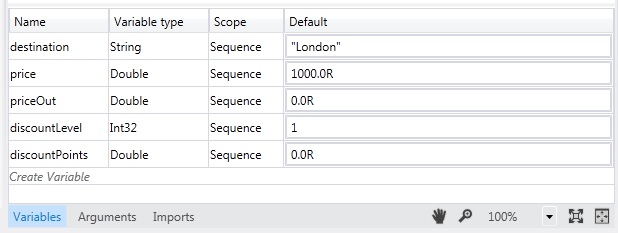
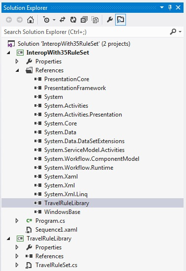
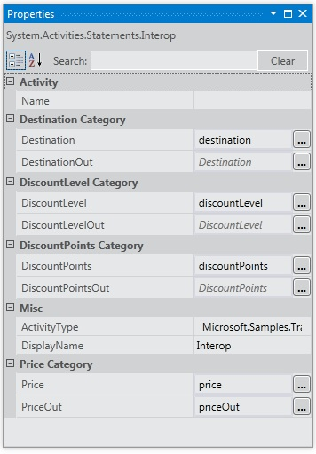

# Interop with 3.5 Rule Set
This sample demonstrates the use of the <xref:System.Activities.Statements.Interop> activity to integrate with a custom activity in [!INCLUDE[netfx35_short](../../../../includes/netfx35-short-md.md)] using <!--zz <xref:System.Workflow.Activities.Policy> --> `System.Workflow.Activities.Policy` and rules. It passes data to the custom activity by binding [!INCLUDE[netfx_current_long](../../../../includes/netfx-current-long-md.md)] variables to the dependency properties exposed by the custom activity.  
  
## Requirements  
  
1.  [!INCLUDE[vs_current_long](../../../../includes/vs-current-long-md.md)]  
  
2.  [!INCLUDE[netfx_current_long](../../../../includes/netfx-current-long-md.md)]  
  
3.  [!INCLUDE[netfx35_long](../../../../includes/netfx35-long-md.md)]  
  
## Demonstrates  
 <xref:System.Activities.Statements.Interop> activity, <!--zz <xref:System.Workflow.Activities.Policy> --> `System.Workflow.Activities.Policy` activity in [!INCLUDE[netfx35_short](../../../../includes/netfx35-short-md.md)] with dependency properties  
  
## Discussion  
 The sample demonstrates one of the integration scenarios for integrating with a [!INCLUDE[netfx35_short](../../../../includes/netfx35-short-md.md)] activity. This sample includes a [!INCLUDE[netfx35_short](../../../../includes/netfx35-short-md.md)] custom activity that invokes a <!--zz <xref:System.Workflow.Activities.Policy> --> `System.Workflow.Activities.Policy` activity.  
  
## TravelRuleLibrary  
 Opening TravelRuleSet.cs in the designer shows a custom sequential activity that contains a Policy activity as follows  
  
   
  
 Double-click the **DiscountPolicy** policy activity to examine the rules. The Rules editor appears to show the rules.  
  
   
  
 Right-click the **DiscountPolicy** activity and select the **View Code** option to examine the code-beside C# code that goes with this activity. Observe the dependency property setting for `DiscountLevel`. This is equivalent to an <xref:System.Activities.Argument> in [!INCLUDE[netfx_current_short](../../../../includes/netfx-current-short-md.md)].  
  
```  
public static DependencyProperty DiscountLevelProperty = DependencyProperty.Register("DiscountLevel", typeof(int), typeof(TravelRuleSet));  
  
[DescriptionAttribute("DiscountLevel")]  
[CategoryAttribute("DiscountLevel Category")]  
[BrowsableAttribute(true)]  
[DesignerSerializationVisibilityAttribute(DesignerSerializationVisibility.Visible)]  
public int DiscountLevel  
{  
   get  
   {  
return ((int)base.GetValue(TravelRuleSet.DiscountLevelProperty)));  
   }  
   set  
   {  
base.SetValue(TravelRuleSet.DiscountLevelProperty, value);  
   }  
}  
```  
  
## InteropWith35RuleSet  
 This is a [!INCLUDE[netfx_current_short](../../../../includes/netfx-current-short-md.md)] sequential workflow project that uses the <xref:System.Activities.Statements.Interop> activity to integrate with the custom rule set created in the TravelRuleLibrary project. Variables are created on the top-level <xref:System.Activities.Statements.Sequence> as follows.  
  
   
  
   
  
 Lastly, the <xref:System.Activities.Statements.Interop> activity is used to integrate with the TravelRuleSet. The variables that were declared earlier on the <xref:System.Activities.Statements.Sequence> are used to bind to the dependency properties.  
  
   
  
   
  
   
  
> [!IMPORTANT]
>  The samples may already be installed on your machine. Check for the following (default) directory before continuing.  
>   
>  `<InstallDrive>:\WF_WCF_Samples`  
>   
>  If this directory does not exist, go to [Windows Communication Foundation (WCF) and Windows Workflow Foundation (WF) Samples for .NET Framework 4](http://go.microsoft.com/fwlink/?LinkId=150780) to download all [!INCLUDE[indigo1](../../../../includes/indigo1-md.md)] and [!INCLUDE[wf1](../../../../includes/wf1-md.md)] samples. This sample is located in the following directory.  
>   
>  `<InstallDrive>:\WF_WCF_Samples\WF\Basic\Built-InActivities\InteropWith35RuleSet`
