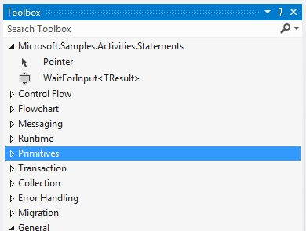
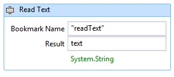

# Wait For Input Activity
This sample demonstrates how to create named bookmarks in a workflow. [!INCLUDE[wf](../../../../includes/wf-md.md)] does not provide an activity for declarative bookmark creation. Therefore, when you want to create a bookmark in your workflow, you must write a custom activity that creates it. The `WaitForInput` activity defined in this sample provides this functionality, so that users can create bookmarks declaratively within a workflow.  
  
## Projects in this sample  
  
|**Project Name**|**Description**|**Main Files**|  
|-|-|-|  
|WaitForInput|Contains `WaitForInput` activity and its designer|WaitForInput.cs   `WaitForInput` activity definition.|  
|||WaitForInputDesigner.xaml   Custom designer for the `WaitForInput` activity.|  
|||TypeToFirstGenericArgumentConverter.cs   WPF type converter used to update the generic type of the activity in the designer.|  
|WaitForInputTestClient|Sample client application that configures and runs a workflow using several WaitForInput activities using the workflow designer.|Sequence1.xaml   A sequential workflow that uses the `WaitForInput` activity.|  
|||Program.cs   Runs an instance of the workflow defined in Sequence1.xaml.|  
  
## WaitForInput Activity  
 The `WaitForInput` activity creates a named bookmark in a workflow. The bookmark waits for a signal and receives data of its configured type. After the bookmark is resumed the data passed into the workflow is available through the `Result` property.  
  
 The `WaitForInput` activity derives from the <xref:System.Activities.NativeActivity> class because it must create bookmarks, which are only accessible through the <xref:System.Activities.NativeActivityContext> class.  
  
 The activity has three attributes applied to it for binding a designer, adding the generic argument feature that can be updated, and setting the default generic type to string. The activity also has the arguments  listed in the following table.  
  
|**Name**|**Type**|**Description**|  
|-|-|-|  
|TResult|Generic argument (TResult)|Type of the bookmark. This is the type of the data to be passed to the bookmark when resumed.|  
|BookmarkName|InArgument\<string>|Name of the bookmark.|  
|Result|InArgument\<TResult>|Data passed to the activity when the bookmark is resumed.|  
  
## WaitForInput activity designer  
 The `WaitForInput` activity designer is implemented in the WaitForInputDesigner.xaml file. The `WaitForInput` activity and its designer are included in the same assembly. The following graphic shows the `WaitForInput` activity in the toolbox within a category that has the same name as the assembly.  
  
   
  
 The following graphic shows the `WaitForInput` designer. Because, the `WaitForInput` activity is very basic, the designer allows setting all its arguments directly in the designer surface.  
  
   
  
#### To use this sample  
  
1.  Using [!INCLUDE[vs2010](../../../../includes/vs2010-md.md)], open the WaitForInput.sln file.  
  
2.  To build the solution, press CTRL+SHIFT+B.  
  
3.  To start the sample without debugging, press CTRL+F5.  
  
> [!IMPORTANT]
>  The samples may already be installed on your machine. Check for the following (default) directory before continuing.  
>   
>  `<InstallDrive>:\WF_WCF_Samples`  
>   
>  If this directory does not exist, go to [Windows Communication Foundation (WCF) and Windows Workflow Foundation (WF) Samples for .NET Framework 4](http://go.microsoft.com/fwlink/?LinkId=150780) to download all [!INCLUDE[indigo1](../../../../includes/indigo1-md.md)] and [!INCLUDE[wf1](../../../../includes/wf1-md.md)] samples. This sample is located in the following directory.  
>   
>  `<InstallDrive>:\WF_WCF_Samples\WF\Scenario\ActivityLibrary\WaitForInput`