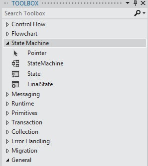

# State Machine Workflows
A state machine is a well-known paradigm for developing programs. The <xref:System.Activities.Statements.StateMachine> activity, along with <xref:System.Activities.Statements.State>, <xref:System.Activities.Statements.Transition>, and other activities can be used to build state machine workflow programs. This topic provides an overview of creating state machine workflows.  
  
## State Machine Workflow Overview  
 State machine workflows provide a modeling style with which you can model your workflow in an event-driven manner. A <xref:System.Activities.Statements.StateMachine> activity contains the states and transitions that make up the logic of the state machine, and can be used anywhere an activity can be used. There are several classes in the state machine runtime:  
  
-   <xref:System.Activities.Statements.StateMachine>  
  
-   <xref:System.Activities.Statements.State>  
  
-   <xref:System.Activities.Statements.Transition>  
  
 To create a state machine workflow, states are added to a <xref:System.Activities.Statements.StateMachine> activity, and transitions are used control the flow between states. The following screenshot, from the [Getting Started Tutorial](../../../docs/framework/windows-workflow-foundation/getting-started-tutorial.md) step [How to: Create a State Machine Workflow](../../../docs/framework/windows-workflow-foundation/how-to-create-a-state-machine-workflow.md), shows a state machine workflow with three states and three transitions. **Initialize Target** is the initial state and represents the first state in the workflow. This is designated by the line leading to it from the **Start** node. The final state in the workflow is named **FinalState**, and represents the point at which the workflow is completed.  
  
   
  
 A state machine workflow must have one and only one initial state, and at least one final state. Each state that is not a final state must have at least one transition. The following sections cover creating and configuring states and transitions.  
  
## Creating and Configuring States  
 A <xref:System.Activities.Statements.State> represents a state in which a state machine can be in. To add a <xref:System.Activities.Statements.State> to a workflow, drag the **State** activity designer from the **State Machine** section of the **Toolbox** and drop it onto a <xref:System.Activities.Statements.StateMachine> activity on the [!INCLUDE[wfd1](../../../includes/wfd1-md.md)] surface.  
  
   
  
 To configure a state as the **Initial State**, right-click the state and select **Set as Initial State**. Additionally, if there is no current initial state, the initial state can be designated by dragging a line from the **Start** node at the top of the workflow to the desired state. When a <xref:System.Activities.Statements.StateMachine> activity is dropped onto the workflow designer, it is pre-configured with an initial state named **State1**. A state machine workflow must have one and only one initial state.  
  
 A state that represents a terminating state in a state machine is called a final state. A final state is a state that has its <xref:System.Activities.Statements.State.IsFinal%2A> property set to `true`, has no <xref:System.Activities.Statements.State.Exit%2A> activity, and no transitions originating from it. To add a final state to a workflow, drag a **FinalState** activity designer from the **State Machine** section of the **Toolbox** and drop it onto a <xref:System.Activities.Statements.StateMachine> activity on the [!INCLUDE[wfd1](../../../includes/wfd1-md.md)] surface. A state machine workflow must have at least one final state.  
  
### Configuring Entry and Exit Actions  
 A state can have an <xref:System.Activities.Statements.State.Entry%2A> and an <xref:System.Activities.Statements.State.Exit%2A> action. (A state configured as a final state may have only an entry action). When a workflow instance enters a state, any activities in the entry action execute. When the entry action is complete, the triggers for the state’s transitions are scheduled. When a transition to another state is confirmed, the activities in the exit action are executed, even if the state transitions back to the same state. After the exit action completes, the activities in the transition’s action execute, and then the new state is transitioned to, and its entry actions are scheduled.  
  
> [!NOTE]
>  When debugging a state machine workflow, breakpoints can be placed on the root state machine activity and states within the state machine workflow. Breakpoints may not be placed directly on the transitions, but they may be placed on any activities contained within the states and transitions.  
  
## Creating and Configuring Transitions  
 All states must have at least one transition, except for a final state which may not have any transitions. Transitions may be added after a state is added to a state machine workflow, or they can be created as the state is dropped.  
  
 To add a <xref:System.Activities.Statements.State> and create a transition in one step, drag a **State** activity from the **State Machine** section of the **Toolbox** and hover it over another state in the workflow designer. When the dragged <xref:System.Activities.Statements.State> is over another <xref:System.Activities.Statements.State>, four triangles will appear around the other <xref:System.Activities.Statements.State>. If the <xref:System.Activities.Statements.State> is dropped onto one of the four triangles, it is added to the state machine and a transition is created from the source <xref:System.Activities.Statements.State> to the dropped destination <xref:System.Activities.Statements.State>. For more information, see [Transition Activity Designer](/visualstudio/workflow-designer/transition-activity-designer).  
  
 To create a transition after a state is added, there are two options. The first option is to drag the state from the workflow designer surface and hover it over an existing state and drop it on one of the drop points. This is very similar to the method described in the previous section. You can also hover the mouse over the desired source state, and drag a line to the desired destination state.  
  
> [!NOTE]
>  A single state in a state machine can have up to 76 transitions created using the workflow designer. The limit on transitions for a state for workflows created outside the designer is limited only by system resources.  
  
 A transition may have a <xref:System.Activities.Statements.Transition.Trigger%2A>, a <xref:System.Activities.Statements.Transition.Condition%2A>, and an <xref:System.Activities.Statements.Transition.Action%2A>. A transition’s <xref:System.Activities.Statements.Transition.Trigger%2A> is scheduled when the transition’s source state’s <xref:System.Activities.Statements.State.Entry%2A> action is complete. Typically the <xref:System.Activities.Statements.Transition.Trigger%2A> is an activity that waits for some type of event to occur, but it can be any activity, or no activity at all. Once the <xref:System.Activities.Statements.Transition.Trigger%2A> activity is complete, the <xref:System.Activities.Statements.Transition.Condition%2A>, if present, is evaluated. If there is no <xref:System.Activities.Statements.Transition.Trigger%2A> activity then the <xref:System.Activities.Statements.Transition.Condition%2A> is immediately evaluated. If the condition evaluates to `false`, the transition is cancelled, and the <xref:System.Activities.Statements.Transition.Trigger%2A> activity for all transitions from the state are rescheduled. If there are other transitions that share the same source state as the current transition, those <xref:System.Activities.Statements.Transition.Trigger%2A> actions are cancelled and rescheduled as well. If the <xref:System.Activities.Statements.Transition.Condition%2A> evaluates to `true`, or there is no condition, then the <xref:System.Activities.Statements.State.Exit%2A> action of the source state is executed, and then the <xref:System.Activities.Statements.Transition.Action%2A> of the transition is executed. When the <xref:System.Activities.Statements.Transition.Action%2A> completes, control passes to the **Target** state  
  
 Transitions that share a common trigger are known as shared trigger transitions. Each transition in a group of shared trigger transitions has the same trigger, but a unique <xref:System.Activities.Statements.Transition.Condition%2A> and Action. To add additional actions to a transition and create a shared transition, click the circle that indicates the start of the desired transition and drag it to the desired state. The new transition will share a same trigger as the initial transition, but it will have a unique condition and action. Shared transitions can also be created from within the transition designer by clicking **Add shared trigger transition** at the bottom of the transition designer, and then selecting the desired target state from the **Available states to connect** drop-down.  
  
> [!NOTE]
>  Note that if the <xref:System.Activities.Statements.Transition.Condition%2A> of a transition evaluates to `False` (or all of the conditions of a shared trigger transition evaluate to `False`), the transition will not occur and all triggers for all the transitions from the state will be rescheduled.  
  
 For more information on creating state machine workflows, see [How to: Create a State Machine Workflow](../../../docs/framework/windows-workflow-foundation/how-to-create-a-state-machine-workflow.md), [StateMachine Activity Designer](/visualstudio/workflow-designer/statemachine-activity-designer), [State Activity Designer](/visualstudio/workflow-designer/state-activity-designer), [FinalState Activity Designer](/visualstudio/workflow-designer/finalstate-activity-designer), and [Transition Activity Designer](/visualstudio/workflow-designer/transition-activity-designer).  
  
## State Machine Terminology  
 This section defines the state machine vocabulary used throughout this topic.  
  
 State  
 The basic unit that composes a state machine. A state machine can be in one state at any particular time.  
  
 Entry Action  
 An activity executed when entering the state  
  
 Exit Action  
 An activity executed when exiting the state  
  
 Transition  
 A directed relationship between two states which represents the complete response of a state machine to an occurrence of an event of a particular type.  
  
 Shared Transition  
 A transition that shares a source state and trigger with one or more transitions, but has a unique condition and action.  
  
 Trigger  
 A triggering activity that causes a transition to occur.  
  
 Condition  
 A constraint which must evaluate to `true` after the trigger occurs in order for the transition to complete.  
  
 Transition Action  
 An activity which is executed when performing a certain transition.  
  
 Conditional Transition  
 A transition with an explicit condition.  
  
 Self-transition  
 A transition which transits from a state to itself.  
  
 Initial State  
 A state which represents the starting point of the state machine.  
  
 Final State  
 A state which represents the completion of the state machine.  
  
## See Also  
 [How to: Create a State Machine Workflow](../../../docs/framework/windows-workflow-foundation/how-to-create-a-state-machine-workflow.md)  
 [StateMachine Activity Designer](/visualstudio/workflow-designer/statemachine-activity-designer)  
 [State Activity Designer](/visualstudio/workflow-designer/state-activity-designer)  
 [FinalState Activity Designer](/visualstudio/workflow-designer/finalstate-activity-designer)  
 [Transition Activity Designer](/visualstudio/workflow-designer/transition-activity-designer)
