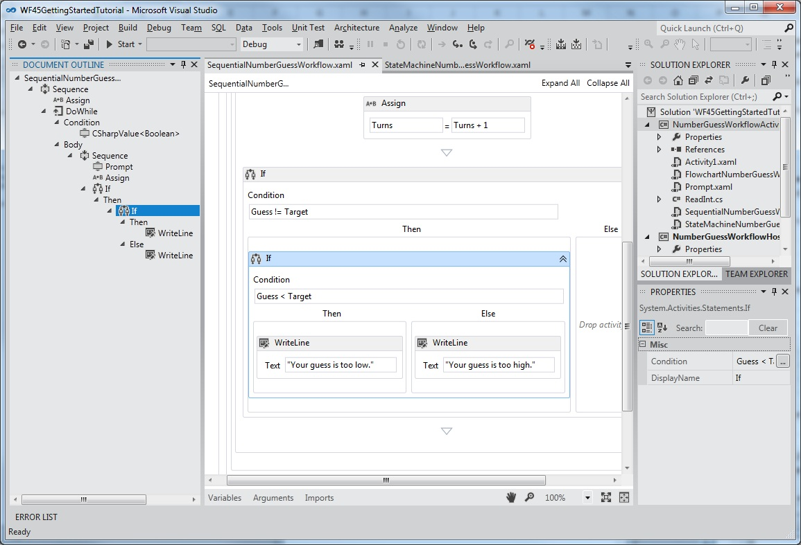

# Support for New Workflow Foundation 4.5 Features in the Rehosted Workflow Designer
Windows Workflow Foundation (WF) in .NET Framework 4.5 introduced many new features, including several enhancements to the workflow designer experience. This topic details which of these features are supported in the rehosted designer, and which ones are currently not supported.

> [!NOTE]
> For a list of all of the new Windows Workflow Foundation (WF) features introduced in .NET Framework 4.5, including those that are unrelated to designer rehosting, see [What's New in Windows Workflow Foundation in .NET 4.5](whats-new-in-wf-in-dotnet.md).

## Activities
 The built-in activity library contains new activities and new features for existing activities. All of these new activities are supported in the rehosted designer. For more information on these new activities, see the [Activities](whats-new-in-wf-in-dotnet.md#BKMK_NewActivities) section of [What's New in Windows Workflow Foundation in .NET 4.5](whats-new-in-wf-in-dotnet.md).

## C# Expressions
 Prior to .NET Framework 4.5, all expressions in workflows could only be written in Visual Basic. In .NET Framework 4.5, Visual Basic expressions are only used for projects created using Visual Basic. Visual C# projects now use C# for expressions. When authoring workflows in Visual Studio 2012, a fully functional C# expression editor is provided which capabilities such as grammar highlighting and intellisense. C# workflow projects created in previous versions that use Visual Basic expressions will continue to work.

> [!WARNING]
> C# expressions are not supported in the rehosted designer.

## New Designer Capabilities

### Designer Search
 The [Quick Find](whats-new-in-wf-in-dotnet.md#BKMK_QuickFind) and [Find in Files](whats-new-in-wf-in-dotnet.md#BKMK_FindInFiles) features introduced with .NET Framework 4.5 are not supported in the rehosted designer. The `Toolbox` search is supported in the rehosted designer. For more information on these features, see [Designer Search](whats-new-in-wf-in-dotnet.md#BKMK_DesignerSearch).

> [!WARNING]
> [Quick Find](whats-new-in-wf-in-dotnet.md#BKMK_QuickFind) and [Find in Files](whats-new-in-wf-in-dotnet.md#BKMK_FindInFiles) are not supported in the rehosted designer.

### Delete context menu item in variable and argument designer
 In [!INCLUDE[netfx40_short](../../../includes/netfx40-short-md.md)], variables and arguments could only be deleted in the designer using the keyboard. Starting with .NET Framework 4.5, variables and arguments can be deleted using the context menu. This feature is supported in the rehosted designer.

 The following screenshot shows the variable and argument designer context menu.

 

### Auto-surround with Sequence
 Since a workflow or certain container activities (such as <xref:System.Activities.Statements.NoPersistScope>) can only contain a single body activity, adding a second activity required the developer to delete the first activity, add a <xref:System.Activities.Statements.Sequence> activity, and then add both activities to the sequence activity. Starting with .NET Framework 4.5, when adding a second activity to the designer surface, a `Sequence` activity will be automatically created to wrap both activities. This feature is supported in the rehosted designer.

 The following screenshot shows a `WriteLine` activity in the `Body` of a `NoPersistScope`.

 

 The following screenshot shows the automatically created `Sequence` activity in the `Body` when a second `WriteLine` is dropped below the first.

 

### Pan Mode
 To more easily navigate a large workflow in the designer, pan mode can be enabled, allowing the developer to click and drag to move the visible portion of the workflow, rather than needing to use the scroll bars. The button to activate pan mode is in the lower right corner of the designer. This feature is supported in the rehosted designer.

 The following screenshot shows the pan button which is located at the bottom right corner of the workflow designer.

 

 The middle mouse button or space bar can also be used to pan the workflow designer.

### Multi-select
 Multiple activities can be selected at one time, either by dragging a rectangle around them (when pan mode is not enabled), or by holding down Ctrl and click on the desired activities one by one. This feature is supported in the rehosted designer.

 Multiple activity selections can also be dragged and dropped within the designer, and can also be interacted with using the context menu.

### Outline view of workflow items
 In order to make hierarchical workflows easier to navigate, components of a workflow are shown in a tree-style outline view. The outline view is displayed in the **Document Outline** view. To open this view in Visual Studio, from the top menu, select **View**, **Other Windows**, **Document Outline**, or press Ctrl W,U. Clicking on a node in outline view will navigate to the corresponding activity in the workflow designer, and the outline view will be updated to show activities that are selected in the designer. This feature is supported in the rehosted designer.

 The following screenshot of the completed workflow from the [Getting Started Tutorial](getting-started-tutorial.md) shows the outline view with a sequential workflow.

 

### More control of visibility of shell bar and header items
 In a rehosted designer, some of the standard UI controls may not have meaning for a given workflow, and may be turned off. In [!INCLUDE[netfx40_short](../../../includes/netfx40-short-md.md)], this customization is only supported by the shell bar at the bottom of the designer. In .NET Framework 4.5, the visibility of shell header items at the top of the designer can be adjusted by setting <xref:System.Activities.Presentation.View.DesignerView.WorkflowShellHeaderItemsVisibility%2A> with the appropriate <xref:System.Activities.Presentation.View.ShellHeaderItemsVisibility> value.

### Auto-connect and auto-insert in Flowchart and State Machine workflows
 In [!INCLUDE[netfx40_short](../../../includes/netfx40-short-md.md)], connections between nodes in a Flowchart workflow had to be added manually. In .NET Framework 4.5, Flowchart and State Machine nodes have auto-connect points that become visible when an activity is dragged from the toolbox onto the designer surface. Dropping an activity on one of these points automatically adds the activity along with the necessary connection.

 The following screenshot shows the attachment points that become visible when an activity is dragged from the toolbox.

 

 Activities can also be dragged onto connections between flowchart nodes and states to auto-insert the node between two other nodes. The following screenshot shows the highlighted connecting line where activities can be dragged from the toolbox and dropped.

 

 Auto-connect and auto-insert are supported in the rehosted designer.

### Designer Annotations
 To facilitate developing larger workflows, the designer now supports adding annotations to help keep track of the design process. Annotation can be added to activities, states, flowchart nodes, variables and arguments. The following screenshot shows the context menu used to add annotations to the designer.

 

 Designer annotations are supported in the rehosted designer.

### Define and consume ActivityDelegate objects in the designer
 Activities in [!INCLUDE[netfx40_short](../../../includes/netfx40-short-md.md)] used <xref:System.Activities.ActivityDelegate> objects to expose execution points where other parts of the workflow could interact with a workflow's execution, but using these execution points usually required a fair amount of code. In this release, developers can define and consume activity delegates using the workflow designer. For more information, see [How to: Define and consume activity delegates in the Workflow Designer](/visualstudio/workflow-designer/how-to-define-and-consume-activity-delegates-in-the-workflow-designer).

 Activity delegates are supported in the rehosted designer.

### Build-time validation
 In [!INCLUDE[netfx40_short](../../../includes/netfx40-short-md.md)], workflow validation errors weren’t counted as build errors during the build of a workflow project. This meant that building a workflow project could succeed even when there were workflow validation errors. In .NET Framework 4.5, workflow validation errors cause the build to fail.

> [!WARNING]
> Build-time validation is not supported in the rehosted designer.  
  
### Design-time background validation  
 In [!INCLUDE[netfx40_short](../../../includes/netfx40-short-md.md)], workflows were validated as a foreground process, which could potentially block the UI during complex or time-consuming validation processes. Workflow validation now takes place on a background thread, so that the UI is not blocked.  
  
 Design-time background validation is supported in the rehosted designer.  
  
### View state located in a separate location in XAML files  
 In [!INCLUDE[netfx40_short](../../../includes/netfx40-short-md.md)], the view state information for a workflow is stored across the XAML file in many different locations. This is inconvenient for developers who want to read XAML directly, or write code to remove the view state information. In .NET Framework 4.5, the view state information in the XAML file is serialized as a separate element in the XAML file.  Developers can easily locate and edit the view state information of an activity, or remove the view state altogether.  
  
 This feature is supported in the rehosted workflow designer.  
  
### Opt-in for Workflow 4.5 features in rehosted designer  
 To preserve backward compatibility, some new features included in .NET Framework 4.5 are not enabled by default in the rehosted designer. This is to ensure that existing applications that use the rehosted designer are not broken by updating to the latest version. To enable new features in the rehosted designer, either set <xref:System.Activities.Presentation.DesignerConfigurationService.TargetFrameworkName%2A> to ".Net Framework 4.5", or set individual members of <xref:System.Activities.Presentation.DesignerConfigurationService> to enable individual features.  
  
## New Workflow Development Models  
 In addition to flowchart and sequential workflow development models, this release includes State Machine workflows, and contract-first workflow services.  
  
### State machine workflows  
 State machine workflows were introduced as part of the .NET Framework 4.0.1 in the [Microsoft .NET Framework 4 Platform Update 1](https://go.microsoft.com/fwlink/?LinkID=215092). This update included several new classes and activities which allowed developers to create state machine workflows. These classes and activities have been updated for .NET Framework 4.5. Updates include:  
  
1. The ability to set breakpoints on states  
  
2. The ability to copy and paste transitions in the workflow designer  
  
3. Designer support for shared trigger transition creation  
  
4. Activities used to create State Machine workflows, including: <xref:System.Activities.Statements.StateMachine>, <xref:System.Activities.Statements.State>, and <xref:System.Activities.Statements.Transition>  
  
 The following screenshot shows the completed state machine workflow from the [Getting Started Tutorial](getting-started-tutorial.md) step [How to: Create a State Machine Workflow](how-to-create-a-state-machine-workflow.md).  
  
   
  
 For more information on creating state machine workflows, see [State Machine Workflows](state-machine-workflows.md). State machine workflows are supported in the rehosted designer.  
  
### Contract-first workflow development  
 The contract-first workflow development tool allows the developer to design a contract in code first, then, with a few clicks in Visual Studio, automatically generate an activity template in the toolbox representing each operation. These activities are then used to create a workflow that implements the operations defined by the contract. The workflow designer will validate the workflow service to ensure that these operations are implemented and the signature of the workflow matches the contract signature. The developer can also associate a workflow service with a collection of implemented contracts. For more information on contract-first workflow service development, see [How to: Create a workflow service that consumes an existing service contract](how-to-create-a-workflow-service-that-consumes-an-existing-service-contract.md).  
  
> [!WARNING]
> Contract-first workflow development is not supported in the workflow designer.
