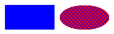
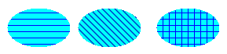
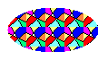

# Brushes and Filled Shapes in GDI+
A closed shape, such as a rectangle or an ellipse, consists of an outline and an interior. The outline is drawn with a pen and the interior is filled with a brush. [!INCLUDE[ndptecgdiplus](../../../../includes/ndptecgdiplus-md.md)] provides several brush classes for filling the interiors of closed shapes: <xref:System.Drawing.SolidBrush>, <xref:System.Drawing.Drawing2D.HatchBrush>, <xref:System.Drawing.TextureBrush>, <xref:System.Drawing.Drawing2D.LinearGradientBrush>, and <xref:System.Drawing.Drawing2D.PathGradientBrush>. All of these classes inherit from the <xref:System.Drawing.Brush> class. The following illustration shows a rectangle filled with a solid brush and an ellipse filled with a hatch brush.  
  
   
  
## Solid Brushes  
 To fill a closed shape, you need an instance of the <xref:System.Drawing.Graphics> class and a <xref:System.Drawing.Brush>. The instance of the <xref:System.Drawing.Graphics> class provides methods, such as <xref:System.Drawing.Graphics.FillRectangle%2A> and <xref:System.Drawing.Graphics.FillEllipse%2A>, and the <xref:System.Drawing.Brush> stores attributes of the fill, such as color and pattern. The <xref:System.Drawing.Brush> is passed as one of the arguments to the fill method. The following code example shows how to fill an ellipse with a solid red color.  
  
 [!code-csharp[LinesCurvesAndShapes#121](../../../../samples/snippets/csharp/VS_Snippets_Winforms/LinesCurvesAndShapes/CS/Class1.cs#121)]
 [!code-vb[LinesCurvesAndShapes#121](../../../../samples/snippets/visualbasic/VS_Snippets_Winforms/LinesCurvesAndShapes/VB/Class1.vb#121)]  
  
> [!NOTE]
>  In the preceding example, the brush is of type <xref:System.Drawing.SolidBrush>, which inherits from <xref:System.Drawing.Brush>.  
  
## Hatch Brushes  
 When you fill a shape with a hatch brush, you specify a foreground color, a background color, and a hatch style. The foreground color is the color of the hatching.  
  
 [!code-csharp[LinesCurvesAndShapes#122](../../../../samples/snippets/csharp/VS_Snippets_Winforms/LinesCurvesAndShapes/CS/Class1.cs#122)]
 [!code-vb[LinesCurvesAndShapes#122](../../../../samples/snippets/visualbasic/VS_Snippets_Winforms/LinesCurvesAndShapes/VB/Class1.vb#122)]  
  
 [!INCLUDE[ndptecgdiplus](../../../../includes/ndptecgdiplus-md.md)] provides more than 50 hatch styles; the three styles shown in the following illustration are <xref:System.Drawing.Drawing2D.HatchStyle.Horizontal>, <xref:System.Drawing.Drawing2D.HatchStyle.ForwardDiagonal>, and <xref:System.Drawing.Drawing2D.HatchStyle.Cross>.  
  
   
  
## Texture Brushes  
 With a texture brush, you can fill a shape with a pattern stored in a bitmap. For example, suppose the following picture is stored in a disk file named `MyTexture.bmp`.  
  
   
  
 The following code example shows how to fill an ellipse by repeating the picture stored in `MyTexture.bmp`.  
  
 [!code-csharp[LinesCurvesAndShapes#123](../../../../samples/snippets/csharp/VS_Snippets_Winforms/LinesCurvesAndShapes/CS/Class1.cs#123)]
 [!code-vb[LinesCurvesAndShapes#123](../../../../samples/snippets/visualbasic/VS_Snippets_Winforms/LinesCurvesAndShapes/VB/Class1.vb#123)]  
  
 The following illustration shows the filled ellipse.  
  
   
  
## Gradient Brushes  
 [!INCLUDE[ndptecgdiplus](../../../../includes/ndptecgdiplus-md.md)] provides two kinds of gradient brushes: linear and path. You can use a linear gradient brush to fill a shape with color that changes gradually as you move across the shape horizontally, vertically, or diagonally. The following code example shows how to fill an ellipse with a horizontal gradient brush that changes from blue to green as you move from the left edge of the ellipse to the right edge.  
  
 [!code-csharp[LinesCurvesAndShapes#124](../../../../samples/snippets/csharp/VS_Snippets_Winforms/LinesCurvesAndShapes/CS/Class1.cs#124)]
 [!code-vb[LinesCurvesAndShapes#124](../../../../samples/snippets/visualbasic/VS_Snippets_Winforms/LinesCurvesAndShapes/VB/Class1.vb#124)]  
  
 The following illustration shows the filled ellipse.  
  
   
  
 A path gradient brush can be configured to change color as you move from the center of a shape toward the edge.  
  
   
  
 Path gradient brushes are quite flexible. The gradient brush used to fill the triangle in the following illustration changes gradually from red at the center to each of three different colors at the vertices.  
  
   
  
## See Also  
 <xref:System.Drawing.SolidBrush?displayProperty=nameWithType>  
 <xref:System.Drawing.Drawing2D.HatchBrush?displayProperty=nameWithType>  
 <xref:System.Drawing.TextureBrush?displayProperty=nameWithType>  
 <xref:System.Drawing.Drawing2D.LinearGradientBrush?displayProperty=nameWithType>  
 [Lines, Curves, and Shapes](../../../../docs/framework/winforms/advanced/lines-curves-and-shapes.md)  
 [How to: Draw a Filled Rectangle on a Windows Form](../../../../docs/framework/winforms/advanced/how-to-draw-a-filled-rectangle-on-a-windows-form.md)  
 [How to: Draw a Filled Ellipse on a Windows Form](../../../../docs/framework/winforms/advanced/how-to-draw-a-filled-ellipse-on-a-windows-form.md)
