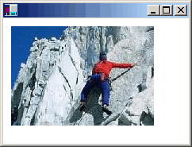

# Drawing, Positioning, and Cloning Images in GDI+
You can use the <xref:System.Drawing.Bitmap> class to load and display raster images, and you can use the <xref:System.Drawing.Imaging.Metafile> class to load and display vector images. The <xref:System.Drawing.Bitmap> and <xref:System.Drawing.Imaging.Metafile> classes inherit from the <xref:System.Drawing.Image> class. To display a vector image, you need an instance of the <xref:System.Drawing.Graphics> class and a <xref:System.Drawing.Imaging.Metafile>. To display a raster image, you need an instance of the <xref:System.Drawing.Graphics> class and a <xref:System.Drawing.Bitmap>. The instance of the <xref:System.Drawing.Graphics> class provides the <xref:System.Drawing.Graphics.DrawImage%2A> method, which receives the <xref:System.Drawing.Imaging.Metafile> or <xref:System.Drawing.Bitmap> as an argument.  
  
## File Types and Cloning  
 The following code example shows how to construct a <xref:System.Drawing.Bitmap> from the file Climber.jpg and displays the bitmap. The destination point for the upper-left corner of the image, (10, 10), is specified in the second and third parameters.  
  
 [!code-csharp[System.Drawing.ImagesBitmapsMetafiles#11](../../../../samples/snippets/csharp/VS_Snippets_Winforms/System.Drawing.ImagesBitmapsMetafiles/CS/Class1.cs#11)]
 [!code-vb[System.Drawing.ImagesBitmapsMetafiles#11](../../../../samples/snippets/visualbasic/VS_Snippets_Winforms/System.Drawing.ImagesBitmapsMetafiles/VB/Class1.vb#11)]  
  
 The following illustration shows the image.  
  
   
  
 You can construct <xref:System.Drawing.Bitmap> objects from a variety of graphics file formats: BMP, GIF, JPEG, EXIF, PNG, TIFF, and ICON.  
  
 The following code example shows how to construct <xref:System.Drawing.Bitmap> objects from a variety of file types and then displays the bitmaps.  
  
 [!code-csharp[System.Drawing.ImagesBitmapsMetafiles#12](../../../../samples/snippets/csharp/VS_Snippets_Winforms/System.Drawing.ImagesBitmapsMetafiles/CS/Class1.cs#12)]
 [!code-vb[System.Drawing.ImagesBitmapsMetafiles#12](../../../../samples/snippets/visualbasic/VS_Snippets_Winforms/System.Drawing.ImagesBitmapsMetafiles/VB/Class1.vb#12)]  
  
 The <xref:System.Drawing.Bitmap> class provides a <xref:System.Drawing.Bitmap.Clone%2A> method that you can use to make a copy of an existing <xref:System.Drawing.Bitmap>. The <xref:System.Drawing.Bitmap.Clone%2A> method has a source rectangle parameter that you can use to specify the portion of the original bitmap that you want to copy. The following code example shows how to create a <xref:System.Drawing.Bitmap> by cloning the top half of an existing <xref:System.Drawing.Bitmap>. Then both images are drawn.  
  
 [!code-csharp[System.Drawing.ImagesBitmapsMetafiles#13](../../../../samples/snippets/csharp/VS_Snippets_Winforms/System.Drawing.ImagesBitmapsMetafiles/CS/Class1.cs#13)]
 [!code-vb[System.Drawing.ImagesBitmapsMetafiles#13](../../../../samples/snippets/visualbasic/VS_Snippets_Winforms/System.Drawing.ImagesBitmapsMetafiles/VB/Class1.vb#13)]  
  
 The following illustration shows the two images.  
  
   
  
## See Also  
 [Images, Bitmaps, and Metafiles](../../../../docs/framework/winforms/advanced/images-bitmaps-and-metafiles.md)  
 [How to: Create Graphics Objects for Drawing](../../../../docs/framework/winforms/advanced/how-to-create-graphics-objects-for-drawing.md)  
 [Working with Images, Bitmaps, Icons, and Metafiles](../../../../docs/framework/winforms/advanced/working-with-images-bitmaps-icons-and-metafiles.md)
