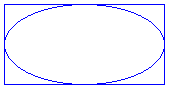
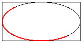

# Ellipses and Arcs in GDI+
You can easily draw ellipses and arcs using the <xref:System.Drawing.Graphics.DrawEllipse%2A> and <xref:System.Drawing.Graphics.DrawArc%2A> methods of the <xref:System.Drawing.Graphics> class.  
  
## Drawing an Ellipse  
 To draw an ellipse, you need a <xref:System.Drawing.Graphics> object and a <xref:System.Drawing.Pen> object. The <xref:System.Drawing.Graphics> object provides the <xref:System.Drawing.Graphics.DrawEllipse%2A> method, and the <xref:System.Drawing.Pen> object stores attributes, such as width and color, of the line used to render the ellipse. The <xref:System.Drawing.Pen> object is passed as one of the arguments to the <xref:System.Drawing.Graphics.DrawEllipse%2A> method. The remaining arguments passed to the <xref:System.Drawing.Graphics.DrawEllipse%2A> method specify the bounding rectangle for the ellipse. The following illustration shows an ellipse along with its bounding rectangle.  
  
   
  
 The following example draws an ellipse; the bounding rectangle has a width of 80, a height of 40, and an upper-left corner of (100, 50):  
  
 [!code-csharp[LinesCurvesAndShapes#51](../../../../samples/snippets/csharp/VS_Snippets_Winforms/LinesCurvesAndShapes/CS/Class1.cs#51)]
 [!code-vb[LinesCurvesAndShapes#51](../../../../samples/snippets/visualbasic/VS_Snippets_Winforms/LinesCurvesAndShapes/VB/Class1.vb#51)]  
  
 <xref:System.Drawing.Graphics.DrawEllipse%2A> is an overloaded method of the <xref:System.Drawing.Graphics> class, so there are several ways you can supply it with arguments. For example, you can construct a <xref:System.Drawing.Rectangle> and pass the <xref:System.Drawing.Rectangle> to the <xref:System.Drawing.Graphics.DrawEllipse%2A> method as an argument:  
  
 [!code-csharp[LinesCurvesAndShapes#52](../../../../samples/snippets/csharp/VS_Snippets_Winforms/LinesCurvesAndShapes/CS/Class1.cs#52)]
 [!code-vb[LinesCurvesAndShapes#52](../../../../samples/snippets/visualbasic/VS_Snippets_Winforms/LinesCurvesAndShapes/VB/Class1.vb#52)]  
  
## Drawing an Arc  
 An arc is a portion of an ellipse. To draw an arc, you call the <xref:System.Drawing.Graphics.DrawArc%2A> method of the <xref:System.Drawing.Graphics> class. The parameters of the <xref:System.Drawing.Graphics.DrawArc%2A> method are the same as the parameters of the <xref:System.Drawing.Graphics.DrawEllipse%2A> method, except that <xref:System.Drawing.Graphics.DrawArc%2A> requires a starting angle and sweep angle. The following example draws an arc with a starting angle of 30 degrees and a sweep angle of 180 degrees:  
  
 [!code-csharp[LinesCurvesAndShapes#53](../../../../samples/snippets/csharp/VS_Snippets_Winforms/LinesCurvesAndShapes/CS/Class1.cs#53)]
 [!code-vb[LinesCurvesAndShapes#53](../../../../samples/snippets/visualbasic/VS_Snippets_Winforms/LinesCurvesAndShapes/VB/Class1.vb#53)]  
  
 The following illustration shows the arc, the ellipse, and the bounding rectangle.  
  
   
  
## See Also  
 <xref:System.Drawing.Graphics?displayProperty=nameWithType>  
 <xref:System.Drawing.Pen?displayProperty=nameWithType>  
 [Lines, Curves, and Shapes](../../../../docs/framework/winforms/advanced/lines-curves-and-shapes.md)  
 [How to: Create Graphics Objects for Drawing](../../../../docs/framework/winforms/advanced/how-to-create-graphics-objects-for-drawing.md)  
 [How to: Create a Pen](../../../../docs/framework/winforms/advanced/how-to-create-a-pen.md)  
 [How to: Draw an Outlined Shape](../../../../docs/framework/winforms/advanced/how-to-draw-an-outlined-shape.md)
