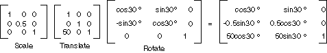
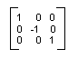
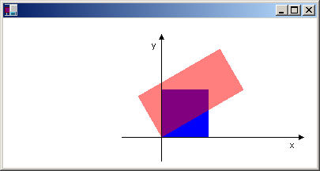

# Global and Local Transformations
A global transformation is a transformation that applies to every item drawn by a given <xref:System.Drawing.Graphics> object. In contrast, a local transformation is a transformation that applies to a specific item to be drawn.  
  
## Global Transformations  
 To create a global transformation, construct a <xref:System.Drawing.Graphics> object, and then manipulate its <xref:System.Drawing.Graphics.Transform%2A> property. The <xref:System.Drawing.Graphics.Transform%2A> property is a <xref:System.Drawing.Drawing2D.Matrix> object, so it can hold any sequence of affine transformations. The transformation stored in the <xref:System.Drawing.Graphics.Transform%2A> property is called the world transformation. The <xref:System.Drawing.Graphics> class provides several methods for building up a composite world transformation: <xref:System.Drawing.Graphics.MultiplyTransform%2A>, <xref:System.Drawing.Graphics.RotateTransform%2A>, <xref:System.Drawing.Graphics.ScaleTransform%2A>, and <xref:System.Drawing.Graphics.TranslateTransform%2A>. The following example draws an ellipse twice: once before creating a world transformation and once after. The transformation first scales by a factor of 0.5 in the y direction, then translates 50 units in the x direction, and then rotates 30 degrees.  
  
 [!code-csharp[System.Drawing.CoordinateSystems#21](../../../../samples/snippets/csharp/VS_Snippets_Winforms/System.Drawing.CoordinateSystems/CS/Class1.cs#21)]
 [!code-vb[System.Drawing.CoordinateSystems#21](../../../../samples/snippets/visualbasic/VS_Snippets_Winforms/System.Drawing.CoordinateSystems/VB/Class1.vb#21)]  
  
 The following illustration shows the matrices involved in the transformation.  
  
   
  
> [!NOTE]
>  In the preceding example, the ellipse is rotated about the origin of the coordinate system, which is at the upper-left corner of the client area. This produces a different result than rotating the ellipse about its own center.  
  
## Local Transformations  
 A local transformation applies to a specific item to be drawn. For example, a <xref:System.Drawing.Drawing2D.GraphicsPath> object has a <xref:System.Drawing.Drawing2D.GraphicsPath.Transform%2A> method that allows you to transform the data points of that path. The following example draws a rectangle with no transformation and a path with a rotation transformation. (Assume that there is no world transformation.)  
  
 [!code-csharp[System.Drawing.CoordinateSystems#22](../../../../samples/snippets/csharp/VS_Snippets_Winforms/System.Drawing.CoordinateSystems/CS/Class1.cs#22)]
 [!code-vb[System.Drawing.CoordinateSystems#22](../../../../samples/snippets/visualbasic/VS_Snippets_Winforms/System.Drawing.CoordinateSystems/VB/Class1.vb#22)]  
  
 You can combine the world transformation with local transformations to achieve a variety of results. For example, you can use the world transformation to revise the coordinate system and use local transformations to rotate and scale objects drawn on the new coordinate system.  
  
 Suppose you want a coordinate system that has its origin 200 pixels from the left edge of the client area and 150 pixels from the top of the client area. Furthermore, assume that you want the unit of measure to be the pixel, with the x-axis pointing to the right and the y-axis pointing up. The default coordinate system has the y-axis pointing down, so you need to perform a reflection across the horizontal axis. The following illustration shows the matrix of such a reflection.  
  
   
  
 Next, assume you need to perform a translation 200 units to the right and 150 units down.  
  
 The following example establishes the coordinate system just described by setting the world transformation of a <xref:System.Drawing.Graphics> object.  
  
 [!code-csharp[System.Drawing.CoordinateSystems#23](../../../../samples/snippets/csharp/VS_Snippets_Winforms/System.Drawing.CoordinateSystems/CS/Class1.cs#23)]
 [!code-vb[System.Drawing.CoordinateSystems#23](../../../../samples/snippets/visualbasic/VS_Snippets_Winforms/System.Drawing.CoordinateSystems/VB/Class1.vb#23)]  
  
 The following code (placed at the end of the preceding example) creates a path that consists of a single rectangle with its lower-left corner at the origin of the new coordinate system. The rectangle is filled once with no local transformation and once with a local transformation. The local transformation consists of a horizontal scaling by a factor of 2 followed by a 30-degree rotation.  
  
 [!code-csharp[System.Drawing.CoordinateSystems#24](../../../../samples/snippets/csharp/VS_Snippets_Winforms/System.Drawing.CoordinateSystems/CS/Class1.cs#24)]
 [!code-vb[System.Drawing.CoordinateSystems#24](../../../../samples/snippets/visualbasic/VS_Snippets_Winforms/System.Drawing.CoordinateSystems/VB/Class1.vb#24)]  
  
 The following illustration shows the new coordinate system and the two rectangles.  
  
   
  
## See Also  
 [Coordinate Systems and Transformations](../../../../docs/framework/winforms/advanced/coordinate-systems-and-transformations.md)  
 [Using Transformations in Managed GDI+](../../../../docs/framework/winforms/advanced/using-transformations-in-managed-gdi.md)
